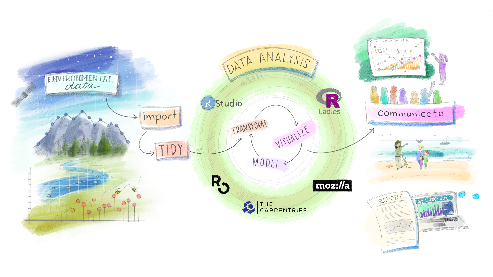
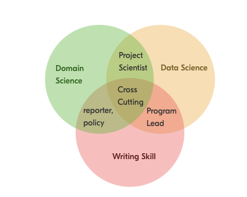
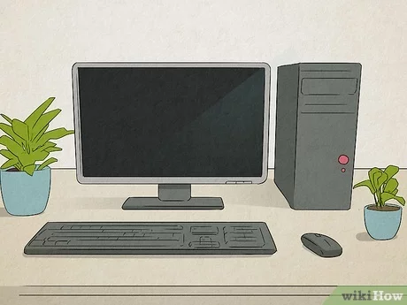
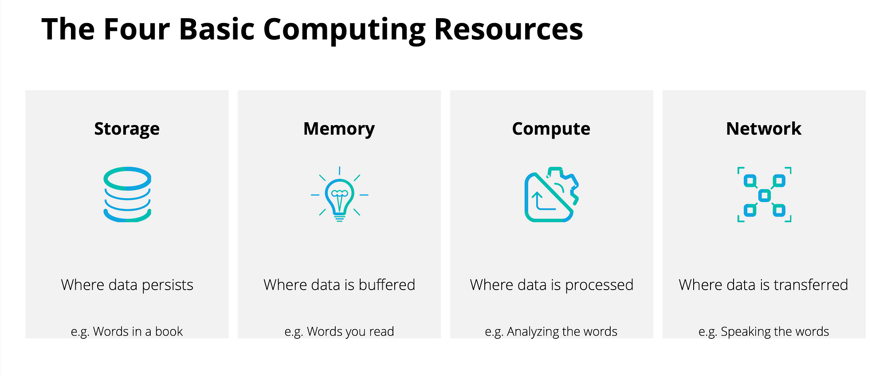
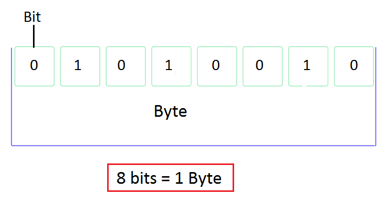
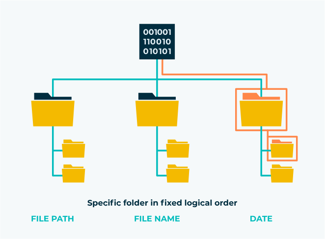
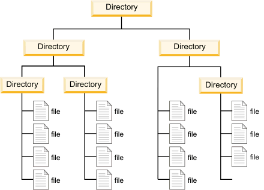
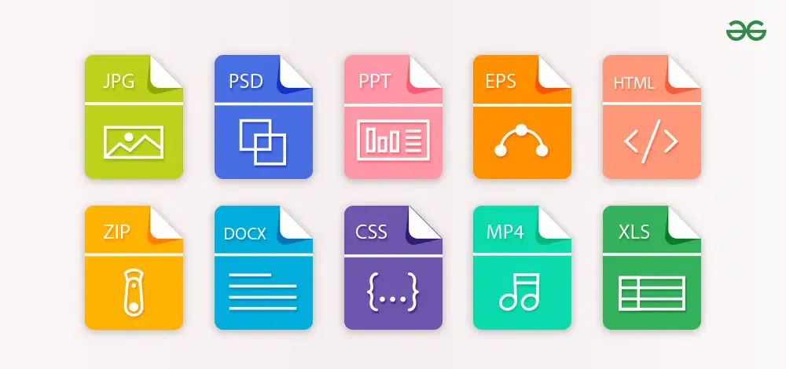
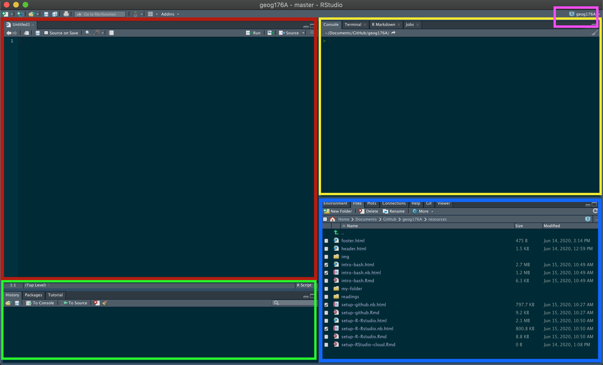
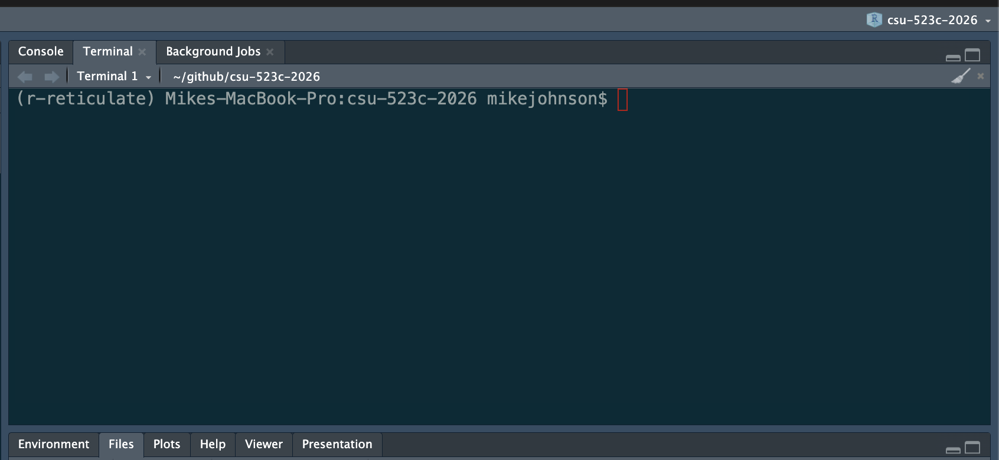

```{r setup}
#| echo: false
#| include: false

library(broom)
library(lobstr)

train_color  <- '#1E4D2B'
test_color   <- '#C8C372'
data_color   <- "#767381"
assess_color <- "#84cae1"
splits_pal   <- c(data_color, train_color, test_color)
```

# Agenda & Timing {background-color="#1E4D2B"}

## Today's flow (1 hr 50 min)

- 0–15 min: Welcome + course overview
- 15–40 min: Files, naming, and paths
- 40–60 min: R, RStudio, version control, terminal
- 60–65 min: 5-minute break
- 65–95 min: File formats, URLs, compute cycle, examples
- 95–110 min: Wrap-up, homework, Q&A


# Welcome

This is a class about water.

. . .

It is also a class about data.

. . .

Because in 2026, **you cannot do one without the other.**

. . .

> Every flood forecast, drought assessment, water quality model, and basin-scale analysis that matters is built on someone's ability to find, wrangle, analyze, and communicate data.

. . .

That person should be you. This class is about making sure it is.

## What This Class Is About

::: {layout-ncol=2}

::: {.column}
- Developing proficiency in the **tools and methods** of modern environmental data science
- Emphasizing **real-world applications** — the datasets, formats, and workflows used in federal agencies, research labs, and consulting firms right now
- Practicing **open science**: reproducible workflows, version-controlled code, open formats, citable data
- Building habits that **scale with you** into a career
:::

::: {.column}
```{r}
#| echo: false
#| out.width: "100%"
#| fig-cap: "Artwork by [@allison_horst](https://x.com/allison_horst)"

```
:::

:::

## The Environmental Trifecta

::: {layout-ncol=2}

::: {.column}
Most environmental scientists have one or two of these. Few have all three.

Combining **writing**, **data analysis**, and **domain expertise** creates a rare and flexible professional — one who can move between science, policy, and practice.

AI can generate code. It cannot ask the right scientific question, evaluate whether the answer makes physical sense, or stand in front of a stakeholder and defend it. That combination is what we're building.

> *"If not you, then who?"*
:::

::: {.column}
```{r}
#| echo: false
#| fig-align: center
#| out.width: "100%"

```
:::

:::

# Course Logistics {background-color="#1E4D2B"}

## Instructor: Mike Johnson

::: {layout-ncol=2}

::: {.column}
```{r}
#| echo: false
#| out.width: "75%"
#| fig-align: center

```
:::

::: {.column}
- Chief Data Scientist, Lynker
- PhD in Geography, UC Santa Barbara
- 10+ years in hydrology and ecosystem science
- Active work with NOAA, USACE, and federal water programs

The work we do in this course is in many ways the same work being done at the federal/state level right now. You're learning a living skillset.

**Course site:**  
[https://mikejohnson51.github.io/csu-ess-523c/](https://mikejohnson51.github.io/csu-ess-523c/)
:::

:::

## Course Structure

| Week | Topic |
|------|-------|
| **Week 1**   | Data Science Tools & Digital Environment |
| **Week 2–3** | Vector Data |
| **Week 4**   | Raster Data |
| **Week 5–6** | Machine Learning |
| **Week 7**   | Time Series |

## Grading

::: {layout-ncol=2}

::: {.column}

**Setup 50 points**
- Due Wednesday — ensures your environment is ready for the course

**Labs (6 × 150 pts = 900 pts)**

- Assigned Wednesdays, due the following Wednesday before class
- All submissions via GitHub — version control is part of the grade
- An optional final project (+150 pts extra credit) builds on your personal site from ESS 523a

**Total: 950 pts (1100 possible with EC)**
:::

::: {.column}
**Grade Scale:**

| Grade | Range |
|-------|-------|
| A+ | ≥ 96.67% |
| A  | 93.33–96.67% |
| A– | 90.0–93.33% |
| B+ | 86.67–90.0% |
| B  | 83.33–86.67% |
| B– | 80.0–83.33% |
| C+ | 76.67–80.0% |
| C  | 70.0–76.67% |
| D  | 60.0–70.0% |
| F  | < 60% |

:::

:::

## Working Together & AI Policy

::: {layout-ncol=2}

::: {.column}
::: callout-tip
**Collaboration — encouraged**

Discuss problems, share approaches, and help each other debug — you learn more working with peers.
:::

::: callout-important
**Individual work — required**

Your code, writing, and results must be submitted individually.
:::

::: callout-note
**AI tools (ChatGPT, Claude, Copilot)**

- Acceptable: exploring concepts, debugging syntax, understanding errors, and short illustrative examples — always verify and understand outputs.
- Not acceptable: producing final analyses, lab write-ups, figures, or any submission you present as solely your own work.
- Disclosure: If AI contributed substantively, include a brief note describing the tool, model, and a short prompt summary.
:::

:::

::: {.column}
```{r}
#| echo: false
#| fig-align: center
#| out.width: "60%"

```
:::

:::

## Compute Needs

::: {layout-ncol=2}

::: {.column}
- Your own computer running a full OS — Windows, macOS, or Linux
- Chromebooks are **not** supported
- If this is a barrier, reach out immediately and we'll find a solution

:::

::: {.column}
```{r}
#| echo: false
#| fig-align: center

```
:::

:::

# Quantitative Reasoning {background-color="#1E4D2B"}

## What Is Quantitative Reasoning?

::: {layout-ncol=2}

::: {.column}
> **Working Definition**: Thinking about *data* from our world to better understand and make choices about the past, present, and future.

- Many people can work with data (data scientists)
- Many people have domain knowledge (hydrologists)
- **Few can do both carefully** — that's what makes you valuable

The rest of today is about building the foundation for that focusing on how computers store, find, and interpret information — and why that matters for doing science well.
:::

::: {.column}
```{r}
#| echo: false
#| fig-align: center
#| out.width: "100%"
knitr::include_graphics('img/03-quant-reasoning.avif')
```
:::

:::

## Every Analysis Is a File Problem

Every piece of work in this course — and in your career — follows this chain:

. . .

```
Raw Data          ← files on disk, often from URLs or APIs
  ↓ R Scripts     ← read, clean, transform
Processed Data    ← files on disk
  ↓ R Scripts     ← model, summarize, visualize  
Outputs           ← figures, tables, reports — files on disk
```

. . .

A broken link anywhere in this chain means **the analysis cannot be reproduced.**

A file you can't find, a path that only works on your machine, a format no one else can open — these are not minor inconveniences. They are scientific failures.

. . .

> *"An analysis is only as reproducible as the data you can find next year."*

# Your Digital Environment {background-color="#1E4D2B"}

## The Computer

::: {layout-ncol=2}

::: {.column}
Three subsystems you need to understand:

- **Disk**: Persistent storage — files live here when the power is off. Reading from disk is slow.
- **Memory (RAM)**: Ephemeral workspace — data lives here while R runs. Fast, but finite and temporary.
- **CPU**: Executes instructions — does the computation.

**Why this matters for you:**  
When you load a 4 GB raster into R, it moves from disk into RAM. If your RAM is full, R crashes or slows to a crawl. Knowing where the bottleneck is (I/O? memory? compute?) is how you diagnose and fix slow analyses.
:::

::: {.column}
```{r}
#| echo: false
#| fig-align: center
#| out.width: "85%"

```
:::

:::

## The Compute Cycle

```{r}
#| echo: false
#| fig-align: center
#| out.width: "75%"

```

<br>

Data flows: **disk → memory → CPU → memory → disk**

Every `read_csv()`, `st_read()`, and `rast()` call you make starts this cycle. Every `write_csv()` and `writeRaster()` ends it.

# Bytes {background-color="#1E4D2B"}

## Bits and Bytes {.smaller}

::: {layout-ncol=2}

::: {.column}
- A **bit** is one logical state: `0` or `1`
- A **byte** is 8 bits
- Everything on a computer — text, images, spatial data, model outputs — is bytes

**Why it matters in practice:**

| Dataset | Size estimate |
|---------|--------------|
| USGS daily flow record, 1 gauge, 50 years | ~150 KB |
| NHDPlus HR flowlines, CONUS | ~12 GB |
| NWM retrospective, 1 variable, 1 year | ~200 GB |
| 3DEP 1m DEM, single HUC4 | ~8–40 GB |

:::

::: {.column}
```{r}
#| echo: false
#| fig-align: center

```
:::

:::

These numbers stop being surprising once you know the unit chain: KB → MB → GB → TB (each ×1,024).


# Files {background-color="#1E4D2B"}

## What Is a File?

::: {layout-ncol=2}

::: {.column}
- Files save bytes on disk in a **structured, meaningful way**

- Every file has three key properties:
  - A **name** — how you and the computer identify it
  - A **path** — its address in the file system hierarchy
  - An **extension** — tells programs how to interpret the bytes

- Hard drives don't understand files — they store bytes. The **file system** is the organizational layer that makes bytes into named, navigable objects.
:::

::: {.column}
```{r}
#| echo: false
#| fig-align: center

```
:::

:::

## File Systems & Directories

::: {layout-ncol=2}

::: {.column}
**How operating systems differ:**

- **Windows** `r icons::fontawesome('windows')`: drives (`C:\`), backslash separators
- **macOS / Linux** `r icons::fontawesome('apple')`: forward slashes, everything under root `/`
- **Cloud (S3, GCS)**: looks like a filesystem, but is actually flat key-value storage

**Key vocabulary:**

| Term | Meaning |
|------|---------|
| Root | Top-level directory — contains everything |
| Working directory | Where your session is (`getwd()`) |
| Parent directory | One level up (`..`) |
| Subdirectory | A folder inside the working directory |
:::

::: {.column}
```{r}
#| echo: false
#| fig-align: center

```
:::

:::

# File Naming {background-color="#1E4D2B"}

## The Importance of Names

::: callout-tip
"There are only two hard things in Computer Science: cache invalidation and naming things." ~Phil Karlton
:::

File names are how you — and your collaborators — navigate a project. There is no enforced standard. The decisions are always yours.

Bad names compound silently. One bad name is annoying. A project full of them is a crisis.

. . .

### Three Principles

1. **Machine readable** — unambiguous, parseable, regex-friendly
2. **Human readable** — tells you what's inside without opening it
3. **Sortable** — natural order reflects logical order

## Machine Readable

- No spaces, no punctuation, no accented characters, no mixed case
- Use [regular expression](https://en.wikipedia.org/wiki/Regular_expression) friendly (e.g. use patterns!)
- Use ISO 8601 dates: `YYYY-MM-DD` — they sort correctly as strings
- Consistent delimiters:
  - `_` separates **metadata fields**
  - `-` separates **words within a field**

. . .

This makes files easy to ...

## Search Programmatically:

```{r}
files <- list.files("data/usgs-files", pattern = "_tx")
length(files)
```

```{r}
#| echo: false
head(files, 2)
```

## Operate on: 

Metadata is recoverable without opening a single file:

```{r, eval = F}
#| eval: false
stringr::str_split(files, "[_\\.]", simplify = TRUE) 
```

```{r, echo = FALSE}
#| echo: FALSE

stringr::str_split(files[1:5], "[_\\.]", simplify = TRUE) |> 
  data.frame() |>
  setNames(c("StartDate", "siteID", "parameterCode", "county", "state", "extension"))  
```

## Human Readable + Sortable

**Human readable** — the name communicates content and purpose. Here, we see the order that the files run (utilities, download, clean, analyze, figures), the project they belong to (src), are archived in the file names.

```{r}
list.files("R")
```

```{r}
#| echo: false
stringr::str_split(list.files("R"), "[_\\.]", simplify = TRUE) |>
  data.frame() |>
  setNames(c("Order", "Project", "Purpose", "extension"))
```

. . .

**Sortable** — leading zeros and ISO dates keep files in logical order:

```
✅  01_src_download.R       2024-01-15_sw-discharge_co.csv
    02_src_clean.R          2024-02-03_sw-discharge_co.csv
    03_src_analyze.R        2024-11-20_sw-discharge_co.csv

❌  1_download.R            01-15-2024_data.csv
    10_figures.R            11-20-2024_data.csv
    2_clean.R               02-03-2024_data.csv
```

# File Paths {background-color="#1E4D2B"}

# System of Directions

::: {layout-ncol=2}

::: {.column}

- File paths tell us the location of a file within the file system

- Directories are stored as hierarchies, again with root (home) directory being the one holding everything on a system

- The folder you are in, is called your **working directory**. (think `pwd`)

- The folder above the working directory is the **parent directory**

- All folders within the working directory are **sub folders** or **child** folder
:::

::: {.column}
```{r}
#| echo: false
#| fig-align: center

```
:::
:::

## Absolute vs. Relative Paths

**Absolute** — starts from root, always resolves, but only on your machine:

```{r, absolute-path}
#| eval: false
img <- png::readPNG('/Users/mikejohnson/github/csu-523c-2026/slides/img/03-bit-byte.png')
```

. . .

**Relative** — starts from the working directory, works anywhere the project is opened:

```{r, relative-path}
#| eval: false
img <- png::readPNG('img/03-bit-byte.png')
```

. . .

**`.` and `..` shorthand:**

```
.    = this directory
..   = the parent directory

../data/raw/flow.csv   →  up one level, then into data/raw/
```

. . .

::: callout-important
Absolute paths are the #1 reproducibility killer in shared projects. If your code contains `/Users/yourname/`, it will break the moment anyone else runs it — including future you on a new machine.
:::

## RStudio Projects + `here`

::: callout-tip
RStudio **Projects** (`.Rproj`) automatically set the working directory to the project root when opened — making relative paths reliable by default.
:::

Best practices:

- Keep all project files together: raw data, scripts, outputs, figures
- Never hardcode paths outside the project root
- Use `here::here()` for paths inside packages or Quarto documents — it anchors to the project root regardless of where the `.qmd` lives

```{r}
#| eval: false
# Always resolves from project root, never from the .qmd file's location
here::here("data", "raw", "flow_2024.csv")
#> /Users/mikejohnson/github/csu-523c-2026/data/raw/flow_2024.csv
```

## Enforcing Relative Paths

::: callout-tip
Working with absolute paths can be a pain compared to relative paths...
:::

- It is a good practice to keep all the files associated with a project  — input data, R scripts, analytic results, figures - together. 

- This is such a common practice that RStudio has built-in support for this via **projects**.

- A good project layout will ultimately make your life easier:

  - It will help ensure the integrity of your data;
  - It makes it simpler to share your code with someone else (a lab-mate, collaborator, or supervisor);
  - It allows you to easily upload your code with your manuscript submission;
  - It makes it easier to pick the project back up after a break.


# File Extensions {background-color="#1E4D2B"}

## Context

::: { layout-ncol=2 }
-   All files store bits.

-   Extensions can be considered a type of metadata that provides information about the way data might be stored

-   There are 1000's of different formats for data ranging from common to custom

-   Each format defines how the sequence of bits and bytes are laid out

-   Indicate the characteristics of the file, its intended use, and the default applications that can open/use the file.

-   If you double click a `.docx` file it opens in Word which interprets the meaning of the bytes

-   If you double click an `.R` file it opens with RStudio, and R interprets the meaning of the bytes

```{r}
#| label: io-device
#| fig-align: center
#| fig-size: 90%
#| echo: false

```
:::

## Extension Interpretation {.smaller}

- Readers depended on anticipated structure

. . . 

```{r}
#| label: i-o-readers
#| error: true
img <- jpeg::readJPEG('img/03-bit-byte.png')
```

- The file is actually a PNG with the wrong file extension. "0x89 0x50" is how a PNG file starts.

. . .

```{r}
#| label: i-o-readers-2
img <- png::readPNG('img/03-bit-byte.png')
```

- The data returned to R is a _structured_ set of bits, interpreted according to the directions of the file _and_ the interpreting language!

. . . 

```{r}
#| label: i-o-readers-3
dim(img)
class(img)
str(img)
```

# Information pass through: 

```{r}
#| label: bytes
#| echo: false
#| eval: false

# Character Object
(x <- "CSU 523C")

# Character Object to Raw Type
# How R sees the data
(y <- charToRaw(x))

# Raw to Bits
# Whats on disk
(z <- rawToBits(y))

length(z) 

nchar(x)

nchar(x) == (length(z)/8)
```

`r flipbookr:::chunq_reveal("bytes", title = "Bytes Being Interpreted", lcolw = "40", rcolw = "60")`


## How images are rendered: 

```{r}
plot(NA, xlim = c(0, 2), ylim = c(0, 1))
rasterImage(img, 0, 0, 2, 1)
```

## Common Formats in Water Resources Data Science

| Format | Type | Common Use |
|--------|------|------------|
| `.csv` | Text | Tabular field data, gauge records, water quality |
| `.json` / `.geojson` | Structured | Web APIs, geographic feature exchange |
| `.tif` / `.geotiff` | Binary | Satellite imagery, DEMs, classified rasters |
| `.nc` (NetCDF) | Binary | NWM output, climate models, multi-dimensional arrays |
| `.gpkg` (GeoPackage) | Structured | Vector + raster, open standard, replaces Shapefile |
| `.shp` (Shapefile) | Binary | Legacy vector data — still everywhere, many limitations |
| `.parquet` | Binary | Large tabular/spatial data, fast I/O, cloud-native |

# URLs as File Paths {background-color="#1E4D2B"}

## URL Structure

```{r}
#| echo: false
#| fig-align: center

```

| Part | Example | Analogy |
|------|---------|---------|
| Protocol | `https://`, `s3://` | How to travel |
| Domain | `waterservices.usgs.gov` | The server (building) |
| Path | `/nwis/iv/` | Directory (floor/room) |
| File | `flow_2024.csv` | The file |
| Parameters | `?sites=06752260&parameterCd=00060` | Filters on the request |

## URLs Are Just Remote Paths

The file system logic you just learned applies directly to URLs:

```
https://mikejohnson51.github.io/csu-ess-330/slides/1-welcome.html#/title-slide
         ↑ server (domain)      ↑ directory   ↑ file             ↑ anchor

s3://noaa-nwm-retrospective-3-0-pds/CONUS/zarr/chrtout.zarr
     ↑ bucket                        ↑ directory  ↑ file
```

. . .

**And URLs are your data pipeline:**

```{r}
#| eval: false
# USGS streamflow — the path IS the query
url <- "https://waterservices.usgs.gov/nwis/iv/?sites=06752260&parameterCd=00060&format=json"
data <- jsonlite::fromJSON(url)

dplyr::glimpse(data)(data)

# NWM retrospective on S3 — same concept, different protocol
s3_path <- "s3://noaa-nwm-retrospective-3-0-pds/CONUS/zarr/chrtout.zarr"
```

. . .

Query parameters (`?sites=...&parameterCd=...`) filter data **at the server** before it reaches your machine. Understanding URL structure means understanding how to ask for exactly what you need.

## Putting It Together

```{r}
#| echo: false
#| fig-align: center
#| out.width: "75%"

```

Every analysis: **question → data (files + paths + formats) → compute → output (files + paths + formats)**

The concepts from today — bytes, files, names, paths, extensions, URLs — are the substrate every analysis runs on. They feel like setup. They are actually the foundation.


# 5-Minute Break {background-color="#1E4D2B"}

## Take five — stretch, hydrate, and reset.

. . .

Return in 5 minutes.

# R + RStudio {background-color="#1E4D2B"}

## R vs. RStudio

::: {layout-ncol=2}

::: {.column}

-  These are two separate things. Confusing them is the most common source of early frustration.

**R** — the language and engine
- Does the actual computation
- Runs without RStudio
- Must be installed first

**RStudio** — the IDE (development environment)
- The interface you'll look at all day
- Organizes files, environment, plots, packages, terminal
- Makes R usable — but it is **not** R

<br>

> **Analogy**: R is the engine. RStudio is the dashboard and steering wheel. You need both, but they are not the same thing.
:::

::: {.column}
```{r}
#| echo: false
#| fig-align: center
#| out.width: "100%"

```
:::

:::

## The Four Panes

| Pane | Location | Purpose |
|------|----------|---------|
| **Source** | Top left | Write and save scripts — your permanent work |
| **Console / Terminal** | Top right | Run R interactively; access the shell |
| **History / Packages / Git** | Bottom left | Command history, package manager, version control |
| **Environment / Files / Plots / Help** | Bottom right | Objects in memory, file browser, output viewer, documentation |


. . .

::: callout-important
**The console does not save your work.** Anything you run there and don't put in a script is gone when you close RStudio. Build the habit early: if it matters, it goes in a script.
:::

## Packages: Extending R

- **Base R**: ships with R — vectors, data frames, basic statistics, plots
- **Packages**: functions written by the community, installed from CRAN (or github/biocondutor/etc), loaded per session

```{r}
#| eval: false
install.packages("sf")   # once per machine
library(sf)              # once per session
```

. . .

**Core packages for this course:**

| Package | Purpose |
|---------|---------|
| `tidyverse` | Data manipulation (`dplyr`, `tidyr`) and visualization (`ggplot2`) |
| `sf` | Vector spatial data — points, lines, polygons |
| `terra` | Raster spatial data — grids, DEMs, satellite imagery |
| `tidymodels` | Machine learning with tidy principles |

# Version Control {background-color="#1E4D2B"}

## You Have Already Done This

```
analysis_final.R
analysis_final_v2.R
analysis_final_ACTUAL_FINAL.R
analysis_mikereview_jan12.R
analysis_mikereview_jan12_USETHISONE.R
```

. . .

This is version control, just done badly.

. . .

It doesn't tell you **what changed**, **why it changed**, or **which version to trust**. It breaks completely the moment two people work on the same file.

. . .

- **Git** provides a solution. 

- It tracks every change to every file — with a timestamp, an author, and a message — and lets you revert to any previous state. Not just for code: data, reports, quarto documents, everything.

## Git + GitHub

::: {layout-ncol=2}

::: {.column}
**Git** runs on your machine — the version control engine

**GitHub** hosts your repositories in the cloud — collaboration, backup, and portfolio in one place

Together:

- Complete, auditable history of every project
- Collaborate without overwriting each other
- Revert any file to any previous state
- Public portfolio of your work
- The standard for open, reproducible science

**All labs in this course are submitted via GitHub.** We set it up together in this week's homework — by next class, this will already be part of your workflow.
:::

::: {.column}
```{r}
#| echo: false
#| fig-align: center
#| fig-cap: "Artwork by [@allison_horst](https://x.com/allison_horst)"

```
:::

:::

# The Terminal {background-color="#1E4D2B"}

## Your Power Tool

::: {layout-ncol=2}

::: {.column}
The **terminal** is a text interface to your file system. It feels archaic. It is indispensable.

Git, package installation, server connections, working in the cloud — all of it eventually touches the terminal. The sooner it feels normal, the better.

| Command | Does |
|---------|------|
| `pwd` | Where am I? |
| `ls` | What's here? |
| `cd folder` | Move into `folder` |
| `cd ..` | Move up one level |
| `mkdir name` | Create a directory name |
| `cp a b` | Copy `a` to `b` |
| `mv a b` | Move / rename `a` to `b` |

**In RStudio**: Terminal tab, next to Console — use it there until the standalone terminal feels comfortable.
:::

::: {.column}
```{r}
#| echo: false
#| fig-align: center
#| out.width: "100%"

```
:::

:::

## Before Next Class

::: {layout-ncol=2}

::: {.column}

#### This week's homework ensures your environment is ready:

<br>

> **[Lab 00: Verify Your Environment + Meet Your Tools](../labs/lab-0.html)**  
> Confirm your R, RStudio, and Git setup — install course packages, configure Git, connect to GitHub. Come to the next class ready to code!

<br>

#### Next topic: **Data Manipulation crash course**

:::

::: {.column}
```{r}
#| echo: false
#| fig-align: center

```
:::

:::
