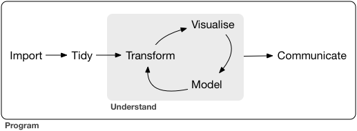
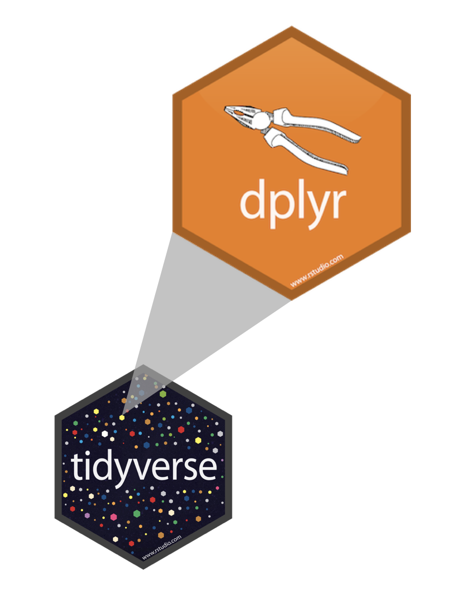
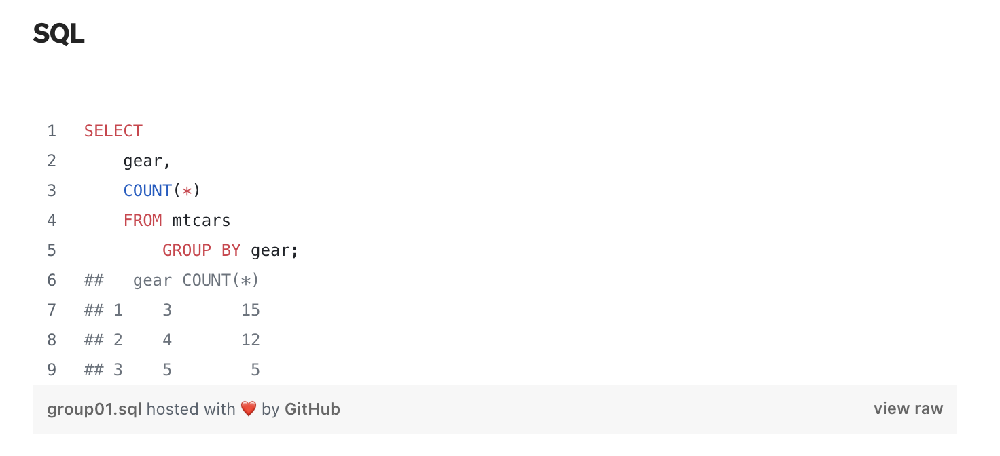
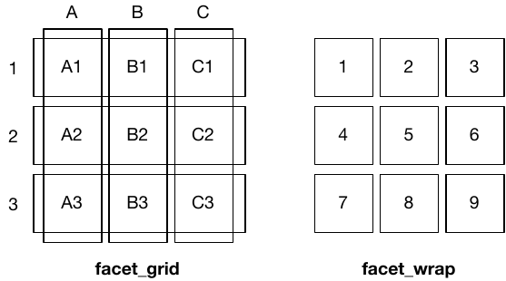
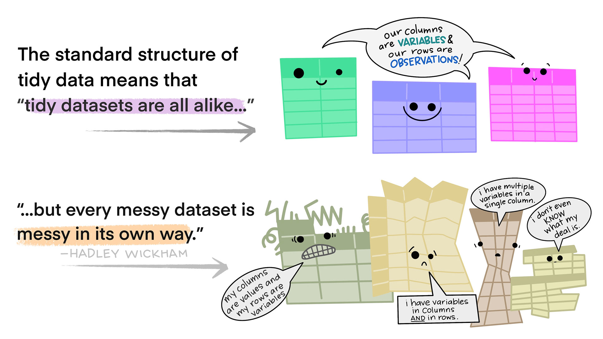
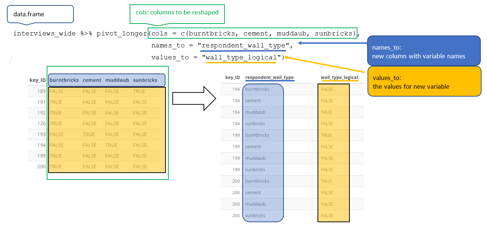
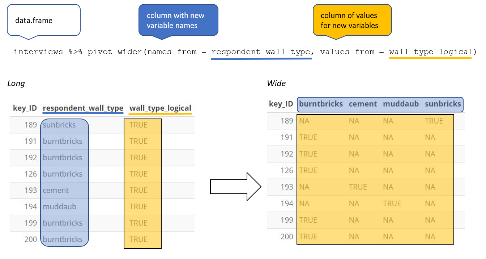

```{r}
#| label: day2-setup
#| echo: false
#| include: false

library(tidyverse)
library(gapminder)
library(flextable)
library(dataRetrieval)
library(lubridate)
```

# Today's Arc {background-color="#1E4D2B"}

## Where We're Going

Yesterday was about the **substrate** — files, paths, bytes, formats, URLs.

Today is about **working with data once it's in R.**

. . .

Three interconnected topics, one dataset throughout:

| Block | Topic | Time |
|-------|-------|------|
| **1** | Data manipulation — `dplyr` | ~40 min |
| **2** | Data visualization — `ggplot2` | ~40 min |
| **3** | Relational data + tidy format — `tidyr` | ~30 min |

. . .

We'll use **gapminder** for most examples — clean, familiar, and ships with R. Every technique applies directly to the USGS streamflow data in Lab 1.

## The Dataset We'll Use

```{r}
library(tidyverse)
library(gapminder)

class(gapminder)
dim(gapminder)
range(gapminder$year)
length(unique(gapminder$country))
```

. . .

```{r}
glimpse(gapminder)
```

# Part 1: Data Manipulation {background-color="#1E4D2B"}

## Tidy Data: The Assumed Shape

```{r}
#| echo: false
#| fig-align: center

```

Tidy data follows three rules: each **variable** is a column, each **observation** is a row, each **value** is a cell. Every tidyverse tool assumes this shape.

When your data doesn't conform, you fix the data — not the tools.

## The Grammar of Data Manipulation

::: {layout-ncol=2}

::: {.column}
`dplyr` provides a consistent set of **verbs** for data manipulation:

| Verb | Does |
|------|------|
| `filter()` | Keep rows matching a condition |
| `select()` | Keep or drop columns |
| `mutate()` | Add or transform columns |
| `summarize()` | Collapse rows to a summary |
| `arrange()` | Reorder rows |
| `group_by()` | Apply operations by group |

These all combine naturally. Learning the verbs is learning the language.
:::

::: {.column}
```{r}
#| echo: false
#| fig-align: center

```
:::

:::

---

## A Note on Subsetting

Before we use these verbs, let's ground ourselves in base R subsetting — it's what dplyr builds on. Understanding the foundation makes the syntax sugar more transparent.

You already know base R subsetting. Here's the vocabulary:

```{r}
df <- data.frame(country = c("USA", "Brazil", "India"),
                 pop     = c(300e6, 200e6, 1.4e9))

df[1, 2]          # row 1, col 2 — matrix style
df[["pop"]]       # column by name — list style
df$pop            # column shorthand
```

. . .

::: callout-important
**Never subset by row number in a script:**

```{r}
#| eval: false
gapminder[19:70, ]   # ❌ not self-documenting, breaks if data changes
```

Always subset by **condition** — it is explicit, readable, and robust.
:::

## Connection to SQL

```{r}
#| echo: false
#| fig-align: center
#| out.width: "75%"

```

. . .

You just learned the core concepts of SQL:

- `filter()` = `WHERE`
- `select()` = `SELECT`
- `mutate()` = computed columns
- `summarize()` + `group_by()` = `GROUP BY` + aggregate functions
- `arrange()` = `ORDER BY`

The grammar transfers directly. SQL is the language of databases; dplyr is the language of R data frames. They solve the same class of problems.

---

## Now Let's Apply Them

Now let's walk through each verb with concrete examples. You'll see how they work in isolation, then how they compose into powerful pipelines.

## `filter()` — Keep Rows by Condition

`filter()` takes logical expressions and returns rows where all conditions are `TRUE`. It never touches columns.

```{r}
filter(gapminder, lifeExp < 40)
```

## `filter()` — Multiple Conditions

Comma-separated conditions are treated as AND:

```{r}
filter(gapminder, lifeExp < 40, year == 2007)
```

## `filter()` — The `%in%` Operator

```{r}
filter(gapminder,
       country %in% c("Iraq", "Iran", "Afghanistan"),
       year > 2005)
```

. . .

::: callout-tip
`%in%` tests membership in a vector — much cleaner than chaining `|` (OR) conditions. You'll use it constantly with site numbers, HUC codes, and state names in water resources work.
:::

## How `filter()` Works: Boolean Vectors

Under the hood, `filter()` creates a **boolean vector** (all TRUE or FALSE) and keeps only the rows where the condition is TRUE.

```{r}
# Create a boolean vector
lifeExp_condition <- gapminder$lifeExp < 40

# This is what filter() does internally
gapminder[lifeExp_condition, ]  # base R subsetting with boolean vector
```

. . .

Equivalent to:

```{r}
# Using filter()
gapminder |>
  filter(lifeExp < 40)
```

. . .

::: callout-note
`filter()` is cleaner and more readable, but it's doing exactly what base R subsetting does: keeping rows where the condition is TRUE, dropping rows where it's FALSE or NA.
:::

## `select()` — Keep Columns by Name

```{r}
select(gapminder, country, lifeExp)
```

. . .

Rename while selecting:

```{r}
select(gapminder, country, life_exp = lifeExp)
```

. . .

Drop a column with `!`:

```{r}
select(gapminder, !continent)
```

## `select()` — Base R Equivalence

Under the hood, `select()` is doing column subsetting — the same operation as base R.

```{r}
#| eval: false
# Base R column subsetting
gapminder[, c("country", "lifeExp")]     # [rows, cols]
gapminder[["lifeExp"]]                   # extract single column
gapminder$lifeExp                        # $ shorthand
```

. . .

**Using `select()`:**

```{r}
gapminder |>
  select(country, lifeExp)
```

. . .

::: callout-note
`select()` is syntactic sugar on top of base R's column subsetting. It's more readable and composable with pipes.
:::

## `select()` Helpers — `tidyselect` Functions {.smaller}

Beyond explicit column names, use **tidyselect** helpers to match columns by pattern:

```{r}
# Select columns starting with a pattern
select(gapminder, starts_with("life"))

# Select columns ending with a pattern
select(gapminder, ends_with("pc"))

# Select columns containing a substring
select(gapminder, contains("pop"))
```

. . .

::: callout-tip
These patterns are especially useful for **water data** where columns follow naming conventions: `site_no`, `site_name`, `discharge_cfs`, `temp_c`. You'll select all temperature columns with `starts_with("temp_")`.
:::

## The `|>` Pipe Operator

The pipe passes the object on the left into the **first argument** of the function on the right:

::: {layout-ncol=2}

::: {.column}
**Without pipe:**

```{r}
select(gapminder, country, lifeExp)
```
:::

::: {.column}
**With pipe:**

```{r}
gapminder |>
  select(country, lifeExp)
```
:::

:::

. . .

**Keyboard shortcut**: `Cmd+Shift+M` (Mac) / `Ctrl+Shift+M` (Windows)

. . .

The pipe is what makes `dplyr` readable — it lets you build a chain of operations that reads like a sentence:

```{r}
gapminder |>
  select(pop, gdpPercap, year, country) |>
  filter(pop > 100000000, gdpPercap > 5000) |>
  filter(year > 1995) |>
  filter(country %in% c("United States", "Mexico"))
```

## Combining Verbs

The pipe lets you chain as many operations as needed:

```{r}
gapminder |>
  select(year, country, gdpPercap) |>
  filter(year == max(year)) |>
  arrange(-gdpPercap) |>
  mutate(rank = 1:n())
```

## `mutate()` — Add New Columns

`mutate()` adds new variables computed from existing ones. New variables are available immediately within the same `mutate()` call:

```{r}
gapminder |>
  mutate(gdp = pop * gdpPercap)
```

. . .

Set a column to `NULL` to remove it:

```{r}
gapminder |>
  mutate(gdp = pop * gdpPercap,
         gdpPercap = NULL)
```

## `mutate()` — Base R Equivalence

Under the hood, `mutate()` is column assignment — the same operation as base R.

```{r}
#| eval: false
# Base R column assignment
gapminder$gdp <- gapminder$pop * gapminder$gdpPercap

# Remove a column (assign to NULL)
gapminder$gdpPercap <- NULL
```

. . .

**Using `mutate()`:**

```{r}
gapminder |>
  mutate(gdp = pop * gdpPercap,
         gdpPercap = NULL)
```

. . .

::: callout-note
`mutate()` builds on base R assignment but allows you to chain operations with the pipe and reference newly created columns *within the same call*.
:::

## `transmute()` — Keep Only New Columns

`transmute()` is like `mutate()`, but it **drops all other columns** — you're left with only what you explicitly create.

```{r}
# mutate() keeps everything
gapminder |>
  mutate(gdp = pop * gdpPercap) |>
  head(2)
```

. . .

```{r}
# transmute() keeps only the new column
gapminder |>
  transmute(gdp = pop * gdpPercap) |>
  head(2)
```

. . .

::: callout-tip
Use `transmute()` when you want to extract a subset of computed columns in one go — cleaner than `mutate()` followed by `select()`.
:::

## Conditional Mutations with `if_else()`

When you need to compute values based on a condition, use `if_else()`:

```{r}
gapminder |>
  filter(year == 2007) |>
  mutate(income_level = if_else(gdpPercap > 10000, "high", "low")) |>
  select(country, gdpPercap, income_level) |>
  head(8)
```

. . .

**In Lab 1 context**: Flag anomalies in streamflow:

```{r}
#| eval: false
flow_data |>
  mutate(is_low = if_else(discharge < quantile(discharge, 0.1), TRUE, FALSE))
```

## `summarize()` — Collapse to a Summary

`summarize()` takes n rows and returns 1:

```{r}
gapminder |>
  mutate(gdp = pop * gdpPercap) |>
  summarize(mean_gdp = mean(gdp),
            sd_gdp   = sd(gdp))
```

. . .

Useful summary functions: `mean()`, `median()`, `sd()`, `min()`, `max()`, `sum()`, `n()`, `n_distinct()`, `quantile()`

## `arrange()` — Reorder Rows

```{r}
gapminder |>
  filter(year == 2007) |>
  arrange(lifeExp)
```

. . .

Descending order with `-`:

```{r}
gapminder |>
  filter(year == 2007) |>
  arrange(-lifeExp)
```

## `group_by()` + `summarize()` — Split-Apply-Combine

Have you ever needed:

- Mean wind speed by storm type?
- Average discharge by HUC?
- Case counts by state?

. . .

`group_by()` adds grouping structure. `mutate()` and `summarize()` honor it:

```{r}
gapminder |>
  mutate(gdp = pop * gdpPercap) |>
  group_by(year) |>
  summarize(mean_gdp = mean(gdp),
            sd_gdp   = sd(gdp))
```

## `group_by()` — More Examples

Life expectancy range by year in Europe:

```{r}
gapminder |>
  filter(continent == "Europe") |>
  group_by(year) |>
  summarize(min_lifeExp = min(lifeExp),
            max_lifeExp = max(lifeExp))
```

## `group_by()` + `mutate()` — Within-Group Calculations

`lag()` within groups — life expectancy gain since baseline year:

```{r}
gapminder |>
  filter(continent == "Europe") |>
  group_by(country) |>
  arrange(year) |>
  mutate(lifeExp_gain = lifeExp - first(lifeExp)) |>
  filter(year == max(year)) |>
  arrange(-lifeExp_gain)
```

## Worst Single-Year Drop in Life Expectancy

```{r}
gapminder |>
  select(country, year, continent, lifeExp) |>
  group_by(country, continent) |>
  arrange(year) |>
  mutate(le_delta = lifeExp - lag(lifeExp)) |>
  summarize(worst_drop = min(le_delta, na.rm = TRUE)) |>
  slice_min(worst_drop, n = 5) |>
  arrange(worst_drop)
```

. . .

::: callout-note
This is `dplyr` doing in 8 lines what would take 30+ lines of base R. The verbs compose — every operation is readable, every result is auditable.
:::

# Part 2: Data Visualization {background-color="#1E4D2B"}

## Why Visualization?

Data without visualization is just numbers. Before building any model or writing any interpretation, plot your data. Always.

. . .

`ggplot2` is built on a consistent grammar — the same recipe works for scatter plots, line charts, heatmaps, and beyond. This systematic grammar is what makes ggplot2 powerful: once you learn the components, you can build *any* visualization.

The **Grammar of Graphics** says every chart is built from the same small set of components:

1. **Data** — what are we visualizing?
2. **Aesthetic mappings** — which variables map to which visual properties?
3. **Geometries** — what shape represents the data?
4. **Labels, facets, themes** — everything else

## The ggplot2 Workflow

Building a plot is additive — you layer components with `+`:

```{r}
#| eval: false
DATA |>
  ggplot(aes(x = VAR1, y = VAR2)) +
  GEOM_FUNCTION() +
  LABELS +
  FACETS +
  THEME
```

. . .

::: callout-tip
Notice the switch from `|>` (pipe) to `+` (plus) when you enter `ggplot`. The pipe passes data into `ggplot()`; the plus adds layers *within* the plot. This is the most common source of syntax errors when learning ggplot.
:::

## Building a Plot: Data → Aesthetics → Geom

All ggplot2 plots follow the same structure: data + aesthetics (which variables to visual properties) + geometry (what shape).

```{r}
gm2007 <- filter(gapminder, year == 2007)

ggplot(data = gm2007, aes(x = gdpPercap, y = lifeExp)) +
  geom_point()
```

. . .

**Key point**: Aesthetic mappings in `aes()` describe how variables are **visualized** — placed in `ggplot()`, they apply globally to all layers.

## Fixed vs. Data-Driven Aesthetics

::: {layout-ncol=2}

::: {.column}
**Fixed** — set outside `aes()`, applies to all points:

```{r}
ggplot(data = gm2007,
       aes(x = gdpPercap, y = lifeExp)) +
  geom_point(col = "red")
```
:::

::: {.column}
**Data-driven** — set inside `aes()`, varies by data:

```{r}
ggplot(data = gm2007,
       aes(x = gdpPercap, y = lifeExp)) +
  geom_point(aes(col = continent))
```
:::

:::

## Multiple Geoms

Layers compose — each `+` adds a new geometric object:

```{r}
ggplot(data = gm2007,
       aes(x = gdpPercap, y = lifeExp)) +
  geom_point(aes(color = continent, size = pop)) +
  geom_smooth(color = "black") +
  geom_hline(yintercept = mean(gm2007$lifeExp), color = "gray50") +
  geom_vline(xintercept = mean(gm2007$gdpPercap), color = "gray50")
```

## Step 3: Labels

```{r}
ggplot(data = gm2007, aes(x = gdpPercap, y = lifeExp)) +
  geom_point(aes(color = continent, size = pop)) +
  geom_smooth(color = "black", linewidth = .5) +
  labs(title    = "Per capita GDP vs. life expectancy (2007)",
       x        = "Per Capita GDP (USD)",
       y        = "Life Expectancy (years)",
       subtitle = "Source: Gapminder",
       color    = "",
       size     = "Population")
```

## Step 4: Facets

Split one plot into many by a categorical variable:

```{r}
ggplot(data = gm2007, aes(x = gdpPercap, y = lifeExp)) +
  geom_point(aes(color = continent, size = pop)) +
  geom_smooth(color = "black", linewidth = .5) +
  labs(x = "Per Capita GDP", y = "Life Expectancy") +
  facet_wrap(~continent)
```

## `facet_wrap()` vs. `facet_grid()`

```{r}
#| echo: false
#| fig-align: center
#| out.width: "65%"

```

- **`facet_wrap(~x)`**: one faceting variable, auto-wraps into rows/columns — flexible layout
- **`facet_grid(y~x)`**: two faceting variables, strict row-column grid — enforces structure

Use `facet_wrap()` for many categories without hierarchy; `facet_grid()` for structured two-way comparisons.

## Step 5: Themes

Themes control all non-data visual elements:

```{r}
ggplot(data = gm2007, aes(x = gdpPercap, y = lifeExp)) +
  geom_point(aes(color = continent, size = pop)) +
  labs(x = "Per Capita GDP", y = "Life Expectancy",
       title = "GDP vs. Life Expectancy (2007)") +
  theme_minimal()
```

. . .

Built-in themes: `theme_bw()`, `theme_minimal()`, `theme_light()`, `theme_dark()`, `theme_classic()`

The `ggthemes` package adds Economist, WSJ, FiveThirtyEight, and many more.

## Saving Plots

ggplot outputs are objects — assign them, then save:

```{r}
#| eval: false
p <- ggplot(data = gm2007, aes(x = gdpPercap, y = lifeExp)) +
  geom_point(aes(color = continent, size = pop)) +
  theme_minimal()

ggsave(p,
       file   = "img/gdp-lifeexp-2007.png",
       width  = 8,
       height = 5,
       units  = "in")
```

. . .

::: callout-tip
Always save with explicit `width`, `height`, and `units`. The default dimensions rarely match what you need for reports or publications. `fig.retina = 3` in your chunk options gives you high-DPI output for web rendering.
:::

## ggplot in a Pipeline

ggplot integrates naturally with dplyr — pipe your wrangled data straight into a plot:

```{r}
gapminder |>
  filter(continent == "Europe") |>
  group_by(year) |>
  summarize(mean_lifeExp = mean(lifeExp)) |>
  ggplot(aes(x = year, y = mean_lifeExp)) +
  geom_line(color = "steelblue", linewidth = 1) +
  geom_point(color = "steelblue", size = 2) +
  labs(title = "Mean Life Expectancy in Europe Over Time",
       x = "Year", y = "Mean Life Expectancy") +
  theme_minimal()
```

# Part 3: Relational Data {background-color="#1E4D2B"}

## When One Table Is Not Enough

Real data rarely lives in a single tidy table. You will always need to combine information from multiple sources:

- Flow records from one table + watershed area from another
- Species counts from field surveys + climate data from NOAA
- County-level discharge + census population estimates

. . .

Multiple related tables are called **relational data**. The relations are as important as the data itself.

## The Anatomy of a Join

Before writing a `_join()` call, answer three questions:

1. **What is the key?** Which column(s) connect the two tables?
2. **What is the relationship?** One-to-one, or one-to-many?
3. **What happens to non-matching rows?** Keep them or drop them?

## Keys

A **key** is the variable (or set of variables) that uniquely identifies an observation:

- **Primary key**: uniquely identifies rows in *its own* table
- **Foreign key**: uniquely identifies rows in *another* table

. . .

```{r}
library(dplyr)
band_members
band_instruments
```

`name` is the primary key in both tables and the foreign key that connects them.

## The Four Joins

```{r}
#| echo: false
#| fig-align: center
knitr::include_graphics('img/07-joins.png')
```

| Function | Keeps rows from... | Non-matches |
|---|---|---|
| `left_join(x, y)` | All of `x` | `y` columns → `NA` |
| `right_join(x, y)` | All of `y` | `x` columns → `NA` |
| `inner_join(x, y)` | Only rows matching in **both** | Dropped |
| `full_join(x, y)` | Both tables | NAs on whichever side has no match |

## Inner Join

Returns only rows with matches in **both** tables:

```{r}
inner_join(band_members, band_instruments, by = "name")
```

Mick has no instrument record → dropped. Keith has no band record → dropped.

## Left Join

Returns **all rows from the left table**, NAs where no match in right:

```{r}
left_join(band_members, band_instruments, by = "name")
```

Mick kept, `plays` is `NA`. Keith dropped (not in left table).

## Right Join

Returns **all rows from the right table**:

```{r}
right_join(band_members, band_instruments, by = "name")
```

## Full Join

Returns **all rows from both tables**:

```{r}
full_join(band_members, band_instruments, by = "name")
```

Everyone is kept. NAs fill missing values on either side.

## The Silent Failure Modes

::: callout-important
Bad joins fail **silently** — your code runs, your result looks plausible, but the numbers are wrong.

**Failure 1: Wrong join type**  
Using `inner_join` when you meant `left_join` silently drops rows. Your dataset shrinks and you may not notice until a downstream result is unexpectedly small.

**Failure 2: Non-unique key**  
If the key column is not actually unique in one of the tables, every matching row gets duplicated. Your dataset grows and you may not notice.
:::

. . .

**Always verify after joining:**

```{r}
#| eval: false
# 1. Row count unchanged
nrow(result) == nrow(left_table)

# 2. No unexpected NAs in joined columns
sum(is.na(result$new_column))

# 3. Spot-check a known value
result |> filter(key == "known_value") |> distinct(key, new_column)
```

## Surrogate Keys

Sometimes a table has no natural primary key. Create one with `row_number()`:

```{r}
gapminder |>
  slice(1:5) |>
  mutate(id = row_number())
```

This is called a **surrogate key** — it has no real-world meaning but uniquely identifies each row for joining purposes.

## Real Example: NWIS Flow + Site Metadata

```{r}
#| eval: false
# Two tables, one key
flow      # site_no appears thousands of times (foreign key)
site_meta # site_no appears once per gauge (primary key)

# One-to-many join: one site_meta row fans out to thousands of flow rows
flow_meta <- flow |>
  left_join(site_meta, by = "site_no")

# Verify
nrow(flow_meta) == nrow(flow)                    # row count unchanged?
sum(is.na(flow_meta$drain_area_va)) == 0          # no missing area values?
flow_meta |>                                      # known value check
  filter(site_no == "09380000") |>
  distinct(site_no, drain_area_va)               # should be ~111,800 mi²
```

This is exactly the join you will perform in Lab 1.

# Part 4: Tidy Data & Pivoting {background-color="#1E4D2B"}

## The Same Data, Many Shapes

The same underlying data can be stored in multiple ways. Which is easiest to work with depends on what you want to do:

```{r}
#| echo: false
table_wide <- gapminder |>
  filter(year %in% c(1952, 2007), country %in% c("India", "Brazil")) |>
  select(country, year, lifeExp, gdpPercap)

table_long <- table_wide |>
  pivot_longer(cols = c(lifeExp, gdpPercap), names_to = "metric")
```

::: {layout-ncol=2}

::: {.column}
**Wide format** — one row per country:
```{r}
#| echo: false
table_wide
```
:::

::: {.column}
**Long format** — one row per country-year-metric:
```{r}
#| echo: false
table_long
```
:::

:::

## Tidy Data: The Standard

```{r}
#| echo: false
#| fig-align: center
knitr::include_graphics('img/07-tidy.png')
```

Three rules that `tidyverse` tools assume:

- Each **variable** has its own column
- Each **observation** has its own row
- Each **value** has its own cell

. . .

In practice: put each dataset in a tibble, put each variable in a column. The rest follows.

## The World Is Messy

```{r}
#| echo: false
#| fig-align: center
#| out.width: "60%"

```

Real data almost never arrives tidy. Two common problems:

1. **A variable is spread across multiple columns** — column names are values, not variable names
2. **An observation is scattered across multiple rows** — a single record spans several rows

`tidyr` (part of `tidyverse`) fixes both.

## `pivot_longer()` — Wide to Long

When column names are actually *values* of a variable, pivot longer:

```{r}
#| echo: false
#| fig-align: center

```

```{r}
lifeExp_wide <- gapminder |>
  filter(country %in% c("India", "Brazil")) |>
  select(country, year, lifeExp) |>
  pivot_wider(names_from = year, values_from = lifeExp)

lifeExp_wide
```

## `pivot_longer()` in Action

```{r}
lifeExp_wide |>
  pivot_longer(
    cols      = -country,         # pivot everything except country
    names_to  = "year",
    values_to = "lifeExp"
  )
```

## `pivot_wider()` — Long to Wide

When one observation is scattered across multiple rows, pivot wider:

```{r}
#| echo: false
#| fig-align: center

```

```{r}
table_long |>
  pivot_wider(names_from  = metric,
              values_from = value)
```

## When to Use Each Format

::: {layout-ncol=2}

::: {.column}
**Long format is better for:**

- `ggplot2` — it expects one row per observation
- `group_by()` + `summarize()` — aggregating over a variable
- Time series with multiple variables
- Repeated measures data

```{r}
table_long |>
  ggplot(aes(x = year, y = value, color = country)) +
  geom_line() +
  facet_grid(metric ~ country, scales = "free_y") +
  theme_bw() +
  theme(legend.position = "none")
```
:::

::: {.column}
**Wide format is better for:**

- Linear models where each variable is a predictor
- Sharing data with non-technical audiences
- Correlation matrices
- When few variables and many observations

```{r}
table_wide |>
  ggplot(aes(x = year, y = gdpPercap, color = country)) +
  geom_line() +
  facet_wrap(~country) +
  theme_bw() +
  theme(legend.position = "none")
```
:::

:::

## Pivot Within a Pipeline

The real power: wrangling shape and visualization in one chain:

```{r}
gapminder |>
  filter(country %in% c("Canada", "United States")) |>
  select(country, year, lifeExp, gdpPercap) |>
  pivot_longer(cols = c(lifeExp, gdpPercap),
               names_to  = "metric",
               values_to = "value") |>
  ggplot(aes(x = year, y = value)) +
  geom_line(color = "gray80") +
  geom_point(aes(color = country)) +
  facet_grid(metric ~ country, scales = "free_y") +
  labs(x = "", y = "",
       title    = "North America: GDP & Life Expectancy",
       subtitle = "1950–2007",
       caption  = "Data: Gapminder R package") +
  theme_linedraw() +
  theme(legend.position = "none",
        axis.text.x = element_text(angle = 90, face = "bold"))
```

# Quarto: Scientific Authoring for the Modern Era {background-color="#1E4D2B"}

## What is Quarto?

Quarto is the evolution of R Markdown — same authoring paradigm, modernized syntax and expanded scope:

- **R Markdown** (2014–): Documents combining code + prose, renders to HTML/PDF/Word
- **Quarto** (2022–): Same concept, better syntax, works with R, Python, Julia, Observable

Everything you did in lab 0 still applies. Three things changed:

1. **Code chunk options**: New YAML-style syntax
2. **Callout blocks**: Native features, simpler markup
3. **Rendering**: Universal command-line tool

## Old vs. New: Chunk Options

**R Markdown syntax:**

```markdown
`{r echo=FALSE, fig.width=6}`
plot(1:10)
`{}`
```

. . .

**Quarto syntax:**

```markdown
`{r}`
#| echo: false
#| fig-width: 6
plot(1:10)
`{}`
```

. . .

Quarto uses **YAML-style options** — one per `#|` line. Clearer, easier to scan.

## Built-in Formatting: Callouts

**Old way** (complicated divs):

```markdown
:::{.callout-note}
This is a note.
:::
```

**Quarto way** (same syntax, more types):

```markdown
:::{.callout-tip}
This is a tip.
:::
```

. . .

Types: `callout-note`, `callout-tip`, `callout-warning`, `callout-important`, `callout-caution`

We've been using these all along — now you know how to author them.

## How to Render & Preview

**Preview live** (auto-reload on save):

```bash
quarto preview slides/week-1-2.qmd
```

Output opens in your browser.

. . .

**Render to static HTML:**

```bash
quarto render slides/week-1-2.qmd
```

Output lands in `docs/` and is ready to share.

. . .

In RStudio: click **Render** button → preview in Viewer pane.

## The Key Takeaway

You will author and submit assignments in Quarto. The workflow:

1. Header (YAML) → sets title, output format, theme
2. Code chunks → execute, embed output, with `#|` options
3. Callouts → highlight key points
4. Prose → explains the data story

This deck is a Quarto reveal.js presentation. Lab assignments are Quarto HTML documents. **Same tool, different output format.**

## Project Configuration: _quarto.yml

Every Quarto project has a `_quarto.yml` file that sets global defaults.

Here's the one for this course:

```yaml
project:
  type: website
  
website:
  title: "ESS 523c: Environmental Data Science"
  site-url: https://github.com/mikejohnson51/csu-ess-523c
  navbar:
    left:
      - href: index.qmd
        text: Home
      - href: labs/lab-01.qmd
        text: Lab 1

format:
  html:
    theme: cosmo
    toc: true
    code-fold: false
```

. . .

You won't edit this — I maintain it. But when you `quarto render`, it reads these defaults and applies them to every `.qmd` file in the project.

# Connecting to Lab 1 {background-color="#1E4D2B"}

## Everything You Just Learned — Applied

Lab 1 uses every concept from today on real federal water data:

| Today | Lab 1 |
|-------|-------|
| `filter()`, `mutate()`, `lag()` | Daily flow delta, threshold flags |
| `group_by()` + `summarize()` | Annual water year totals, seasonal summaries |
| `arrange()`, `slice_max()` | Top 5 gauges by discharge |
| `left_join()` + verify | Flow records + site metadata |
| `pivot_longer()` | Seasonal anomaly visualization |
| `ggplot()` + facets + themes | Heatmap, Lees Ferry time series, patchwork map |

. . .

The data source is `dataRetrieval` — a USGS package that wraps the same REST API URLs we discussed in lecture yesterday. The workflow: pull → tidy → wrangle → visualize → model.

## Before Next Class

::: {layout-ncol=2}

::: {.column}
### Lab 1 is due next Wednesday

> **[Lab 1: Streamflow Across the Colorado River Basin](../labs/lab-01.qmd)**

All the tools are now in your hands. The data is live. Start early — the data pull takes a few minutes the first time.

### Next Topic

**Week 2: Vector Spatial Data**

You will apply these same wrangling skills to geometries — points, lines, polygons, watershed boundaries, and the river network that connects them.

The `sf` package treats spatial features as data frames. Everything you learned today still applies.
:::

::: {.column}
```{r}
#| echo: false
#| fig-align: center
#| fig-cap: "Artwork by [@allison_horst](https://x.com/allison_horst)"
knitr::include_graphics('img/horst-eco-r4ds.png')
```
:::

:::
