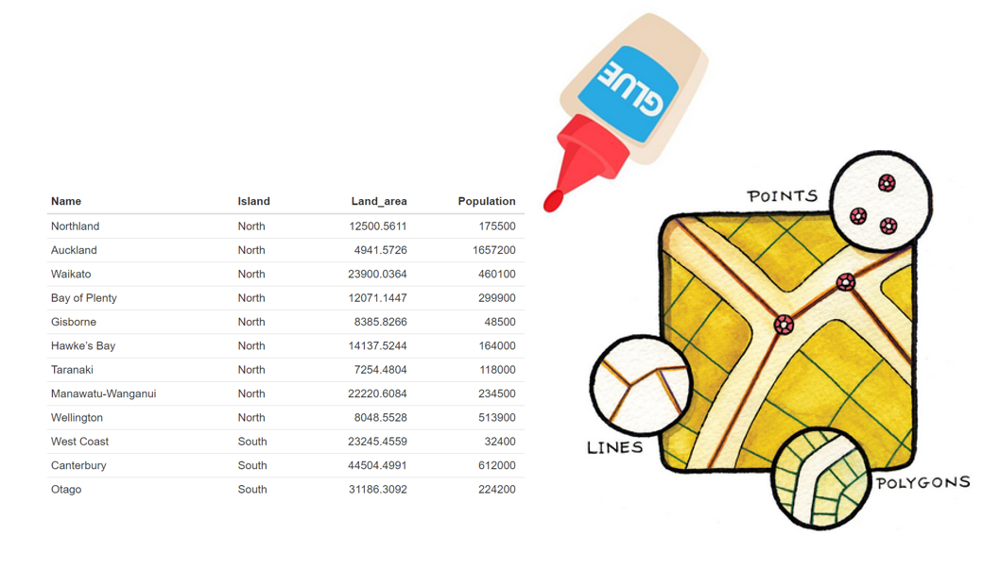
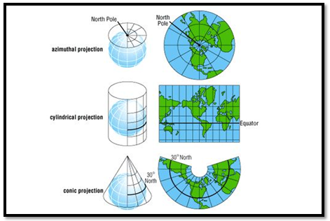

```{r}
#| label: week2-setup
#| echo: false
#| include: false
library(tidyverse)
library(sf)
library(flipbookr)

co <- AOI::aoi_get(state = "CO", county = "all") |>
  select(geoid = fip_code, name, aland = land_area, state_nm = state_name)

conus <- AOI::aoi_get(state = "conus")
```

# Today's Arc {background-color="#1E4D2B"}

## From Tabular to Spatial

Last week: data as **rows and columns** — wrangling, joining, visualizing, modeling.

. . .

This week: data as **features in space** — the same verbs, but now every observation has a *geometry* that describes where it is and what shape it takes.

. . .

**Today's arc:**

1. **Simple Features** — the standard and the R implementation
2. **Spatial Computing: The Stack** — GDAL, PROJ, GEOS (the C++ libraries under `sf`)
3. **Coordinate Systems** — GCS, datums, projections
4. **Measurements** — distance, area, units

(We'll take a 5-minute break after Simple Features.)

# R Objects and Classes {background-color="#1E4D2B"}

## Why Classes Matter: One Data Structure, Many Behaviors

You've already used S3 classes in tidyverse without noticing. The same object type can behave differently based on its class.

Understanding **S3 classes** in R explains:

- Why `print()` on a tibble looks different than a regular `data.frame`

. . .

- Why `filter()` on grouped data filters *within each group* instead of globally

. . .

- Why `summarize()` on a `grouped_df` produces a different output shape

. . .

This is the **callback pattern** — R looks at an object's class and dispatches to the right function. Later, `sf` will extend `data.frame` with spatial methods that work the same way.

## Adding Class: Matrix → Data Frame

A **class** is metadata attached to an object telling R how to interpret and operate on it:

```{r}
# Start with a matrix — just numbers in rows and columns
v <- c(1,2,3,4,5,6)
class(v)
m <- matrix(v, nrow = 3)
class(m)
m
```

```{r}
# Add class metadata: "this is a data frame"
df <- as.data.frame(m)
class(df)
df
```

Same data. But now `df` has **column names**, **printed summary**, and **methods** that respect rectangular structure. The class changed the **behavior** without changing the underlying values.

## Class Hierarchies: Adding Layers

Objects can have **multiple classes** in a hierarchy. Adding structure adds more classes:

```{r}
# Plain data.frame
df <- data.frame(gauge = c("A", "B", "C"), flow = c(100, 120, 95))
class(df)

# Add grouping — now it has *two* classes
gdf <- group_by(df, gauge)
class(gdf)

# Methods are dispatched: dplyr functions check for "grouped_df" first
slice(gdf, 1)  # respects grouping — one row per group, not one global row
slice(df, 1)   # no grouping — just one row total
```

. . .

The key insight: **the same function behaves differently based on class**. This is the callback mechanism. When you call `slice()`, R internally asks: _"What class is this object?"_ and *dispatches* to the right implementation.

## Methods: Functions That Know Their Object's Class

Every function that respects class has **methods** or versions specialized for each class:

```{r}
#| eval: false
# Base R example: print() has different methods
print.data.frame()   # specialized for data.frames
print.default()      # fallback for other objects

# You can list all methods for a class:
methods(class = "data.frame")   # all functions with .data.frame versions
```

. . . 

`select()`, `filter()`, `mutate()` are dplyr verbs that have methods:

```{r}
#| eval: true
methods("filter")    # shows filter.data.frame, filter.grouped_df, filter.ts, etc.
```

## 

When you call `filter()` on a grouped dataframe, R internally does: 

1. Check: "What class is this object?" (`grouped_df`)
2. Look for `filter.grouped_df()`
3. If it exists, call it; if not, fall back to `filter.data.frame()`
4. The `filter.grouped_df()` method applies the condition **within each group** — the key behavior

Compare the same code on grouped vs ungrouped data:

```{r}
df <- data.frame(site = c("A", "A", "B", "B"), flow = c(100, 120, 95, 110))

# On ungrouped data: keeps rows where flow > 105
df |> filter(flow > 105)

# On grouped data: keeps earliest row per group where flow > 105
group_by(df, site) |> filter(flow > 105)
```

The function is identical; the **method dispatched** changes based on class.

# Spatial Computing: The Stack {background-color="#1E4D2B"}

## The Dependencies Under `sf`

`sf` is powerful because it's not built from scratch — it wraps three long standing C/C++ libraries, each with a focused job:

```{r}
#| echo: false
#| fig.align: center
knitr::include_graphics("img/09-sf-depends.png")
```

## The Spatial Stack {.smaller}

**Your R code:**
```R
sf::st_read("data.shp")      # I/O
sf::st_distance(a, b)        # Geometry
sf::st_transform(x, 4269)    # CRS
```

::::: {.columns}

:::: {.column width="33%"}

::: callout-note
### 📦 GDAL
**File I/O**

- Format translators

- Reads/writes Shapefile, GeoJSON, GeoPackage, GeoTIFF

- Returns WKB geometry
:::

::::

:::: {.column width="33%"}

::: callout-note
### 🧭 PROJ
**Coordinate Systems**

- Transforms between 10,000+ CRS definitions

- Handles datum shifts & projections

- Underlies `st_transform()`
:::

::::

:::: {.column width="33%"}

::: callout-note
### ⚙️ GEOS
**Geometry Ops**

- Intersection, union, buffer, centroid

- Distance calculations

- Spatial predicates (`st_intersects()`)
:::

::::

:::::

## Why This Matters

Each library solves a hard problem:

| Library | Solves | Water Resources Example |
|:---------|:--------|:--------|
| **GDAL** | "How do I read a shapefile or GeoPackage?" | Read NHD flowlines, USGS boundaries, stream gauges |
| **PROJ** | "How do I convert WGS84 to Albers?" | Transform NWIS gauges from GPS coordinates to federal projection |
| **GEOS** | "Is this point inside this polygon? What's the distance?" | Snap gauge to nearest flowline, clip to basin |

If we had to write these from scratch in R, it would take years. Instead, spatial computing in R benefits from decades of work by the OSGeo community.

## The `sf` Wrapper

```{r}
sf::sf_extSoftVersion()
```

`sf` doesn't reinvent these wheels. It:

1. **Calls GDAL** for I/O (`st_read()`, `st_write()`)
2. **Calls PROJ** for CRS transformations (`st_transform()`)
3. **Calls GEOS** for geometry operations (`st_distance()`, `st_buffer()`, spatial predicates)
4. **Wraps results** with S3 classes and methods so dplyr verbs (`filter()`, `mutate()`, `select()`) just work — same as tidyverse

This diagram shows the relationship: `sf` methods dispatch to GEOS for the heavy lifting, then return R objects.

::: callout-note
When you install the `sf` package on your machine, the R package manager compiles and links against GDAL, PROJ, and GEOS. If installation fails, it's usually because one of these C/C++ libraries is missing from your system. This is why setting up spatial computing can be more complex than installing a pure-R package.
:::

## What Is GDAL?

**GDAL** = Geospatial Data Abstraction Layer

A C++ library (developed by OSGeo, used by every GIS software) that:

1. **Abstracts** file formats — speaks shapefile, GeoJSON, GeoPackage, etc., but exposes the same API to your program
2. **Translates** between formats — convert any format to any other with one command
3. **Manages drivers** — each format has a "driver" (code that knows how to read/write that specific format)
4. **Handles metadata** — CRS, bounds, layer names, attribute types

. . .

```{r}
#| eval: false
# GDAL (C++ library) <- drivers (one per format)
#     ├── Shapefile driver
#     ├── GeoJSON driver
#     ├── GeoPackage driver
#     ├── GeoTIFF driver
#     ├── NetCDF driver
#     └── ... 200+ more
```

## 

When you call `st_read("data.shp")`, here's what happens:

1. R/`sf` calls GDAL: *"Read this file"*
2. GDAL looks at the extension (.shp)
3. GDAL finds the Shapefile driver
4. The driver reads the .shp and its sidecars
5. GDAL returns data to `sf`
6. `sf` wraps it in an `sfc` geometry + `sf` object structure and hands it to your R code

. . .

::: callout-note
You don't write GDAL code directly. But `st_read()` and `st_write()` are thin wrappers around GDAL. Understanding this explains why `st_read()` "just works" on 50+ formats and why format conversions are trivial in R but painful elsewhere.
:::

## GDAL Drivers and Water Resources {.smaller}

```{r}
#| eval: false
sf::st_drivers() # shows Format, type (vector/raster), open, write
```

Key drivers for water resources:

::: {style="text-align: left; font-size: 0.85em;"}
| Driver | Format | Extension | Common Use |
|:---|:---|:---|:---|
| **ESRI Shapefile** | Shapefile | .shp | USGS NHD, NOAA, boundaries |
| **GeoJSON** | GeoJSON | .geojson | Google APIs, web services |
| **GPKG** | GeoPackage | .gpkg | NHDPlus HR, modern data |
| **GTiff** | GeoTIFF | .tif | USGS 3DEP elevation, imagery |
| **netCDF** | NetCDF | .nc | NOAA climate grids |
| **HDF5** | HDF5 | .h5 | NASA satellite data |
:::

. . .

::: callout-important
**GeoPackage** replaces Shapefiles: one file, complete metadata, SQLite-based. **Shapefiles** require sidecars (.shx, .dbf, .prj) and lack metadata. Use GeoPackage when possible.
:::

## How Core Libraries Pass Data to R: WKT and WKB

When GDAL reads a file or GEOS performs an operation, it uses two standard encodings to pass geometry to R:

**Well-Known Text (WKT)** — human-readable (you'll see this in error messages and discussions):

```{r}
x <- st_linestring(matrix(10:1, 5))
st_as_text(x)
```

- LINESTRING = type; parentheses contain points; points separated by commas; coordinates separated by spaces

**Well-Known Binary (WKB)** — machine-readable, used internally by GDAL/GEOS for speed and lossless communication:

```{r}
st_as_binary(x)
```

. . .

::: callout-note
You rarely write WKT/WKB directly, but understanding they exist explains why `st_read()` "just works"—GDAL converts any format to WKB, `sf` wraps it as an R object, and the roundtrip is seamless.
:::

# Simple Features {background-color="#1E4D2B"}

## Simple Features

```{r}
#| echo: false
#| fig.align: center
knitr::include_graphics("img/09-sf-model.png")
```

## Today's Data: Colorado Counties

:::{.columns}
::: {.column width="50%"}
```{r}
#| echo: true
co
```
:::
::: {.column width="50%"}
```{r}
#| echo: false
ggplot(data = co) +
  geom_sf(aes(fill = aland)) +
  scale_fill_viridis_c(name = "Land Area (m²)") +
  labs(title = "Colorado Counties by Land Area") +
  theme_minimal()
```
:::
:::


## What Is a Simple Feature?

- [Simple features](https://en.wikipedia.org/wiki/Simple_Features) (ISO 19125-1:2004) is a standard describing how real-world objects can be represented in computers, with emphasis on their *spatial geometry*

- It defines:
  1. A **class hierarchy** of geometry types
  2. A **set of operations** on those geometries
  3. **Binary and text encodings** for storage and transfer

. . .

- Widely implemented: PostGIS, ESRI ArcGIS, GDAL, GeoJSON — and `sf` in R
- A subset of simple features (the **big 7**) forms the [GeoJSON](http://geojson.org/) specification

## What Is a Feature?

A feature is a **thing in the real world** — a river, a gauge, a watershed, a county.

- Features often consist of other features:
  - A river *system* → a river → an outlet point
  - A watershed → sub-basins → individual reaches

. . .

The standard says: *"A simple feature has both **spatial** and **non-spatial** attributes. Spatial attributes are geometry valued."*

- The **geometry** describes *where* the feature is and *how* it is represented
- A river's geometry could be its watershed polygon, its mainstem linestring, or its outlet point — depending on the question

. . .

```{r}
str(co)
```

## POINT

A point is composed of **one** coordinate pair in a specific coordinate system.

- Points have no length or area
- Example: a gauge location, a dam, a city

```{r}
#| fig.height: 4
#| fig.align: center
ggplot() + 
  geom_point(aes(x = c(1, 2, 3), y = c(3, 1, 2)), size = 3) + 
  labs(x = "Longitude", y = "Latitude") +
  theme_linedraw()
```

## LINESTRING

A linestring is composed of an **ordered** sequence of two or more coordinate points.

- Points in a line are called **vertices** and explicitly define the connection between two points
- A line has **length**, but no area
- Example: a stream centerline, a river reach, a road

```{r}
#| fig.height: 4
#| fig.align: center
ggplot() + 
  geom_line(aes(x = c(1, 2, 3), y = c(3, 1, 2)), linewidth = 1) + 
  geom_point(aes(x = c(1, 2, 3), y = c(3, 1, 2)), col = "red", size = 3) + 
  labs(x = "Longitude", y = "Latitude") +
  theme_linedraw()
```

## POLYGON

A polygon is composed of 4 or more points whose starting and ending point are the same.

- Polygons enclose a **closed ring** (first point = last point)
- Polygons have both **length and area**
- Example: a watershed boundary, a county border, a floodplain

```{r}
#| fig.height: 4
#| fig.align: center
ggplot() + 
  geom_polygon(aes(x = c(1, 2, 3, 1), y = c(3, 1, 2, 3)), fill = "steelblue", alpha = 0.5, color = "black") + 
  geom_point(aes(x = c(1, 2, 3), y = c(3, 1, 2)), col = "red", size = 3) +
  labs(x = "Longitude", y = "Latitude") +
  theme_linedraw()
```

## Multi-Geometries and Collections

**Multi-** variants are just **sets** of the same type:

- `MULTIPOINT` = set of points
- `MULTILINESTRING` = set of lines (e.g., a braided river system)
- `MULTIPOLYGON` = set of polygons (e.g., an island chain, a fragmented watershed)

**GEOMETRYCOLLECTION** = a set of mixed geometry types (rare, usually from intersections)

## The Big 7 Geometry Types

::: {style="text-align: left;"}
| Single | Description |
|:--------|:-------------|
| `POINT` | Zero-dimensional — a single coordinate pair |
| `LINESTRING` | Sequence of points connected by straight line pieces — 1D |
| `POLYGON` | Closed ring with positive area — 2D; may have interior holes |

| Multi (same type) | Description |
|:--------|:-------------|
| `MULTIPOINT` | Set of points |
| `MULTILINESTRING` | Set of linestrings |
| `MULTIPOLYGON` | Set of polygons |

| Mixed | Description |
|:--------|:-------------|
| `GEOMETRYCOLLECTION` | Set of geometries of any type |
:::

::: callout-note
These 7 types cover virtually everything in water resources work: gauge locations (POINT), stream reaches (LINESTRING), watershed boundaries (POLYGON), and their multi-feature equivalents.
:::

## Dimensions

All geometries are composed of **points** defined in 2-, 3-, or 4-D space:

- **XY** — standard 2D coordinates (longitude, latitude or easting, northing)
- **XYZ** — adds altitude (elevation of stream bed, DEM surface)
- **XYM** — adds a measure attribute independent of the feature (e.g., streamflow at a vertex — rarely used)
- **XYZM** — both Z and M

. . .

Note: "dimension" here means *coordinate dimension* (XY vs XYZ), **not** whether the geometry has length or area:

```{r}
m1 <- rbind(c(8,1), c(2,5), c(3,2))
st_dimension(st_multipoint(m1))    # 0 — point set, no length
st_dimension(st_linestring(m1))    # 1 — has length, no area
```

## Valid Geometries {.smaller}

**Rules for valid geometries:**

- **LINESTRING** — no self-intersections

- **POLYGON** — rings must be closed

- **POLYGON** — holes inside exterior only

- **POLYGON** — rings touch at points only

- **POLYGON** — no repeated paths

::: callout-warning
Run `st_is_valid()` to check your data. Fix invalid geometries with `st_make_valid()`.
:::

## Invalid Examples {.smaller}

:::{.columns}
:::{.column width="45%"}

**Self-intersecting line:**

```{r}
#| eval: false
x1 <- st_linestring(cbind(c(0,1,0,1), 
                          c(0,1,1,0)))
st_is_simple(x1)  # FALSE
```

**Invalid polygon (crossing edges):**

```{r}
#| eval: false
x2 <- st_polygon(list(cbind(
  c(0,1,1,1,0,0), 
  c(0,0,1,0.6,1,0))))
st_is_valid(x2)  # FALSE
```

:::
:::{.column width="55%"}

```{r}
#| echo: false
#| fig.align: center
#| fig.width: 5
#| fig.height: 4

x1 <- st_linestring(cbind(c(0,1,0,1), c(0,1,1,0)))
x2 <- st_polygon(list(cbind(c(0,1,1,1,0,0), c(0,0,1,0.6,1,0))))

par(mfrow = c(1, 2), mar = c(2, 2, 2, 1))
plot(x1, main = "Self-intersecting\nLINESTRING")
plot(x2, col = "steelblue", main = "Invalid POLYGON\n(crossing edges)")
par(mfrow = c(1, 1))
```

:::
:::

*These operations fail silently unless checked.*

## Empty Geometries

`EMPTY` geometries serve as "`NA`" placeholders for geometry types — they arise naturally from spatial operations:

```{r}
#| message: true
(e <- st_intersection(st_point(c(0,0)), st_point(c(1,1))))
st_is_empty(e)

plot(st_point(c(0,0)), pch = 16)
plot(st_point(c(1,1)), add = TRUE, col = 'red', pch = 16)
```

# sfg → sfc → sf {background-color="#1E4D2B"}

## Storing Geometry: Nested Lists {.smaller}

Remember nested lists? A geometry is just **coordinates**:

```{r}
#| eval: false
# One geometry: a pair of coordinates
c(x = 1, y = 2)

# Many geometries: nested list of coordinate pairs
list(list(c(1, 2)), list(c(3, 4)), list(c(5, 6)))
```

. . .

**R stores multiple geometries side-by-side this way:** Each row in a data.frame holds one geometry (which is a list of coordinates). This creates a **geometry column** — many rows, each with its own nested geometry.

- **One row** = one feature (with attributes + geometry)
- **Each row's geometry** = one nested coordinate structure  
- **All rows together** = a geometry list-column

## Three Classes, One Object

```{r}
#| echo: false
#| fig.align: center
knitr::include_graphics("img/10-sf-diagram.png")
```

- 🟢 **sf** — a `data.frame` with feature attributes and a geometry column (class: `sf`)
- 🔴 **sfc** — the geometry list-column (set of geometries)
- 🔵 **sfg** — individual simple feature geometry (one geometry per feature)

. . .

::: callout-important
**This is the S3 class hierarchy in action.** 
`sf` is a subclass of `data.frame` adding the geometry column and specialized methods. When you call `filter()` on an `sf` object, R looks at its class and dispatches to the spatial-aware `filter.sf()` method, which respects the geometry column. Same pattern as `grouped_df` from tidyverse.
:::

## `sfg`: Simple Feature Geometry

`sfg` objects carry the geometry for a **single feature**. Storage rules:

1. A single `POINT` → numeric vector
2. Points in a `LINESTRING` or `POLYGON` ring → matrix (each row = a point)
3. Any other set → list

. . .

Creator functions (rarely used in practice — you usually read existing data):

```{r}
(x <- st_point(c(1, 2)))
str(x)

(x <- st_linestring(matrix(c(1,2,3,4), ncol = 2)))
str(x)
```

## `sfg`: Class Structure

All geometry objects have an S3 class indicating (1) dimension, (2) type, (3) superclass:

```{r}
(pt  <- st_point(c(0, 1)))
attributes(pt)

(pt2 <- st_point(c(0, 1, 4)))   # XYZ
attributes(pt2)
```

## `sfg`: Same Points, Different Meaning

The same coordinate matrix creates geometries with entirely different dimensionality:

```{r}
m1 <- rbind(c(8,1), c(2,5), c(3,2))

(mp <- st_multipoint(m1))   # zero-dimensional point set
(ls <- st_linestring(m1))   # one-dimensional line

st_dimension(mp); st_length(mp)
st_dimension(ls); st_length(ls)
```

## Mixed Geometries and Collections {.smaller}

When features have different geometry types, the type becomes `GEOMETRY`.

**Example: A collection with POINT + LINESTRING:**

```{r}
g <- st_sfc(st_point(c(0, 0)), 
            st_linestring(rbind(c(0, 0), c(1, 1))))
```

. . .

**Filter by type with `st_is()`:**

```{r}
st_sf(geometry = g) |>
  filter(st_is(geometry, "LINESTRING"))   # keep only lines
```

. . .

**When intersections produce mixed types, use `st_collection_extract()`:**

```{r}
#| eval: false
pt   <- st_point(c(1, 0))
ls   <- st_linestring(matrix(c(4, 3, 0, 0), ncol = 2))
poly <- st_polygon(list(matrix(c(5.5, 7, 7, 6, 5.5, 0, 0, -0.5, -0.5, 0), ncol = 2)))
collection <- st_geometrycollection(list(pt, ls, poly))

st_collection_extract(collection, "POLYGON")  # extract only polygons
```

## Conversion Between Types: `st_cast`

```{r}
(co1   <- filter(co, name == "Larimer")$geometry)
(co_ls <- st_cast(co1, "MULTILINESTRING"))
```

```{r}
#| echo: false
#| fig.align: center
par(mfrow = c(1,2), mar = c(1,1,2,1))
plot(co1,   col = "steelblue", main = "MULTIPOLYGON")
plot(co_ls, col = "firebrick", main = "MULTILINESTRING")
```

## Casting: Feature vs. Set Level

Casting operates at the **feature level**, not the set level:

```{r}
#| warning: true
rbind(c(0,0), c(1,1), c(1,0), c(0,1)) |>
  st_linestring() |>
  st_cast("POINT")   # ⚠️ converts ONE line to ONE point — not what you want
```

. . .

To extract individual points, work at the **set level** (`sfc`):

```{r}
(p <- rbind(c(0,0), c(1,1), c(1,0), c(0,1)) |>
   st_linestring() |>
   st_sfc() |>           # create a SET of one geometry
   st_cast("POINT"))     # now produces 4 individual points
```

`r flipbookr::chunq_reveal("set", title = "Sets of geometries", lcolw = 40, rcolw = 60)`

```{r set}
#| include: false
#| warning: true
rbind(c(0,0), c(1,1), c(1,0), c(0,1)) |>
  st_linestring() |>
  st_sfc() |>
  st_cast("POINT") ->
  p
```

## Combining and Dissolving Geometries

Two key operations for working with geometry sets:

**`st_combine()`** — joins geometries while **preserving** interior boundaries:

```{r}
(co_combined <- st_combine(co$geometry))
```

. . .

**`st_union()`** — joins geometries and **dissolves** interior boundaries (merges into one feature):

```{r}
(co_unioned <- st_union(co$geometry))
```

## Visualizing Combine vs. Union

::: {.columns}
::: {.column width="50%"}
**st_combine** (boundaries preserved):
```{r}
#| echo: false
#| fig.align: center
plot(st_combine(co$geometry), col = "steelblue", main = "st_combine: county borders visible")
```
:::
::: {.column width="50%"}
**st_union** (boundaries dissolved):
```{r}
#| echo: false
#| fig.align: center
plot(st_union(co$geometry), col = "firebrick", main = "st_union: state outline only")
```
:::
:::

. . .

**Water resources example**: Use `st_combine()` to keep sub-basins separate, use `st_union()` to create a single merged basin outline.

---

## `sfc`: Geometry List-Columns

`st_sfc` creates sets of geometries — what becomes the sticky list-column in `sf` objects:

```{r}
(sfc <- st_sfc(st_point(c(0,1)), st_point(c(-3,2))))
class(sfc)
attributes(sfc) |> names()
```

The `sfc` object records for the **whole set**: precision, bounding box, CRS, and count of empty geometries.

## Combine + Cast: From Boundaries to Lines

You can combine geometries and then cast them to a different type — useful for creating line networks from polygon boundaries:

```{r}
co_borders_combined <- st_combine(co$geometry) |> st_cast("MULTILINESTRING")
co_borders_unioned  <- st_union(co$geometry) |> st_cast("MULTILINESTRING")
```

```{r}
#| echo: false
#| fig.align: center
par(mfrow = c(1,2), mar = c(1,1,2,1))
plot(co_borders_combined, col = "steelblue", main = "Combined: county borders preserved")
plot(co_borders_unioned, col = "firebrick", main = "Unioned: state border only")
par(mfrow = c(1,1))
```

. . .

::: callout-tip
This distinction matters constantly in water resources: county boundaries vs. watershed boundaries, stream reaches vs. the river network, individual gauge catchments vs. the basin outline.
:::

## CONUS: Combine vs. Union

```{r}
us_c_ml <- st_combine(conus) |> st_cast("MULTILINESTRING")
us_u_ml <- st_union(conus)   |> st_cast("MULTILINESTRING")
```

```{r}
#| echo: false
#| fig.align: center
g1 <- ggplot() + geom_sf(data = us_c_ml, color = "steelblue") +
  theme_linedraw() + labs(title = paste("Combined:", length(st_geometry(us_c_ml)), "feature(s)"))

g2 <- ggplot() + geom_sf(data = us_u_ml, color = "firebrick") +
  theme_linedraw() + labs(title = paste("Unioned:", length(st_geometry(us_u_ml)), "feature(s)"))

gridExtra::grid.arrange(g1, g2, nrow = 1)
```

## Distance to Denver: Thinking About Feature Level

**Question**: how far is Denver from the nearest state border?

```{r}
denver_sf <- data.frame(y = 39.7392, x = -104.9903, name = "Denver") |>
  st_as_sf(coords = c("x", "y"), crs = 4326)
```

`r flipbookr::chunq_reveal("q14", title = "Attempt 1: distance to states (polygons)", lcolw = 40, rcolw = 60)`


```{r}
#| label: q14
#| include: false
conus |>
  select(state_name) %>%
  mutate(dist = st_distance(., denver_sf)) |>
  slice_min(dist, n = 3) ->
  state_data
```

- NOTE: the `%>% pipe needed here ...
- Distance to Colorado is 0 — Denver is *inside* a polygon, so distance = 0
- Polygons describe **areas** — distance to the interior is always 0

`r flipbookr::chunq_reveal("q15", title = "Attempt 2: cast to lines first", widths = c(40,60,0))`

```{r}
#| label: q15
#| include: false
conus |>
  select(state_name) |>
  st_cast("MULTILINESTRING") %>%
  mutate(dist = st_distance(., denver_sf)) |>
  slice_min(dist, n = 3)
```

## The Right Feature Level

Computing distance to 48 state borders when we only need the nearest one is wasteful. The **feature** should be the complete set of borders — one `MULTILINESTRING`:

```{r}
st_distance(denver_sf, st_cast(st_combine(conus), "MULTILINESTRING"))
```

. . .

- 1 calculation instead of 48
- Correct answer: distance to the **border**, not to individual state features
- Same principle applies to: distance to national border, distance to any river network, distance to nearest dam

# The `sf` Object {background-color="#1E4D2B"}

## `sf`: Attributes + Geometry

```{r}
co
class(co)
attr(co, "sf_column")
```

An `sf` object is a `data.frame` with one special list-column: the geometry. It extends `data.frame` with spatial awareness.

## Sticky Geometry

The geometry column **persists through dplyr operations**:

```{r}
co |> 
  select(name) |> 
  slice(1:2)   # geometry comes along
```

. . .

Drop it explicitly when you don't need it:

```{r}
co |> st_drop_geometry() |> select(name) |> slice(1:2)
```

## Plotting `sf` Objects with ggplot2

`geom_sf()` is the bridge between `sf` and `ggplot2` — everything from last week works:

```{r}
#| fig.align: center
ggplot(data = co) +
  geom_sf(aes(fill = aland)) +
  scale_fill_viridis_c(name = "Land Area (m²)") +
  labs(title = "Colorado Counties by Land Area") +
  theme_minimal()
```

. . .

All `dplyr` verbs work on `sf` objects first, then pipe into `ggplot`:

```{r}
#| eval: false
co |>
  filter(name == "Larimer") |>
  ggplot() + geom_sf(fill = "#1E4D2B") + theme_void()
```

## The Sticky Geometry Structure

```{r}
#| echo: false
#| fig.align: center
#| out.width: '75%'

```

The geometry binding is unique — unlike `bind_cols()` or `cbind()`, the `sfc` list-column carries CRS, bounding box, and precision metadata that regular column binding does not.

---

## Simple Features: What You've Learned

You now understand:

- The **seven geometry types** — POINT, LINESTRING, POLYGON, and their multi-equivalents
- The **class hierarchy** — `sfg` (individual geometry) → `sfc` (set) → `sf` (dataframe with sticky geometry)
- **Valid geometries** — self-intersecting lines and invalid polygons break spatial operations silently
- **WKT and WKB** — human-readable and machine-readable encodings
- **Casting and dissolving** — changing geometry type and boundary representation
- **Sticky geometry in dplyr** — `sf` objects work naturally with pipes, filters, and ggplot

Now a 5-minute break, then: **What makes these coordinates actually *spatial*?** We'll cover the Coordinate Reference System — the foundation that anchors every spatial operation.

# ☕ Break {background-color="#1E4D2B"}

## 5 Minutes

Back in 5. Next: coordinate systems, projections, and the three-part system (ellipsoid, datum, prime meridian) that determines whether your spatial analysis is correct or silently wrong.

# Coordinate Systems {background-color="#1E4D2B"}

## What Makes Spatial Data Spatial?

```{r}
#| echo: false
#| fig.align: center
#| out.width: '75%'
knitr::include_graphics("img/09-sf-model.png")
```

The geometry alone is meaningless without knowing **where on Earth** those coordinates refer to. That's the job of the Coordinate Reference System.

## Coordinate Reference Systems

A **Coordinate Reference System (CRS)** defines how spatial features relate to the surface of the Earth.

Two broad types:

- **Geographic Coordinate System (GCS)** — locations on the *curved* surface of the Earth, measured in angular units (degrees)
- **Projected Coordinate System (PCS)** — locations on a *flat* surface, measured in linear units (meters, feet)

In `sf`, three tools:

| Function | Does |
|:---|:---|
| `st_crs()` | Retrieve CRS from an `sf` or `sfc` object |
| `st_set_crs()` | Set or replace CRS (no coordinate transformation) |
| `st_transform()` | Transform coordinates from one CRS to another |

## Geographic Coordinate Systems

A GCS identifies locations on the **curved** surface of the Earth using angular measurements from the center:

- **Latitude** — vertical angle (North/South from equator)
- **Longitude** — horizontal angle (East/West from prime meridian)
- North and East are positive; South and West are negative

. . .

A GCS is defined by three components:

1. **Ellipsoid** — the mathematical model of Earth's shape (flattened sphere, not perfect)
2. **Datum** — how the ellipsoid is anchored to the real Earth (locally fitted or globally centered)
3. **Prime meridian** — the origin of longitude (Greenwich, 0°E/W)

Why this matters: two datasets may use the same coordinates but different datums. The difference is small (sub-meter) but compounds in spatial joins and distance calculations.

## Common Datums in Water Resources

Three datums account for most US data:

| Datum | Acronym | Used by | Typical error vs. NAD83 |
|:---|:---|:---|:---|
| North American Datum 1983 | NAD83 | NHDPlus, most USGS vector data | Reference datum |
| World Geodetic System 1984 | WGS84 | GPS, NWIS gauges, web maps | <1 meter in CONUS |
| NAD27 (historic) | NAD27 | Legacy sources only | Can be 100+ meters off |

::: callout-note
NAD83 and WGS84 differ by less than 1 meter for most of CONUS. But they are *not* the same CRS. Mixing them without explicit transformation introduces sub-meter errors that compound in spatial joins. Always check with `st_crs(a) == st_crs(b)` before joining.
:::

## Projected Coordinate Systems {.smaller}

A **Projected Coordinate System (PCS)** transforms the curved Earth onto a 2D plane. Every transformation introduces **distortion**.

. . .

**Three main projection families:**

```{r}
#| echo: false
#| fig.align: center
#| fig.height: 4.5

```

. . .

- **Planar** — flat surface touches globe at a point (best for polar regions)
- **Cylindrical** — cylinder wraps around globe (world maps, Mercator)
- **Conic** — cone around globe (mid-latitude areas, CONUS)

## Spatial Properties and Distortion

Each type of projection prioritizes one property at the cost of others:

| Property | Preserved by | Used for |
|:---|:---|:---|
| **Area** | Equal-area (Albers) | Accurate area calculations, choropleth maps |
| **Distance** | Equidistant | Distance from a fixed center point |
| **Shape** | Conformal (Mercator) | Navigation, preserving local angles |
| **Direction** | Azimuthal | Navigation from a pole |

## Projection Choice: Water Resources Defaults

For CONUS analysis, use these defaults:

::: callout-important
- **Computing area** (choropleth maps, watershed statistics) → **EPSG:5070** (Albers Equal Area). This is the standard federal projection for CONUS.
- **Measuring distance** (gauge to outlet, confluences, dam spacing) → Keep data in geographic (WGS84, EPSG:4326) and use `st_distance()` with default S2 spherical geometry — it's geodesic and correct.
- **Sub-state local analysis** → Use a local UTM zone (e.g., NAD83 / UTM zone 13) if you need projected planar distance.
- **Visualization/mapping** → Use whatever looks right for your region (Web Mercator for web, Albers for print).
:::

## EPSG Codes and PROJ Strings

`sf` stores CRS in two ways:

- **EPSG code** — integer ID for a known CRS (e.g., `4326` = WGS84 geographic)
- **PROJ4 string** — generic text description understood by the PROJ library

Common codes for water resources work:

| EPSG | Name | Use |
|:---|:---|:---|
| 4326 | WGS84 geographic | GPS coordinates, web maps, NWIS gauges |
| 4269 | NAD83 geographic | NHDPlus, most USGS vector data |
| 5070 | NAD83 / Conus Albers | Area calculations, CONUS-wide analysis |
| 26913–26915 | UTM NAD83 zones 13–15 | Local/state-level distance calculations |

Practical rule: Use EPSG:5070 for CONUS area calculations; use a local UTM (e.g., NAD83 / UTM zones) for sub-state analyses.

## Checking and Setting CRS

::: {.columns}
::: {.column width="50%"}
```{r}
st_crs(conus)$epsg
st_crs(conus)$proj4string
st_crs(conus)$datum
```
:::
::: {.column width="50%"}
```{r}
conus5070 <- st_transform(conus, 5070)
st_crs(conus5070)$epsg
st_crs(conus5070)$proj4string
```
:::
:::

## Visualizing Projections

```{r}
#| echo: false
#| fig.align: center

eqdc <- '+proj=eqdc +lat_0=40 +lon_0=-96 +lat_1=20 +lat_2=60 +x_0=0 +y_0=0 +datum=NAD83 +units=m +no_defs'

g1 <- ggplot(data = conus) +
  geom_sf() + theme_linedraw() + coord_sf(datum = 4326) +
  labs(title = "Unprojected (WGS84)", subtitle = "EPSG:4326 — angular units")

g2 <- ggplot(data = st_transform(conus, 5070)) +
  geom_sf() + theme_linedraw() + coord_sf(datum = 5070) +
  labs(title = "Albers Equal Area", subtitle = "EPSG:5070 — preserves area")

g3 <- ggplot(data = st_transform(conus, eqdc)) +
  geom_sf() + theme_linedraw() + coord_sf(datum = eqdc) +
  labs(title = "Equidistant Conic", subtitle = "EQDC — preserves distance")

gridExtra::grid.arrange(g1, g2, g3, nrow = 1)
```

## #1 Reproducibility Habit: Always Check CRS

Before **any** spatial operation — joins, distance calculations, area calculations — verify CRS match:

```{r}
#| eval: false
# Guard pattern: check before joining
if (st_crs(gauges) != st_crs(flowlines)) {
  flowlines <- st_transform(flowlines, st_crs(gauges))
}

# Or use the equality check
st_crs(gauges) == st_crs(flowlines)  # must be TRUE
```

. . .

**Real example**: NWIS gauges (WGS84, EPSG:4326) + NHD flowlines (NAD83, EPSG:4269):

```{r}
st_crs(4326) == st_crs(4269)    # FALSE — they are not the same!
```

They look similar (sub-meter differences in CONUS), but snapping a point to a line or computing a distance will be subtly wrong without transformation.

::: callout-important
`sf` will warn you about CRS mismatch but **won't stop you**. The result will execute and look plausible — but numbers will be wrong. Build the guard-check habit now.
:::

# Measurements {background-color="#1E4D2B"}

## Geodesic vs. Planar Measurements {.smaller}

**Geodesic distance**: shortest path on an ellipsoid — true Earth surface distance.

**Planar distance**: Euclidean distance in projected coordinates — fast but introduces error.

```{r}
#| eval: false
pts <- data.frame(y = c(40.7128, 34.4208), x = c(-74.0060, -119.6982)) |>
  st_as_sf(coords = c("x", "y"), crs = 4326)

st_distance(pts)                    # Geodesic: ~3,962 km (correct)
st_distance(st_transform(pts, 5070))# Planar: ~3,950 km (distorted)
```

. . .

::: callout-important
**For water resources: use geodesic (default)**. In geographic CRS, `st_distance()` automatically computes geodesic (spherical) distances — correct for continental scales.
:::

. . .

::: callout-note
`sf` uses geodesic by default in geographic CRS. Toggle S2 with `sf::sf_use_s2(TRUE/FALSE)` for fine control (rarely needed).
:::

. . .

::: callout-note
**Performance:** S2 geodesic calculations used to be substantially slower, but modern versions of `sf` and the S2 library have optimized performance significantly. Geodesic is now only ~25% slower than planar for large operations — a measurable but not critical difference for most workflows. Use geodesic unless you're profiling and find it's a real bottleneck.
:::

## What Is S2?

**S2** is Google's spherical geometry library — a modern C++ implementation for accurate calculations on a sphere/ellipsoid.

`sf` uses S2 under the hood when data is in geographic coordinates (e.g., WGS84). Instead of flattening Earth to a 2D plane (which introduces distortion), S2 works directly with spherical coordinates:

- **Ellipsoidal geometry** — computes distances, intersections, areas on the actual Earth shape
- **Efficient spatial indexing** — divides the sphere into hierarchical cells for fast operations
- **Replaces GEOS for geographic data** — when your CRS is in degrees, S2 handles the heavy lifting
- **Fast enough in practice** — modern optimizations have made geodesic calculations competitive with planar

. . .

::: callout-important
S2 is **automatic**: if your data is in geographic coordinates, `st_distance()`, `st_intersects()`, and other spatial operations use S2 geodesic calculations by default. You don't need to do anything.
:::

## Controlling S2: When and How

S2 is the right default for water resources work (continental scales, mixed coordinate systems), but you can toggle it for specialized cases:

```{r}
#| eval: false
# Disable S2 (use GEOS planar geometry instead)
sf::sf_use_s2(FALSE)

# Re-enable S2
sf::sf_use_s2(TRUE)

# Check current setting
sf::sf_use_s2()
```

. . .

**When to disable S2:**
- Very small local areas (< 10 km) where planar error is negligible and you want marginal speed gains
- Specialized geometric algorithms that require GEOS planar operations (rare in practice)

**Leave S2 enabled (default):**
- Continental and larger scales (your typical water resources workflow)
- Mixing geographic and projected data
- When correctness matters more than squeezing out microseconds


## Units as an S3 Class — Workflow

Results carry **units** as an S3 class attribute — both powerful for correctness and a source of confusion in practice.

```{r}
class(conus)
attributes(conus)
```

...

```{r}
class(st_length(conus))
attributes(st_length(conus)) |> unlist()
```

## Units Workflow: Create → Convert → Drop

Create units naturally from measurements, convert between units, then drop before plotting or filtering:

Convert between units with the `units` package:

```{r}
co <- AOI::aoi_get(state = "CO")
(l = st_length(st_cast(co, "MULTILINESTRING")))

units::set_units(l, "km")
units::set_units(l, "mile")

(a = st_area(co))

units::set_units(a, "ha")
units::set_units(a, "km2")
```

. . .

Strip units when needed for arithmetic or plotting:

```{r}
units::drop_units(l)
as.numeric(l)
```

## Units Are a Class — Know the Rules

Units enforce dimensional correctness but can surprise you:

```{r}
#| error: true
#| eval: false
st_length(conus) + 100   # can't add meters + unitless number

filter(cities, dist_to_border < 160)  # may warn or fail
```

. . .

The corrected patterns:

```{r}
#| eval: false
# Create numeric version for filtering/plotting
cities <- cities |>
  mutate(dist_to_border_km = as.numeric(units::set_units(dist_to_border, "km")))

# Now filter and plot safely
cities |>
  filter(dist_to_border_km < 160) |>
  ggplot(aes(color = dist_to_border_km)) +
  geom_sf()
```

# Getting Spatial Data into R {background-color="#1E4D2B"}

## Building `sf` from a CSV

When coordinates are stored as numeric columns in a CSV — the most common format for point data from APIs, sensors, and databases — use `st_as_sf()`:

```{r}
#| eval: false
cities <- read_csv("data/uscities.csv") |>
  st_as_sf(coords = c("lng", "lat"),  # column names: X first, then Y
           crs    = 4326)             # raw lat/lon is almost always WGS84
```

. . .

Three things to always specify:

1. `coords =` — column names in order X (longitude), Y (latitude)
2. `crs =` — the CRS the raw numbers **are in** (not what you want them in)
3. Then `st_transform()` to convert to your analysis CRS

## Full pipeline:

```{r}
#| eval: false
cities <- read_csv("data/uscities.csv") |>
  st_as_sf(coords = c("lng", "lat"), crs = 4326) |>
  st_transform(5070)                # reproject for distance analysis
```

## End-to-End: CSV → Filtered → Transformed → Measured

This is the complete workflow to compute the distance from every city to the national border:

```{r}
#| eval: true
# Pre-compute boundary in projected space (outside the pipeline)
boundary <- st_cast(st_union(st_transform(conus, 5070)), "MULTILINESTRING")

# Main workflow: read, build, transform, measure
system.time({
cities <- read_csv("data/uscities.csv", show_col_types =FALSE) |>
  st_as_sf(coords = c("lng", "lat"), crs = 4326) |>
  st_transform(5070) %>%
  mutate(
    dist_to_border_m = st_distance(., boundary),
    dist_to_border_km = units::set_units(dist_to_border_m, "km")
  )
})

# user  system elapsed 
# 1.648   0.014   1.677
```

Key takeaways:
- **Build sf**: CSV coordinates + CRS they're in → `st_as_sf()`
- **Transform**: project to EPSG:5070 for measurements
- **Measure**: distance returns units object; convert as needed
- **Reuse**: pass pre-computed boundary to `st_distance()` — clean, fast, readable

## Common Pitfalls ⚠️ {.smaller}

### Pitfall: Distances in Geographic Space

```{r}
#| eval: false
boundary <- st_cast(st_union(conus),"MULTILINESTRING")

cities <- read_csv("data/uscities.csv") |>
  st_as_sf(coords = c("lng", "lat"), crs = 4326) %>%
  mutate(dist = st_distance(., boundary))

# user    system  elapsed
# 80.763  0.300   81.055
```

. . .

**Rule**: Transform geometry to projected CRS before expensive operations like `st_union()`, `st_intersection()`, etc.

### Pitfall 2: Comparing Units

```{r}
#| eval: false
dist <- st_distance(cities, boundary)  # Returns [m]

filter(cities, dist < 100)              # ❌ ERROR
filter(cities, as.numeric(dist) < 100)  # ✅ CORRECT
```

**Rule**: Drop units with `as.numeric()` before comparisons.

::: callout-important
**Principle: Choose CRS strategically.**

- **Geographic (4326)** by default for input/output (standard data format)
- **Project immediately** to EPSG:5070 (or your region's standard) for analysis
- **Pre-compute expensive operations** (union, clip, buffer) in projected space *outside* the data pipeline
- This respects both correctness (geodesic) and performance (planar operations where they matter)
:::

# Visualizing Spatial Data {background-color="#1E4D2B"}

## `geom_sf()`: The Foundation

`geom_sf()` is ggplot2's spatial geometry layer. It automatically extracts coordinates from the `geometry` column and plots them. **No need to specify `x` and `y` aesthetics.**

::: columns
::: {.column width="50%"}

**Points**
```{r}
#| eval: false
ggplot(cities) +
  geom_sf(color = "navy", size = 1)
```

:::
::: {.column width="50%"}

**Polygons**
```{r}
#| eval: false
ggplot(conus) +
  geom_sf(fill = "lightblue", color = "black")
```

:::
:::

. . .

**Key advantage**: All standard ggplot2 aesthetics work — `color`, `fill`, `size`, `alpha`, `linetype`, etc. And you can layer multiple `geom_sf()` calls:

```{r}
#| eval: false
ggplot() +
  geom_sf(data = conus, fill = "white") +
  geom_sf(data = st_filter(cities, st_transform(conus, 5070)), color = "red", size = 0.1) +
  theme_void()
```

::: callout-tip
**Always add `theme_void()`** to remove axes, gridlines, and background — maps don't need Cartesian coordinates.
:::

## `ggrepel`: Non-Overlapping Labels

`ggrepel` solves label collision — essential any time you label points on a map:

```{r}
#| eval: false
library(ggrepel)

ggplot() +
  geom_sf(data = conus, fill = "white") +
  geom_sf(data = st_filter(cities, st_transform(conus, 5070)), color = "red", size = 0.1) +
  ggrepel::geom_label_repel(
    data = filter(cities, city == "Denver"),
    aes(geometry = geometry, label = city),
    stat = "sf_coordinates",  # extracts coordinates from sf geometry
    size = 3
  ) +
  theme_void()
```

. . .

`stat = "sf_coordinates"` is the key argument — it tells ggrepel to extract X/Y from the geometry column rather than expecting explicit `x` and `y` aesthetics. Without it, you get an error.

## `gghighlight`: Emphasize a Subset

`gghighlight` greys out features that do not meet a condition, keeping them as spatial context:

```{r}
#| eval: false
library(gghighlight)

ggplot() +
  geom_sf(data = conus) +
  geom_sf(data = st_filter(cities, st_transform(conus, 5070)),
          aes(color = as.numeric(dist_to_border_km)),
          size = 0.3) +
  gghighlight(as.numeric(dist_to_border_km) < 100) +
  scale_color_gradient(low = "orange", high = "darkred") +
  labs(title = "Cities within 100 km of the national border",
       color = "Distance (km)") +
  theme_void()
```

. . .

Features outside the condition are rendered in grey at reduced opacity — they provide spatial context without competing visually with the highlighted subset. Works with any `geom_*` — points, lines, polygons.

# Wrapping Up {background-color="#1E4D2B"}

## What We Covered

::: {.columns}
::: {.column width="50%"}
**Simple Features**

- The ISO standard and its R implementation
- The big 7 geometry types
- sfg → sfc → sf class hierarchy
- WKT / WKB encodings
- Casting, combining, dissolving
- Sticky geometry + `geom_sf()`

**Coordinate Systems**

- GCS: ellipsoid, geoid, datum
- PCS: projection types and distortion
- EPSG codes and `st_transform()`
- Always check CRS before joining
:::
::: {.column width="50%"}

**Measurements**

- Geodesic vs. planar distance
- `st_distance()`, `st_area()`, `st_length()`
- Units as an S3 class — `set_units()`, `drop_units()`
- Converting and dropping units

**Key habits built today:**

1. `st_is_valid()` on every dataset you read
2. `st_crs(a) == st_crs(b)` before every spatial join
3. Use equal-area CRS for areas, equidistant for distances
4. `as.numeric()` before filtering on unit quantities
:::
:::

## Next Week

**Week 3: Spatial Predicates & Joins** — relationships between geometries, filtering by space, and combining data sources
