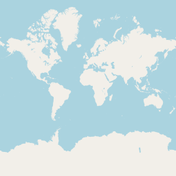
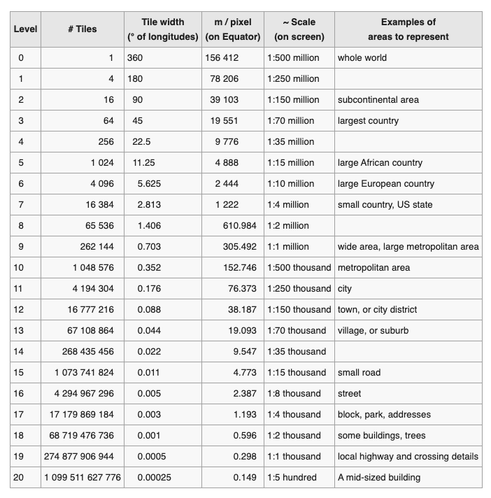
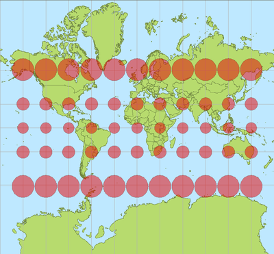
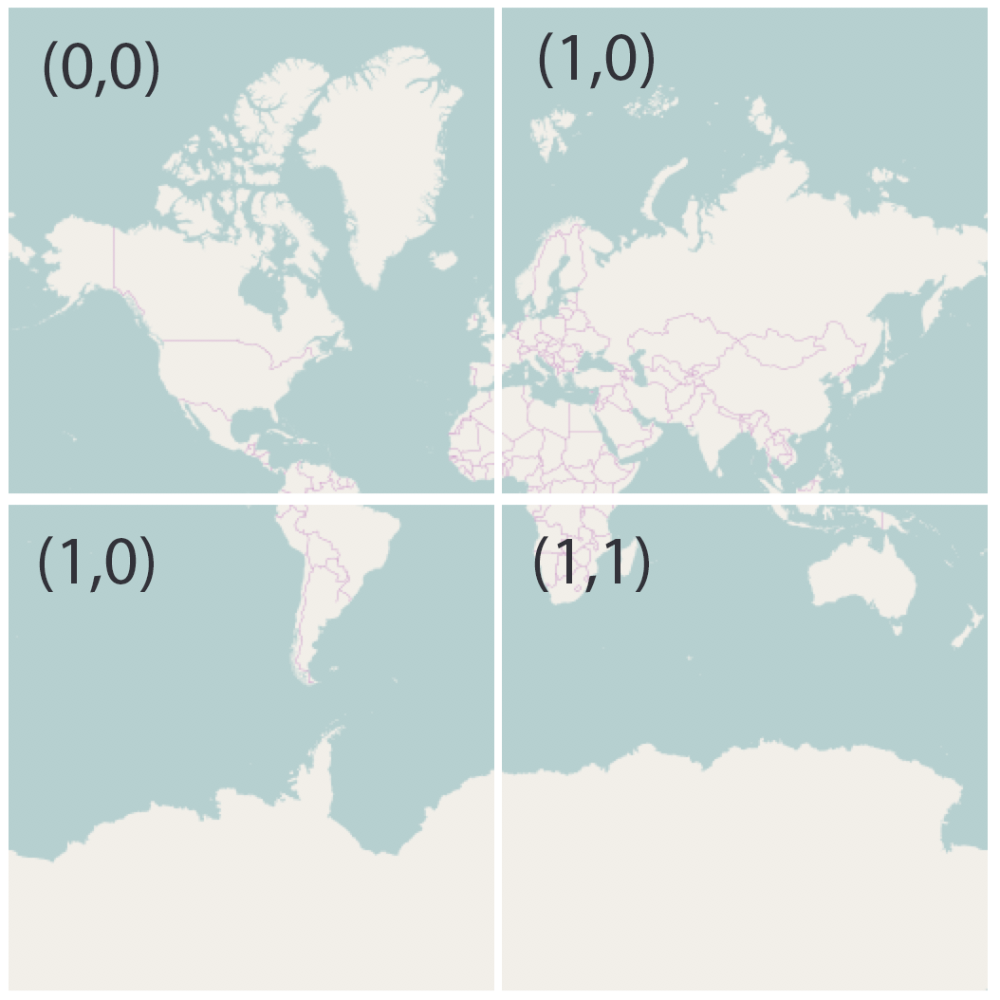
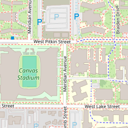

```{r}
#| label: week2-setup
#| echo: false
#| include: false
library(sf)
library(tidyverse)
library(USAboundaries)
library(leaflet)
```

# Interactive Mapping — Core Concepts {background-color="#1E4D2B"}

## Lecture focus

- What makes a map interactive?
- Tile servers, markers, layers, popups, and controls
- Practical implications for teaching and research in a grad seminar

## Leaflet

- Leaflet is a very popular, open-source, JavaScript library for interactive maps

- Used by the New York Times, Washington Post, GitHub, OpenStreetMap, Mapbox and CartoDB

## Features

- Interactive panning/zooming
- Layered composition: basemap tiles + vector overlays (markers, polylines, polygons)
- Rich annotations: popups, labels, and custom HTML/CSS

## Map Tiles

A tiled web map (slippy map) stitches many tile images streamed over the web to form a seamless, zoomable map.

- Conventions:
  - Tiles are 256 × 256 pixels
  
  - Zoom level 0 renders the world (domain) in one tile; each zoom doubles tiles in X/Y
  
    - Each zoom level _doubles_ in both dimensions, so a single tile is replaced by 4 tiles when zooming in. 
    
  - ~22 zoom levels are common for web maps
  
  - Web Mercator (EPSG:3857) is the de-facto tiling projection (lat limits ≈ ±85°)

## The OpenStreetMap **standard**,
-  Known as Slippy Map  or XYZ, follows these and adds more:

  - An X and Y numbering scheme
  
  - PNG images for tiles

  - Images are served through a Web server, with a URL like http://.../Z/X/Y.png, where Z is the zoom level, and X and Y identify the tile.

## Zoom Levels

- Zoom levels define map scale; higher Z → more tiles and finer detail

:::{.columns}
:::{.column}
```{r, fig.align='center', out.width='85%', echo = FALSE}

```
:::
:::{.column}
```{r, fig.align='center', out.width='85%', echo = FALSE}

```
:::
:::

## Projection Distortion

- Web Mercator (EPSG:3857) tiles distort areas, especially near poles; zooming in reveals this.

```{r, fig.align='center', out.width='50%', echo = FALSE}

```

## Zoom factor and coordinates

:::{.columns}
:::{.column}
At each zoom the number of tiles increases by 4×; tile coordinates start at (0,0) in the top-left.

```{r, fig.align='center', out.width="55%", echo = FALSE}

```

:::
:::{.column}
At any given zoom level, a specific tile can be identified by cartesian coordinates with 0,0 starting in the top left of the map.

```{r, fig.align='center', fig.height = 5, echo = FALSE}

```

:::
:::

## User Zooming

```{r, fig.align='center', fig.width = 8, echo = FALSE}
knitr::include_graphics('img/15-pyramid.jpg')
```

## Request Format

Tiles are requested at `url/Z/X/Y.png` — example:

`https://a.tile.openstreetmap.org/16/13637/24674.png`

```{r, fig.align='center', fig.width = 5, echo = FALSE}

```

## 

The horizontal distance represented by each 256x256 pixel tile, measured along the parallel at a given latitude, is given by: $latitude$ and zoom $zoomlevel$:

$$S_{tile} = C \cdot \cos(latitude) / 2^{zoomlevel}$$

where $C$ is the equatorial circumference of the Earth for the reference geoid

$$C =  2pi * 6,378,137.00$$
As tiles are 256-pixels wide, the horizontal distance represented by one pixel is:

$$Spixel = Stile / 256$$
For CSU the URL:  https://a.tile.openstreetmap.org/16/13637/24674.png

```{r}
C = 2*pi*6378137.00
(Stile = C * cos(40.5699 *pi/180) / 2^16)
Stile / 256
```

## Tile / Zoom — Quick Notes

- **What the formulas do:** $C$ is the equatorial circumference (Web‑Mercator reference). $S_{tile}=C\cdot\cos(\text{lat})/2^{\text{zoom}}$ gives the east–west ground width of one 256×256 tile at the given latitude; divide by 256 for meters per pixel.

- **Numeric example:** lat = 40.5699°, zoom = 16 → $S_{tile}\approx464.5\,$m, so one pixel ≈ 1.81 m. At zoom 18 this becomes ≈0.45 m/pixel.

- **Practical tips:** choose the zoom to match desired ground resolution; if a point lies near a tile edge, fetch neighboring tiles (3×3) to avoid cropping; remember this is an east–west estimate along the parallel — Web‑Mercator distorts north–south scale.

 

## Live Demos

<a href="week-2-2-2.html" target="_blank" rel="noopener" class="btn btn-primary">Live Demos — Examples page</a>

## Summary

- Interactive maps are powerful communicative tools for research and teaching

- Key tech: tile providers, vector overlays, popups, controls, and CRS awareness

