```{r, include = TRUE}
library(sf)
library(tidyverse)
library(knitr)
library(AOI)
library(flipbookr)
library(units)

cities <-  readr::read_csv('data/uscities.csv') |>
  st_as_sf(coords = c("lng", "lat"), crs = 4326)  |> 
  select(city, state_name, population)

plot_tess = function(data, title){
  ggplot() + 
    geom_sf(data = data, fill = "white", col = "navy", size = .2) +   
    theme_void() +
    labs(title = title, caption = paste("This tesselation has:", nrow(data), "tiles" )) +
    theme(plot.title = element_text(hjust = .5, color =  "navy", face = "bold"))
}
```

# Last week

We learned about the SRS (Spatial Reference Systems)


- They can be **geographic** (3D, angular units)


  - Ellipsoid (squished sphere model)


  - geoid (mathematical model of gravitational field)
  

  
  - datum marks the relationship between the ellipsoid and geoid


    - can be local (NAD27)
    


    - can be global (WGS84, NAD83)
    

  
- SRS can be projected (x-y axis, measurement units (m), false origin)


  - All PCS are based on GCS
      

  
  - Projections seek to place the 3D earth on 2D
      

  
  - Does this by defining a plane that can be conic, cylindrical or planar
      

  
  - "unfolding to this plane" creates distortion of **shape**, **area**, **distance**, or **direction**
      

  
  - The distortion is greater from point/lines of tangency or secancy 


# Measures (GEOS Measures)

- Measures are the questions we ask about the dimension of a geometry
    
  - How long is a line or polygon perimeter (unit)
  
  - What is the area of a polygon (unit^2^)
  
  - How far are two object from one another (unit)
      
- Measures come from the GEOS library
    
- Measures are in the **units** of the base projection
    
- Measures can be Euclidean (PCS) or geodesic (GCS)

  - geodesic (Great Circle) distances can be more accurate by eliminating distortion

  - but are much slower to calculate

## For example ...

```{r}
usa <- st_cast(st_union(aoi_get(state = "conus")), "MULTILINESTRING")

nrow(cities)
```

<br>

```{r,eval = FALSE}
# Great Circle Distance in GCS
system.time({x <- st_distance(usa, cities)})
# user      system elapsed 
# 103.560   1.390  117.128 

# Great Circle Distance in GCS
system.time({x <- st_distance(usa, cities)})
# user  system elapsed 
# 0.703   0.005   0.739  

# Euclidean Distance on PCS
system.time({x <- st_distance(usa, cities, which = "Euclidean")})
# user  system elapsed 
# 1.285   0.004   1.319 


system.time({x <- st_distance(st_transform(usa,5070), 
                              st_transform(cities, 5070))})

# user  system elapsed 
# 1.399   0.003   1.435
```

## Units

When possible measure operations report results with a units appropriate for the CRS:

```{r}
co <- st_read("data/co.shp")
a <- st_area(co[1,])
attributes(a) |> unlist()
```

The **units** package can be used to convert between units:

```{r}
units::set_units(a, km^2) # result in square kilometers
units::set_units(a, ha) # result in hectares
```

and the results can be stripped of their attributes for cases where numeric values are needed (e.g. math operators and ggplot):

```{r}
as.numeric(a)
```

## Topological Dimension

A **POINT** is a shape with a dimension of 0 that occupies a single location in coordinate space.

```{r}
# POINT defined as numeric vector
(st_dimension(st_point(c(0,1))))
```


A **LINESTRING** is a shape that has a dimension of 1 (length)

```{r}
# LINESTRING defined by matrix
(st_dimension(st_linestring(matrix(1:4, nrow = 2))))
```

A **POLYGON** is a surface stored as a list of its exterior and interior rings. It has a dimension of 2 (area)

```{r}
# POLYGON defined by LIST (interior and exterior rings)
(st_dimension(st_polygon(list(matrix(c(1:4, 1,2), nrow = 3, byrow = TRUE)))))
```

# Predicates

## Geometric Interiors, Boundaries and Exteriors

All geometries have interior, boundary and exterior regions.

The terms `interior` and `boundary` are used in the context of algebraic topology and manifold theory and **not** general topology

The OGC has defined these states for the common geometry types in the simple features standard:

| Dimension 	| Geometry Type 	| Interior (I) 	| Boundary (B) 	|
|:-	|:-	|:-	|:-	|
| Point, MultiPoint             | 0   	| Point, Points                                              	| Empty            |  
| LineString, Line              | 1   	| Points that are left when the boundary points are removed. 	| Two end points.  |   	
| Polygon                       | 2   	| Points within the rings.                                   	| Set of rings.    |   	
  
## Interior, Boundary and Exterior: POINTS

```{r fig.height=5, fig.width=10, echo=FALSE, message=FALSE, fig.align='center'}

g = st_bbox(c(xmin = 0, xmax = 10, ymax = 6, ymin = 0)) |> 
  st_as_sfc() |> 
  st_make_grid(cellsize = 1)

point = st_sfc(st_point(c(5,3)))


p0 = ggplot() + 
  geom_sf(data = g, fill = "white") + 
  geom_sf(data = point, col = "red", size  = 3) + 
  theme_void() + 
  labs(title = "POINT")

p1 = ggplot() + 
  geom_sf(data = g, fill = "white") + 
  geom_sf(data = point, col = "red", size  = 3) + 
  theme_void() + 
  labs(title = "Interior (POINT)")

p2 = ggplot() + 
  geom_sf(data = g, fill = "white") + 
  geom_sf(data = point, col = "navy", size  = 3) + 
  theme_void() + 
  labs(title = "Boundary (POINT)")

p3 = ggplot() + 
  geom_sf(data = g, fill = "orange", alpha = .5) + 
  geom_sf(data = point, col = "red", size  = 3) + 
  theme_void() + 
  labs(title = "Exterior (POINT)")

gridExtra::grid.arrange(p0,p1,p2,p3, nrow = 1)
```

## Interior, Boundary and Exterior: LINESTRING

```{r fig.height=5, fig.width=10, echo=FALSE, message=FALSE, fig.align='center'}
l0 = ggplot() + 
  geom_sf(data = g, fill = "white") + 
  geom_segment(aes(x = 2, y = 2, xend = 8, yend = 4 ), col = "red", size = 2) +
  theme_void() + 
  labs(title = "LINESTRING")

l1 = ggplot() + 
  geom_sf(data = g, fill = "white") + 
  geom_point(aes(x = 2, y = 2), size = 3, col = "navy") +
  geom_point(aes(x = 8, y = 4), size = 3, col = "navy") + 
  geom_segment(aes(x = 2, y = 2, xend = 8, yend = 4), col = "red") +
  theme_void() + 
  labs(title = "Interior (LINESTRING)")

l2 = ggplot() + 
  geom_sf(data = g, fill = "white") + 
  geom_point(aes(x = 2, y = 2), size = 3, col = "red") +
  geom_point(aes(x = 8, y = 4), size = 3, col = "red") + 
  theme_void() + 
  labs(title = "Boundary (LINESTRING)")

l3 = ggplot() + 
  geom_sf(data = g, fill = "orange", alpha = .5) + 
  geom_point(aes(x = 2, y = 2), size = 3, col = "navy") +
  geom_point(aes(x = 8, y = 4), size = 3, col = "navy") + 
  geom_segment(aes(x = 2, y = 2, xend = 8, yend = 4), col = "red") +
  theme_void() + 
  labs(title = "Exterior (LINESTRING)")

gridExtra::grid.arrange(l0,l1,l2,l3, nrow = 1)
```

## Interior, Boundary and Exterior: POLYGON

```{r fig.height=5, fig.width=10, echo=FALSE, message=FALSE, fig.align='center'}
pg = g[c(23:28, 33:38)] 

area = st_union(pg) 

border = st_cast(area, "LINESTRING")

pg0 = ggplot() + 
  geom_sf(data = g, fill = "white") + 
  geom_sf(data = area, fill = "red")+
  geom_sf(data = border,  color = "navy", size = 3)+
  theme_void() + 
  labs(title = "POLYGON")

pg1 = ggplot() + 
  geom_sf(data = g, fill = "white") + 
  geom_sf(data = area, fill = "red", alpha = .5)+
  theme_void() + 
  labs(title = "Interior (POLYGON)")

pg2 = ggplot() + 
  geom_sf(data = g, fill = "white") + 
  geom_sf(data = border,  color = "red", size = 3)+
  theme_void() + 
  labs(title = "Boundary (POLYGON)")

pg3 = ggplot() + 
  geom_sf(data = g, fill = "orange", alpha = .5) + 
  geom_sf(data = pg,  fill = "white")+
  theme_void() + 
  labs(title = "Exterior (POLYGON)")

gridExtra::grid.arrange(pg0,pg1,pg2,pg3, nrow = 1)
```

## Summary

```{r fig.height=5, fig.width=10, echo=FALSE, message=FALSE, fig.align='center'}
fin  = gridExtra::grid.arrange(p0,p1,p2,p3,
                        l0,l1,l2,l3,
                        pg0,pg1,pg2,pg3,
                        nrow = 3)

ggsave(fin, filename = "img/12-int-ext-bound.png", width = 10, height = 7)
```

## Predicates

In the following, we are interested in the resulting geometry that occurs when 2 geometries are overlaid...

## Overlap is a POINT: 0D

```{r, echo = F, fig.width=10, fig.height=1.5, fig.align='center'}
geom1 = g[c(12:16, 22:26)] |> 
  st_union()
geom2 = g[c(37:39, 47:49)]  |> st_union()

g1 = ggplot() +
  geom_sf(data = g, fill = "white") +
  geom_sf(data = geom1, fill = "orange")+
  theme_void()

g2 = ggplot() +
  geom_sf(data = g, fill = "white") +
  geom_sf(data = geom2, fill = "blue")+
  theme_void()

g3 = ggplot() +
  geom_sf(data = g, fill = "white") +
  geom_sf(data = geom1, fill = "orange")+
  geom_sf(data = geom2, fill = "blue")+
  theme_void()

g4 = ggplot() +
  geom_sf(data = g, fill = "white") +
  geom_point(aes(x = 7,y = 3)) +
  theme_void()

gridExtra::grid.arrange(g1,g2,g3,g4, nrow = 1)
```

```{r, echo = F, fig.width=10, fig.height=1.5, fig.align='center'}
geom1 = g[c(12:16, 22:26, 32:36)] |> 
  st_union()
geom2 = st_linestring(matrix(c(4,6,9,1), byrow = TRUE, nrow = 2)) |> 
  st_sfc()

g1 = ggplot() +
  geom_sf(data = g, fill = "white") +
  geom_sf(data = geom1, fill = "orange")+
  theme_void()

g2 = ggplot() +
  geom_sf(data = g, fill = "white") +
  geom_sf(data = geom2, color = "blue", size = 2)+
  theme_void()

g3 = ggplot() +
  geom_sf(data = g, fill = "white") +
  geom_sf(data = geom1, fill = "orange")+
  geom_sf(data = geom2, color = "blue", size = 2)+
  theme_void()

g4 = ggplot() +
  geom_sf(data = g, fill = "white") +
  geom_point(aes(x = 6,y = 4)) +
  theme_void()

gridExtra::grid.arrange(g1,g2,g3,g4, nrow = 1)
```

```{r, echo = F, fig.width=10, fig.height=1.5, fig.align='center'}
geom1 = g[c(12:16, 22:26, 32:36)] |> 
  st_union()

geom2 = st_point(c(5,4)) |> 
  st_sfc()

g1 = ggplot() +
  geom_sf(data = g, fill = "white") +
  geom_sf(data = geom1, fill = "orange")+
  theme_void()

g2 = ggplot() +
  geom_sf(data = g, fill = "white") +
  geom_sf(data = geom2, color = "blue", size = 2)+
  theme_void()

g3 = ggplot() +
  geom_sf(data = g, fill = "white") +
  geom_sf(data = geom1, fill = "orange")+
  geom_sf(data = geom2, color = "blue", size = 2)+
  theme_void()

g4 = ggplot() +
  geom_sf(data = g, fill = "white") +
  geom_sf(data = geom2, size = 2) +
  theme_void()

gridExtra::grid.arrange(g1,g2,g3,g4, nrow = 1)
```

## Overlap is a LINESTRING: 1D

```{r, echo = F, fig.width=10, fig.height=1.5, fig.align='center'}
geom1 = g[c(32:36, 42:46)] |> 
  st_union()
geom2 = st_linestring(matrix(c(6,1,2,5), byrow = TRUE, nrow = 2)) |> 
  st_sfc()

g1 = ggplot() +
  geom_sf(data = g, fill = "white") +
  geom_sf(data = geom1, fill = "orange")+
  theme_void()

g2 = ggplot() +
  geom_sf(data = g, fill = "white") +
  geom_sf(data = geom2, color = "blue", size = 2)+
  theme_void()

g3 = ggplot() +
  geom_sf(data = g, fill = "white") +
  geom_sf(data = geom1, fill = "orange")+
  geom_sf(data = geom2, color = "blue", size = 2)+
  theme_void()

g4 = ggplot() +
  geom_sf(data = g, fill = "white") +
  geom_segment(aes(x=4,xend = 2,y =3, yend = 5), size = 2) +
  theme_void()

gridExtra::grid.arrange(g1,g2,g3,g4, nrow = 1)
```

```{r, echo = F, fig.width=10, fig.height=1.5, fig.align='center'}
geom1 = g[c(12:17, 22:27)] |> 
  st_union()
geom2 = g[c(35:39, 45:49)] |> 
  st_union()

g1 = ggplot() +
  geom_sf(data = g, fill = "white") +
  geom_sf(data = geom1, fill = "orange")+
  theme_void()

g2 = ggplot() +
  geom_sf(data = g, fill = "white") +
  geom_sf(data = geom2, fill = "blue")+
  theme_void()

g3 = ggplot() +
  geom_sf(data = g, fill = "white") +
  geom_sf(data = geom1, fill = "orange")+
  geom_sf(data = geom2, fill = "blue")+
  theme_void()

g4 = ggplot() +
  geom_sf(data = g, fill = "white") +
  geom_segment(aes(x=4,xend = 7,y =3, yend = 3), size = 2) +
  theme_void()

gridExtra::grid.arrange(g1,g2,g3,g4, nrow = 1)
```

```{r, echo = F, fig.width=10, fig.height=1.5, fig.align='center'}
geom1 = st_linestring(matrix(c(2,3,8,3), byrow = TRUE, nrow = 2)) |> 
  st_sfc()

geom2 = st_linestring(matrix(c(4,3,7,3), byrow = TRUE, nrow = 2)) |> 
  st_sfc()

g1 = ggplot() +
  geom_sf(data = g, fill = "white") +
  geom_sf(data = geom1, color = "orange",size = 2)+
  theme_void()

g2 = ggplot() +
  geom_sf(data = g, fill = "white") +
  geom_sf(data = geom2, color = "blue", size = 2)+
  theme_void()

g3 = ggplot() +
  geom_sf(data = g, fill = "white") +
  geom_sf(data = geom1, color = "orange", size = 2)+
  geom_sf(data = geom2, color = "blue", size = 2)+
  theme_void()

g4 = ggplot() +
  geom_sf(data = g, fill = "white") +
  geom_sf(data = geom2, size = 2) +
  theme_void()

gridExtra::grid.arrange(g1,g2,g3,g4, nrow = 1)
```

## Overlap is a POLYGON: 2D

```{r, echo = F, fig.width=10, fig.height=1.5, fig.align='center'}
geom1 = g[c(23:27, 33:37)] |> 
  st_union()
geom2 = g[c(36:39, 46:49)] |> 
  st_union()

g1 = ggplot() +
  geom_sf(data = g, fill = "white") +
  geom_sf(data = geom1, fill = "orange")+
  theme_void()

g2 = ggplot() +
  geom_sf(data = g, fill = "white") +
  geom_sf(data = geom2, fill = "blue")+
  theme_void()

g3 = ggplot() +
  geom_sf(data = g, fill = "white") +
  geom_sf(data = geom1, fill = "orange")+
  geom_sf(data = geom2, fill = "blue")+
  theme_void()

g4 = ggplot() +
  geom_sf(data = g, fill = "white") +
  geom_sf(data = st_intersection(geom1,geom2), fill = "black") +
  theme_void()

gridExtra::grid.arrange(g1,g2,g3,g4, nrow = 1)
```

```{r, echo = F, fig.width=10, fig.height=1.5, fig.align='center'}
geom1 = g[c(12:19,  22:29, 32:39, 42:49)] |> 
  st_union()
geom2 = g[c(23:27, 33:37)] |> 
  st_union()

g1 = ggplot() +
  geom_sf(data = g, fill = "white") +
  geom_sf(data = geom1, fill = "orange")+
  theme_void()

g2 = ggplot() +
  geom_sf(data = g, fill = "white") +
  geom_sf(data = geom2, fill = "blue")+
  theme_void()

g3 = ggplot() +
  geom_sf(data = g, fill = "white") +
  geom_sf(data = geom1, fill = "orange")+
  geom_sf(data = geom2, fill = "blue")+
  theme_void()

g4 = ggplot() +
  geom_sf(data = g, fill = "white") +
  geom_sf(data = st_intersection(geom1,geom2), fill = "black") +
  theme_void()

gridExtra::grid.arrange(g1,g2,g3,g4, nrow = 1)
```

```{r, echo = F, fig.width=10, fig.height=1.5, fig.align='center'}
geom1 = g[c(23:27, 33:37)] |> 
  st_union()
geom2 = g[c(16:19, 26:29,36:39,46:49)] |> 
  st_union()

g1 = ggplot() +
  geom_sf(data = g, fill = "white") +
  geom_sf(data = geom1, fill = "orange")+
  theme_void()

g2 = ggplot() +
  geom_sf(data = g, fill = "white") +
  geom_sf(data = geom2, fill = "blue")+
  theme_void()

g3 = ggplot() +
  geom_sf(data = g, fill = "white") +
  geom_sf(data = geom1, fill = "orange")+
  geom_sf(data = geom2, fill = "blue")+
  theme_void()

g4 = ggplot() +
  geom_sf(data = g, fill = "white") +
  geom_sf(data = st_intersection(geom1,geom2), fill = "black") +
  theme_void()

gridExtra::grid.arrange(g1,g2,g3,g4, nrow = 1)
```

## No Overlap = FALSE

```{r, echo = F, fig.width=10, fig.height=1.5, fig.align='center'}
geom1 = g[c(23:25, 33:35)] |> 
  st_union()
geom2 = g[c(37:39, 47:49)] |> 
  st_union()

g1 = ggplot() +
  geom_sf(data = g, fill = "white") +
  geom_sf(data = geom1, fill = "orange")+
  theme_void()

g2 = ggplot() +
  geom_sf(data = g, fill = "white") +
  geom_sf(data = geom2, fill = "blue")+
  theme_void()

g3 = ggplot() +
  geom_sf(data = g, fill = "white") +
  geom_sf(data = geom1, fill = "orange")+
  geom_sf(data = geom2, fill = "blue")+
  theme_void()

g4 = ggplot() +
  geom_sf(data = g, fill = "white") +
  geom_sf(data = st_intersection(geom1,geom2), fill = "black") +
  theme_void()

gridExtra::grid.arrange(g1,g2,g3,g4, nrow = 1)
```


## Dimensionally Extended 9-Intersection Model

- The DE-9IM is a **topological** model and (standard) used to describe the spatial relations of two geometries 

- Used in geometry, point-set topology, geospatial topology

- The **DE-9IM** _matrix_ provides a way to classify geometry relations using the set **{0,1,2,F}** or **{T,F}**

- With a **{T,F}** matrix domain, there are 512 possible relations that can be grouped into binary classification schemes. 

- About 10 of these, have been given a common name such as _intersects_, _touches_, and _within_. 

- When testing two geometries against a scheme, the result is a spatial _predicate_ named by the scheme.

- Provides the primary basis for queries and assertions in GIS and spatial databases (PostGIS).

## The Matrix Model

The **DE-9IM** matrix is based on a 3x3 intersection matrix:

```{r, fig.align='center', out.width = "50%", echo = FALSE}
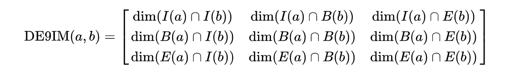
```

Where: 

  - **dim** is the dimension of the intersection and
  - I is the interior
  - B is the boundary
  - E is the exterior 

. . . 

Empty sets are denoted as **F** 

non-empty sets are denoted with the maximum dimension of the intersection *{0,1,2}*

## 

A simpler (binary) version of this matrix can be created by mapping all non-empty intersections {0,1,2} to TRUE.


Where `II` would state: "Does the Interior of "a" overlaps with the Interior of "b" in a way that produces a point (0), line (1), or polygon (2)"

Where `IB` would state: "Does the Interior of "a" overlap with the Boundary of "b" in a way that produces a point (0), line (1), or polygon (2)"

Both matrix forms:

  - dimensional {0,1,2,F}
  - Boolean {T,F}
  
. . . 

Can be serialize as a "DE-9IM string code" representing the matrix in a single string element (standardized format for data interchange)

The OGC has standardized the typical spatial predicates (Contains, Crosses, Intersects, Touches, etc.) as *Boolean* functions, and the DE-9IM model as a function that returns the DE-9IM code, with domain of {0,1,2,F}

## Illustration

```{r, fig.align='center', out.width = "50%", echo = FALSE}
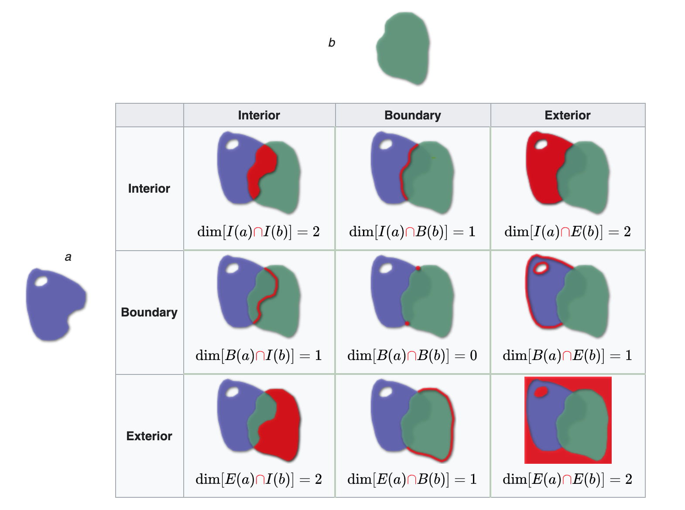
```

Reading from left-to-right and top-to-bottom, the DE-9IM(a,b) string code is '212101212'

## Spatial Relations in R

- Geometry X is a 3 feature polygon colored in red
- Geometry Y is a 4 feature polygon colored in blue

::: columns
::: {.column width="50%"}
```{r, echo = FALSE}
#| out.width: '50%'
b0 = st_polygon(list(rbind(c(-1,-1), c(1,-1), c(1,1), c(-1,1), c(-1,-1))))
b1 = b0 + 2
b2 = b0 + c(-0.2, 2)
x = st_sfc(b0, b1, b2)
a0 = b0 * 0.8
a1 = a0 * 0.5 + c(2, 0.7)
a2 = a0 + 1
a3 = b0 * 0.5 + c(2, -0.5)
y = st_sfc(a0,a1,a2,a3)
plot(x, border = 'red')
plot(y, border = 'blue', add = TRUE)
```
::: {.column width="50%"}
:::
```{r}
st_relate(x,y)
st_relate(x,x)
st_relate(y,y)
```
:::
:::

## Named Predicates {.smaller}

- "named spatial predicates" have been defined for some common relations.

- A few functions can be derived (expressed by masks) from DE-9IM include (* = wildcard):

| Predicate 	| DE-9IM String Code 	| Description 	|
|:-	|:-	|:-	|
| **Intersects** 	| `T*F**FFF*` 	| "Two geometries intersect if they share any portion of space" 	|
| **Overlaps** 	| `T*F**FFF*` 	| "Two geometries overlap if they share some but not all of the same space" 	|
| **Equals** 	| `T*F**FFF*` 	| "Two geometries are topologically equal if their interiors intersect and no part of the interior or boundary of one geometry intersects the exterior of the other" 	|
| **Disjoint** 	| `FF*FF*****` 	| "Two geometries are disjoint: they have no point in common. They form a set of disconnected geometries." 	|
| **Touches** 	| `FT*******` | `F**T*****` | `F***T****` 	| "Two geometries touch if they have at least one point in common, but their interiors do not intersect." 	|
| **Contains** 	| `T*****FF**` 	| "A contains B: geometry B lies in A, and the interiors intersect" 	|
| **Covers** 	| `T*****FF*` | `*T****FF*` | `***T**FF*` | `****T*FF*` 	| "A covers B: geometry B lies in A." 	|
| **Within** 	| `*T*****FF*` | `**T****FF*` | `***T**FF*` | `****T*FF*` 	| "A within B: geometry A lies in B." 	|
| **Covered by** 	| `*T*****FF*` | `**T****FF*` | `***T**FF*` | `****T*FF*` 	| "A covered by B: geometry A lies in B." 	|

## Binary Predicates

- Collectively, predicates define the type of relationship each 2D object has with another.

- Of the ~ 512 unique relationships offered by the DE-9IM models a selection of ~ 10 have been named.

- These are included in PostGIS/GEOS and are made accessible via R sf

```{r, fig.align='center', out.width = "50%", echo = FALSE}
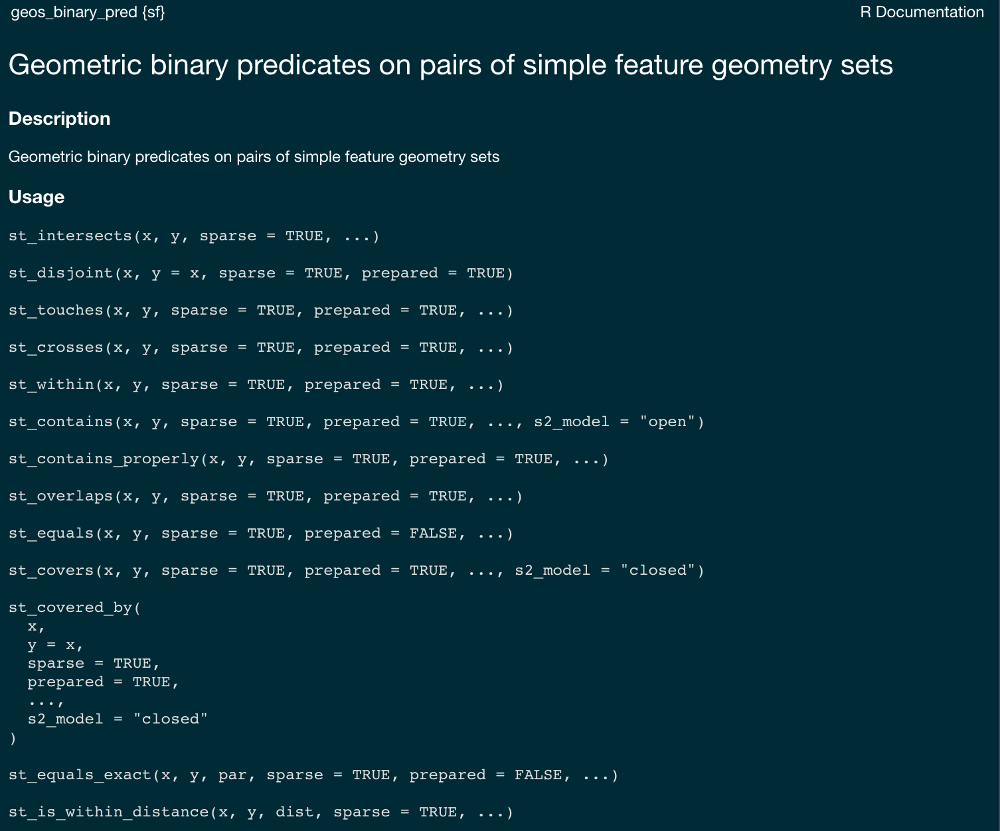
```

## Named predicates in R 

- `sf` provides a set of functions that implement the DE-9IM model and named predicates. Each of these can return either a *sparse* or *dense* matrix.

#### *sparse* matrix

```{r}
st_intersects(x,y)
```

#### *dense* matrix

```{r}
st_intersects(x, y, sparse = FALSE)

st_disjoint(x, y, sparse = FALSE)

st_touches(x, y, sparse = FALSE)

st_within(x, y, sparse = FALSE)
```

## st_relates vs. predicate calls...

```{r, message = F, warning = F}
states <- select(filter(aoi_get(state = "all"), state_abbr %in% c("WA", "OR", "MT", "ID")), name)

wa = filter(states, name == "Washington")
```

::: columns
::: {.column width="50%"}
```{r}
#| out.width: '50%'
plot(states$geometry)
```
:::
::: {.column width="50%"}
```{r, message = F, warning = F}
(mutate(states, 
        deim9 = st_relate(states, wa),
        touch = st_touches(states, wa, sparse = FALSE))) 
```
:::
:::

# So... 

- binary predicates return conditional _{T,F}_ relations based on predefined masks of the DE-9IM strings

- Up to this point in class we have been using Boolean _{T,F}_ masks to filter data.frames by columns:

```{r}
fruits = c("apple", "orange", "lemon", "watermelon")
```

```{r}
fruits == "apple"
```

```{r}
fruits %in% c("apple", "lemon")
```

## Filtering on data.frames

- We have used `dplyr::filter` to  subset a data frame, retaining all rows that satisfy a `boolean` condition. 

::: columns
::: {.column width="50%"}
```{r}
mutate(states, equalsWA = (name == "Washington")) |> 
  st_drop_geometry()
```
:::
::: {.column width="50%"}
```{r}
filter(states, name == "Washington")
```
:::
:::

## Spatial Filtering
 
- We can filter spatially, use `st_filter` as the function call

- Here the `boolean` condition is not passed (e.g. name == WA)

- But instead, is defined by a spatial predicate

- The default is `st_intersects` but can be changed with the `.predicate` argument:

::: {columns}
::: {.column width="50%"}
```{r}
mutate(states, touch = st_touches(states, wa, sparse = FALSE)) |> 
  filter(touch)
```
:::
::: {.column width="50%"}
```{r}
st_filter(states, wa, .predicate = st_touches) 
```
:::
:::

## Result 

```{r, message = FALSE, echo = TRUE, fig.width=6, fig.height=4.5,fig.align='center'}
ggplot(states) + 
  geom_sf() + 
  geom_sf(data = wa, fill = "blue", alpha = .3) +
  geom_sf(data = st_filter(states, wa, .predicate = st_touches), fill = "red", alpha = .5) + 
  theme_void()
```

## Distance Example (additional parameter)

```{r, message = FALSE }
cities = read_csv("data/uscities.csv") |> 
  st_as_sf(coords = c("lng", "lat"), crs = 4326) |> 
  select(city, population, state_name) |> 
  st_transform(5070)
```

```{r}
st_filter(cities, 
          filter(cities, city == "Fort Collins"), 
          .predicate = st_is_within_distance, 10000) 
```

# Spatial Data Science

- Filtering is a nice way to reduce the dimensions of a **single** dataset

- Often "*... one table is not enough... *"

- In these cases we want to combine - or **join** -  data 
 

# Spatial Joining

- Joining two non-spatial datasets relies on a shared _key_  that uniquely identifies each record in a table

```{r, fig.align='center', fig.height = 5, echo = FALSE}
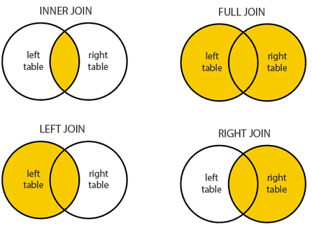
```

- Spatially joining data relies on shared _geographic relations_ rather then a shared _key_

- Like filter, these relations can be defined by a **predicate**

- As with tabular data, mutating joins *add* data to the target object (x) from a source object (y).

## st_join

- In `sf` `st_join` provides this joining capacity

- By default, `st_join` performs a _left_ join (Returns all records from x, and the matched records from y)

- It can also do inner joins by setting `left = FALSE`.

- **Important**: Many-to-many relationships create duplicate rows. In the Starbucks-counties example, a single Starbucks points at a county boundary may match multiple counties, creating multiple rows for that Starbucks.

- The default predicate for `st_join` (and `st_filter`) is `st_intersects`, but this can be changed with the `.predicate` argument to use other spatial relations like `st_touches`, `st_within`, etc. 

::: {columns}
::: {.column width="50%"}
```{r, fig.align='center', out.width = "25%", echo = FALSE}
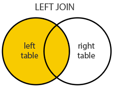
```
:::
::: {.column width="50%"}
```{r, fig.align='center', out.width = "25%", echo = FALSE}
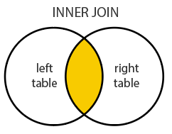
```
:::
:::

- The default predicate for `st_join` (and `st_filter`) is `st_intersects`

- This can be changed with the join argument (see `?st_join` for details).

# Every Starbucks in the World

What county has the most Starbucks in each state?

```{r, message= FALSE, warning = FALSE}
(starbucks = readr::read_csv('data/directory.csv') |> 
  filter(!is.na(Latitude), Country == "US") |> 
  st_as_sf(coords = c("Longitude", "Latitude"), crs = 4326) |> 
  st_transform(5070))
```

```{r}
counties = aoi_get(state = "conus", county = "all") |> 
  st_transform(5070) |> 
  select(name, state_name)
```

## 

```{r,message=FALSE, fig.align = 'center'}
topSB <- st_join(counties, starbucks) |> 
  group_by(name, state_name) |> 
  summarise(n = n()) |> 
  group_by(state_name) |> 
  slice_max(n, n = 1) |> 
  ungroup()
```

```{r, echo  = F, fig.height=5, fig.align="center"}
ggplot() + 
  geom_sf(data = counties, size = .05, fill = "white") + 
  geom_sf(data = topSB, aes(fill = n), size = .1) + 
  scale_fill_viridis_c() + 
  theme_void() + 
  theme(legend.position = 'bottom') + 
  labs(title = "County with Most Starbucks by State",
       fill = "Number of stores: ")
```

## Tessellation and Aggregation (Sneek Peak)

- The same Starbucks data can be aggregated into different tessellation schemes
- This demonstrates how the choice of geographic units affects analysis results:

```{r, message = FALSE}
# Create a simple grid for CONUS
conus = st_union(counties)
grid_1 = st_make_grid(conus, n = c(20, 15)) |> 
  st_as_sf() |> 
  mutate(cell_id = 1:n())

grid_2 = st_make_grid(conus, n = c(200, 150)) |> 
  st_as_sf() |> 
  mutate(cell_id = 1:n())

# Aggregate Starbucks by grid cell
sbck_grid_1 <- st_join(grid_1, starbucks) |> 
  group_by(cell_id) |> 
  summarise(n_stores = n())

sbck_grid_2 <- st_join(grid_2, starbucks) |> 
  group_by(cell_id) |> 
  summarise(n_stores = n())
```

```{r, echo = FALSE, fig.height=4, fig.width=10, fig.align='center'}
g1 = ggplot() + 
  geom_sf(data = sbck_grid_1, aes(fill = n_stores), size = .1) + 
  scale_fill_viridis_c() + 
  theme_void() + 
  theme(legend.position = 'bottom') + 
  labs(title = "Starbucks by Grid Cell",
       fill = "Number of stores: ")

g2 = ggplot() + 
  geom_sf(data = sbck_grid_2, aes(fill = n_stores), size = .1) + 
  scale_fill_viridis_c() + 
  theme_void() + 
  theme(legend.position = 'bottom') + 
  labs(title = "Starbucks by Grid Cell (10x)",
       fill = "Number of stores: ")

library(patchwork)
g1 + g2
```

## Critical Note:

- Neither _joining_ nor _filtering_ spatially alter the underlying geometry of the features
- In cases where we seek to alter a geometry based on another, we need clipping methods

## Clipping 

- Clipping is a form of subsetting that involves changing the geometry of at least some features.

- Clipping can only apply to features more complex than points: (lines, polygons and their ‘multi’ equivalents). 

```{r, fig.align='center', fig.height = 5, echo = FALSE}
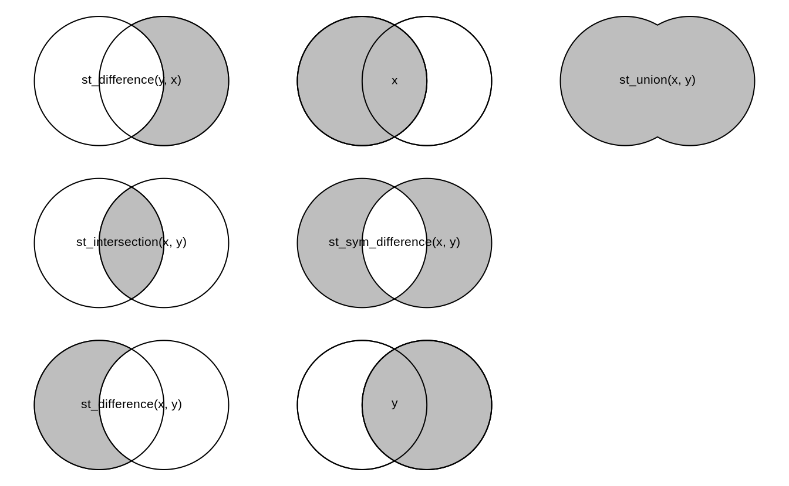
```

## Spatial Subsetting

- By default the data.frame subsetting methods we've seen (e.g `[,]`) implements `st_intersection`

```{r, fig.align='center', fig.height=4.5}
wa = st_transform(wa, 5070)
wa_starbucks = starbucks[wa,] #<<

ggplot() + geom_sf(data = wa) + geom_sf(data = wa_starbucks) + theme_void()
```

# Buffering

- A buffer is a zone of a specified distance around a geometry
- `st_buffer()` expands or contracts geometries by a given distance
- Useful for proximity analysis and creating zones of influence

```{r, fig.align='center', fig.height=4.5}
# Buffer the Washington state boundary by 50 km
wa_buffer = st_buffer(wa, dist = 50000) # distance in map units (meters for EPSG:5070)

ggplot() + 
  geom_sf(data = wa_buffer, fill = "blue", alpha = .2) + 
  geom_sf(data = wa, fill = "navy") + 
  theme_void() +
  labs(title = "Buffer around Washington state (50 km)")
```

- Buffers are often combined with predicates for analysis like _"find all cities within 100 km of a river"_

# Simplification

# Computational Complexity

- In all the cases we have looked at, the number of `POINT` (e.g geometries, nodes, or vertices) define the complexity of the predicate or the clip

- Computational needs increase with the number of POINTS / NODES / VERTICES

- **Simplification** is a process for generalization  vector objects (lines and polygons) 

- Another reason for simplifying objects is to reduce the amount of memory, disk space and network bandwidth they consume

- Other times the level of detail captured in a geometry is either not needed, or, even counter productive the the scale/purpose of an analysis

- If you are cropping features to a national border, how much detail do you need? The more points in your border, the long the clip operation will take....

##

In cases where we want to reduce the complexity in a geometry we can use simplification algorithms

The most common algorithms are Ramer–Douglas–Peucker and Visvalingam-Whyatt.

## Ramer–Douglas–Peucker

- Mark the `first` and `last` points as kept

- Find the point, `p` that is the farthest from the first-last line segment. If there are no points between first and last we are done (the base case)

- If `p` is closer than `tolerance` units to the line segment then everything between first and last can be discarded

- Otherwise, mark p as kept and repeat steps 1-4 using the points between first and p and between p and last (the call to recursion)

```{r, fig.align='center', out.width = "100%", echo = FALSE}
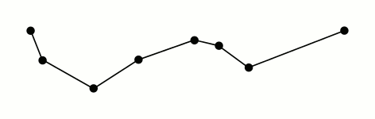
```

## st_simplify

```{r, fig.align='center', out.width = "90%", echo = FALSE}

```

## st_simplify

-  `sf` provides `st_simplify`, which uses the GEOS implementation of the Douglas-Peucker algorithm to reduce the vertex count. 

- `st_simplify` uses the `dTolerance` to control the level of generalization in map units (see Douglas and Peucker 1973 for details).

- **Note on CRS**: We use EPSG:5070 (USA Contiguous Albers Equal Area projection) for these examples because it preserves area and provides consistent distance measurements across the continental US, making tolerance values meaningful and comparable.

```{r, fig.align='center', out.width = "50%", echo = FALSE}
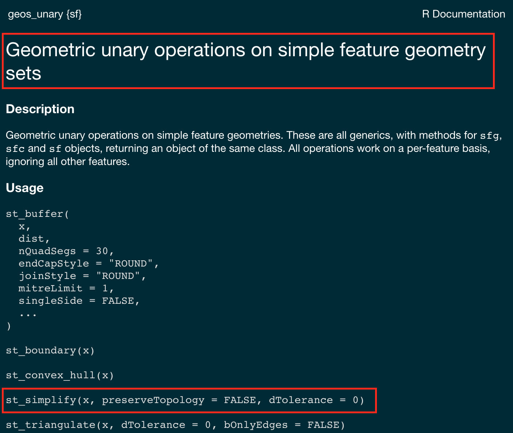
```

## Performance Impact of Simplification

- Simplification dramatically reduces computational complexity for subsequent operations

```{r}
usa = aoi_get(state = "conus") |> 
  st_union() |> 
  st_transform(5070)

usa1000   = st_simplify(usa, dTolerance = 10000)
usa10000  = st_simplify(usa, dTolerance = 100000)
usa100000 = st_simplify(usa, dTolerance = 1000000)

# Compare point counts
cat("Original points:", mapview::npts(usa), "\n")
cat("After 10 km tolerance:", mapview::npts(usa1000), "\n")
cat("After 100 km tolerance:", mapview::npts(usa10000), "\n")
cat("After 1000 km tolerance:", mapview::npts(usa100000), "\n")
```

```{r fig.height=4, fig.width=12, echo=FALSE, message=FALSE, fig.align='center'}
g1 = ggplot(usa) + 
  geom_sf() + 
  labs(title = paste(mapview::npts(usa), 'points'),
       caption = "dTolerance = 0") +
  theme_void()

g2 = ggplot(usa1000) + 
  geom_sf() + 
  labs(title = paste(mapview::npts(usa1000), 'points'),
       caption = "dTolerance = 1,000") +
  theme_void()

g3 = ggplot(usa10000) + 
  geom_sf() + 
  labs(title = paste(mapview::npts(usa10000), 'points'),
       caption = "dTolerance = 10,000") +
  theme_void()

g4 = ggplot(usa100000) + 
  geom_sf() + 
  labs(title = paste(mapview::npts(usa100000), 'points'),
       caption = paste("dTolerance = 100,000\n",
                  st_length(st_cast(usa1000, "MULTILINESTRING")))) +
  theme_void()

gridExtra::grid.arrange(g1,g2,g3,g4, nrow = 1)
```

## 

- A limitation with Douglas-Peucker (therefore st_simplify) is that it simplifies objects on a per-geometry basis. 

- This means the ‘topology’ is lost, resulting in overlapping and disconnected geometries. 

```{r}
states = st_transform(states, 5070)
simp_states   = st_simplify(states, dTolerance = 20000)
plot(simp_states$geometry)
```

## Visvalingam

- The Visvalingam algorithm overcomes some limitations of the Douglas-Peucker algorithm (Visvalingam and Whyatt 1993).
- it progressively removes points with the least-perceptible change. 
- Simplification often allows the elimination of 95% or more points while retaining sufficient detail for visualization and often analysis

```{r, fig.align='center', out.width = "50%", echo = FALSE}
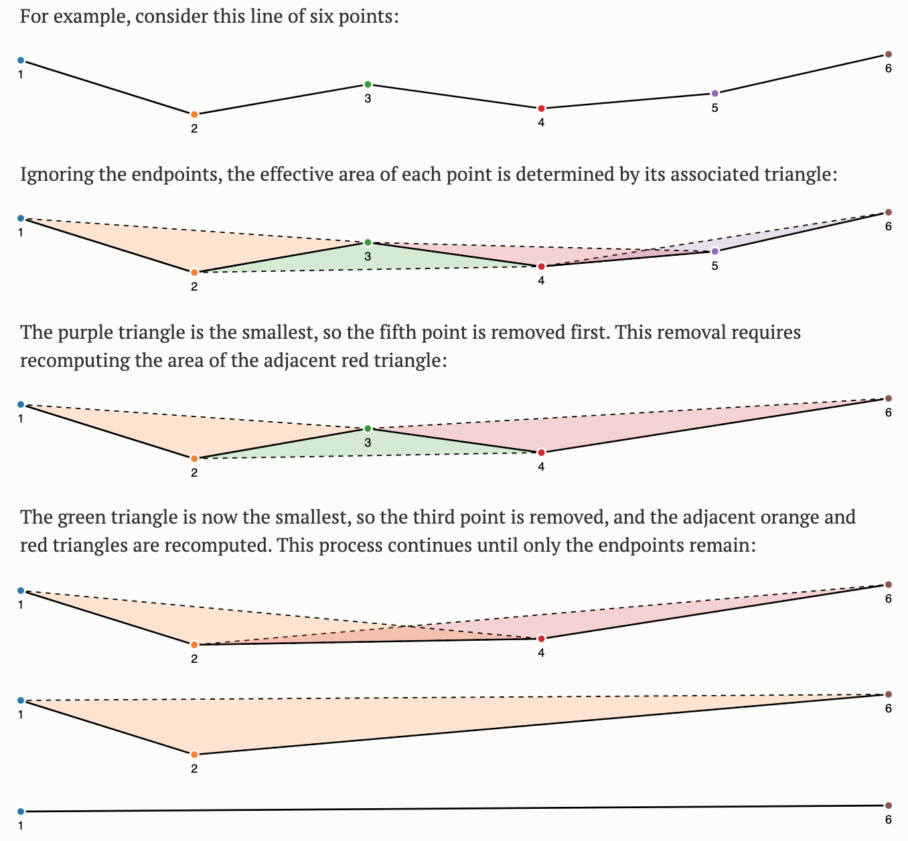
```

## rmapshaper

In R, the `rmapshaper` package implements the Visvalingam algorithm in the `ms_simplify` function. 

- The `ms_simplify` function is a wrapper around the `mapshaper` JavaScript library (created by lead viz experts at the NYT)

```{r}
library(rmapshaper)

usa10 = ms_simplify(usa, keep = .1)
usa5  = ms_simplify(usa, keep = .05)
usa1  = ms_simplify(usa, keep = .01)
```

```{r fig.height=4, fig.width=12, echo=FALSE, message=FALSE, fig.align='center'}

g1 = ggplot(usa) + 
  geom_sf() + 
  labs(title = paste(mapview::npts(usa), 'points'),
       caption = "keep = 1") +
  theme_void()

g2 = ggplot(usa10) + 
  geom_sf() + 
  labs(title = paste(mapview::npts(usa10), 'points'),
       caption = "keep = .1 (10%)") +
  theme_void()

g3 = ggplot(usa5) + 
  geom_sf() + 
  labs(title = paste(mapview::npts(usa5), 'points'),
       caption = "keep = .05 (5%)") +
  theme_void()

g4 = ggplot(usa1) + 
  geom_sf() + 
  labs(title = paste(mapview::npts(usa1), 'points'),
       caption = "keep = .01 (1%)") +
  theme_void()

gridExtra::grid.arrange(g1,g2,g3,g4, nrow = 1)
```

##

```{r}
states = st_transform(states, 5070)
simp_states   = ms_simplify(states, keep = .05)
plot(simp_states$geometry)
```

##

In all cases, the number of points in a geometry can be calculated with `mapview::npts()`

```{r}
states = st_transform(states, 5070)
simp_states_st   = st_simplify(states, dTolerance = 20000)
simp_states_ms   = ms_simplify(states, keep = .05)

mapview::npts(states)
mapview::npts(simp_states_st)
mapview::npts(simp_states_ms)
```

# Tesselation

- So far we have spent the last few days looking at simple feature objects

- Where a feature as a geometry define by a set of structured POINT(s) 

- These points have precision and define location ({X Y CRS})

- The geometry defines a bounds: either 0D, 1D or 2D 

- Each object is therefore bounded to those geometries implying a level of exactness.

# Object Coverages

## LANDSAT Path Row

- Serves tiles based on a path/row index

```{r, echo = FALSE, fig.align='center', fig.width=10}
ls = read_sf('data/CONUS_ARD_grid/conus_ard_grid.shp')

states = AOI::aoi_get(state = "conus") |> 
  st_transform(st_crs(ls))

csu = AOI::geocode("Colorado State Universiy", pt = TRUE) |> 
  st_transform(st_crs(ls))

ggplot() + 
  geom_sf(data = states, col = NA, alpha = .95) + 
  geom_sf(data = ls, fill = NA) + 
  geom_sf(data = csu, col = "darkred", aes(label = request)) + 
  ggrepel::geom_label_repel(
    data = csu,
    aes(label = request, geometry = geometry),
    stat = "sf_coordinates"
  ) +
  theme_void()+ 
  labs(title = "LANDSAT Path/row")
```


## MODIS Sinisoial Grid

- Serves tiles based on a path/row index

```{r, echo = FALSE, fig.align='center', fig.width=10}
ls = read_sf('data/modis_grid/modis_sinusoidal_grid_world.shp') |> 
  st_set_crs('+proj=sinu +lon_0=0 +x_0=0 +y_0=0 +ellps=WGS84 +datum=WGS84 +units=m +no_defs')

states = rnaturalearth::ne_countries(returnclass = "sf") |> st_transform(st_crs(ls))

csu = csu |> 
  st_transform(st_crs(ls))

ggplot() + 
  geom_sf(data = states, col = NA, fill = "gray",alpha = 1) + 
  geom_sf(data = ls, fill = NA) + 
  geom_sf(data = csu, col = "darkred", aes(label = request)) + 
  ggrepel::geom_label_repel(
    data = csu,
    aes(label = request, geometry = geometry),
    stat = "sf_coordinates"
  ) +
  theme_void()+ 
  labs(title = "MODIS Path/row")
```

## [Uber Hex Addressing](https://eng.uber.com/h3/)

- Breaks the world into Hexagons...\

<br>

::: columns
::: {.column width="50%"}

```{r}
#| echo: false
#| out.width: "100%"
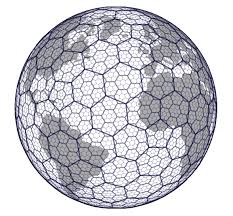
```

:::
::: {.column width="50%"}

```{r}
#| echo: false
#| out.width: "100%"
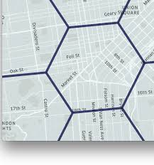
```

:::
:::

## [what3word](https://what3words.com/switched.mandates.apple)

- Breaks the world into 3m grids encoded with unique 3 word strings

```{r, fig.align='center', fig.width = 7, echo = FALSE}
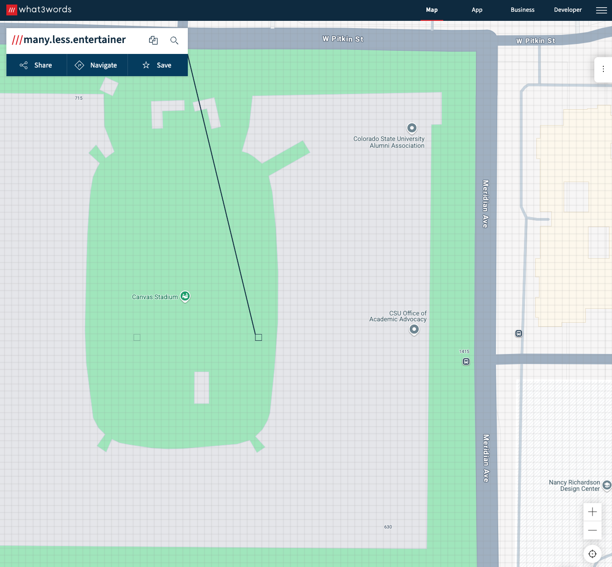
```

## [Map Tiles / slippy maps / Pyramids](https://wiki.openstreetmap.org/wiki/Slippy_map_tilenames)

- Use XYZ where Z is a zoom level ...

```{r, fig.align='center', fig.height = 5, echo = FALSE}
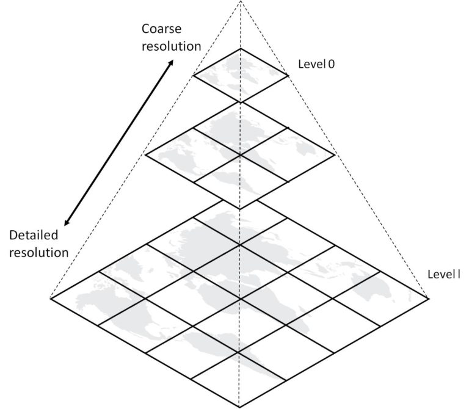
```

## Our Data for today ...

#### Southern Counties

```{r}
south_counties = aoi_get(state = "south", county = "all") |> 
  st_transform(st_crs(cities))
```

<br>

#### Unioned to States using `dplyr`

```{r}
south_states = south_counties |> 
  group_by(state_name) |> 
  summarise()
```

<br>

#### South County Centroids

```{r}
south_cent = st_centroid(south_counties)
```

```{r, echo = FALSE}
ggplot() + 
  geom_sf(data = south_counties, lty = 2) + 
  geom_sf(data = south_states, fill = NA, lwd = .75) + 
  geom_sf(data = south_cent, col = 'darkred', size = .2) +
  theme_void()
```

## Southern Coverage: County

```{r, fig.align='center', fig.width =10, echo = FALSE}
plot_tess(south_counties, "Counties")
```

## Regular Tiles

- One way to tile a surface is into regions of equal area

- Tiles can be either _square_ (rectilinear) or _hexagonal_

- `st_make_grid` generates a square or hexagonal grid covering the geometry of an `sf` or `sfc` object

- The return object of `st_make_grid` is a new `sfc` object 

- Grids can be specified by _cellsize_ or number of grid cells (*n*) in the X and Y direction

```{r}
# Create a grid over the south with 70 rows and 50 columns
sq_grid = st_make_grid(south_counties, n = c(70, 50)) |> 
  st_as_sf() |> 
  mutate(id = 1:n())
```

## Southern Coverage: Square

```{r, fig.align='center', fig.width=10, echo = FALSE}
plot_tess(sq_grid, "Square Coverage")
```

## Hexagonal Grid

- Hexagonal tessellations (honey combs) offer an alternative to square grids

- They are created in the same way but by setting `square = FALSE`

```{r}
hex_grid = st_make_grid(south_counties, n = c(70, 50), square = FALSE) |> 
  st_as_sf() |> 
  mutate(id = 1:n())
```

## Southern Coverage: Hexagon

```{r, fig.align='center', fig.width=10, echo = FALSE}
plot_tess(hex_grid, "Hexagonal Coverage")
```

## Advantages Square Grids

 - Simple definition and data storage
    - Only need the origin (lower left), cell size (XY) and grid dimensions
    
 - Easy to aggregate and dissaggregate (resample)
 
 - Analogous to raster data
 
 - Relationship between cells is given 
 
 - Combining layers is easy with traditional matrix algebra


## Advantages Square Grids 

 - Reduced Edge Effects
    - Lower perimeter to area ratio
    - minimizes the amount line length needed to create a lattice of cells with a given area
    
 - All neighbors are identical
    - No rook vs queen neighbors
    
 - Better fit to curve surfaces (e.g. the earth)

##

```{r, fig.align='center', fig.width = 18, echo = FALSE}
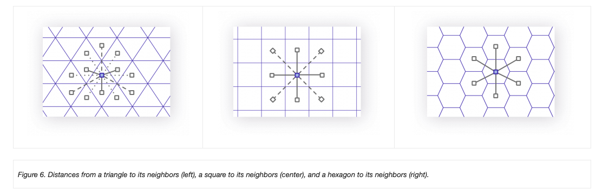
```

## Triangulations

- An alternative to creating equal area tiles is to create triangulations from known **anchor points**

- Triangulation requires a set of input points and seeks to partition the interior into a partition of triangles.

- In GIS contexts you'll hear:
  - Thiessen Polygon 
  - Voronoi Regions
  - Delunay Triangulation
  - TIN (Triangular irregular networks)
  - etc,..

## Voronoi Polygons

- Voronoi/Thiessen polygon boundaries define the area closest to each anchor point relative to all others

- They are defined by the _perpendicular_ bisectors of the lines between all points.

```{r, fig.align='center', fig.height = 8, echo = FALSE}
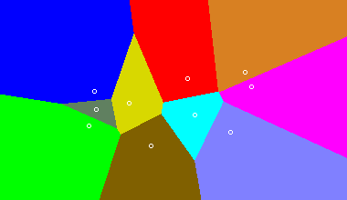
```

## Voronoi Polygons

```{r, fig.align='center', fig.height = 8, echo = FALSE}
knitr::include_graphics('img/15-Voronoi_growth_euclidean.gif')
```

## Voronoi Polygons

- Usefull for tasks such as: 
  - nearest neighbor search, 
  - facility location (optimization), 
  - largest empty areas, 
  - path planning...

- Also useful for simple interpolation of values such as rain gauges,

::: columns
::: {.column width="50%"}
```{r, echo = FALSE, fig.width = 6}
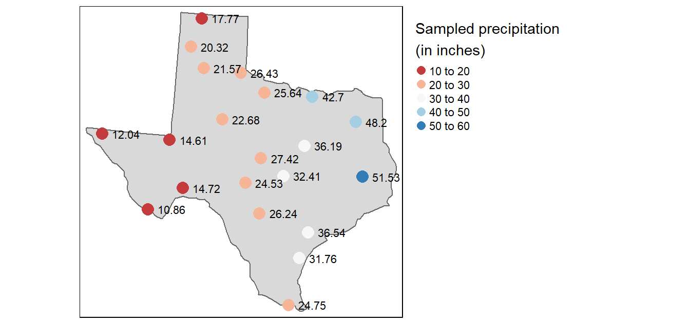
```
:::
::: {.column width="50%"}
```{r, echo = FALSE, fig.width = 6}
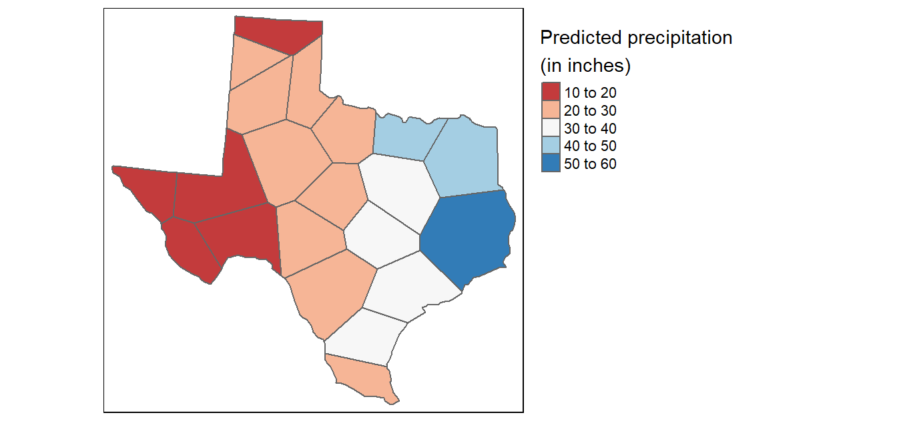
```
:::
:::

## Often used in numerical models and simulations

::: columns
::: {.column width="50%"}
```{r, echo = FALSE, fig.width = 6}
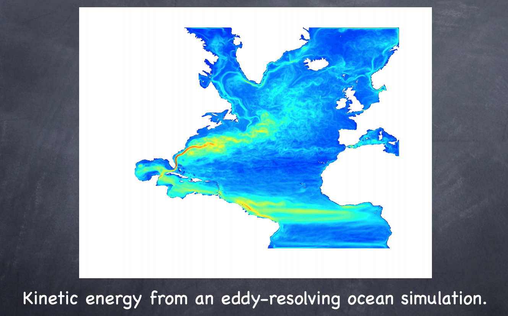
```
:::
::: {.column width="50%"}
```{r, echo = FALSE, fig.width = 6}
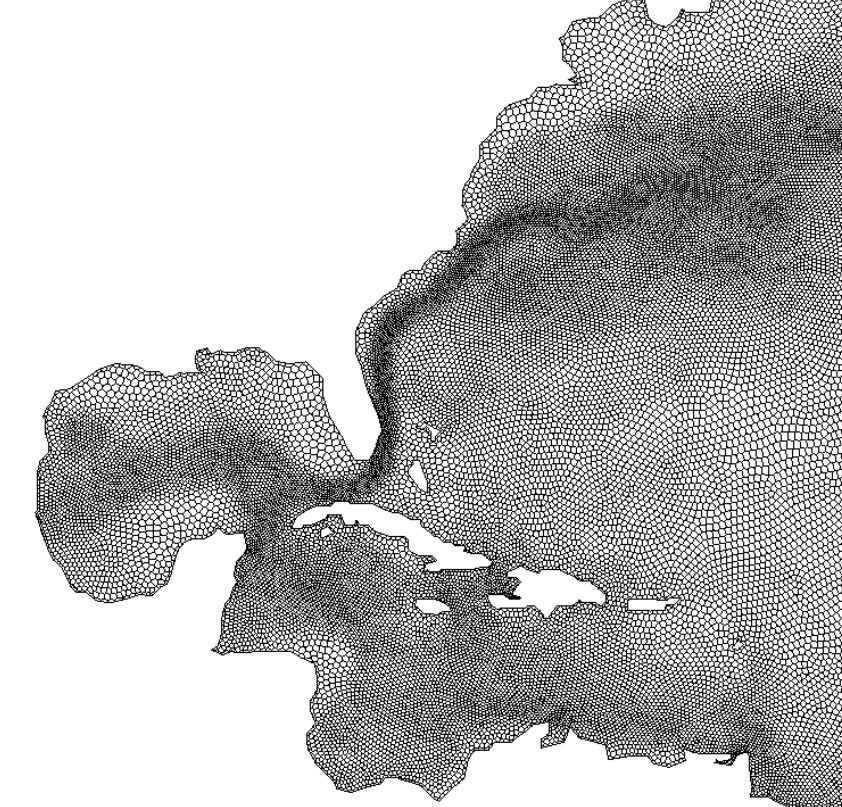
```
:::
:::

## `st_voronoi`

- st_voronoi creates voronoi tesselation in `sf`

- It works over a `MULTIPOINT` collection

- Should always be simplified after creation (st_cast())

- If to be treated as an object for analysis, should be id'd

```{r}
south_cent_u = st_union(south_cent)

v_grid = st_voronoi(south_cent_u) |> 
  st_cast() |> 
  st_as_sf() |> 
  mutate(id = 1:n())
```

## Southern Coverage: Voronoi

```{r, fig.align='center', fig.width=10, echo = FALSE}
plot_tess(v_grid, "Voronoi Coverage")
```

## Southern Coverage: Voronoi

```{r, fig.align='center', fig.width=10, echo = FALSE}
v_grid = st_intersection(v_grid, st_union(south_states))
```

```{r, fig.align='center', fig.width=10, echo = FALSE}
plot_tess(v_grid, "Voronoi Coverage") + 
  geom_sf(data = south_cent, col = "darkred", size = .2)
```

## Delaunay triangulation

- A Delaunay triangulation for a given set of points (P) in a plane, is a triangulation DT(P), where no point is inside the circumcircle of any triangle in DT(P). 

```{r, fig.align='center', fig.height = 5, echo = FALSE}
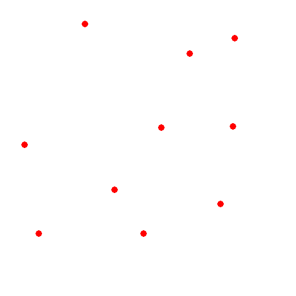
```

## Delaunay triangulation

- The Delaunay triangulation of a discrete POINT set corresponds to the dual graph of the Voronoi diagram. 

- The circumcenters (center of circles) of Delaunay triangles are the vertices of the Voronoi diagram. 

```{r,  fig.width = 10, fig.align='center', echo = FALSE}
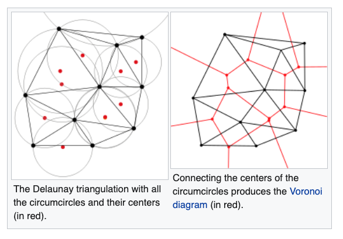
```

## Used in landscape evaluation and terrian modeling

::: columns
::: {.column width="50%"}

```{r,  fig.height = 4, echo = FALSE}
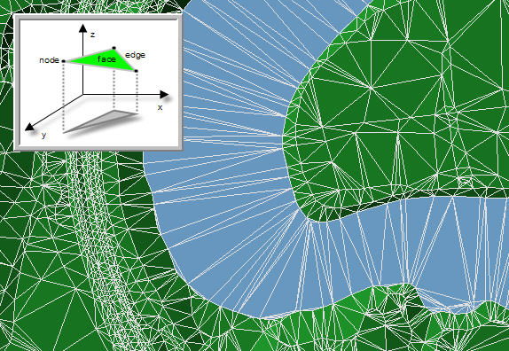
```
::: 
::: {.column width="50%"}
```{r,echo = FALSE}
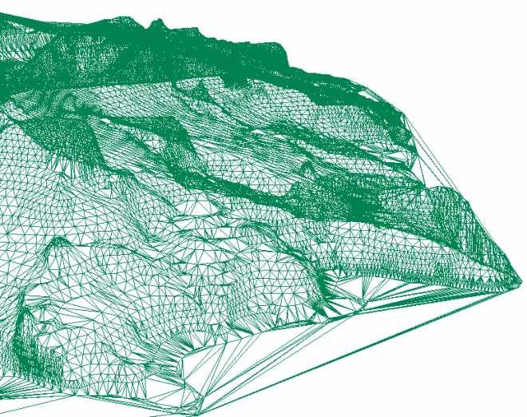
```
:::
:::

## `st_triangulate`

- `st_triangulate` creates Delaunay triangulation in `sf`

- It works over a `MULTIPOINT` collection

- Should always be simplified after creation (`st_cast()`)

- If to be treated as an object for analysis, should be id'd

```{r}
t_grid = st_triangulate(south_cent_u) |> 
  st_cast() |> 
  st_as_sf() |> 
  mutate(id = 1:n())
```

## Southern Coverage: Triangles

```{r, fig.align='center', fig.width=10, echo = FALSE}
plot_tess(t_grid, "Triangular Coverage")
```

## Southern Coverage: Triangles

```{r, fig.align='center', fig.width=10}
t_grid = st_intersection(t_grid, st_union(south_states))
```

```{r, fig.align='center', fig.width=10, echo = FALSE}
plot_tess(t_grid, "Voronoi Coverage") + 
  geom_sf(data = south_cent, col = "darkred", size = .3)
```

## Difference in object coverages:

```{r, echo = FALSE}
sum_tess = function(data, type){
  areakm2 = drop_units(set_units(st_area(data), "km2"))
  data.frame(type = type, count = length(areakm2),  mean = mean(areakm2),  sd = sd(areakm2), tot = sum(areakm2))
}

bind_rows(
  sum_tess(t_grid,"triangulation"),
  sum_tess(v_grid, "voronoi"),
  sum_tess(south_counties, "counties"),
  sum_tess(sq_grid, "grid"),
  sum_tess(hex_grid, "Hexagon")) |> 
knitr::kable(caption = "Tesselation Characteristics",
               col.names = c("Type", "Elements", "Mean Area (km2)", "Standard Deviation Area (km2)" ,"Coverage Area"),
               format.args = list(big.mark = ",", digits = 2)) |>
  kableExtra::kable_styling("striped", full_width = T, font_size = 48)
```

## Modifiable areal unit problem (MAUP)

- The modifiable areal unit problem (MAUP) is a source of statistical bias that can significantly impact the results of statistical hypothesis tests. 

- MAUP affects results when point-based measures are aggregated into districts. 

- The resulting summary values (e.g., totals or proportions) are influenced by both the shape and scale of the aggregation unit.

```{r, fig.align='center', fig.width = 2, echo = FALSE}
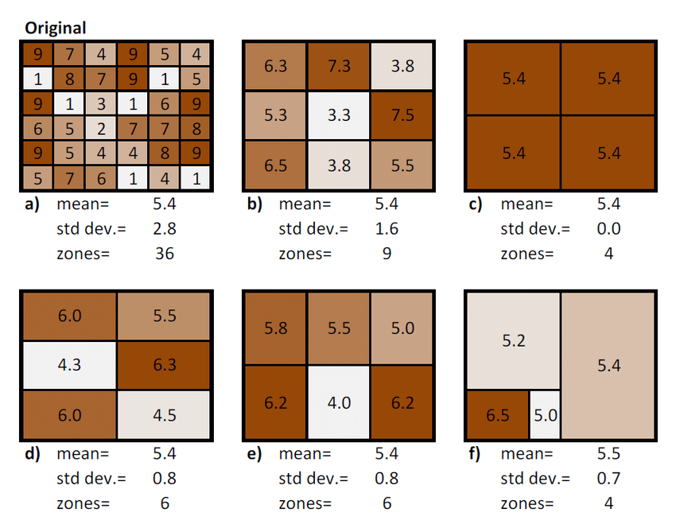
```

## Worked Example: MAUP with Starbucks

- Using the same Starbucks data, aggregating into different grid sizes produces different statistical patterns:

```{r, message = FALSE}
# Aggregate into 3 different grid resolutions
conus = st_union(counties)
fine_grid = st_make_grid(conus, n = c(40, 30)) |> st_as_sf() |> mutate(id = 1:n())
medium_grid = st_make_grid(conus, n = c(20, 15)) |> st_as_sf() |> mutate(id = 1:n())
coarse_grid = st_make_grid(conus, n = c(10, 8)) |> st_as_sf() |> mutate(id = 1:n())

fine_agg = st_join(fine_grid, starbucks) |> group_by(id) |> summarise(n = n())
medium_agg = st_join(medium_grid, starbucks) |> group_by(id) |> summarise(n = n())
coarse_agg = st_join(coarse_grid, starbucks) |> group_by(id) |> summarise(n = n())

# Statistics differ by aggregation scheme
cat("Fine grid - Mean:", round(mean(fine_agg$n), 2), "SD:", round(sd(fine_agg$n), 2), "\n")
cat("Medium grid - Mean:", round(mean(medium_agg$n), 2), "SD:", round(sd(medium_agg$n), 2), "\n")
cat("Coarse grid - Mean:", round(mean(coarse_agg$n), 2), "SD:", round(sd(coarse_agg$n), 2), "\n")
```

- The spatial patterns and statistical properties differ significantly based on aggregation choice—this is the MAUP!

# Real World Example

- The power of GIS is the ability to integrate different layers and types of information

- The scale of information can impact the analysis as can the grouping and zoning schemes chosen

- The Modifiable Areal Unit Problem (MAUP) is an important issue for those who conduct spatial analysis using units of analysis at aggregations higher than incident level. 

- The MAUP occurs when the aggregate units of analysis are arbitrarily produced or not directly related to the underlying phenomena. A classic example of this problem is Gerrymandering.

- Gerrymandering involves shaping and re-shaping voting districts based on the political affiliations of the resident citizenry. 

# [Examples](https://thefulcrum.us/worst-gerrymandering-districts-example)

```{r, fig.align='center', out.width="90%", echo = FALSE}
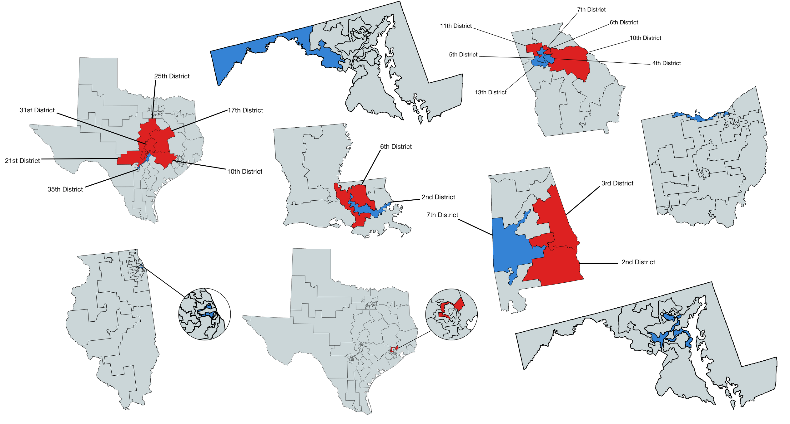
```

# Spatial Statistics Foundation

## Bridge from geometry to inference

So far, we have learned that geometric choices change analysis:

- predicates define relationships
- tessellations define units
- simplification changes representation

. . .

**Spatial statistics adds one new question:**

> Do nearby observations tend to have similar values?

If the answer is yes, then geometry is not just changing the map — it is changing the **inference**.

**Story of this section:**

- define what “near” means
- encode that definition in `W`
- use `W` to test for clustering
- see why changing spatial units can change the answer

---

## Why spatial statistics?

**Core idea:** spatial data are rarely independent.

- Nearby places often share similar conditions
- Aggregation choices can create or hide pattern
- A standard iid mental model can be misleading

. . .

So before modeling, we need a formal way to say **who is near whom**.

**This is why spatial statistics exists:** not because maps are fancy, but because location changes the assumptions behind inference.

**So what for water resources?**

- neighboring catchments often share climate, geology, and land use
- nearby gages are rarely independent replicates
- flood, drought, and water-quality patterns often organize regionally

---

## From predicates to neighbors

This is where prior content matters.

We already know how to encode spatial relationships with predicates:

- `st_touches()` → shared borders
- `st_intersects()` → overlap
- `st_is_within_distance()` → distance-based neighbors

. . .

These are not just GIS operations.

They are how we turn geometry into a statistical definition of **neighborhood**.

**Key point:** the choice of predicate is already a modeling choice.

**Water-resources implication:** a watershed adjacency rule, stream-network rule, or Euclidean distance rule may imply very different hydrologic processes.

---

## Spatial weights matrix `W`

**`W` is a formal encoding of who counts as near whom.**

- rows = focal locations
- columns = possible neighbors
- `w_ij > 0` means location *j* contributes to location *i*
- `w_ij = 0` means they are not neighbors

. . .

This is the bridge from geometry to spatial inference.

**So what?** If you care about regionalization, transfer learning, model validation, gage networks, or hotspot detection, you are already making choices that belong in `W`.

```{r, echo=FALSE, message=FALSE, warning=FALSE}
# Prepare a tiny example grid so we can print concrete outputs in the step boxes
sf_use_s2(FALSE)
small_bbox <- st_bbox(c(xmin = 0, ymin = 0, xmax = 3, ymax = 3))
small_grid <- st_make_grid(small_bbox, n = c(3,3)) %>% st_as_sf() %>% mutate(id = row_number())

W_binary_small <- st_touches(small_grid, sparse = FALSE) * 1
diag(W_binary_small) <- 0
W_small <- W_binary_small / rowSums(W_binary_small)
W_small[!is.finite(W_small)] <- 0
deg <- rowSums(W_binary_small)
```

---

## Building `W` in 3 steps

::: columns
::: {.column width="33%"}
**1. Define neighbors**
```{r, eval=FALSE}
W_binary <- st_touches(grid, sparse = FALSE) * 1
```
1 = neighbors, 0 = not neighbors

```{r, echo=FALSE}
cat("Neighbor counts (min / mean / max):", min(deg), round(mean(deg),2), max(deg), "
")
print(W_binary_small[1:6, 1:6])
```
:::

::: {.column width="33%"}
**2. Remove self-links**
```{r, eval=FALSE}
diag(W_binary) <- 0
```
A region is not its own neighbor

```{r, echo=FALSE}
print(diag(W_binary_small)[1:6])
```
:::

::: {.column width="33%"}
**3. Row-standardize**
```{r, eval=FALSE}
W <- W_binary / rowSums(W_binary)
```
Each row sums to 1, so the lag is a neighbor average

```{r, echo=FALSE}
print(round(W_small[1:6, 1:6], 2))
```
:::
:::

---

## What row-standardizing does

Row-standardizing makes the spatial lag easier to interpret.

Without it:

- locations with many neighbors can dominate
- raw adjacency counts are harder to compare across space

With it:

- each row sums to 1
- the lag becomes a weighted average of neighboring values
- “my neighborhood signal” becomes directly interpretable

**It does not remove the modeling choice — it just makes the choice easier to work with.**

---

## What `W` lets us do

Once we have `W`, we can ask statistical questions about pattern.

**Most important first question:**

> Are nearby values more similar than we would expect by chance?

That is the core idea behind **spatial autocorrelation**.

. . .

For a first pass, the main tool is **Moran’s I**.

---

## Moran’s I: the first global test

**Moran’s I** summarizes whether similar values cluster in space.

Interpretation:

- **positive** Moran’s I → similar neighbors cluster together
- **near 0** → no strong spatial pattern beyond randomness
- **negative** Moran’s I → neighbors tend to be dissimilar

. . .

It is a **global** summary: one value for the whole study area.

**Mental model:** Moran’s I is asking whether values line up with their neighborhood averages more than a random rearrangement would.

**Water-resources implication:** if streamflow error, nutrient concentration, or flood exposure has strong positive spatial autocorrelation, then nearby units are carrying shared information — and naive independence assumptions can mislead you.

---

## How to read Moran’s I in practice

When you see a Moran’s I result, ask three questions:

1. **Sign** — is the pattern clustered or contrasting?
2. **Magnitude** — how strong is the pattern?
3. **Context** — what definition of neighborhood produced it?

. . .

A Moran’s I value is never just “about the data.”
It is always about the data **plus the chosen `W`**.

---

## Example: Starbucks counts in hexagons

We will use a simple areal example:

- build a hexagon tessellation over CONUS
- count Starbucks per hexagon
- define neighbors with `st_touches()`
- compute Moran’s I on those counts

**This example is simplified, not definitive.**
Its purpose is to make the statistical logic visible before moving to real research settings.

```{r, include=TRUE, cache=TRUE, message=FALSE, warning=FALSE}
# Hidden prep for the main spatial statistics examples
if (!require(ape, quietly = TRUE)) install.packages("ape")
if (!require(ggplot2, quietly = TRUE)) install.packages("ggplot2")
sf_use_s2(FALSE)

states_valid <- AOI::aoi_get(state = "conus") |>
  st_transform(5070) |>
  st_make_valid()

conus_bbox <- st_bbox(states_valid)
conus_union <- st_union(states_valid)

hex_grid <- st_make_grid(conus_bbox, n = 70, square = FALSE) %>%
  st_as_sf() %>%
  st_set_crs(st_crs(starbucks)) %>%
  st_filter(conus_union) %>%
  mutate(id = row_number())

sq_grid <- st_make_grid(conus_bbox, n = 70, square = TRUE) %>%
  st_as_sf() %>%
  st_set_crs(st_crs(starbucks)) %>%
  st_filter(conus_union) %>%
  mutate(id = row_number())

set.seed(523)
centroids <- st_sample(conus_union, 2500) %>%
  st_as_sf() %>%
  st_set_crs(st_crs(starbucks)) %>%
  mutate(id = row_number())

voronoi_grid <- st_voronoi(st_union(st_geometry(centroids))) %>%
  st_collection_extract() %>% st_as_sf() %>%
  st_set_crs(st_crs(starbucks)) %>%
  st_filter(conus_union) %>%
  mutate(id = row_number())

count_starbucks <- function(grid) {
  out <- st_join(grid, starbucks) %>%
    st_drop_geometry() %>%
    count(id, name = "n")
  grid %>%
    st_drop_geometry() %>%
    select(id) %>%
    left_join(out, by = "id") %>%
    mutate(n = replace_na(n, 0)) %>%
    pull(n)
}

build_W <- function(grid) {
  W <- st_touches(grid, sparse = FALSE) * 1
  diag(W) <- 0
  rs <- rowSums(W)
  W <- W / ifelse(rs == 0, 1, rs)
  W[!is.finite(W)] <- 0
  W
}

compute_moran <- function(x, W) {
  out <- ape::Moran.I(as.numeric(x), W)
  tibble(I = out$observed, p = out$p.value)
}

hex_sb <- count_starbucks(hex_grid)
sq_sb  <- count_starbucks(sq_grid)
vor_sb <- count_starbucks(voronoi_grid)

W_hex <- build_W(hex_grid)
W_sq  <- build_W(sq_grid)
W_vor <- build_W(voronoi_grid)

hex_m <- compute_moran(hex_sb, W_hex)
sq_m  <- compute_moran(sq_sb, W_sq)
vor_m <- compute_moran(vor_sb, W_vor)

hex_lag <- as.numeric(W_hex %*% hex_sb)
hex_z <- as.numeric(scale(hex_sb))
hex_lag_z <- as.numeric(scale(hex_lag))

hex_lisa <- tibble(
  x = hex_z,
  lag_x = hex_lag_z,
  quadrant = case_when(
    x > 0 & lag_x > 0 ~ "High-High",
    x < 0 & lag_x < 0 ~ "Low-Low",
    x > 0 & lag_x < 0 ~ "High-Low",
    x < 0 & lag_x > 0 ~ "Low-High",
    TRUE ~ "Other"
  )
)

hex_map <- hex_grid
hex_map$count <- as.numeric(hex_sb)
hex_map$quadrant <- hex_lisa$quadrant

compare_tbl <- tibble(
  tessellation = c("Hexagon", "Square", "Voronoi"),
  tiles = c(nrow(hex_grid), nrow(sq_grid), nrow(voronoi_grid)),
  avg_neighbors = c(mean(rowSums(W_hex > 0)), mean(rowSums(W_sq > 0)), mean(rowSums(W_vor > 0))),
  moran_I = c(hex_m$I, sq_m$I, vor_m$I),
  p_value = c(hex_m$p, sq_m$p, vor_m$p)
)
```

---

## Moran’s I example: map + takeaway

```{r, echo=FALSE, fig.width=8, fig.height=4}
ggplot() +
  geom_sf(data = hex_map, aes(fill = count), color = NA) +
  scale_fill_viridis_c(option = "magma") +
  labs(
    title = paste0("Hexagon Starbucks counts: Moran's I = ", round(hex_m$I, 3)),
    subtitle = paste0("Analytical p-value ≈ ", signif(hex_m$p, 3)),
    fill = "count"
  ) +
  theme_minimal()
```

**Teaching takeaway:** similar values are clustering in space, so this pattern is not well described as iid randomness.

**Interpretation in plain English:** places with lots of Starbucks tend to be near places with lots of Starbucks; places with few tend to be near places with few.

**So what for water resources research?**

- if flood losses cluster, response planning should be regional, not purely local
- if model residuals cluster, validation should account for spatial dependence
- if hydrologic signatures cluster, regionalization may be defensible — but only at the right scale

---

## From global pattern to local pattern

Moran’s I gives us one number for the whole map.

That is useful, but it hides *where* the pattern is happening.

To get local intuition, we introduce two related ideas:

- the **spatial lag**: the weighted average of neighboring values
- **LISA**: Local Indicators of Spatial Association

. . .

**Why this matters:**

- Moran’s I asks whether clustering exists overall
- the spatial lag helps show how each place relates to its neighborhood
- LISA asks where local similarity or local contrast is strongest

---

## Spatial lag and LISA: what they are

**Spatial lag**

- for each location, compute a neighborhood summary using `W`
- most often, this is a weighted average of neighboring values
- it answers: *what do my neighbors look like?*

**Formula:**

$$	ext{lag}(x)_i = \sum_j w_{ij} x_j$$

. . .

**LISA**

- stands for **Local Indicators of Spatial Association**
- uses each location’s value together with its neighborhood context
- helps identify places that are:
  - high surrounded by high
  - low surrounded by low
  - high surrounded by low
  - low surrounded by high

For now, think of LISA as the **local companion** to Moran’s I.

---

## How the spatial lag is calculated

The calculation follows directly from `W`:

1. choose a neighborhood definition
2. build `W`
3. take a weighted average of neighbor values for each location

```{r, echo=FALSE}
demo_counts <- 1:9
demo_lag <- as.numeric(W_small %*% demo_counts)
cat("counts:", paste(demo_counts, collapse=", "), "
")
cat("lag values:", paste(round(demo_lag,2), collapse=", "), "
")
```

. . .

**Interpretation:**

- a high lag means your neighbors tend to have high values
- a low lag means your neighbors tend to have low values
- comparing your value to your lag helps reveal local agreement or mismatch

**Water-resources implication:** this is the local logic behind identifying coherent flood-prone regions, drought clusters, unusually impaired reaches, or stations behaving unlike their surroundings.

---

## Spatial lag: what your neighbors look like

The spatial lag is the weighted neighborhood average:

$$	ext{lag}(x) = W x$$

```{r, echo=FALSE, fig.width=6, fig.height=4}
ggplot(hex_lisa, aes(x = x, y = lag_x, color = quadrant)) +
  geom_point(alpha = 0.7, size = 2.5) +
  geom_hline(yintercept = 0, linetype = "dashed", color = "gray50") +
  geom_vline(xintercept = 0, linetype = "dashed", color = "gray50") +
  scale_color_manual(values = c(
    "High-High" = "#d73027",
    "Low-Low" = "#4575b4",
    "High-Low" = "#fee090",
    "Low-High" = "#91bfdb",
    "Other" = "gray80"
  )) +
  labs(
    title = "Spatial lag plot",
    x = "Standardized value",
    y = "Standardized neighbor average",
    color = "pattern"
  ) +
  theme_minimal()
```

This gives local intuition:

- upper-right = high values near high values
- lower-left = low values near low values
- off-diagonal = local mismatch or transition

---

## Why the lag plot matters

The lag plot helps make visible what Moran’s I compresses into one number.

- points near the upper-right and lower-left support positive autocorrelation
- a diffuse cloud around the center suggests weak structure
- strong off-diagonal structure would imply contrast rather than clustering

**Start with the global pattern, then look for local structure.**
That progression makes the map easier to interpret.

---

## Local clustering intuition

A global Moran’s I gives one number for the whole map.

A local view asks:

> Where are the high-high and low-low areas?

```{r, echo=FALSE, fig.width=8, fig.height=4}
ggplot() +
  geom_sf(data = hex_map, aes(fill = quadrant), color = NA) +
  scale_fill_manual(values = c(
    "High-High" = "#d73027",
    "Low-Low" = "#4575b4",
    "High-Low" = "#fee090",
    "Low-High" = "#91bfdb",
    "Other" = "gray90"
  )) +
  labs(title = "Local clustering intuition from lag quadrants", fill = "quadrant") +
  theme_minimal()
```

This is a useful bridge to LISA without overloading the first lesson with full local significance testing.

**So what?** Local patterns are often what matter operationally: where should we investigate, intervene, monitor, or transfer information with caution?

---

## MAUP returns: tessellation changes inference

This is the key bridge back to prior content.

The same point data can produce different statistical results when we change the spatial units.

```{r, echo=FALSE}
knitr::kable(
  compare_tbl %>%
    mutate(
      avg_neighbors = round(avg_neighbors, 2),
      moran_I = round(moran_I, 3),
      p_value = signif(p_value, 3)
    ),
  caption = "Same points, different tessellations, different neighbor structures"
)
```

**Interpretation:** `W` is not a fact of nature. It depends on the geometry we choose.

**Water-resources implication:** conclusions about “regional pattern” can change when you move from HUCs to grid cells, from catchments to counties, or from areal neighbors to stream-network neighbors.

---

## What this means substantively

When tessellation changes, three things can change together:

- the number of units
- the number of neighbors each unit has
- the value of Moran’s I

. . .

So a spatial statistic is not just a property of the phenomenon.
It is also a property of the **representation**.

This is why MAUP is not a side note — it is a warning label.

**Research takeaway:** when your paper makes a spatial claim, you should be ready to explain why your spatial units and neighborhood rule are substantively defensible.

---

## Common beginner mistakes

1. Treating `W` as obvious or neutral
2. Reporting Moran’s I without explaining the neighborhood rule
3. Moving from one global statistic straight to causal claims
4. Forgetting that aggregation choice can change the result

**Safer habit:** always describe how neighbors were defined and why that definition is substantively reasonable.

**In water resources research, this means:** tie your spatial definition back to process — flow connectivity, basin similarity, meteorology, infrastructure, administration, or management scale.

---

## Key takeaways

1. Spatial statistics begin by defining **near**
2. Predicates and tessellations create neighbor relationships
3. Neighbor relationships become the weights matrix `W`
4. Moran’s I tests whether similar values cluster globally
5. Results depend on scale, zoning, and neighborhood definition

. . .

That is why geometry matters statistically, not just visually.

**Bottom line for water resources:** spatial statistics helps you decide whether apparent regional pattern is signal, artifact, or some mixture of both.

---

## Preview, not mastery

Today’s core lesson is:

- **global autocorrelation**: Moran’s I
- **local clustering intuition**: lag quadrants / LISA preview
- **sensitivity to spatial representation**: MAUP

What comes next in a fuller course:

- spatial regression
- distance-threshold sensitivity
- Geary’s C
- variograms
- kriging

We will treat those as extensions, not the main story of this first introduction.

---

## Two defensible ways to define “near”

A shared-border rule is not the only option.

- **contiguity neighbors**: units touch along an edge or boundary
- **distance neighbors**: units are within some threshold distance

```{r, eval=FALSE}
# contiguity
W_contig <- st_touches(polygons, sparse = FALSE) * 1

# distance
W_dist <- st_is_within_distance(points, dist = 50000)
```

. . .

Both are reasonable in different settings.
Changing this choice changes `W`, and that can change Moran’s I.

---

## Appendix / preview: geostatistics is a different family

Areal autocorrelation asks whether nearby units have similar values.

Geostatistics asks how similarity changes with distance in continuous space.

- empirical variogram = summarize semivariance by distance
- kriging = use that structure for prediction

For this first lesson, the main point is just that these are related, but not identical, branches of spatial statistics.

---

## Standard Regression Fails with Spatial Data

**OLS Assumption:**
Observations are independent (residuals are uncorrelated)

. . .

**Spatial Data Reality:**
Nearby regions often have correlated attributes

  - Starbucks density clusters (coastal cities have high density)
  - Similar urban development patterns
  - Regional consumer preferences & market saturation
  - → **Residuals are correlated, not independent**

. . .

**Consequences of violating independence:**

| Problem | Impact |
|---------|--------|
| Standard errors too narrow | Over-confident estimates |
| t-statistics inflated | Too many false positives |
| 95% CI doesn't cover 95% | Invalid inference |
| Type I error rate > 5% | Wrong conclusions |

. . .

**Solution: Use spatial statistics that explicitly model dependence**

  - **Testing**: Moran's I (test for spatial clustering)
  - **Modeling**: Spatial Autoregressive (SAR) or Spatial Error (SEM) models
  - **Interpretation**: Spatial lag models, Conditional AutoRegressive (CAR) models

## LISA: Which Neighborhoods are Clusters vs. Outliers?

**Global Moran's I** = Average clustering across entire region

**LISA** (Local Indicator of Spatial Association) = Clustering at each location

. . .

**LISA Quadrants** (from Moran scatterplot):

::: columns
::: {.column width="50%"}
🔴 **High-High** (red)

- High value + high neighbors
- Cluster of high values
- Example: California coast (high Starbucks, neighbors are high)

🔵 **Low-Low** (blue)

- Low value + low neighbors
- Cluster of low values
- Example: Rural interior states (low Starbucks, neighbors are low)
:::

::: {.column width="50%"}
🟠 **High-Low** (orange)

- High value + low neighbors
- Isolated hotspot (outlier)
- Example: Denver metro (high Starbucks surrounded by sparse rural states)

🟢 **Low-High** (green)

- Low value + high neighbors
- Rare anomaly
- Example: Small town on coast (low local Starbucks but high neighbors)
:::
:::

## 

**In practice**: LISA identifies which specific neighborhoods drive the global Moran's I signal

  - Are Starbucks clusters concentrated on coasts? Or distributed nationwide?
  - Are high-density outliers major metros or measurement errors?

```{r, echo=FALSE, fig.width=10, fig.height=5}
if (exists("p_lisa") && exists("p_quad")) {
  library(patchwork)
  # Show LISA scatter (left) and hexagon LISA map (right) side-by-side
  p_lisa | p_quad
} else if (exists("p_lisa") && exists("p_lag")) {
  # fallback if older name exists
  library(patchwork)
  p_lisa | p_lag
} else {
  cat("LISA plots unavailable: tessellation computation not run.\n")
}
```

## The Road Ahead: Spatial Regression

**Now that you understand spatial dependence, the next step is modeling it**

. . .

**Three spatial regression approaches:**

1. **Spatial Autoregressive (SAR):**
   - $y = \rho W y + X\beta + \epsilon$
   - Neighboring values directly influence your value
   - Best for: Regional spillover effects

. . .

2. **Spatial Error (SEM):**
   - $\epsilon = \lambda W \epsilon + u$
   - Omitted variables create correlated errors  
   - Best for: Unobserved heterogeneity

. . .

3. **Conditional AutoRegressive (CAR):**
   - Bayesian approach; specific conditional structure
   - Best for: Spatial smoothing, hierarchical models

. . .

- You can now look at **any** spatial dataset and ask: "Are these observations spatially dependent? Which tessellation makes sense? What does that imply for my statistical model?"


- You'll implement these models in Lab-03. 

