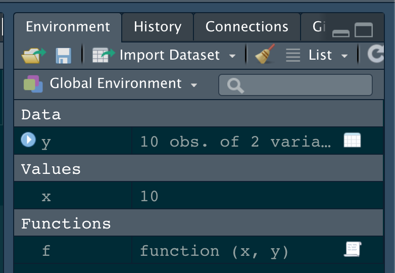
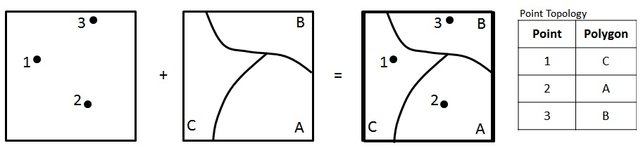

```{r, include = F}
library(sf)
library(tidyverse)
library(USAboundaries)
library(units)
library(rmapshaper)
library(leaflet)
```


# Over the last few weeks :

We have learned a lot! 

## tools for reading and writing data:
  - read_sf / write_sf
  - read_csv / write_csv
  - read_excel

## tools for data manipulation
 - filter
 - select
 - mutate
 - group_by
 - summarize
 - rollmean, lag

## tools to manage/manipulate data type/structure
  - as.numeric
  - as.factor
  - st_as_sf
  - data.frame

## tools for merging and shaping data
  - inner_join
  - left_join
  - right_join
  - full_join
  - pivot_longer
  - pivot_wider
  
## tools for measuring geometries:
  - st_distance
  - st_area
  - st_length
  - set_units / drop_units

## These tools are all functions

- R is a statistical computing language that provides _features_ as _functions_ 

- Even with just its base installation, R provides hundreds of functions:

```{r}
length(lsf.str("package:base")) + length(lsf.str("package:stats")) + length(lsf.str("package:utils"))
```
- sf provides over 100 more

```{r}
length(lsf.str("package:sf")) 
```

- and the core tidyverse packages (that we use) an additional ~750

```{r}
length(lsf.str("package:dplyr")) +
length(lsf.str("package:ggplot2")) +
length(lsf.str("package:tidyr")) +
length(lsf.str("package:forcats")) +
length(lsf.str("package:purrr")) 
```

## To date ... 

- We have been using functions written for us - mostly by `sf` and the `tidyverse`

- This is how any commercial GIS suite operates as well
 - Analysis and workflows are limited to the tools kits and options exposed to the user
 - In R, a lot more is actually exposed!

- Every time we install a new package, we download code that provides new specific features (as functions)

- Every time we *attach* a package to a working session (`library()`) we are making those functions available/visible

## Functions are objects

- Just like `x = 10` binds the value of 10 to the name x creating an object visible in the environment,

- functions are objects that can be called by name to execute a set of directions over defined arguments.

```{r}
class(sf::st_intersects)
class(sf::st_as_sf)
```

## Our own functions are visible as objects in the environment

```{r}
x = 10
y = data.frame(x = 1:10, y = 10:1)
f = function(x,y){ x  + y }
```

```{r, fig.align='center', fig.height = 5, echo = FALSE}

```

## Advancing your programming skills

- One of the best ways to improve your skills as a data scientist is to write functions.

- Functions allow you to automate common tasks in a more general way than copy-and-pasting. 

- The more times you apply a function, the more incentive you have to optimize it for speed/accuracy

- The more creative/unique your analyses and questions can be

## Spatial statistics needs functions

**Example: Computing Moran's I across different tessellations**

You learned this week that spatial statistics depend on neighbor structure:

::: columns
::: {.column width="50%"}
**Without functions:**
```{r, eval = FALSE}
# Hexagon Moran's I
W_hex <- st_touches(hex_grid)
diag(W_hex) <- 0
W_hex <- W_hex / rowSums(W_hex)
I_hex <- ape::Moran.I(data, W_hex)

# Square Moran's I
W_sq <- st_touches(sq_grid)
diag(W_sq) <- 0
W_sq <- W_sq / rowSums(W_sq)
I_sq <- ape::Moran.I(data, W_sq)

# Voronoi Moran's I
W_vor <- st_touches(vor_grid)
diag(W_vor) <- 0
W_vor <- W_vor / rowSums(W_vor)
I_vor <- ape::Moran.I(data, W_vor)
```

⚠️ **Repetitive, error-prone!**
:::

::: {.column width="50%"}
**With functions:**
```{r, eval = FALSE}
compute_morans_i <- function(
    tessellation, 
    data_values) {
  
  # Build neighbor matrix
  W <- st_touches(tessellation, 
                   sparse = FALSE)
  diag(W) <- 0
  W <- W / rowSums(W)
  
  # Compute Moran's I
  ape::Moran.I(data_values, W)
}

# Apply to all tessellations
I_hex <- compute_morans_i(
  hex_grid, data_values)
I_sq <- compute_morans_i(
  sq_grid, data_values)
I_vor <- compute_morans_i(
  vor_grid, data_values)
```

✅ **Consistent, maintainable!**
:::
:::

. . .

**Key insight:** The spatial statistics pipeline you learned is now encapsulated in a single reusable function

## So why write functions as opposed to scripts?


 - The process can be named
 
 - As requirements change, you only need to update code in one place
 
 - You eliminate the chance of making incidental mistakes when you copy and paste (forgetting to change `dist_to_state` to `dist_to_border`).
 
 - functions can be 'sourced' into Qmd/Rmd files and R Scripts

 - You save yourself time

## Rule of thumb `r icons::fontawesome('thumbs-up')`

- Data is the first argument (better for pipes!)

- Whenever you have copy-and pasted code more than twice you should write a function

For example how many times have we coded:

```{r, eval = FALSE}
states = USAboundaries::us_states() |> 
  filter(!name %in% c("Hawaii", "Puerto Rico", "Alaska"))
```

- Or made the same table with `knitr`/`kableExtra` only changing the `col.names` and `data.frame`

- Or calculated a distance, changed the units, and dropped them?

- All of these task are repetitive and prone to making errors that could impact our analysis but not break our code...

## The form of a function:

Creating a function follows the form:

```{r, eval = FALSE}
name = function(arg1, arg2, *){
  code
  ..
  return(...)
}
```

Where:

 - `name` is the function name (e.g. `st_as_sf`)
 
    - This is the name on which R is able to call the object

 - `arg1` is the first input
 

 - `arg2` is the second input
 

 - `*` is any other argument you want to define

 - `code ...` defines the instructions to carry out on `arg1` and `arg2`

 - `return(...)` is what the function returns
 

## Defining a function

 - To define a function we need to identify the code we have, and what can/should generalized for future uses?
 
```{r, eval = FALSE}
states = USAboundaries::us_states() |> 
  filter(!name %in% c("Hawaii", "Puerto Rico", "Alaska"))
```


- Here the input data (us_states) could change

- So could the variable name we filter by (name)

## Function Signature

So, let's start with a function that takes general input data and a variable name


```{r, eval = FALSE}
get_conus = function(data, var){

}
```

## Function arguments

Function arguments typically include two two broad sets: 
  -  the data to compute on, 
  -  arguments that control the details of the calculation

- In `st_transform` `x` is the data, `crs` is the proj4string/EPSG code 

- In `ms_simplify` `input` is the data, `keep` defines the directions

- In `get_conus`: `data` provides the data, `var` defines the column to filter

## 

- Generally, data arguments should come first. 
- Detail arguments should go on the end
- It can be useful - and good practice - to define default values. 
  - should almost always be the most common value. 
  - The exceptions to this rule are to do with safety of the process.
    - e.g. `na.rm = FALSE`

## Code body

We then have to carry these generalizations into the function directions using the arguments as our operators:
 
```{r}
get_conus = function(data, var){
  conus = filter(data, !get(var) %in% c("Hawaii", "Puerto Rico", "Alaska"))
  return(conus)
}
```

 - here, we replace `us_states()` with `data`

 - we use `get()` to return the *value* of a *named* object

 - We assign our filtered object to the name `conus`

 - And explicitly return the `conus` object from the function

- The value returned by the function is *usually* the last evaluated statement, if we don't specify return we can take advantage of this default:

```{r}
get_conus = function(data, var){
  filter(data, !get(var) %in% c("Hawaii", "Puerto Rico", "Alaska"))
}
```

## Using our function:

- Like any object, we have to run the lines of code to save it as an object before we can use it directly in our code:

- But then ...

::: {columns}
::: {.column width=50%}
### States
```{r, fig.height=5}
x = get_conus(data = us_states(), var = "name")
plot(x$geometry)
```
:::

::: {.column width=50%}
### Counties
```{r, fig.height=5}
x2 = get_conus(data = us_counties()[,-9], var = "state_name")
plot(x2$geometry)
```
:::
:::

## Cities

```{r, fig.width=8}
cities = read_csv("../labs/data/uscities.csv") |>
  st_as_sf(coords = c("lng", "lat"), crs = 4326) |> 
  get_conus("state_name")

plot(cities$geometry, pch = 16, cex = .1)
```

## It's ok to be more detailed

- Another advantage of functions is that if our requirements change, we only need to make the change our code in one place. 

- This also means we can spend more time fine-tuning our code since we know it will be recycled.

- Here we can be more focused and make sure to remove other potential "non-conus" states from any input object:

```{r}
get_conus = function(data, var){
  filter(data, !get(var) %in% 
           c("Hawaii", "Puerto Rico", "Alaska",
             "Guam", "District of Columbia"))
}
```

## Using our function

```{r}
conus = get_conus(us_states(), "name")
nrow(conus)
```

## Point-in-Polygon Case Study

- The power of GIS lies in analyzing multiple data sources together. 

- Often the answer you want lies in many different layers and you need to do some analysis to extract and compile information. 

- One common analysis is Points-in-Polygon (PIP). 

-  PIP is useful when you want to know how many - or what kind of -  points fall within the bounds of each polygon


```{r, fig.align='center', fig.width = 18, echo = FALSE}

```

## Data

### CONUS counties

```{r}
counties = st_transform(us_counties()[,-9], 5070) |> 
  select(name, geoid, state_name) |> 
  get_conus("state_name")
```

### CONUS Starbucks

```{r, message = FALSE}
starbucks = read_csv('data/directory.csv') |> 
  filter(!is.na(Latitude), Country == "US") |> 
  st_as_sf(coords = c("Longitude", "Latitude"), crs = 4326) |> 
  st_transform(5070) |> 
  st_filter(counties) |> 
  select(store_name = `Store Name`)
```

### Colorado Counties 

```{r}
co = filter(counties, state_name == "Colorado")
```


```{r, echo = FALSE, fig.width=10, fig.align='center'}
ggplot() +
  geom_sf(data = counties, size = .1, col = "gray") + 
  geom_sf(data = co, fill = "red", alpha = .2, col = NA) +
  geom_sf(data = starbucks, size = .01) + 
  theme_void() + 
  labs(title = "USA Starbucks Locations",
       caption = paste(nrow(starbucks), "locations shown"))
```

## Step 1: Spatial Join

To count the Starbucks locations in Colorado counties, we start by joining the Colorado counties to the locations:

 - Here we use the `counties` as the x table and the locations as the y table
 
 - This is because we want to **add** the starbucks information to the `county` sf object.

 - Remember the default of `st_join` is a `left_join` on the `st_intersects` predicate


```{r}
(starbucks1 = st_join(co, starbucks))
```

## Step 2: Point counts by Polygon

`count()` is a dplyr function that "*lets you quickly count the unique values of one or more variables: df |> count(a, b) is roughly equivalent to df |> group_by(a, b) |> summarize(n = n())*"

```{r}
(count(starbucks1, geoid))
```

## Step 3: Combine the processes ...

```{r fig.height=5}
starbucks1 = st_join(co, starbucks) |> 
   count(geoid)

plot(starbucks1['n'])
```

## Now for Colorado?

We can anticipate that PIP is a useful process we want to implement over variable points and polygons pairs


So, let's make a function named `point_in_polygon`, that takes a `point` dataset and a `polygon` dataset

```{r}
point_in_polygon = function(points, polygon){
 st_join(polygon, points) |> 
   count(geoid)
}
```

## Test

::: {columns}
::: {.column width=50%}
```{r}
co_sb = point_in_polygon(starbucks, co)
plot(co_sb['n'])
```

```{r}
ca_sb = point_in_polygon(starbucks, 
                         filter(counties, state_name == "California"))
plot(co_sb['n'])
```
:::
::: {.column width=50%}

```{r}
or_sb = point_in_polygon(starbucks, 
                         filter(counties, 
                                state_name == "Oregon"))
plot(or_sb['n'])
```

```{r}
ny_sb = point_in_polygon(starbucks, 
                         filter(counties, 
                                state_name == "New York"))
plot(ny_sb['n'])
```

:::
:::

## Generalizing the `count` variable

- In its current form, `point_in_polygon` only counts on `geoid`


- Let's modify that by making the variable name an input
  - again, we use `get()` to return the *value* of a *named* object 
  - we call this, variable `id`


```{r}
point_in_polygon2 = function(points, polygon, var){
  st_join(polygon, points) |> 
    count(get(var))
}
```

## Applying the new function

- Here, we can apply the PIP function over **states** and _count_ by `name`

```{r, fig.align='center', fig.height = 5}
states = get_conus(us_states(), "name") |> 
  st_transform(5070)

state_sb = point_in_polygon2(starbucks, states, 'name')

plot(state_sb['n'])
```

## Optimizing functions 

- Let's apply our function over the counties and see how long it takes

- We can check the time it takes by wrapping our function in `system.time`

```{r, eval = FALSE}
system.time({
  us = point_in_polygon(starbucks, counties)
})

# user    system  elapsed 
# 3.719   0.354   4.309 
```

## That's not bad...

```{r}
# How many seconds per point?
(point_per_sec = 4.3 / (nrow(counties) * nrow(starbucks)))
```

```{r}
# How will this scale to our dams data
# (assuming the process is linear)

point_per_sec * (nrow(counties) * 91000)
```

- ~ 30 seconds to test ~282,100,000 point/polygon relations is not bad, but could be a bottleneck in analysis


- Let's look at a common means for improvement...

## To keep geometry or not?

- Remember our geometries are **sticky**, that means they carry through all calculations - whether they are needed or not

- We can ease a lot of computational overhead by being mindful of when we retain our geometry data with our attribute data.


::: {columns}
::: {.column width=50%}
```{r, eval = FALSE}
system.time({
  st_join(counties, starbucks) |> 
    count(geoid) 
})

#user    system  elapsed 
#3.970   0.421   5.521
```
:::
::: {.column width=50%}

```{r, eval = FALSE}
system.time({
  st_join(counties, starbucks) |> 
    st_drop_geometry() |> 
    count(geoid) |> 
    left_join(counties, by = 'geoid') |> 
    st_as_sf() 
})

# user    system  elapsed 
# 0.396   0.017   0.598
```
:::
:::

## 

```{r}
# How many seconds per point?
(point_per_sec = .598 / (nrow(counties) * nrow(starbucks)))

# How will this scale to our dams data
# (assuming the process is linear)

point_per_sec * (nrow(counties) * 91000)
```

### Awesome! 

Effectively a 86% decrease in time needed ((29-4) / 29)

### "Function-izing" our improvements

```{r}
point_in_polygon3 = function(points, polygon, var){
  st_join(polygon, points) |> 
    st_drop_geometry() |> 
    count(get(var)) |> 
    setNames(c(var, "n")) |> #<< 
    left_join(polygon, by = var) |> 
    st_as_sf() 
}
```

## What else can we wrap?

- What about a really nice, clean, informative plot?

- ggplots look great but can be time consuming to program...

- A function would allow us to take care of the groundwork 

```{r}
plot_pip = function(data){
  ggplot() + 
    geom_sf(data = data, aes(fill = log(n)), alpha = .9, size = .2) + 
    scale_fill_gradient(low = "white", high = "darkgreen") + 
    theme_void() + 
    theme(legend.position = 'none',
          plot.title = element_text(face = "bold", color = "darkgreen", hjust = .5, size = 24)) +
    labs(title = "Starbucks Locations",
         caption = paste0(sum(data$n), " locations represented")) 
}
```

- This is great because we can devote the time to making a nice plot and we will be able to recycle the work over other cases...

## Test

::: {columns}
::: {.column width=50%}
```{r, fig.height=5}
point_in_polygon3(starbucks, filter(counties, state_name == "California"), "geoid") |> 
plot_pip()
```

```{r}
point_in_polygon3(starbucks, filter(counties, state_name == "New York"), "geoid") |> 
plot_pip()
``` 
:::
::: {.column width=50%}
```{r}
point_in_polygon3(starbucks, counties, "geoid") |> 
  plot_pip()
```

```{r}
point_in_polygon3(starbucks, states, var = "name") |> 
  plot_pip()
```
:::
:::

## Moving beyond Starbucks?

- [Here](https://www.qgistutorials.com/en/docs/points_in_polygon.html#:~:text=One%20such%20type%20of%20analysis,use%20this%20method%20of%20analysis.) is a nice tutorial of point-in-polygon in QGIS. It is looking at earthquakes by country.

- Just like us they use `naturalearth` data for the polygon areas

- And they are looking at earthquake data maintained by NOAA.

- In R, we can read the NOAA data directly from a URL.

- The data is a tab delimited txt file so we use `readr::read_delim()`

##

```{r, message = FALSE, warning=FALSE}
sf::sf_use_s2(FALSE)
countries = st_as_sf(rnaturalearth::countries110)

quakes = 'data/earthquakes-2025-03-29_21-55-22_-0600.tsv' |> 
  read_delim(delim = "\t") |> 
  filter(!is.na(Latitude), !is.na(Longitude)) |> 
  st_as_sf(coords = c("Longitude", "Latitude"), crs = 4326) |>     
  st_transform(st_crs(countries))

nrow(countries)
nrow(quakes)
nrow(st_intersection(quakes, countries))
```


## PIP --> Plotting Method

- We can use our functions right out of the box for this data 

- But... somethings are not quite right..

```{r, fig.height=5, fig.align='center'}
point_in_polygon3(quakes, countries, var = "ADMIN") |> 
  plot_pip() 
```


## Modify for our analysis ...

```{r eval = FALSE}
point_in_polygon3(quakes, countries, var = "ADMIN") |> 
  plot_pip() + #<<
  labs(title = "Earthquake Locations") + 
  scale_fill_viridis_c() + 
  geom_sf(data = quakes, size = .25, alpha = .05, col = 'red')
```

```{r, echo = FALSE, fig.width=12, fig.align='center'}
point_in_polygon3(quakes, countries, var = "ADMIN") |> 
  plot_pip() + 
  labs(title = "Earthquake Locations") + 
  scale_fill_viridis_c() + 
  geom_sf(data = quakes, size = .3, alpha = .05, col = 'red')
```


## Improve the anaylsis...

```{r eval = FALSE}
point_in_polygon3(quakes, countries, var = "ADMIN") |> 
  plot_pip() + 
  labs(title = "Earthquake Locations",
       subtitle = "Most impacted countries") + 
  theme(plot.subtitle = element_text(hjust = .5),
        plot.title = element_text(color = "navy")) + 
  scale_fill_viridis_c() + 
  geom_sf(data = quakes, size = .3, alpha = .05, col = 'red') +
  gghighlight::gghighlight(n > (mean(n) + sd(n)))
```

```{r, echo = FALSE, fig.width=12, fig.align='center'}
point_in_polygon3(quakes, countries, var = "ADMIN") |> 
  plot_pip() + 
  labs(title = "Earthquake Locations",
       subtitle = "Most impacted countries") + 
  theme(plot.subtitle = element_text(hjust = .5),
        plot.title = element_text(color = "navy")) + 
  scale_fill_viridis_c() + 
  geom_sf(data = quakes, size = .2, alpha = .05, col = 'red') +
  gghighlight::gghighlight(n > (mean(n) + sd(n)))
```

---

# Defensive Programming with Functions

## Why Be Defensive?

- You are unlikely to remember every edge case when you wrote your function

- Other people (or future you!) will use your functions in ways you didn't anticipate

- Data can change, be corrupt, or have unexpected structure

- Functions used in production need to **fail gracefully** and provide useful error messages

- Good defensive programming prevents silent failures that corrupt your analysis

## Defensive Programming Principles

Key strategies:

 - **Validate inputs** - check that arguments are the correct type/structure
 - **Handle errors** - use `tryCatch()` to manage exceptions
 - **Provide feedback** - use informative messages and logging
 - **Fail fast** - stop at the first problem rather than continuing with bad data
 - **Document expectations** - be clear about what your function requires

## Example: The Risky Function

```{r}
# This function is risky!
fast_distance = function(x, y) {
  sqrt((x$geometry[[1]]$x - y$geometry[[1]]$x)^2 + 
       (x$geometry[[1]]$y - y$geometry[[1]]$y)^2)
}
```

Problems:
 - Assumes x and y have geometry columns
 - Assumes geometry is simple point data
 - No error handling if data is missing or malformed
 - Cryptic error messages if something goes wrong

## tryCatch: Error Handling in R

`tryCatch()` allows you to handle errors and other conditions gracefully:

```{r, eval = FALSE}
tryCatch(
  {
    # Code to try
    result = risky_operation()
  },
  error = function(e) {
    # Handle errors
    print(paste("Error occurred:", e$message))
  },
  warning = function(w) {
    # Handle warnings
    print(paste("Warning:", w$message))
  },
  finally = {
    # Always runs, regardless of success/error
    print("Operation completed")
  }
)
```

## Defensive Distance Function

```{r}
# Better version with defensive programming
defensible_distance = function(x, y) {
  
  # Check inputs are sf objects
  if (!inherits(x, "sf") || !inherits(y, "sf")) {
    stop("Both x and y must be sf objects")
  }
  
  # Check geometry column exists
  if (!"geometry" %in% names(x) || !"geometry" %in% names(y)) {
    stop("sfObjects must have geometry column")
  }
  
  # Use tryCatch for computation
  tryCatch(
    {
      dist = sf::st_distance(x, y)
      dist
    },
    error = function(e) {
      stop(paste("Distance calculation failed:", e$message))
    }
  )
}
```

## The Logger Package

The `logger` package provides a standardized way to record function activity:

```{r, eval = FALSE}
library(logger)

# Basic logging
log_info("Function started with parameters: x = {x}, y = {y}")
log_debug("Internal state: data shape is {nrow(data)} rows")
log_warn("Missing data found in column {col}")
log_error("Critical error: unable to read file {filename}")
```

Benefits:
 - **Structured output** - timestamps, log levels, consistent format
 - **Easy filtering** - can set thresholds for verbosity
 - **Production-ready** - can write to files or streaming services
 - **Namespace-aware** - tracks which function is logging

## Setting Log Thresholds

```{r, eval = FALSE}
# Show only warnings and errors (less verbose)
log_threshold(WARN)

# Show all debug info (very verbose)
log_threshold(DEBUG)

# Production setting - only errors and above
log_threshold(ERROR)
```

## Combining tryCatch and Logger

```{r, eval = FALSE}
smart_point_in_polygon = function(points, polygon, var) {
  
  log_info("Starting point_in_polygon: {nrow(points)} points, {nrow(polygon)} polygons")
  
  # Input validation
  tryCatch(
    {
      if (!inherits(points, "sf")) {
        log_error("Points input is not an sf object")
        stop("Points must be an sf object")
      }
      
      if (!inherits(polygon, "sf")) {
        log_error("Polygon input is not an sf object")
        stop("Polygon must be an sf object")
      }
      
      if (!var %in% names(polygon)) {
        log_error("Variable '{var}' not found in polygon data")
        stop(paste("Variable", var, "not found"))
      }
      
      log_debug("Inputs validated successfully")
    },
    error = function(e) {
      log_error("Input validation failed: {e$message}")
      stop(e)
    }
  )
  
  # Main computation with error handling
  tryCatch(
    {
      log_debug("Performing spatial join...")
      result = st_join(polygon, points) |>
        st_drop_geometry() |>
        count(get(var)) |>
        setNames(c(var, "n")) |>
        left_join(polygon, by = var) |>
        st_as_sf()
      
      log_info("Success: {nrow(result)} polygons returned with point counts")
      result
    },
    error = function(e) {
      log_error("Spatial join failed: {e$message}")
      stop(e)
    }
  )
}
```

## Verbose Function Example: Defensive PIP

```{r}
library(logger)

point_in_polygon_safe = function(points, polygon, var) {
  
  log_info("="*50)
  log_info("Starting point_in_polygon_safe()")
  log_info("Input: {nrow(points)} points")
  log_info("Input: {nrow(polygon)} polygons")
  log_info("Variable: {var}")
  
  # Validate and report on inputs
  tryCatch(
    {
      log_debug("Checking point geometry type...")
      if (!all(st_geometry_type(points) %in% c("POINT", "MULTIPOINT"))) {
        log_warn("Some point geometries are not simple points")
      } else {
        log_debug("All points are valid POINT geometries")
      }
      
      log_debug("Checking polygon geometry type...")
      if (!all(st_geometry_type(polygon) %in% c("POLYGON", "MULTIPOLYGON"))) {
        log_error("Not all geometries are polygons!")
        stop("Polygon input must contain polygon geometries")
      }
      log_debug("All polygons are valid POLYGON geometries")
      
      # Check CRS match
      if (st_crs(points) != st_crs(polygon)) {
        log_warn("CRS mismatch detected")
        log_info("Transforming points to polygon CRS")
        points = st_transform(points, st_crs(polygon))
      } else {
        log_debug("CRS match confirmed: {st_crs(polygon)$epsg}")
      }
      
    },
    error = function(e) {
      log_error("Validation failed: {e$message}")
      stop(e)
    }
  )
  
  # Perform computation
  tryCatch(
    {
      log_info("Beginning spatial join...")
      start_time = Sys.time()
      
      result = st_join(polygon, points) |>
        st_drop_geometry() |>
        count(get(var)) |>
        setNames(c(var, "n")) |>
        left_join(polygon, by = var) |>
        st_as_sf()
      
      elapsed = as.numeric(Sys.time() - start_time)
      log_info("Spatial join completed in {round(elapsed, 2)} seconds")
      log_info("Results: {nrow(result)} features with point counts")
      log_info("Range of points per feature: {min(result$n, na.rm=T)} to {max(result$n, na.rm=T)}")
      
      result
      
    },
    warning = function(w) {
      log_warn("Warning during computation: {w$message}")
    },
    error = function(e) {
      log_error("Computation failed: {e$message}")
      stop(e)
    },
    finally = {
      log_info("point_in_polygon_safe() completed")
      log_info("="*50)
    }
  )
}
```

## Using the Safe Version

```{r, eval = FALSE}
# Set verbosity level
log_threshold(DEBUG)

# Run with full diagnostic output
result = point_in_polygon_safe(starbucks, filter(counties, state_name == "Colorado"), "geoid")

plot_pip(result)
```

## Key Takeaways

✅ **Write defensive functions:**
  - Validate all inputs
  - Check data structure and types
  - Handle edge cases

✅ **Use tryCatch for robustness:**
  - Catch errors before they crash
  - Provide meaningful error messages
  - Clean up resources in `finally` block

✅ **Use logger for transparency:**
  - Record function progress
  - Help users understand what's happening
  - Make debugging easier

✅ **Combine them all:**
  - Defensive programming + logging = production-ready functions
  - Users (and you!) will understand what went wrong
  - Easier to maintain and debug over time

