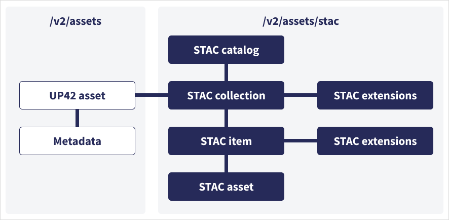
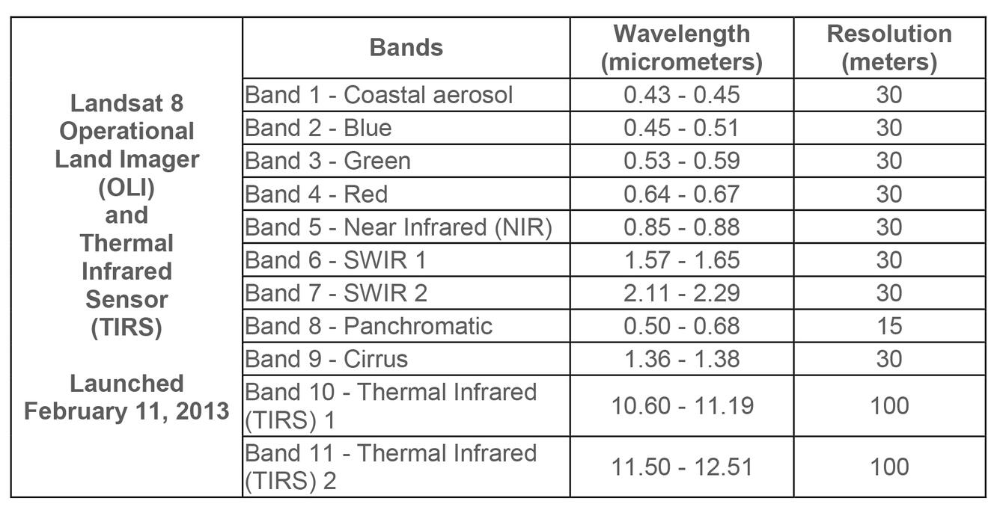

```{r, include = F}
library(tidyverse)
library(AOI)
library(sf)
library(terra)
```

## Learning Objectives

By the end of this week, you will be able to:

- **Parse and validate JSON** from APIs and cloud storage systems
- **Read and write GeoJSON** for spatial data exchange in reproducible workflows
- **Query STAC catalogs** to discover and access petabyte-scale remote sensing datasets
- **Download and organize** imaging assets directly into analysis pipelines (avoiding manual downloads)
- **Apply these tools** to real water resource problems (e.g., flood extent mapping, drought monitoring)

---

## Why These Standards Matter for Water Data Science

Modern water resource analysis requires **fast, reproducible access to cloud-hosted data**:

- **JSON**: Standard format for REST APIs (USGS, NOAA, NWIS, NASA)
- **GeoJSON**: Enables spatial data to flow between databases, web services, and R
- **STAC**: Discovers satellite imagery, model outputs, and time-series data without manual catalog browsing

**Real scenario**: Analyzing the 2016 Palo, Iowa flood requires Landsat imagery from Sept 24–29, 2016. With STAC + `rstac`, that's a 3-line search query. Without it: hours of clicking through NASA/USGS websites.

---

## JSON: The Universal Data Exchange Format

JSON (**JavaScript Object Notation**) is everywhere in modern data science:

- **APIs**: USGS NWIS, NOAA, OpenWeather, Mapbox, Google Earth Engine
- **Cloud storage**: AWS S3 metadata, Azure metadata, Google Cloud Storage
- **Databases**: NoSQL (MongoDB), time-series (InfluxDB), document stores
- **Configuration**: `package.json`, Docker Compose, Kubernetes

Key advantage: **Human-readable** + **machine-parseable** + **language-agnostic**.

```json
{ "type": "FeatureCollection",
  "features": [
    { "type": "Feature",
      "geometry": {
        "type": "Point",
        "coordinates": [-91.793, 42.066]
      },
      "properties": {
        "gauge": "Palo, IA",
        "flood_date": "2016-09-26"
      }
    }
  ]
}
```
## JSON Syntax & Data Types

**Objects** (key-value pairs):
```json
{
  "gauge_id": "09380000",
  "name": "Colorado R at Lees Ferry",
  "state": "AZ",
  "mean_flow_cfs": 12500.5
}
```

**Arrays** (ordered lists):
```json
["red", "green", "blue", "nir"]
```

**Data types**: string, number, boolean, null, object, array

**Common mistakes**: unquoted keys, trailing commas, mismatched quotes

---

## Parsing JSON in R

Use `jsonlite::fromJSON()` to parse JSON strings or URLs:

```{r}
library(jsonlite)

# Parse JSON string
response_json <- '{"gauge":"Lees Ferry","flow":12400}'
(data <- fromJSON(response_json))

# Convert R object back to JSON
data_out <- toJSON(data, pretty = TRUE)
cat(data_out)
```

## Example 

```{r}
jsonlite::fromJSON('https://api.water.usgs.gov/nldi/linked-data/nwissite/USGS-11120000/basin?f=json')
```

## GeoJSON: Spatial Data as JSON

**GeoJSON** encodes geographic features in JSON—standard for web mapping, APIs, and data interchange.

Structure:
- **Geometry**: Points, LineStrings, Polygons (lon/lat coordinates in WGS84)
- **Properties**: Attributes (names, values, measurements)
- **Feature**: Single geometry + properties
- **FeatureCollection**: Multiple features

**Point**: `[-91.793, 42.066]` (lon, lat)

**Polygon**: Ring of coordinates forming closed boundary


## GeoJSON Geometry Types

```json
{
  "type": "Point",
  "coordinates": [-91.793, 42.066]
}
```

```json
{
  "type": "Polygon",
  "coordinates": [[
    [-91.8, 42.06], [-91.79, 42.07], [-91.78, 42.06], [-91.8, 42.06]
  ]]
}
```

**Key rule**: Coordinates are **[longitude, latitude]** (not lat, lon!)

---

## GeoJSON Feature Example

A single flood extent:

```{json}
{
  "type": "Feature",
  "geometry": {
    "type": "Polygon",
    "coordinates": [[
      [-91.8, 42.06], [-91.79, 42.07], [-91.78, 42.06], [-91.8, 42.06]
    ]]
  },
  "properties": {
    "name": "Flooded Area in Palo",
    "date": "2016-09-26",
    "flood_depth_feet": 18.5
  }
}
```

## Live Read

```{r}
basin <- sf::read_sf('https://api.water.usgs.gov/nldi/linked-data/nwissite/USGS-11120000/basin') 

basin

plot(basin)
```

## STAC: Discovering Petabyte-Scale Remote Sensing Data

**STAC** (**SpatioTemporal Asset Catalog**) is a standard for describing & discovering imagery:

- **Problem**: Finding cloud-free Landsat imagery for your study area on a specific date used to require:
  - Visiting NASA EarthExplorer or USGS
  - Manually filtering by date, cloud cover, location
  - Clicking download buttons
  - Waiting for large files

- **STAC solution**: Machine-readable metadata + standard API = **programmatic discovery & download**

---

## STAC Concepts

- **Catalog**: Describes a collection of data (e.g., Landsat Collection 2 Level-2)
- **Collection**: Metadata + spatial/temporal extent for a dataset
- **Item**: Single asset (one satellite scene), with its own metadata (cloud cover, datetime, bands)
- **Asset**: Specific file or data product (red band, NIR band, thumbnail, cloud mask)

{width="80%"}

**Key insight**: This nested structure lets you *query at any level* (find catalogs, browse collections, search for items, download specific assets).

---

## STAC Item Anatomy (Landsat Example)

```json
{
  "type": "Feature",
  "id": "LC08_L2SP_025031_20160926_02_T1",
  "stac_version": "1.0.0",
  "geometry": { "type": "Polygon", "coordinates": [...] },
  "properties": {
    "datetime": "2016-09-26T16:47:00Z",
    "platform": "landsat-8",
    "instruments": ["OLI", "TIRS"],
    "eo:cloud_cover": 2.1
  },
  "assets": {
    "red": { "href": "s3://...LC08_red.TIF" },
    "nir": { "href": "s3://...LC08_nir.TIF" }
  }
}
```

::: columns
::: {.column width="50%"}
**Key insight**: Assets are URLs pointing to cloud storage. A STAC item is essentially metadata + pointers to files.
:::
::: {.column width="50%"}
{width="100%"}
:::
:::

## Catalog

[What is a STAC?](https://planetarycomputer.microsoft.com/api/stac/v1)

## Querying STAC with `rstac`: Palo 2016 Flood

The Palo flood occurred Sept 26, 2016. Search for Landsat imagery covering that event:

```{r}
#| echo: true
library(rstac)

# STAC endpoint: Microsoft Planetary Computer
stac_ep <- "https://planetarycomputer.microsoft.com/api/stac/v1"

# Bounding box around Palo, IA
bbox_palo <- AOI::geocode("Palo, Iowa", bbox = TRUE)
```

```{r}
(search <- stac(stac_ep))
```

## Collections

```{r}
(
  search <- stac(stac_ep) |> 
   stac_search(
    collections = "landsat-c2-l2",
  )|> 
    get_request()
 )
```

## Spatial Filter

```{r}
(
  search <- stac(stac_ep) |> 
   stac_search(
    collections = "landsat-c2-l2",
    bbox = st_bbox(bbox_palo),
    limit = 10
  )|> 
    get_request()
 )
```

## Temporal Filter

```{r}
(
  search <- stac(stac_ep) |> 
   stac_search(
    collections = "landsat-c2-l2",
    bbox = st_bbox(bbox_palo),
    datetime = "2016-09-24/2016-09-29",
    limit = 10
  )|> 
    get_request()
 )
```

## Get Request

 - The GET request only returns the JSON catalog showing were data is located this is "free" to all.
 
 - To actually get the assests from the URL, some providers require a key, some an account, and some just an authentication
 
 - Microsoft is an example of authenticated but free to use!

```{r}
search$features[[1]]$assets$green$href
```
 
## Signed URLs & Accessing Planetary Computer Data

Microsoft Planetary Computer hosts large datasets (Landsat, Sentinel, Copernicus, MODIS, etc.) and requires **signed URLs** for access. The `rstac` package handles this automatically:

```{r}
# Sign all asset URLs for the first item
item_signed <- search  |> 
  items_sign(rstac::sign_planetary_computer())

item_signed$features[[1]]$assets$green$href # Now this URL is signed and ready for download
```
This avoids keeping credentials in your code—much more secure!

## Safe Download: Check File Size First

Before downloading large band files (100s of MB), inspect the file size with a HEAD request:

```{r, eval=FALSE}
# Example: safe download pattern
file_url <- item_signed[[1]]$assets$green$href

# HEAD request: get metadata without downloading
h <- httr::HEAD(file_url)
if (httr::status_code(h) == 200) {
  file_size_mb <- as.numeric(httr::headers(h)$`content-length`) / 1e6
  cat("File size:", file_size_mb, "MB\n")
  
  # Only download if < 500 MB
  if (file_size_mb < 500) {
    httr::GET(file_url, httr::write_disk("band_red.TIF", overwrite = TRUE))
    cat("Downloaded successfully\n")
  } else {
    cat("File too large; consider downloading selectively\n")
  }
}
```

## Direct read

```{r}
vsi <- terra::rast(item_signed$features[[1]]$assets$green$href)
vsi
```

## Assisted Asset Download

```{r, eval=FALSE}
assets_download(
  items      = item_signed,
  asset_names =  c('blue', 'green', 'red'),
  output_dir = '../labs/data',
  overwrite  = FALSE
)
```

. . . 

```{r}
list.files( path = "../labs/data",
  pattern = "*.TIF$",
  recursive = TRUE, 
  full.names = TRUE)
```


## From STAC to Analysis: The Full Workflow

```
Query STAC        Inspect         Sign URLs        Download         Load & Analyze
Find scenes  →  Metadata/CC  →  Authenticate  →  Selectively  →  NDVI, floods, etc.
     ↓              ↓              ↓              ↓              ↓
 bbox, date     cloud cover   secured tokens   30m TIFFs        terra raster
 collection     available         valid          to disk         ensemble
               bands            ~15 min         only needed      mapping
```

**Lab 4 & this walkthrough execute all five steps for Palo 2016 flood.**

1. **Query STAC** → find scenes matching criteria (date, location, cloud cover)
2. **Inspect metadata** → confirm cloud cover, available bands, data quality
3. **Sign URLs** → authenticate access to cloud-hosted files
4. **Download selectively** → you often need only 1–2 bands, not entire scenes
5. **Load into `terra`** → treat as raster for analysis (NDVI, flood mapping, etc.)

## Why This Matters for Water Science

**Pre-STAC workflow** (still common):

- Click directories on EarthExplorer

- Download entire scenes (10+ GB each)

- Manual metadata tracking

- Months to assemble regional datasets

**With STAC + rstac**:

- Query programmatically in seconds

- Download only what you need (individual bands, 50–100 MB)

- Metadata is structured, version-controlled

- Automated multi-year, multi-sensor analyses feasible

## Real-World STAC Catalogs for Water

- **Microsoft Planetary Computer**: 50+ datasets (Landsat, Sentinel-1/2, MODIS, ASTER, Climate models)
- **AWS Registry of Open Data**: Open-access Landsat, Sentinel, NOAA, others
- **Google Earth Engine**: Similar concept (not STAC-native, but queryable)
- **USGS OpenData**: Some products via STAC
- **CBERS/INPE (Brazil)**: Open satellite data via STAC

All queryable programmatically from R with `rstac`.

## Key Takeaways

1. **JSON** is the lingua franca of modern APIs—parsing it in R is essential
2. **GeoJSON** enables you to encode, share, and analyze spatial data portably
3. **STAC** unlocks programmatic access to massive remote sensing archives without manual downloads
4. Together, these **unlock automated multi-year, multi-region analyses**
5. For water science: **combine satellite data with ground-truth** (gauges, models) to answer critical operational questions

---

## Complete Walkthrough: 
### Palo 2016 Flood Analysis

#### Step 1: Define AOI and Temporal Window

```{r}
#| label: aoi-temporal
library(rstac)
library(terra)
library(sf)
library(tidyverse)

# AOI: Palo, Iowa
palo <- AOI::geocode("Palo, Iowa", bbox = TRUE)

# Flood occurred Sept 26, 2016; search Sept 24–29 for cloud-free imagery
temporal_range <- "2016-09-24/2016-09-29"

mapview::mapview(palo)
```

## Complete Walkthrough: STAC Query (with signing)

```{r}
#| label: stac-query-sign
# Connect to Microsoft Planetary Computer
stac_query <- stac("https://planetarycomputer.microsoft.com/api/stac/v1") %>%
  stac_search(
    collections = "landsat-c2-l2",
    datetime    = temporal_range,
    bbox        = st_bbox(palo),
    limit       = 1
  ) %>%
  get_request() %>%
  items_sign(sign_planetary_computer())

stac_query
# Inspect the result
cat("Item ID:", stac_query$features[[1]]$id, "\n")

cat("Date:", stac_query$features[[1]]$properties$datetime, "\n")

cat("Cloud cover:", stac_query$features[[1]]$properties$`eo:cloud_cover`, "%\n")
```

```{r, eval = FALSE}
assets_download(
  items      = stac_query,
  asset_names = c('coastal', 'blue', 'green', 'red', 'nir08', 'swir16'),
  output_dir = '../labs/data',
  overwrite  = FALSE
)
```


## Complete Walkthrough: Load Pre-Downloaded Data

Since data is already in `labs/data`, load directly from the local directory:

```{r}
#| label: load-from-disk
# List downloaded Landsat band files (TIF format)
raster_files <- list.files(
  path = "../labs/data",
  pattern = "*.TIF$",
  full.names = TRUE,
  recursive = TRUE
)

# Sort to ensure consistent band order
raster_files <- sort(raster_files)[1:6]

# Stack into a single SpatRaster object
landsat_stack <- rast(raster_files)
band_names <- c('coastal', 'blue', 'green', 'red', 'nir08', 'swir16')
landsat_stack <- setNames(landsat_stack, band_names)

landsat_stack
```

---

## Complete Walkthrough: Crop to AOI

```{r}
#| label: crop-to-aoi
# Transform AOI to match raster CRS (UTM zone 15N)
palo_utm <- bbox_palo %>% 
  st_transform(crs(landsat_stack))

# Crop the full scene to study area (saves memory, speeds processing)
landsat_crop <- crop(landsat_stack, palo_utm)

cat("\nCropped extent:\n")
print(ext(landsat_crop))
cat("Cropped dimensions:", dim(landsat_crop), "\n")
```

## Complete Walkthrough: Visualize Band Combinations

#### Natural Color (RGB) — What the Human Eye Would See

```{r}
#| label: viz-natural
plotRGB(landsat_crop, r = 4, g = 3, b = 2, stretch = "lin", 
        main = "Natural Color: Red-Green-Blue")
```

**Visible**: Water (dark), vegetation (green), urban (gray/tan), clouds (white)

**Limitation**: Flooding can look similar to vegetation in RGB alone.


## Visualize: Color Infrared (Vegetation)

```{r}
#| label: viz-cir
plotRGB(landsat_crop, r = 5, g = 4, b = 3, stretch = "lin",
        main = "Color Infrared: NIR-Red-Green\n(Bright red = healthy vegetation)")
```

**Visible**: 
- Bright red/magenta = healthy vegetation (strong NIR reflectance)
- Dark blue/black = water
- Gray/tan = soil/urban

**Why NIR matters**: Vegetation reflects ~50% of NIR light; water absorbs it. This makes forests "glow" red.


## Visualize: Water-Focused False Color

```{r}
#| label: viz-water-focus
plotRGB(landsat_crop, r = 5, g = 6, b = 4, stretch = "lin",
        main = "Water Focus: NIR-SWIR1-Red\n(Dark blue = open water/flooding)")
```

::: columns
::: {.column width="50%"}
**Visible**:
- Dark blue/black = open water, flooded areas (absorbs NIR + SWIR)
- Bright colors = vegetation & land
- Often shows flooding more clearly than natural color

**Why SWIR1 matters**: Water absorbs SWIR; vegetation reflects it. This combo best delineates water boundaries.
:::
::: {.column width="50%"}
{width="100%"}
:::
:::


## Complete Walkthrough: NDVI

$ NDVI = \frac{NIR - Red}{NIR + Red}$

```{r}
#| label: water-indices
# Extract individual bands for calculations
# Calculate key water indices
ndvi  <- (landsat_crop$nir08 - landsat_crop$red) / (landsat_crop$nir08 + landsat_crop$red)

plot(ndvi, col = colorRampPalette(c("blue", "white", "red"))(256))
```

## Thresholding to Binary Flood Maps

NDVI < 0 typically indicates water. We can apply this threshold to create a binary flood map:

```{r}
#| label: threshold-floods
# Apply thresholds specific to each index
ndvi_flood  <- app(ndvi,  function(x) ifelse(x < 0, 1, 0))      # NDVI < 0 = water

# Plot: blue = flooded, white = non-flooded
plot(ndvi_flood, col = c("white", "blue"), 
     main = c("NDVI-based"))
```

## Imapct Assessment:
```{r, echo = FALSE}
buildings <- read_sf("data/palo_buildings.geojson")
```

```{r, eval = FALSE}
library(osmdata)
osm <-  osmdata::opq(st_bbox(st_transform(palo, 4326))) |> 
    add_osm_feature("building") |> 
    osmdata_sf() 

buildings = st_transform(osm$osm_polygons, crs(landsat_crop))
```

```{r}
{plot(ndvi_flood, col = c("white", "blue"), 
     main = c("NDVI-based Flood Map with OSM Buildings"))
plot(buildings, add = TRUE)}
```

```{r}
buildings$impact = terra::extract(ndvi_flood, buildings, fun = max, na.rm = TRUE)[,2] > 0

{
plot(ndvi_flood, col = c("white", "blue"), 
     main = c("NDVI-based Flood Map with OSM Buildings"))
plot(filter(buildings, impact),
     add = TRUE,
     col = 'red',
     border = FALSE)
}

carto = app(ndvi,  function(x) ifelse(x < 0, 1, NA))
mapview::mapview(carto) + filter(buildings, impact)
```

## Key Insights from the Walkthrough

1. **STAC query** identified the exact cloud-free Landsat 8 scene (Sept 26, 2016)
2. **Local files** (pre-downloaded in `labs/data`) eliminated long download wait
3. **Band stacking** combined 6 spectral bands into a single raster object
4. **Color composites** revealed features invisible in natural color (vegetation, water)
5. **Indices + thresholding** converted continuous values to binary flood/no-flood
6. **Ensemble mapping** quantified confidence by counting method agreement

**Result**: A rigorous, reproducible flood map derived from open satellite data, validated against known drone footage.


## Further Reading & Resources

- **JSON Spec**: https://www.json.org/
- **GeoJSON RFC 7946**: https://tools.ietf.org/html/rfc7946
- **STAC Specification**: https://stacspec.org/
- **Planetary Computer STAC API**: https://planetarycomputer.microsoft.com/api/stac/v1
- **`rstac` Package**: https://cran.r-project.org/package=rstac
