```{r}
#| echo: false
#| message: false
#| warning: false
hexes <- function(..., size = 64) {
  x <- c(...)
  x <- sort(unique(x), decreasing = TRUE)
  right <- (seq_along(x) - 1) * size

  res <- glue::glue(
    '{.absolute top=-20 right=<right> width="<size>" height="<size * 1.16>"}',
    .open = "<", .close = ">"
  )

  paste0(res, collapse = " ")
}

library(tidymodels)
library(tibble)
library(ggpubr)
library(palmerpenguins)
library(visdat)

train_color <- '#1E4D2B'
test_color  <- '#C8C372'
data_color  <- "#767381"
assess_color <- "#84cae1"
splits_pal <- c(data_color, train_color, test_color)
```


## Modeling (Machine Learning)

{fig-align="center"}

::: footer
<https://xkcd.com/1838/>
:::

## By the end of today you will be able to...

- Summarize a dataset's structure and distributions using **EDA** tools (`skimr`, `ggpubr`, `visdat`)
- Assess whether data meets **normality assumptions** and choose an appropriate response (transform, nonparametric, bootstrap)
- Explain the role of **training**, **testing**, and **resampling** splits in a modeling workflow
- Specify a model with `parsnip` by choosing a **type**, **engine**, and **mode**
- Fit a model inside a `workflow` and evaluate it with `yardstick` metrics
- Compare multiple models at once with `workflow_sets` over cross-validation folds

. . .

Today's running example: *"Can we predict whether a 6,000-acre hexagon in Washington is forested?"*

## What is machine learning?

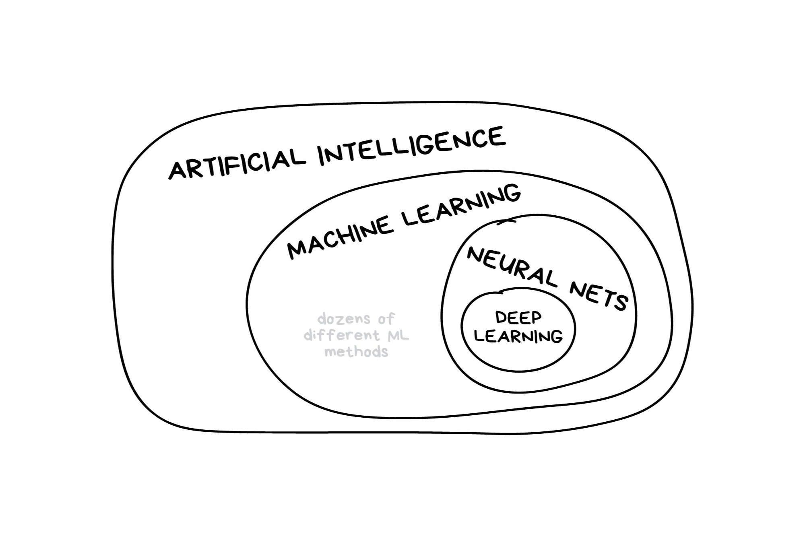{.absolute top=0 left=150 style="z-index: -1;"}

::: footer
Illustration credit: <https://vas3k.com/blog/machine_learning/>
:::

## What is machine learning? (2025 edition)

:::{.callout-note}
In the early 2010s, "Artificial intelligence" (AI) was largely synonymous with what we'll refer to as "machine learning" in this workshop. In the late 2010s and early 2020s, AI usually referred to deep learning methods. Since the release of ChatGPT in late 2022, "AI" has come to also encompass large language models (LLMs) / generative models.
:::

{.absolute top=150 left=150 style="z-index: -1;"}


::: footer
Illustration credit: <https://vas3k.com/blog/machine_learning/>
:::

## Classic Conceptual Model

{fig-align="center"}

::: footer
Illustration credit: <https://vas3k.com/blog/machine_learning/>
:::

##  {background-image="img/tm-org.png" background-size="contain"}

## The big picture: Road map

```{r end-game}
#| fig-align: "center"
#| echo: false
knitr::include_graphics("img/whole-game-final-performance.jpg")
```

## What is `tidymodels`?

  - An R package ecosystem for modeling and machine learning
  - Built on the `tidyverse` principles (consistent syntax, modular design)
  - Provides a structured workflow for preprocessing, model fitting, and evaluation
  - Includes packages for model specification, preprocessing, resampling, tuning, and evaluation
  - Promotes best practices for reproducibility and efficiency
  - Offers a unified interface for different models and tasks

## Key tidymodels Packages

📦 `recipes`: Feature engineering and preprocessing

📦 `parsnip`: Unified interface for model specification

📦 `workflows`: Streamlined modeling pipelines

📦 `tune`: Hyperparameter tuning

📦 `rsample`: Resampling and validation

📦 `yardstick`: Model evaluation metrics

```{r}
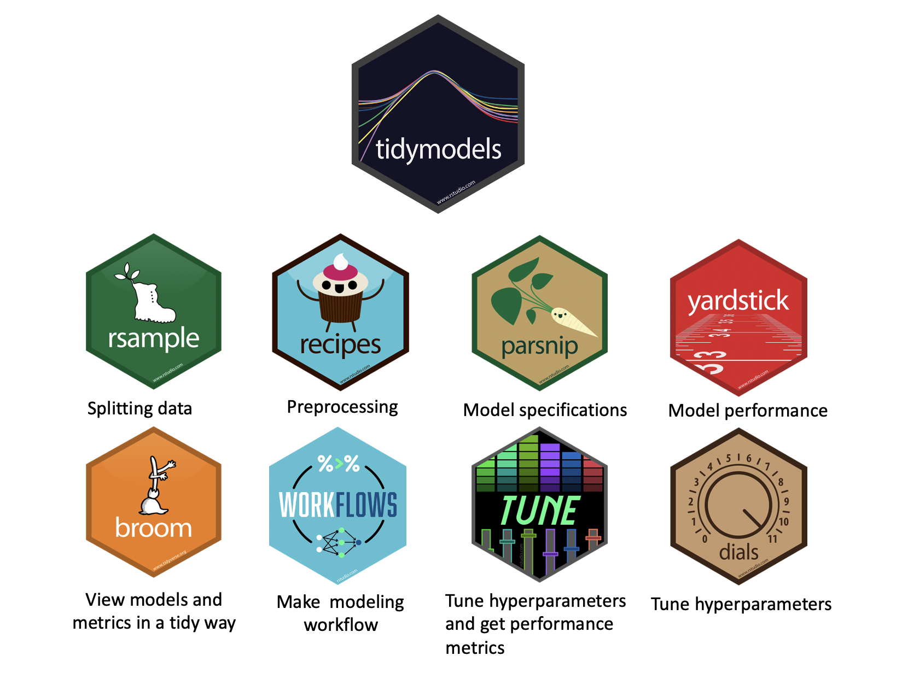
tidymodels::tidymodels_packages()
```

## Typical Workflow in `tidymodels`

1️⃣ Load Package & Data

2️⃣ Preprocess Data (`recipes`)

3️⃣ Define Model (`parsnip`)

4️⃣ Create a Workflow (`workflows`)

5️⃣ Train & Tune (`tune`)

6️⃣ Evaluate Performance (`yardstick`)

## Recap: `lm()` in R

_You've used `lm()` before — this slide frames it as the foundation for everything broom and tidymodels build on top of._

:::: {.columns}
::: {.column width="50%"}
`lm()` fits a **linear model** by ordinary least squares.

```r
model <- lm(y ~ x1 + x2, data = df)
```

**Key arguments:**

- `formula` — `response ~ predictors` (`.` = all columns)
- `data` — the training data frame

**Common follow-up functions:**

| Function | What it returns |
|---|---|
| `summary(model)` | Coefficients, R², F-statistic |
| `coef(model)` | Named coefficient vector |
| `fitted(model)` | In-sample predictions |
| `residuals(model)` | Raw residuals |
:::
::: {.column width="50%"}
```{r lm-recap-demo}
mod <- lm(body_mass_g ~ bill_length_mm + species,
          data = drop_na(penguins))
summary(mod)
```

**Reading the output:**

- `Estimate` — change in *y* per 1-unit increase in *x*
- `Pr(>|t|)` — p-value: is the coefficient ≠ 0?
- `Adjusted R²` — proportion of variance explained
- `F-statistic` — overall model significance

→ `broom` wraps this into tidy tibbles (next slide)
:::
::::

---

## Recap: `broom` — tidying model outputs `r hexes("broom")`

`broom` converts messy model objects into tidy tibbles. Three core functions:

| Function | Returns | Use it when you want to ... |
|---|---|---|
| `tidy()` | One row per **model term** | Inspect coefficients, p-values, confidence intervals |
| `glance()` | One row per **model** | Compare overall fit (R², AIC, log-likelihood, …) |
| `augment()` | One row per **observation** | Add predictions, residuals, influence stats to data |

. . .

```{r broom-lm-demo}
simple_mod <- lm(body_mass_g ~ bill_length_mm + species, data = drop_na(penguins))

tidy(simple_mod)      # coefficients table
```

---

## Recap: `broom` in practice

```{r broom-glance-augment}
glance(simple_mod)    # model-level fit statistics

augment(simple_mod) |>
  select(body_mass_g, .fitted, .resid) |>
  head(5)
```

:::{.callout-note}
`augment()` on a **workflow** (next slide) works the same way — it just accepts `new_data =` so you can apply the fitted model to held-out data. The column names (`.fitted`, `.pred_class`, `.pred_*`, `.resid`) are always predictable.
:::

## Predict with your model `r hexes("broom")`

_How do you use your new model?_

  * `augment()` will return the dataset with predictions and residuals added.

```{r augment}
lm_preds <- augment(simple_mod, new_data = drop_na(penguins))
```

<br> 

```{r}
#| echo: false
lm_preds
```

## Our typical process will look like this:

1.  Read in raw data (`readr`, `dplyr::*_join`) (single or multi table)

. . . 

2.  Prepare the data (EDA/mutate/summarize/clean, etc)
   

  - This is "Feature Engineering"

. . .

3.  Once we've established our features (rows), we decide how to "spend" them ... 

. . . 


For machine learning, we typically split data into **training** and **test** sets:

. . .

  - The **training set** is used to estimate model parameters.
  
  - Spending too much data in **training** prevents us from computing a good assessment of model **performance**.
    
. . . 

  - The **test set** is used as an independent assessment of performance.
  
  - Spending too much data in **testing** prevents us from computing good model parameter estimates.


# Exploratory Data Analysis {background-color="#C8C372"}

## What is EDA?

```{r}
#| echo: false
#| out.width: '100%'
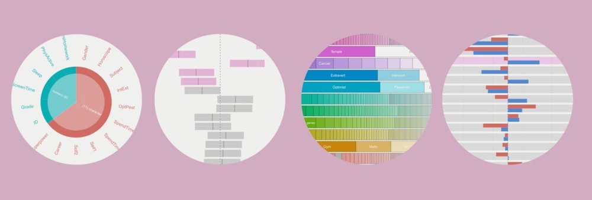
```

- **Exploratory Data Analysis (EDA)** is an approach to analyzing datasets to summarize their key characteristics using visualizations and statistical techniques.
- It uncovers patterns, anomalies, and relationships — and guides data cleaning, feature selection, and model choice.
- Today we focus on EDA from a **statistical perspective**: understanding data properties needed to support modeling assumptions.

---

## Why is EDA Important?

✅ **Detects data quality issues** – Missing values, outliers, inconsistencies.

✅ **Identifies patterns & trends** – Helps understand distributions and relationships.

✅ **Reduces bias & assumptions** – Ensures models are based on well-understood data.

✅ **Supports feature engineering** – Helps select or create the best features for modeling.

✅ **Guides modeling choices** – Informs whether linear, nonlinear, or other methods are suitable.

---

## EDA Checklist (Peng 2016)

1. **Develop a question** — E.g., *"Is there a relationship between tree canopy and flood risk?"*
2. **Read in data and check the structure** — dimensions, variable types, factors vs. characters
3. **Summarize the data** — missing values, ranges, means/medians, category counts
4. **Look at top and bottom** — `head()`, `tail()`, `skimr::skim()` for anomalies
5. **Answer your question with descriptive measures** — distributions, central tendency, variation
6. **Follow up with additional questions** — EDA is iterative

---

## Key Steps in EDA

1️⃣ **Understand Data Structure** – Check types, dimensions, missing values.
  `glimpse()`, `str()`, `summary()`, `vis_dat()`

2️⃣ **Summary Statistics** – Mean, median, variance, skewness, kurtosis.
  `skimr::skim()`, `summary()`, `table()`

3️⃣ **Visualizations** – Histograms, box plots, scatter plots, correlation matrices.
  `ggplot2`, `ggpubr`, `visdat`

4️⃣ **Identify Data Issues** – Outliers, missing data, inconsistencies.
  `vis_dat()`, IQR / Z-score methods

5️⃣ **Transformations & Feature Engineering** – Scaling, encoding, derived features.
  `recipes`, `tidymodels`

---

## Common Pitfalls in EDA

⚠ Ignoring domain context – Statistical insights must align with real-world meaning.

⚠ Over-reliance on visualizations – Needs statistical validation.

⚠ Dismissing small patterns – Some signals may be weak but significant.

⚠ Not documenting findings – EDA should inform later modeling stages.

---

## Understanding Data Structure

```{r}
glimpse(penguins)
nrow(penguins)
```

---

## Summary Stats with `skimr`

```{r}
library(skimr)
skimr::skim(penguins, body_mass_g)
```

---

## Central Tendency & Variability

**Central Tendency:**

- **Mean**: Average of all values. Best for symmetric distributions without outliers.
- **Median**: Middle value when sorted. Robust to outliers.
- **Mode**: Most frequent value. Useful for categorical data.

**Variability:**

- **Range**: Max − Min.
- **Variance / SD**: Spread around the mean.
- **IQR**: Range of the middle 50%; robust to outliers.

---

## Overview of `ggpubr`

- `ggpubr` wraps `ggplot2` to produce publication-ready statistical plots with minimal code.

- ✅ **Simplified syntax** — no deep ggplot2 knowledge required
- ✅ **Statistical plot types** — box plots, violin, scatter, density, bar, dot
- ✅ **Built-in tests** — `stat_compare_means()` adds p-values directly to plots
- ✅ **Grouped data** — easy faceting, p-value annotation, confidence intervals
- ✅ **Multi-plot layout** — `ggarrange()` combines plots in a grid

---

## Univariate Analysis – Distribution of Bill Length

Univariate analysis focuses on a single variable at a time.

```{r}
ggdensity(penguins, x = "bill_length_mm", add = "mean") +
  labs(title = "Distribution of Bill Length", x = "Bill Length (mm)")
```

📌 Most bill lengths are between 35–55 mm. Some outliers exist.

---

## Boxplot for Outlier Detection

```{r}
ggboxplot(penguins, x = "species", y = "bill_length_mm",
          color = "species", palette = "jco") +
  labs(title = "Bill Length Distribution by Species")
```

📌 Different species have distinct distributions. Outliers may need further investigation.

---

## Bivariate Analysis

| Variable Types | Plot Type |
|---|---|
| Categorical + Categorical | Bar plot (stacked or side-by-side) |
| Categorical + Continuous | Box plot; bar plot with summary stats |
| Continuous + Continuous | Scatter plot with regression line |

```{r}
ggscatter(penguins, x = "bill_length_mm", y = "bill_depth_mm",
          color = "species", add = "reg.line", conf.int = TRUE) +
  labs(title = "Bill Length vs. Bill Depth",
       x = "Bill Length (mm)", y = "Bill Depth (mm)")
```

---

## Multivariate Analysis

```{r}
ggscatter(penguins, x = "bill_length_mm", y = "bill_depth_mm",
          color = "species", add = "reg.line", ellipse = TRUE, conf.int = TRUE) +
  labs(title = "Bill Length vs. Bill Depth") +
  facet_wrap(~species)
```

---

## Correlation Analysis

:::: {.columns}
::: {.column width="50%"}
- Correlation coefficients range from −1 to 1.
- Close to **+1**: strong positive relationship.
- Close to **−1**: strong negative relationship.
- Close to **0**: no linear relationship.
- ⚠️ Correlation ≠ causation.
:::
::: {.column width="50%"}
```{r}
penguins |>
  select(where(is.numeric)) |>
  vis_cor()
```
:::
::::

---

## Identify Data Issues

**Duplicates:**
```{r, eval=FALSE}
df <- distinct(df)
```

**Missing Data:**
```{r, eval=FALSE}
df <- drop_na(df)
# Or impute:
df <- mutate(df, x = if_else(is.na(x), mean(x, na.rm = TRUE), x))
```

**Outlier Detection:** IQR, Z-scores, or clustering-based methods.

---

# Data Normality {background-color="#C8C372"}
Many statistical tests and models rely on the assumption that data is normally distributed.

## What is the Central Limit Theorem?

- The **CLT** states that the sampling distribution of the sample mean approaches a normal distribution as sample size increases, **regardless of the original distribution**.
- This justifies using normal-based inference even when raw data isn't normal.

---

## CLT in Action: Uniform Distribution

At n = 2, this may look normal, but the true distribution is triangular—CLT describes convergence, not instant normality

```{r}
set.seed(123)
n    <- 2
sims <- 10000
means <- replicate(sims, mean(runif(n)))

ggplot(data.frame(means), aes(x = means)) +
  geom_histogram(binwidth = 0.05, fill = "steelblue", color = "black", alpha = 0.7) +
  ggtitle(paste("Sampling Distribution of Mean (n =", n, ")")) +
  theme_minimal()
```

---

## CLT: Increasing Sample Size

As n increases, the distribution of sample means becomes normal even though the original data was uniform.

```{r}
#| out.width: '100%'
n_values <- c(2, 5, 30)
par(mfrow = c(1, 3))

for (n in n_values) {
  means <- replicate(sims, mean(runif(n)))
  hist(means, breaks = 30, main = paste("n =", n), col = "lightblue", probability = TRUE)
  curve(dnorm(x, mean = 0.5, sd = sqrt(1/12/n)), add = TRUE, col = "red", lwd = 2)
}
```

---

## Properties of a Normal Distribution

:::: {.columns}
::: {.column width="50%"}
- Symmetric about the mean
- Follows the **empirical rule**:
  - ~68% within 1 SD
  - ~95% within 2 SD
  - ~99.7% within 3 SD

```{r}
set.seed(123)
data <- rnorm(1000, mean = 50, sd = 10)
```
:::
::: {.column width="50%"}
```{r}
#| echo: false
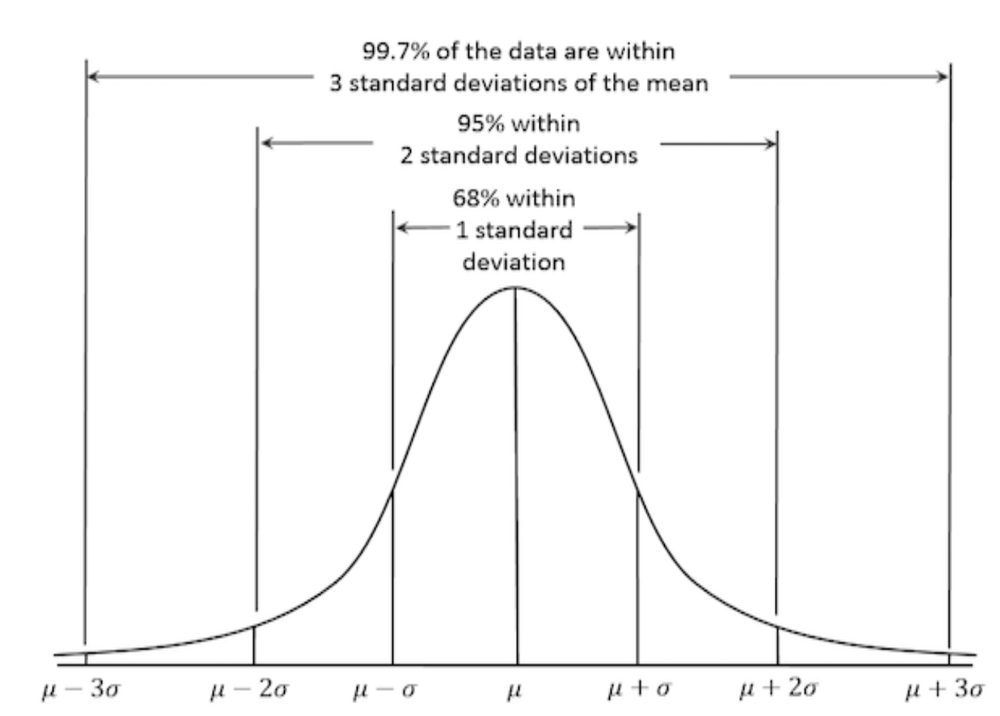
```
:::
::::

---

## Why Normality Matters

Many statistical techniques assume normality:

- **t-tests / ANOVA** — compare means between groups
- **Linear regression (`lm`)** — residuals should be normally distributed
- **PCA** — performs best with normally distributed features
- **Confidence intervals** — normality ensures accurate estimation

When data deviates from normality, these methods may produce inaccurate results.

---

## Assessing Normality: Visual Methods

::::{.columns}
:::{.column width="50%"}
```{r}
gghistogram(data, y = "density",
            bins = 30, fill = "skyblue",
            add = "mean", color = "black",
            add_density = TRUE)
```
:::
:::{.column width="50%"}
```{r}
ggboxplot(data, fill = "lightgreen",
          title = "Boxplot of Data")
```
:::
::::

---

## Checking Normality with Q-Q Plots

- Points along the **45-degree line** → normally distributed.
- Deviations suggest skewness or outliers.

```{r}
ggqqplot(group_by(penguins, species), x = "body_mass_g", color = "species")
```

---

## Statistical Tests for Normality

| Test | Strengths | Weaknesses |
|------|-----------|------------|
| Shapiro-Wilk | Sensitive; good for small samples | Too sensitive for large n |
| Kolmogorov-Smirnov | Works for any sample size | Less powerful for small n |
| Anderson-Darling | Emphasizes tails | Sensitive to sample size |
| Jarque-Bera | Tests skewness + kurtosis | Less reliable for small n |

H₀ in all tests: data is normally distributed. Low p-value → reject H₀.

---

## Normality Tests in R

```{r}
shapiro.test(data)
```

. . .

```{r}
ks.test(data, "pnorm", mean = mean(data), sd = sd(data))
```

. . .

```{r}
library(nortest)
ad.test(data)
```

---

## `nest`/`map` Pattern for Per-Group Testing

```{r}
penguins |>
  drop_na() |>
  nest(data = -species) |>
  mutate(test          = map(data, ~shapiro.test(.x$body_mass_g)),
         glance_shapiro = map(test, broom::glance)) |>
  unnest(glance_shapiro)
```

---

## Dealing with Non-Normal Data

**Option 1 — Transformations:**

| Transformation | When to Use |
|----------------|-------------|
| Log | Right-skewed, positive values |
| Square Root | Moderate right-skew, count data |
| Box-Cox | Unknown transformation needed |
| Yeo-Johnson | Like Box-Cox but works on negative values |

```{r}
log_data  <- log(data)
sqrt_data <- sqrt(data)
```

---

## Option 2 — Nonparametric Methods

Use when data is not normally distributed:

```{r}
# Wilcoxon (instead of t-test)
wilcox.test(Ozone ~ Month, data = airquality, subset = Month %in% c(5, 8))
```

```{r}
# Kruskal-Wallis (instead of ANOVA)
kruskal.test(Ozone ~ Month, data = airquality)
```

```{r}
# Spearman correlation (instead of Pearson)
cor.test(airquality$Ozone, airquality$Temp, method = "spearman")
```

---

## Option 3 — Bootstrapping

Provides robust estimates without assuming normality:

```{r}
library(boot)
boot_mean <- function(data, indices) mean(data[indices])
results <- boot(data, boot_mean, R = 1000)
plot(results)
```

---

## Skewness

:::: {.columns}
::: {.column width="50%"}
Skewness measures the asymmetry of a distribution:

- **Positive skew**: Longer right tail
- **Negative skew**: Longer left tail
- **Symmetric**: No skew (normal)

D'Agostino test for skewness:
```{r}
moments::agostino.test(na.omit(penguins$body_mass_g))
```
:::
::: {.column width="50%"}
```{r}
#| echo: false
set.seed(123)
right_skewed <- rexp(500, rate = 1)
left_skewed  <- -rexp(500, rate = 1)
skew_data <- data.frame(
  value = c(right_skewed, left_skewed),
  type  = rep(c("Right Skewed", "Left Skewed"), each = 500)
)
ggplot(skew_data, aes(x = value, fill = type)) +
  geom_histogram(bins = 30, alpha = 0.6, position = "identity") +
  facet_wrap(~type, scales = "free") +
  theme_minimal() +
  labs(title = "Skewed Distributions", x = "Value", y = "Count")
```
:::
::::

# On to modeling! {background-color="#C8C372"}

Now that the data is cleaned, understood, and modified, we can move on to modeling.

## Data Budget

- In any modeling effort, it's crucial to evaluate the performance of a model using different validation techniques to ensure a model can generalize to unseen data. 

- But data is limited even in the age of "big data".

```{r diagram-split}
#| fig-align: "center"
#| echo: false
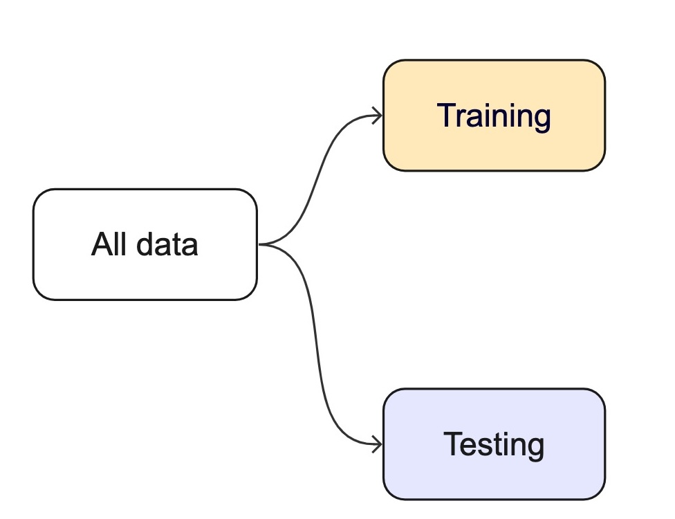
```


## How we split data 

```{r test-train-split}
#| echo: false
#| fig.width: 12
#| fig.height: 3
#| 
set.seed(123)

library(forcats)

one_split <- tibble(x = 1:30) %>% 
  initial_split() %>% 
  tidy() %>% 
  add_row(Row = 1:30, Data = "Original") %>% 
  mutate(Data = case_when(
    Data == "Analysis" ~ "Training",
    Data == "Assessment" ~ "Testing",
    TRUE ~ Data
  )) %>% 
  mutate(Data = factor(Data, levels = c("Original", "Training", "Testing")))

all_split <-
  ggplot(one_split, aes(x = Row, y = fct_rev(Data), fill = Data)) + 
  geom_tile(color = "white",
            linewidth = 1) + 
  scale_fill_manual(values = splits_pal, guide = "none") +
  theme_minimal() +
  theme(axis.text.y = element_text(size = rel(2)),
        axis.text.x = element_blank(),
        legend.position = "top",
        panel.grid = element_blank()) +
  coord_equal(ratio = 1) +
  labs(x = NULL, y = NULL)

all_split
```

. . . 

- Splitting can be handled in many of ways. Typically, we base it off of a "hold out" percentage (e.g. 20%)

- These hold out cases are extracted randomly from the data set. (remember seeds?)
 
 . . . 
 
- The **training** set is usually the majority of the data and provides a sandbox for testing different modeling approaches.

. . . 

- The **test** set is held in reserve until one or two models are chosen. 

- The **test** set is then used as the final arbiter to determine the efficacy of the model. 


## Stratification

- In many cases, there is a structure to the data that would inhibit impartial splitting (e.g. a class, a region, a species, a sex, etc)

- Imagine you have a jar of M&Ms in different colors — red, blue, and green. You want to take some candies out to taste, but you want to make sure you get a fair mix of each color, not just grabbing a bunch of red ones by accident.

- Stratified resampling is like making sure that if your jar is 50% red, 30% blue, and 20% green, then the handful of candies you take keeps the same balance.

- In data science, we do the same thing when we pick samples from a dataset: we make sure that different groups (like categories of people, animals, or weather types) are still fairly represented!

## Initial splits `r hexes("rsample")`

- In `tidymodels`, the `rsample` package provides functions for creating initial splits of data.
- The `initial_split()` function is used to create a single split of the data.
- The `prop` argument defines the proportion of the data to be used for training.
- The default is 0.75, which means 75% of the data will be used for training and 25% for testing.

```{r}
set.seed(101991)
(resample_split <- initial_split(penguins, prop = 0.8))

#Sanity check
69/344
```

## Accessing the data: `r hexes("rsample")`

- Once the data is split, we can access the training and testing data using the `training()` and `testing()` functions to extract the partitioned data from the full set:

```{r}
penguins_train <- training(resample_split)
glimpse(penguins_train)
```

. . .

```{r}
penguins_test <- testing(resample_split)
glimpse(penguins_test)
```

## Proportional Gaps — Before Stratification

:::{.callout-warning}
Without stratification, random sampling can over- or under-represent groups. Compare the species proportions below — they don't match.
:::

```{r}
# Dataset
(table(penguins$species) / nrow(penguins))
# Training Data
(table(penguins_train$species) / nrow(penguins_train))
# Testing Data
(table(penguins_test$species) / nrow(penguins_test))
```

## Stratification Example

- A stratified random sample conducts a specified split within defined subsets of subsets, and then pools the results. 

- Only one column can be used to define a strata, but grouping/mutate operations can be used to create a new column that can be used as a strata (e.g. species/island)

- In the case of the penguins data, we can stratify by species (think back to our nested/linear model approach)

- This ensures that the training and testing sets have the same proportion of each species as the original data.


```{r}
# Set the seed
set.seed(123)

# Drop missing values and split the data
penguins <- drop_na(penguins)
penguins_strata <- initial_split(penguins, strata = species, prop = .8)

# Extract the training and testing sets

train_strata <- training(penguins_strata)
test_strata  <- testing(penguins_strata)
```

## Proportional Alignment

```{r}
# Check the proportions
# Dataset
table(penguins$species) / nrow(penguins)
# Training Data
table(train_strata$species) / nrow(train_strata)
# Testing Data
table(test_strata$species) / nrow(test_strata)
```

## Modeling

::: {.columns}
:::{.column width="50%"}
- Once the data is split, we can decide what type of model to invoke.

- Often, users simply pick a well known model type or class for a type of problem (Classic Conceptual Model)

- We will learn more about model types and uses next week!

- For now, just know that the **training** data is used to fit a model.

- If we are certain about the model, we can use the **test** data to evaluate the model.
:::
:::{.column width="50%"}

```{r diagram-model-2}
#| echo: false
#| out.width: '45%'

```

```{r diagram-model-3}
#| echo: false
#| out.width: '100%'
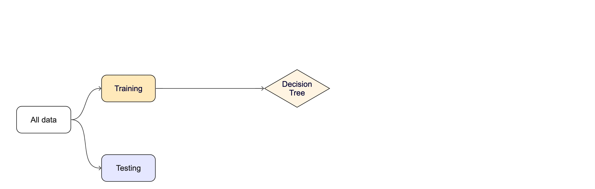
```
:::
:::

## Modeling Options

- But, there are many types of models, with different assumptions, behaviors, and qualities, that make some more applicable to a given dataset!

- Most models have some type of parameterization, that can often be _tuned_.

- Testing combinations of model and tuning parameters also requires some combination of `training`/`testing` splits.

```{r diagram-model-n}
#| echo: false
#| fig-align: "center"

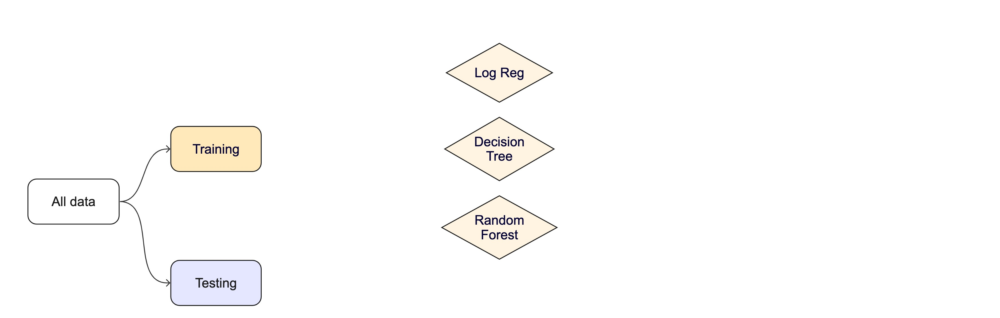
```

## Modeling Options

What if we want to compare more models?

. . .

And/or more model configurations?

. . .

And we want to understand if these are important differences?

. . . 

How can we use the *training* data to compare and evaluate different models? 🤔

. . . 

```{r diagram-resamples, echo = FALSE}
#| fig-align: "center"
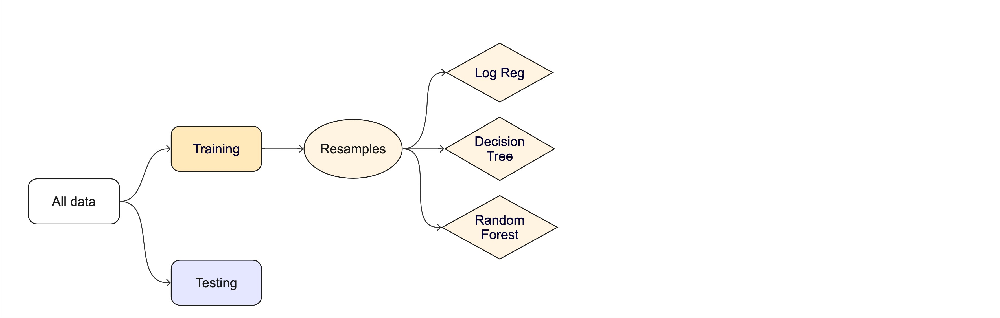
```

## Resampling

::: columns
::: {.column width="50%"}

- Testing combinations of model and tuning parameters also requires some combination of `training`/`testing` splits.

- Resampling methods, such as cross-validation and bootstrapping, are empirical simulation systems that help facilitate this.

- They create a series of data sets similar to the initial `training`/`testing` split.

- In the first level of the diagram to the right, we first split the original data into `training`/`testing` sets. Then, the training set is chosen for resampling.

:::
:::{.column width="50%"}
```{r diagram-resamples2, echo = FALSE}
#| fig-align: "center"
#| caption: 'This schematic from [Kuhn and Johnson (2019)](https://bookdown.org/max/FES/resampling.html) illustrates data usage for resampling methods'

knitr::include_graphics("img/resampling.svg")
```
:::
:::


## Key Resampling Methods

:::{.callout-warning}
Resampling is always used with the training set.
:::

Resampling is a key step in model validation and assessment. The `rsample` package provides tools to create resampling strategies such as cross-validation, bootstrapping, and validation splits.

. . . 

1. **K-Fold Cross-Validation**: The dataset is split into multiple "folds" (e.g., 5-fold or 10-fold), where each fold is used as a validation set while the remaining data is used for training.

    _Example (10-fold):_ On iteration 1, folds 2–10 become the training set and fold 1 is held out for assessment. On iteration 2, fold 2 is held out and folds 1, 3–10 are trained on. After 10 iterations every row has been predicted exactly once from a model it did not train on — and we average the 10 metric values to get a more stable estimate of skill.

. . .

2. **Bootstrap Resampling**: Samples are drawn _with replacement_ from the training dataset to generate multiple datasets, which are used to train and test the model.


. . .

3. **Monte Carlo Resampling (Repeated Train-Test Splits)**: Randomly splits data multiple times.

. . .

4. **Validation Split**: Creates a single training and testing partition.


## Cross-validation


## Cross-validation


## Cross-validation `r hexes("rsample")`

::: {.columns}
:::{.column width="50%"}
```{r vfold-cv}
penguins_train |> glimpse() 
```

<br>

```{r}
nrow(penguins_train) * 1/10

vfold_cv(penguins_train, v = 10) # v = 10 is default
```
:::
:::{.column width="50%"}
```{r}
#| fig.align: "center"
#| echo: false
knitr::include_graphics("https://www.tmwr.org/premade/three-CV.svg")
```

```{r}
#| fig.align: "center"
#| echo: false
knitr::include_graphics("https://www.tmwr.org/premade/three-CV-iter.svg")
```

:::
:::

## Cross-validation `r hexes("rsample")`

What is in this?

```{r forested-splits}
penguins_folds <- vfold_cv(penguins_train)
penguins_folds$splits[1:3]
```

:::{.callout-note}
Here is another example of a list column enabling the storage of non-atomic types in tibble
:::

:::{.callout-important}
Set the seed when creating resamples
:::

# Alternate resampling schemes {background-color="#C8C372"}

## Bootstrapping


## Bootstrapping `r hexes("rsample")`

```{r bootstraps}
set.seed(3214)
bootstraps(penguins_train)
```

## Monte Carlo Cross-Validation `r hexes("rsample")`

```{r mc-cv}
set.seed(322)
mc_cv(penguins_train, times = 10)
```

## Validation set `r hexes("rsample")`

```{r validation-split}
set.seed(853)
penguins_val_split <- initial_validation_split(penguins)
penguins_val_split
validation_set(penguins_val_split)
```

. . .

A validation set is just another type of resample

## The whole game - status update

```{r diagram-resamples3, echo = FALSE}
#| fig-align: "center"

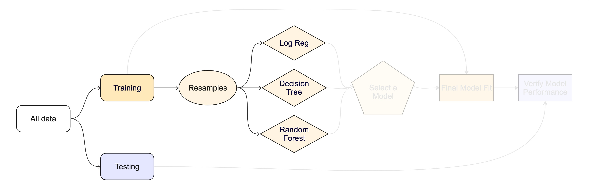
```

##  {background-iframe="https://rsample.tidymodels.org/reference/index.html"}

::: footer
:::

# Unit Example {background-image="img/oregon-forest.png" background-opacity=".5"}

Can we predict if a plot of land is forested?

 - Interested in classification models
 - We have a dataset of 7,107 6000-acre hexagons in Washington state
 - Each hexagon has a nominal outcome, `forested`, with levels `"Yes"` and `"No"`


## Data on forests in Washington

::: columns
::: {.column width="60%"}
-   The U.S. Forest Service maintains ML models to predict whether a plot of land is "forested."
-   This classification is important for all sorts of research, legislation, and land management purposes.
-  Plots are typically remeasured every 10 years and this dataset contains the most recent measurement per plot.
-   Type `?forested` to learn more about this dataset, including references.
:::

::: {.column width="40%"}

:::

:::

::: footer
Credit: <https://www.svgrepo.com/svg/251793/forest-mountain>
:::

## Data on forests in Washington

::: columns
::: {.column width="70%"}

```{r}
#| message: false
library(tidymodels)
library(forested)
dim(forested)
```
-   One observation from each of 7,107 6000-acre hexagons in Washington state.

-   A nominal outcome, `forested`, with levels `"Yes"` and `"No"`, measured **on-the-ground** (expensive, slow).

```{r}
table(forested$forested)
```

-   18 **remotely-sensed** and easily-accessible predictors (cheap, fast, wall-to-wall coverage).

-   The ML framing: *use cheap, abundant predictors to estimate an expensive ground-truth label* so the Forest Service can predict forest cover without sending a crew to every hexagon.
     
```{r}
names(forested)
```
:::

::: {.column width="30%"}
{.center}
:::
:::

::: footer
Credit: <https://www.svgrepo.com/svg/67614/forest>
:::

## Data splitting and spending

### The initial split `r hexes("rsample")`

```{r forested-split}
set.seed(123)
forested_split <- initial_split(forested, prop = .8, strata = tree_no_tree)
forested_split
```

## Accessing the data `r hexes("rsample")`

```{r forested-train-test}
forested_train <- training(forested_split)
forested_test  <- testing(forested_split)

nrow(forested_train)
nrow(forested_test)
```

## K-Fold Cross-Validation `r hexes("rsample")`

```{r}
# Load the dataset
set.seed(123)

# Create a 10-fold cross-validation object
(forested_folds <- vfold_cv(forested_train, v = 10))
```


## How do you fit a model in R?

-   `lm` for linear model <-- The one we have looked at!

-   `glmnet` for regularized regression

-   `keras` for regression using TensorFlow

-   `stan` for Bayesian regression using Stan

-   `spark` for large data sets using spark

-   `brulee` for regression using torch (PyTorch)


## Challenge

 - All of these models have different syntax and functions
 - How do you keep track of all of them?
 - How do you know which one to use?
 - How would you compare them?
 
Comparing 3-5 of these models is a lot of work using functions for diverse packages.

::: {.columns}
:::{.column width="40%"}
```{r}
#| echo: false
knitr::include_graphics(c('img/lm-help.png'))
``` 
:::
:::{.column width="50%"}
```{r}
#| echo: false
#| out.width: '70%'
knitr::include_graphics(c('img/glm-help.png'))
``` 
:::
:::

## The tidymodels advantage

::: columns
::: {.column width="60%"}
- In the `tidymodels` framework, all models are created using the same syntax:
  - This makes it easy to compare models
  - This makes it easy to switch between models
  - This makes it easy to use the same model with different engines (packages)
- The `parsnip` package provides a consistent interface to many models
- For example, to fit a linear model you would be able to access the `linear_reg()` function

:::
::: {.column width="40%"}

```{r}
#| eval: false
?linear_reg
```

```{r}
#| echo: false
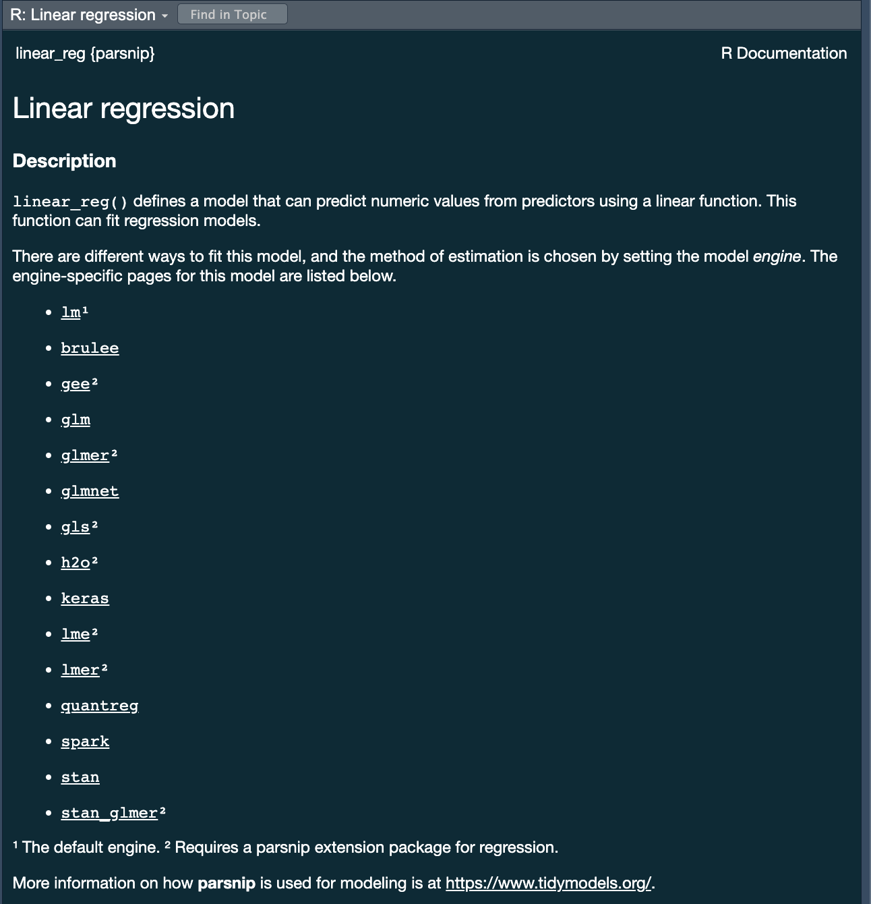
```
:::
:::

## A tidymodels prediction will ... `r hexes("tidymodels")`

-   always be inside a **tibble**
-   have column names and types that are **unsurprising** and **predictable**
-   ensure the number of rows in `new_data` and the output **are the same**

## To specify a model `r hexes("parsnip")`

. . .

::: columns
::: {.column width="60%"}
-   Choose a [model]{.underline}
-   Specify an engine
-   Set the mode
:::

::: {.column width="40%"}
<br><br><br>
{.absolute height="300"}
:::
:::

## Specify a model: Type `r hexes("parsnip")`

Next week we will discuss model types more thoroughly. For now, we will focus on two types:

1. Logistic Regression

```{r}
logistic_reg()
```

```{r}
decision_tree()
```

We chose these two because they are robust, simple models that fit our goal of predicting a binary condition/class (forested/not forested)

## Specify a model: engine `r hexes("parsnip")`

::: columns
::: {.column width="60%"}
-   Choose a model
-   Specify an [engine]{.underline}
-   Set the mode
:::
::: {.column width="40%"}
```{r logistic-reg}
#| eval: false
?logistic_reg()
```
```{r}
#| echo: false
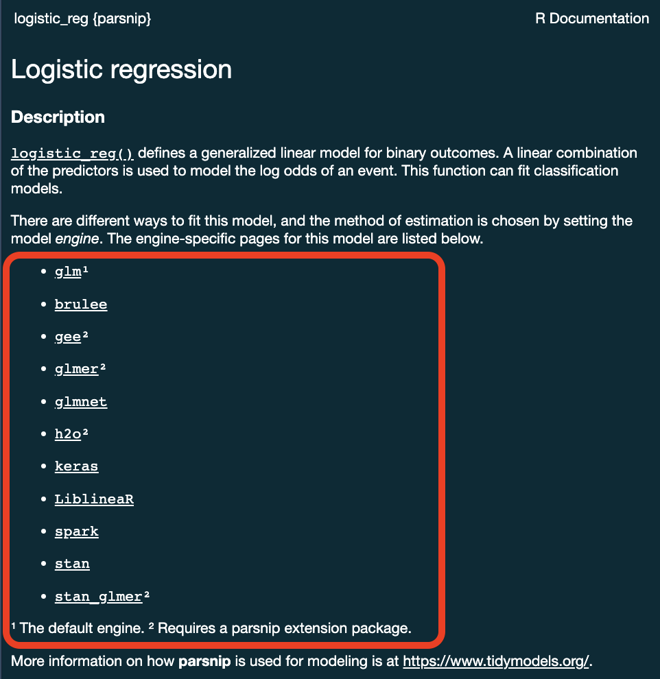
```
:::
:::

## Specify a model: engine `r hexes("parsnip")`

```{r logistic-reg-glmnet}
logistic_reg() %>%
  set_engine("glmnet")
```

. . . 

<br>

```{r logistic-reg-stan}
logistic_reg() %>%
  set_engine("stan")
```

## Specify a model: mode `r hexes("parsnip")`

::: columns
::: {.column width="60%"}
-   Choose a model
-   Specify an engine
-   Set the [mode]{.underline}
:::
::: {.column width="40%"}
```{r logistic-reg2}
#| eval: false
?logistic_reg()
```
```{r}
#| echo: false
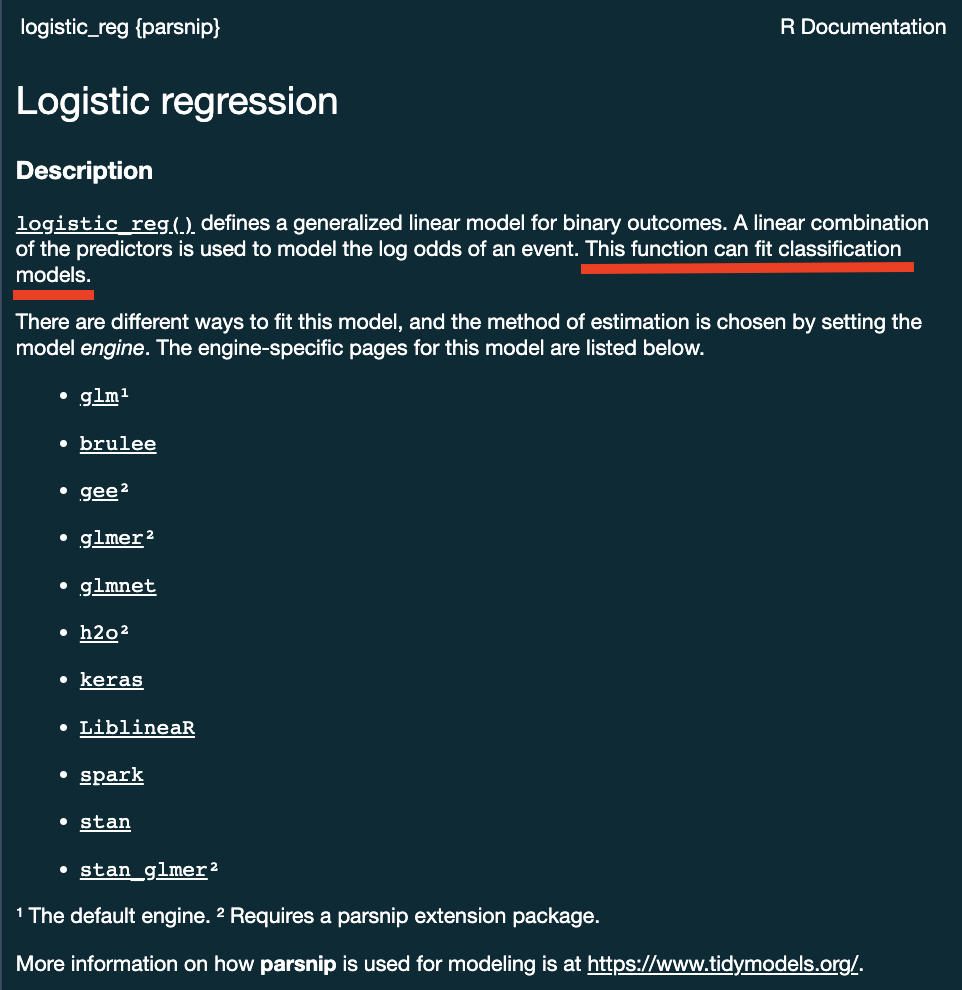
```
:::
:::

## Specify a model: mode `r hexes("parsnip")`

#### Some models have a limited set of modes ...
```{r decision-tree-classification}
logistic_reg()
```

. . .

#### Others require specification ...
```{r decision-tree-classification2}
decision_tree()

decision_tree() %>% 
  set_mode("classification")
```

::: r-fit-text
All available models are listed at <https://www.tidymodels.org/find/parsnip/> 
:::

##  {background-iframe="https://www.tidymodels.org/find/parsnip/"}

::: footer
:::

## To specify a model `r hexes("parsnip")`

::: columns
::: {.column width="60%"}
-   Choose a [model]{.underline}
-   Specify an [engine]{.underline}
-   Set the [mode]{.underline}
:::

::: {.column width="40%"}
<br><br><br>
{.absolute height="300"}
:::
:::

```{r sim-model-viz}
#| echo: false
set.seed(1)
# 500 samples, equation
dat <- sim_logistic(500, ~ .1 + 2 * A)
dat$bin <- cut(dat$A, breaks = c(seq(-3, 3, by = .5)), include.lowest = TRUE)
bin_midpoints <- data.frame(A = seq(-3, 3, by = .5) + 0.25)

rates <- 
  dat %>% 
  nest(.by = bin) %>% 
  mutate(
    probs = map(data, ~ binom.test(sum(.x$class == "one"), nrow(.x))),
    probs = map(probs, ~ tidy(.x))
  ) %>% 
  select(-data) %>% 
  unnest(cols = probs) %>% 
  arrange(bin) %>% 
  mutate(A = seq(-3, 3, by = .5) + 0.25) 

plot_rates <- left_join(rates, bin_midpoints, by = join_by(A)) %>% 
  filter(-2.5 < A, A < 3) %>% 
  ggplot() + 
  geom_point(aes(A, estimate)) +
  geom_errorbar(aes(A, estimate, ymin = conf.low, ymax = conf.high), width = .25)  +
  xlim(c(-3, 3.5)) +
  theme_bw(base_size = 18)
```

# Two algorithms to try {background-color="#C8C372"}

We have a problem (predict whether a hexagon is forested), data (`forested_train`), and a way to evaluate predictions. Before we wire up the full tidymodels plumbing, let's look at the two models we'll compare today.

## Logistic regression

::: columns
::: {.column width="50%"}
- Logistic regression predicts probability—instead of a straight line, it gives an S-shaped curve that estimates how likely an outcome (e.g., is forested) is based on a predictor (e.g., rainfall and temperature).

 - The dots in the plot show the actual proportion of "successes" (e.g., is forested) within different bins of the predictor variable(s) (A).

 - The vertical error bars represent uncertainty—showing a range where the true probability might fall.

- Logistic regression helps answer "how likely" questions—e.g., "How likely is someone to pass based on their study hours?" rather than just predicting a yes/no outcome.
:::

::: {.column width="50%"}
```{r plot-logistic-reg-2}
#| echo: false
#| fig.width: 8
#| fig.height: 7

logistic_preds <- logistic_reg() %>% 
  fit(class ~ A, data = dat) %>% 
  augment(new_data = bin_midpoints) 

plot_rates +
  geom_line(aes(A, .pred_one, col = I(test_color)), linewidth = 2, alpha = 0.8, data = logistic_preds)
```
:::
:::

## Decision trees — structure & pruning

::: columns
::: {.column width="50%"}
```{r tree-fit}
#| echo: false
#| fig.width: 8
#| fig.height: 7

tree_fit <- decision_tree(mode = "classification") %>%
  fit(class ~ A, data = mutate(dat, class = forcats::fct_rev(class)))

tree_preds <- augment(tree_fit, new_data = bin_midpoints)
```

```{r plot-tree-fit}
#| echo: false
#| fig.width: 4
#| fig.height: 3.5
#| fig-align: center

library(rpart.plot)
tree_fit %>%
  extract_fit_engine() %>%
  rpart.plot(roundint = FALSE)
```
:::

::: {.column width="50%"}
-   Series of splits or if/then statements based on predictors

-   First the tree *grows* until some condition is met (maximum depth, no more data)

-   Then the tree is *pruned* to reduce its complexity

-   Each terminal leaf predicts a class (or, for regression, a numeric value)
:::
:::

## Decision trees — what predictions look like

::: columns
::: {.column width="50%"}
```{r plot-tree-fit-3}
#| echo: false
#| fig.width: 4
#| fig.height: 3.5
#| fig-align: center

library(rpart.plot)
tree_fit %>%
  extract_fit_engine() %>%
  rpart.plot(roundint = FALSE)
```
:::

::: {.column width="50%"}
```{r plot-tree-preds}
#| echo: false
#| fig.width: 8
#| fig.height: 7

plot_rates +
  geom_step(aes(A, .pred_one, col = I(test_color)), linewidth = 2, alpha = 0.8, data = tree_preds)
```

A tree's decision boundary is **stepwise** — in contrast to the smooth S-curve of logistic regression.
:::
:::

## When would you reach for each?

::: columns
::: {.column width="50%"}
#### Logistic regression

- Smooth, monotonic decision boundary
- Returns calibrated **probabilities**, not just a class
- Coefficients are **interpretable** (log-odds per predictor)
- Sensitive to predictor scale → benefits from normalization
- Assumes a (largely) linear relationship on the log-odds scale
:::

::: {.column width="50%"}
#### Decision trees

- Step-wise, rectangular splits on predictors
- Handles **non-linearities** and **interactions** natively
- No need to scale, dummy-encode, or worry about collinearity
- Easy to explain visually, but a single tree can **overfit** and is unstable across samples
- Sets up ensemble methods (random forest, boosting) next week
:::
:::

## What algorithm is best for estimating forested plots?

We can only really know by testing them ... but we know the options! 


::: columns
::: {.column width="50%"}
#### Logistic regression
```{r plot-logistic-reg-3}
#| echo: false
#| fig.width: 7
#| fig.height: 6

plot_rates +
  geom_line(aes(A, .pred_one, col = I(test_color)), linewidth = 2, alpha = 0.8, data = logistic_preds)
```
:::

::: {.column width="50%"}
#### Decision trees
```{r plot-tree-preds-2}
#| echo: false
#| fig.width: 7
#| fig.height: 6

plot_rates +
  geom_step(aes(A, .pred_one, col = I(test_color)), linewidth = 2, alpha = 0.8, data = tree_preds)
```
:::
:::

# Feature engineering with `recipes` {background-color="#C8C372"}

## Why preprocess? `r hexes("recipes")`

- A raw formula (`forested ~ .`) would send features to the model untouched.

- But many models care how their features look — different scales, skewed distributions, missing values, or categorical levels can bias the fit.

- `recipes` lets us *declare* a preprocessing pipeline **once**, **estimate its parameters from the training data**, and apply it consistently to every new data set (folds, test set, future predictions).

:::{.callout-important}
Preprocessing parameters (means, sds, imputed values, PCA loadings) are learned **only on the training set** — this prevents *data leakage* from test data into the fit.
:::

## Data Normalization in `tidymodels`

- We've now seen *why* distributions matter and how to detect non-normality.
- In the `recipes` framework, normalization is declared once and applied consistently to every split — preventing **data leakage**.
- The same `step_*()` functions handle min-max scaling, z-score standardization, power transforms, and more.

## Common Normalization Techniques

| Technique | Idea | When to use | `step_*` |
|---|---|---|---|
| **Min-max** | rescale to $[0, 1]$: $x' = \frac{x - x_\text{min}}{x_\text{max} - x_\text{min}}$ | Need a bounded range; beware outliers | `step_range()` |
| **Z-score** | center + scale: $x' = \frac{x - \mu}{\sigma}$ | Symmetric-ish features, different units | `step_normalize()` |
| **Power** | Box-Cox (positive) or Yeo-Johnson (any sign) estimate an optimal power transform | Reshape skew toward normality before scaling | `step_YeoJohnson()`, `step_BoxCox()` |
| **Log** | $x' = \log(x)$ | Right-skewed positive data (e.g. streamflow) | `step_log()` |
| **PCA** | project to a lower-dimensional basis that preserves variance | Many correlated numeric predictors | `step_pca()` |

:::{.callout-tip}
For environmental variables (streamflow, precipitation, concentrations) **log** is by far the most common first move — they're almost always right-skewed.
:::

## Other Feature Engineering Tasks

Beyond scaling, three `recipes` moves you'll reach for most often in water resources:

#### Handling missing values

- `step_impute_mean()` / `step_impute_median()` — fast, parametric fill
- `step_impute_knn()` — use neighboring rows (preserves covariance structure)

#### Encoding categorical variables

- `step_dummy(all_nominal_predictors())` — one-hot encodes factors
- `step_other()` — collapses rare levels into "other"

#### Creating interaction terms

- `step_interact(terms = ~ aridity:p_mean)` — add variable products when the effect of one predictor depends on another

:::{.callout-note}
The full `step_*` catalog (text, splines, binning, dimension reduction, …) lives at <https://recipes.tidymodels.org/reference/>. Search there when you need something not listed here.
:::

## Implementing a recipe in `tidymodels`

1. Declare a `recipe()` with a formula + training data.

2. Add `step_*()` preprocessing operations (imputation, dummies, normalization, ...).

3. `prep()` estimates the transformation parameters from the training data.

4. `bake()` applies those transformations to any data set (training, test, new).

. . .

### Example Workflow

:::: {.columns}
::: {.column width="50%"}
```{r}
library(tidymodels)

(recipe_obj <- recipe(flipper_length_mm ~
                       bill_length_mm + body_mass_g +
                       sex + island + species,
                      data = penguins) |>
  step_impute_mean(all_numeric_predictors()) |>
  step_dummy(all_factor_predictors()) |>
  step_normalize(all_numeric_predictors()))

# Prepare and apply transformations
prep_recipe     <- prep(recipe_obj, training = penguins)

normalized_data <- bake(prep_recipe, new_data = NULL) |>
  mutate(species = penguins$species) |>
  drop_na()

head(normalized_data)
```

:::
::: {.column width="50%"}

#### Explanation:

- `recipe()` defines preprocessing steps for modeling.

- `step_impute_mean(all_numeric_predictors())` fills missing numeric values with the column mean (estimated on training data).

- `step_dummy(all_factor_predictors())` creates dummy variables for categorical predictors.

- `step_normalize(all_numeric_predictors())` standardizes all numerical predictors (mean 0, sd 1).

- `prep()` estimates parameters for transformations.

- `bake()` applies the transformations to the dataset.

:::
::::

## A recipe for our running example `r hexes("recipes")`

Back to `forested`. Before we fit any models, let's declare the preprocessing pipeline we want every model in this deck to use — impute missing numeric values, dummy-encode the nominal predictors, and normalize everything numeric:

```{r forested-recipe}
forested_recipe <- recipe(forested ~ ., data = forested_train) |>
  step_impute_mean(all_numeric_predictors()) |>
  step_dummy(all_nominal_predictors()) |>
  step_normalize(all_numeric_predictors())

forested_recipe
```

:::{.callout-note}
We'll reuse `forested_recipe` for every model we specify for the rest of today (decision tree, logistic regression, workflow set) — the point of a recipe is to define preprocessing **once** and reuse it everywhere. The same recipe carries forward into Wednesday's lecture (VIP + spatial CV) and next week's (more model families + tuning).
:::

## Fitting your model:

 - OK! So you have split data, a recipe, and a model spec (with engine + mode)
 - Now you need to fit the model!
 - Before we reach for `workflow()`, it's useful to see how a recipe + model compose manually: `prep()` the recipe on the training data, `bake()` it to get the transformed frame, then hand that frame to `fit()`.

```{r}
dt_model <- decision_tree() %>%
  set_engine('rpart') %>%
  set_mode("classification")

# Estimate preprocessing parameters (means, dummy levels, etc.) from training data
prepped     <- prep(forested_recipe, training = forested_train)

# Apply the pipeline
forested_baked <- bake(prepped, new_data = NULL)

# Fit the model against the fully preprocessed training data
# Note: `.` now picks up the dummy-encoded + normalized columns produced by the recipe
(output <- fit(dt_model, forested ~ ., data = forested_baked))
```

:::{.callout-tip}
This `prep → bake → fit` dance is what `workflow()` automates on the next slide. Seeing it once makes the workflow version less magical.
:::

## Component extracts:

::: columns
::: {.column width="50%"}
- While `tidymodels` provides a standard interface to all models all base models have specific methods (remember `summary.lm`? )

- To use these, you must extract the underlying object.

- `extract_fit_engine()` extracts the underlying model object
- `extract_fit_parsnip()` extracts the parsnip object
- `extract_recipe()` extracts the recipe object
- `extract_preprocessor()` extracts the preprocessor object
- ...  many more
:::
::: {.column width="50%"}
```{r}
ex <- extract_fit_engine(output)
class(ex) # the class of the engine used!

# Use rpart plot and text methods ...
plot(ex)
text(ex, cex = 0.9, use.n = TRUE, xpd = TRUE)
```
:::
:::

# A model workflow {background-color="#C8C372"}

## Workflows — a container for your pipeline `r hexes("workflows")`

The `workflows` package bundles a **preprocessor** (recipe or formula) and a **model spec** into a single object. Instead of managing `prep → bake → fit` by hand, you hand the workflow your training data and it does the bookkeeping on every resample.

**The four-step pattern:**

1. Create a workflow (`workflow()` — like `ggplot()` instantiates a canvas)
2. Add a preprocessor (`add_recipe()` or `add_formula()`)
3. Add a model (`add_model()`)
4. Fit it (`fit()` or `fit_resamples()`)

. . .

**Why bother?**

✅ Preprocessing and modeling travel together — no forgetting to bake the test set
✅ Same skeleton for every model — swap in a new `add_model()` spec and go
✅ Works identically with a single `fit()`, resamples, or tuning

## A model workflow `r hexes("parsnip", "workflows")`

Instead of `prep`/`bake`/`fit` by hand, drop the recipe and the model into a `workflow()` and let it do the bookkeeping:

```{r tree-wflow}
dt_wf <- workflow() %>%
  add_recipe(forested_recipe) %>%
  add_model(dt_model) %>%
  fit(data = forested_train)
```

<br>

```{r}
#| echo: false
dt_wf
```

. . .

:::{.callout-tip}
`add_recipe()` means the workflow carries your feature engineering pipeline *and* the model together — `fit()` automatically `prep()`/`bake()`s for every resample. (You *can* use `add_formula()` instead if you don't need any preprocessing, but once you have a recipe there's no reason to.)
:::

## Predict with your model `r hexes("workflows", "broom")`

_How do you apply your fitted workflow to the test set?_

  * `augment()` on a workflow accepts `new_data =` and returns the test data with predictions appended.

```{r dt-predict}
dt_preds <- augment(dt_wf, new_data = forested_test)
```

<br>

```{r}
#| echo: false
dt_preds
```

## Evaluate your model `r hexes("yardstick")`

_How do you evaluate the skill of your models?_

We will learn more about model evaluation and tuning later in this unit, but for now we can blindly use the `metrics()` function defaults to get a sense of how our model is doing.

  - The default metrics for _classification_ models are **accuracy** and **kap** (Cohen's Kappa)

  - The default metrics for _regression_ models are **rmse**, **rsq** (R²), and **mae**

```{r}
# We have a classification model
metrics(dt_preds, truth = forested, estimate = .pred_class)
```

# `tidymodels` advantage! `r hexes("tidymodels")`

- OK! while that was not too much work, it certainly wasn't minimal.

. . .

- Now let's say you want to check if the logistic regression model performs better than the decision tree.
- That sounds like a lot to repeat.

- Fortunately, the `tidymodels` framework makes this a straightforward swap!

. . . 

```{r}
log_mod = logistic_reg() %>% 
  set_engine("glm") %>% 
  set_mode("classification")

log_wf <- workflow() %>%
  add_recipe(forested_recipe) %>%
  add_model(log_mod) %>%
  fit(data = forested_train)

log_preds <- augment(log_wf, new_data = forested_test)

metrics(log_preds, truth = forested, estimate = .pred_class)
```

:::{.callout-note}
Note how little changed: same recipe, same workflow skeleton — only the model spec is different. That swap is the whole point of `tidymodels`.
:::

## So who wins?

```{r}
metrics(dt_preds, truth = forested, estimate = .pred_class)
metrics(log_preds, truth = forested, estimate = .pred_class)
```
Right out of the gate, there doesn't seem to be much difference, but ...

## Don't get too confident — use resamples

 - We have a single point-estimate of performance — one train/test split produces **one number** that can be misleadingly high or low depending on which rows ended up in the test set.
 - Resampling repeatedly holds out different subsets, fits the model each time, and **averages** the metric — giving a more stable and trustworthy estimate of skill.
 - Instead, we can use our `resamples` to better understand the skill of a model based on the iterative leave-out policy:
 
```{r}
dt_wf_rs <- workflow() %>%
  add_recipe(forested_recipe) %>%
  add_model(dt_model) %>%
  fit_resamples(resamples = forested_folds,
                # Here we just ask tidymodels to save all predictions...
                control   = control_resamples(save_pred = TRUE))
```

<br>

```{r}
#| echo: false
dt_wf_rs[1,]
```

:::{.callout-note}
`tidyr::unnest` could be used to expand any of those list columns!
:::

## Don't get too confident — same pattern, other model

- We can execute the same workflow for the logistic regression model, this time evaluating the resamples instead of the test data.

```{r}
log_wf_rs <- workflow() %>%
  add_recipe(forested_recipe) %>%
  add_model(log_mod) %>%
  fit_resamples(resamples = forested_folds,
                control = control_resamples(save_pred = TRUE))
```

<br>

```{r}
#| echo: false
log_wf_rs
```

## Don't get too confident — collect the metrics

- Since we now have an "ensemble" of models (across the folds), we can collect a summary of the metrics across them.

- The default metrics for classification ensembles are: 

  - **accuracy**: accuracy is the proportion of correct predictions
  - **brier_class**: the Brier score for classification is the mean squared difference between the predicted probability and the actual outcome
  - **roc_auc**: the area under the ROC (Receiver Operating Characteristic) curve

```{r}

collect_metrics(log_wf_rs)
collect_metrics(dt_wf_rs)
```

## Further simplification: `workflowsets`

OK, so we have streamlined a lot of things with `tidymodels`:

  - We have a specified preprocessor (e.g. formula or recipe)

  - We have defined a model (complete with engine and mode)

  - We have implemented workflows pairing each model with the preprocessor to either fit the model to the resamples, or, the training data.

While a significant improvement, we can do better!

:::{.callout-note}
Does the idea of implementing a process over a list of elements ring a bell?
:::

## Model mappings: `r hexes("workflows")`

 - `workflowsets` is a package that builds off of `purrr` and allows you to iterate over multiple models and/or multiple resamples

- Remember how `map`, `map_*`,  `map2`, and `walk2` functions allow lists to map to lists or vectors? `workflow_set` maps a preprocessor (formula or recipe) to a set of models - each provided as a `list` object.

- To start, we will create a `workflow_set` object (instead of a `workflow`). The first argument is a list of preprocessor objects (formulas or recipes) and the second argument is a list of model objects.

- Both must be lists, by nature of the underlying `purrr` code. 

```{r}
(wf_obj <- workflow_set(list(forested_recipe), list(log_mod, dt_model)))
```

## Iterative execution

- Once the `workflow_set` object is created, the `workflow_map` function can be used to map a function across the preprocessor/model combinations.

- Here we are mapping the `fit_resamples` function across the `workflow_set` combinations using the `resamples` argument to specify the resamples we want to use (`forested_folds`).

```{r}
wf_obj <-
  workflow_set(list(forested_recipe), list(log_mod, dt_model)) %>%
  workflow_map("fit_resamples", resamples = forested_folds)
```
<br>

```{r}
#| echo: false
wf_obj
```

## Rapid comparison

With that single function, all models have been fit to the resamples and we can quickly compare the results both graphically and statistically: 

::: columns
::: {.column width="50%"}
```{r}
# Quick plot function
autoplot(wf_obj) + 
  theme_linedraw()
```
:::
::: {.column width="50%"}
```{r}
# Long list of results, ranked by accuracy
rank_results(wf_obj, 
            rank_metric = "accuracy", 
            select_best = TRUE)
```
:::
:::

. . . 

Overall, the logistic regression model appears to be the best model for this data set!

. . .

:::{.callout-note}
Keep in mind: we compared these models **out of the box**, with no feature engineering, no hyperparameter tuning, and a single resampling scheme. Next week we'll revisit this comparison once we can actually *tune* a model 👀
:::

## The whole game - status update

```{r diagram-model-1, echo = FALSE}
#| fig-align: "center"

knitr::include_graphics("img/whole-game-transparent-select.jpg")
```

On **Wednesday** we'll ask two things `collect_metrics()` can't answer: *which predictors did the model actually use* (VIP) and *is our 0.9-ish score honest* (spatial cross-validation on autocorrelated data). **Next week** we'll meet a bigger zoo of model families and learn to tune them.


