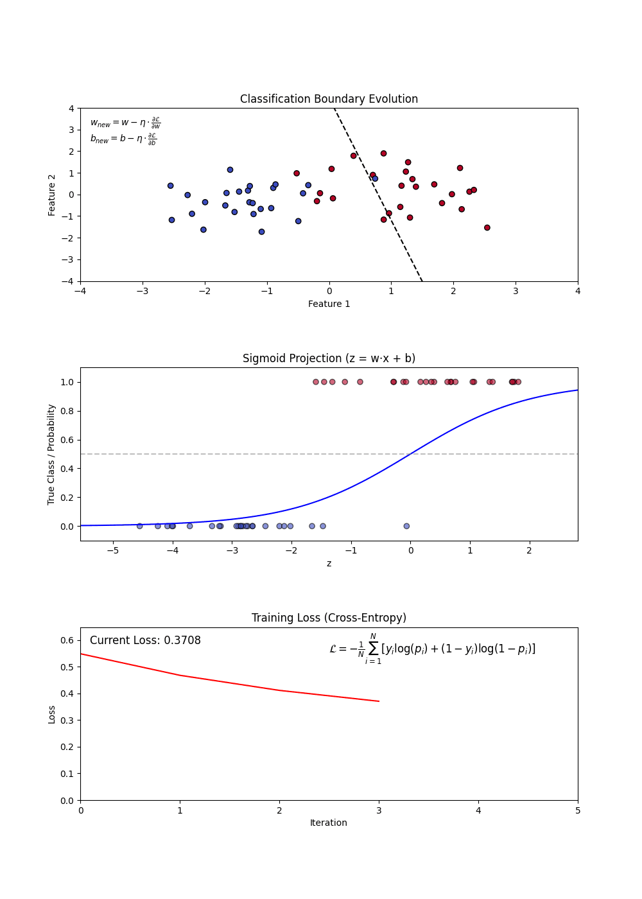
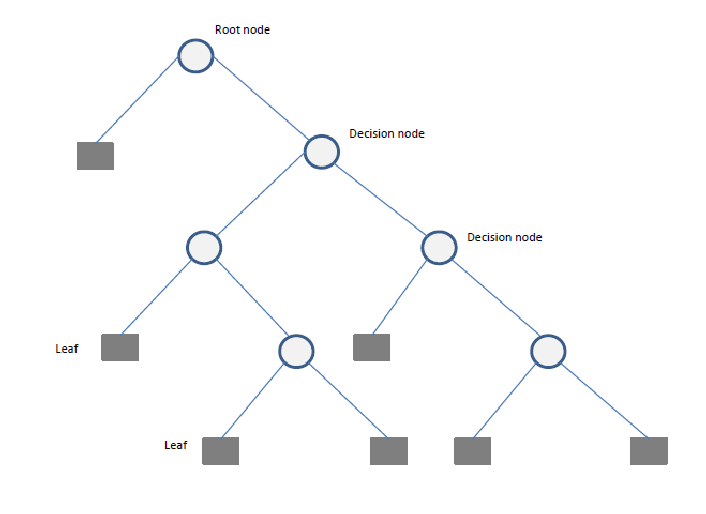
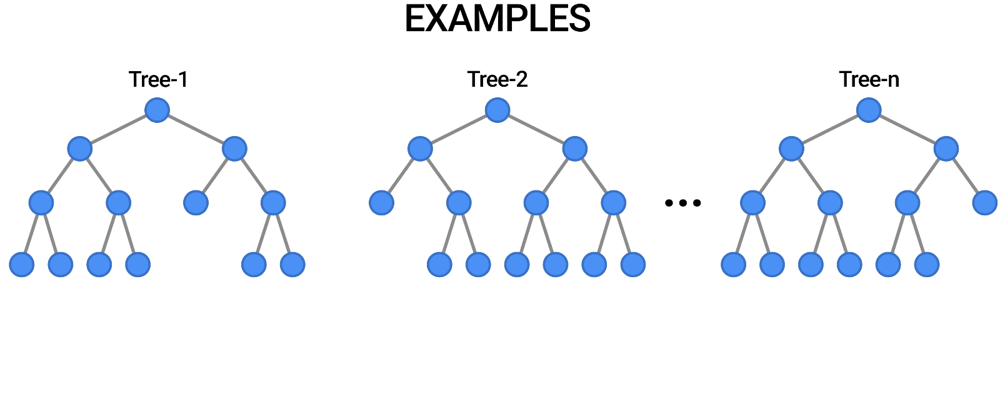
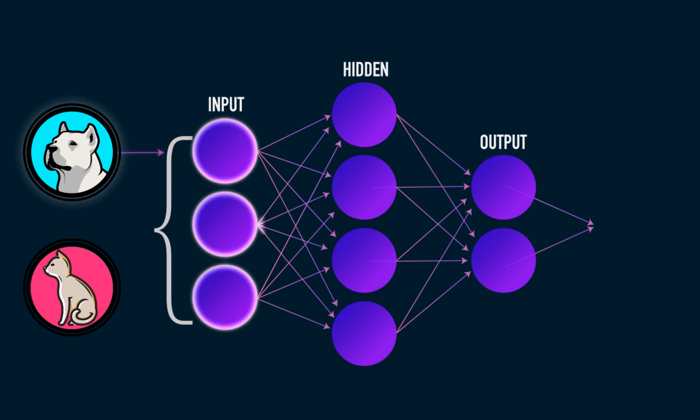
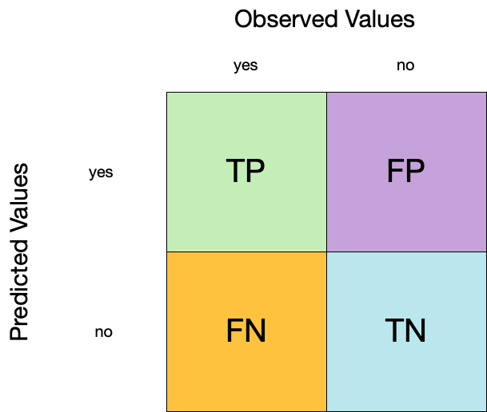
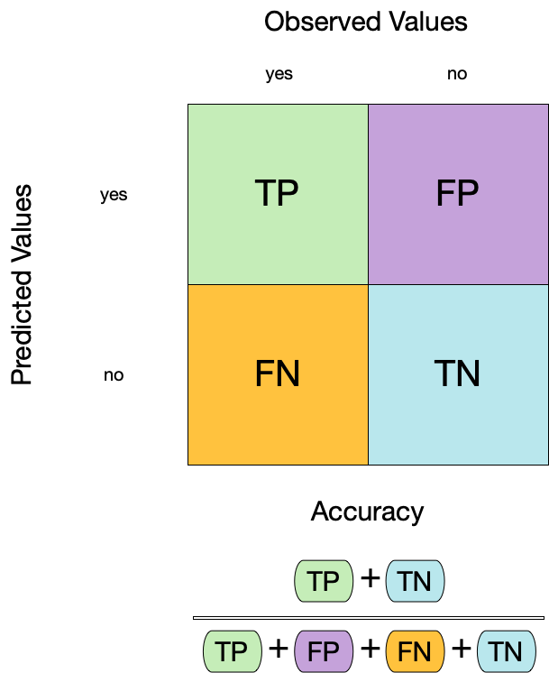
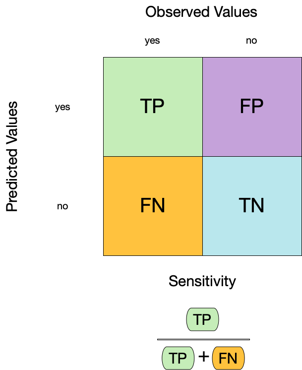
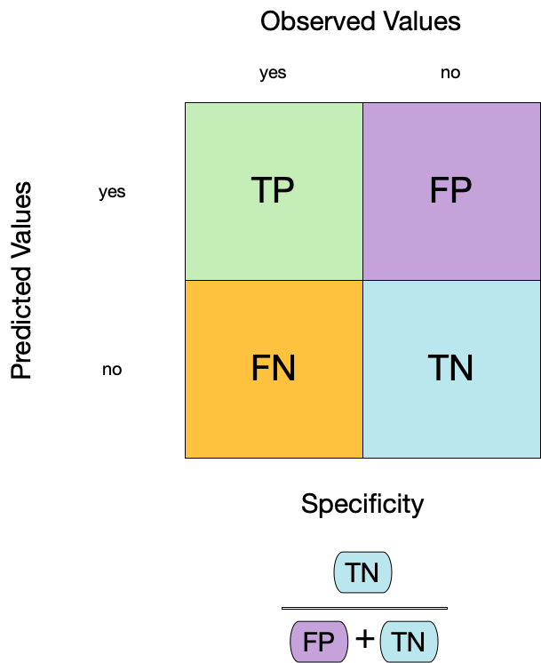
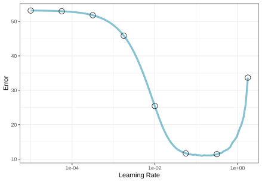
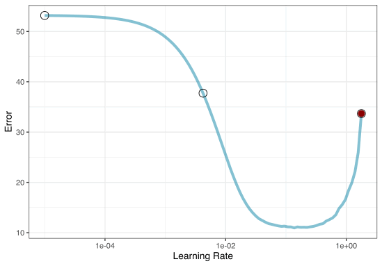

```{r setup}
#| echo: false
hexes <- function(..., size = 64) {
  x <- c(...)
  x <- sort(unique(x), decreasing = TRUE)
  right <- (seq_along(x) - 1) * size

  res <- glue::glue(
    '{.absolute top=-20 right=<right> width="<size>" height="<size * 1.16>"}',
    .open = "<", .close = ">"
  )

  paste0(res, collapse = " ")
}

train_color <- '#1E4D2B'
test_color  <- '#C8C372'
data_color  <- "#767381"
assess_color <- "#84cae1"
splits_pal <- c(data_color, train_color, test_color)
```

## Introduction `r hexes("tidymodels")`

Machine learning (ML) is widely used in environmental science for tasks such as land cover classification, climate modeling, and species distribution prediction. This lecture explores five common ML model families available through the `tidymodels` framework in R, applied to the `forested` dataset we met last week.

  1. Linear Regression

  2. Logistic Regression

  3. Trees
     - Decision Tree
     - Random Forest
     - Boosted Trees

  4. Support Vector Machines

  5. Neural Networks

## By the end of today you will be able to...

- Distinguish **classification** from **regression** modes and pick the right one for an environmental question
- Specify six major model families with `parsnip` (linear, logistic, tree, random forest, boosted trees, SVM, neural network)
- Read and interpret classification metrics from a **confusion matrix**: accuracy, sensitivity, specificity, ROC AUC, Brier score
- Compare models *systematically* using `workflow_set()` over cross-validation folds

. . .

Running example: continuing the `forested` dataset from last week — can we predict whether a 6,000-acre hexagon in Washington is forested?

## Classification vs. Regression

In `tidymodels`, a model's **mode** tells the engine what kind of outcome it's predicting:

  **Classification** → Predict a *categorical* outcome (discrete classes).

  **Regression** → Predict a *numeric* outcome (a continuous value).

Many of the same model families (trees, SVMs, neural networks, ...) can do either — you pick the mode with `set_mode()`.
  
<br> 
```{r}
#| echo: false
#| fig.align: 'center'
knitr::include_graphics('img/ml_illustration.jpg')
```

## Classification Models

:::{.callout-note appearance="simple"}
Goal: Categorize phenomena into discrete classes.
:::

#### Examples:

  ✅ Land Cover Classification (Forest, Urban, Water, Agriculture)\
  ✅ Flood Risk Assessment (High, Medium, Low)\
  ✅ Drought Severity Levels (No Drought, Moderate, Severe)\
  ✅ Wildfire Prediction (Fire vs. No Fire)\
  ✅ Species Identification (Bird species, Plant types)

#### Common Algorithms:
  - Decision Trees \
  - Random Forest \
  - Support Vector Machines (SVM)\ 
  - Neural Networks (for remote sensing & image analysis)\
  - K-Nearest Neighbors (KNN)\

## Regression Models

:::{.callout-note appearance="simple"}
Goal: Estimate continuous environmental variables.
:::

#### Examples:

  📈 Streamflow Forecasting (Predict river discharge over time)\
  🌡️ Temperature Projections (Future temperature changes under climate scenarios)\
  ☔ Precipitation Forecasting (Rainfall estimates for flood preparedness)\
  📊 Air Quality Index Prediction (Forecast pollution levels)\

#### Common Algorithms:
  - Linear & Multiple Regression\
  - Random Forest Regression\
  - Long Short-Term Memory (LSTM) Neural Networks (for time series forecasting)\
  
## Choosing the Right Model

- Use [classification]{.underline} if: You need to categorize environmental states (e.g., classifying land use changes).

- Use [regression]{.underline} if: You need to estimate a continuous environmental value (e.g., predicting flood levels).

- Use [hybrid approaches]{.underline} if: You need to classify and estimate (e.g., classifying drought severity *and* predicting future water availability).

## Model Selection Considerations

Choosing an ML algorithm (model) depends on:

  - **Dataset Size**: e.g. Large datasets benefit from ensemble methods like Random Forest and XGBoost.

  - **Feature Complexity**: e.g. SVM works well for high-dimensional data.

  - **Interpretability Needs**: e.g. Decision trees and LASSO regression provide intuitive insights.

  - **Computation Constraints**: e.g. GLM and Decision Trees are efficient compared to XGBoost.
  
  - **Data**: Variance, linearity, dimensionality


## Load Required Libraries `r hexes("tidymodels", "tidyverse", "forested")`

```{r} 
library(tidyverse)
library(tidymodels)
library(forested)
library(flextable)
```

## Data Preparation `r hexes("rsample", "forested")`

We will use the `forested` dataset for classification. Each row is a 6,000-acre hexagon in Washington state with an on-the-ground `forested` label (`"Yes"`/`"No"`) and 18 remotely-sensed predictors (elevation, climate summaries, vegetation indices, etc.).

```{r}       
set.seed(123)
forested_split <- initial_split(forested, strata = tree_no_tree)
forested_train <- training(forested_split)
forested_test  <- testing(forested_split)
forested_folds <- vfold_cv(forested_train, v = 10)

# Feature Engineering: Classification
forested_recipe <- recipe(forested ~ ., data = forested_train) |>
  step_impute_mean(all_numeric_predictors()) |>
  step_dummy(all_nominal_predictors()) |>
  step_normalize(all_numeric_predictors())
```

# Machine Learning Specifications in `tidymodels` 

## Unified Interface for ML Models `r hexes("parsnip")`

- The `parsnip` package is a part of the `tidymodels` framework
- It provides a consistent interface for specifying models through specifications
- The combination of a specification, mode, and engine is called a model
- Let's look at the parsnip [documentation](https://www.tidymodels.org/find/parsnip/)!

## Metric vocabulary — what `collect_metrics()` will show us `r hexes("yardstick")`

Every example below ends with a `collect_metrics()` call. For **classification** models the default output is three metrics you should know before reading them:

| Metric | What it measures | Range | Good value |
|---|---|---|---|
| **accuracy** | Fraction of predictions that match the truth | 0–1 | higher |
| **roc_auc** | Probability the model ranks a true positive above a true negative at *any* threshold (separation) | 0–1 | higher (>0.8 good) |
| **brier_class** | Mean squared error between predicted probability and outcome (calibration) | 0–1 | lower (<0.25 acceptable) |

. . .

We'll unpack each — plus **sensitivity**, **specificity**, and the **confusion matrix** — after the model zoo.

:::{.callout-note}
Regression models default to `rmse`, `rsq`, `mae` instead — covered in the Regression Metrics section.
:::

## What are hyperparameters?

- Hyperparameters are settings that control the learning process of a model.
- They are set before training and affect the model's performance.
- Hyperparameters can be tuned to optimize the model's predictive power.
- More on model tuning next week!

## Today's model zoo, at a glance

| `parsnip` function | Family | Typical strength | Typical weakness | Key hyperparameters |
|---|---|---|---|---|
| `linear_reg()` | Linear | Fast, interpretable | Assumes linearity | `penalty`, `mixture` |
| `logistic_reg()` | GLM (classification) | Probabilities + interpretable coefs | Linear decision boundary | `penalty`, `mixture` |
| `decision_tree()` | Tree | Visual, handles non-linearity | Overfits, unstable | `tree_depth`, `min_n`, `cost_complexity` |
| `rand_forest()` | Tree ensemble (bagging) | Robust, little tuning needed | Slower, less interpretable | `trees`, `mtry`, `min_n` |
| `boost_tree()` | Tree ensemble (boosting) | Often top accuracy on tabular data | Tuning-sensitive, risk of overfit | `trees`, `learn_rate`, `min_n`, `mtry` |
| `svm_poly()` / `svm_rbf()` | Margin-based | High-dim, small-N friendly | Slow at scale, needs scaling | `cost`, `degree`, `rbf_sigma` |
| `mlp()` | Neural network | Learns complex non-linearities | Data-hungry, opaque | `hidden_units`, `penalty`, `epochs` |

. . .

We'll walk through each family below — keep this table handy; we won't re-derive each row.

# Linear Regression

Linear regression is a fundamental statistical method used for modeling the relationship between a dependent variable and one or more independent variables. It is widely used in environmental science for tasks such as predicting species distribution, estimating climate variables, and modeling ecosystem dynamics.

## Components of Linear Regression

- **Dependent Variable (Y)**: The variable to be predicted.
- **Independent Variables (X)**: Features that influence the dependent variable.
- **Regression Line**: Represents the relationship between X and Y.
- **Residuals**: Differences between predicted and actual values.

```{r}
#| echo: false
knitr::include_graphics('img/lm-gif.gif')
```

## Linear Regression in `tidymodels`

#### Specification

```{r}
linear_reg()
```

#### engines & modes `r hexes("parsnip")`

```{r}
show_engines("linear_reg") |> 
  mutate(specification = "linear_reg") |> 
  flextable()
```

## Example `r hexes("parsnip", "workflows", "yardstick")`

:::{.callout-warning}
This example predicts `elevation` from the other columns — it's a **syntactic demo** of `parsnip`'s regression mode, not a meaningful scientific model. In a real regression problem you'd pick an outcome that represents what you actually want to estimate.
:::

```{r}
lm_mod <- linear_reg(mode = "regression", engine = "lm")

workflow() |>
  add_formula(elevation ~ .) |>
  add_model(lm_mod) |>
  fit_resamples(resamples = forested_folds) |>
  collect_metrics()
```

# Logistic Regression

Logistic Regression is used for _binary_ classification tasks. It models the probability that an observation belongs to a category using the logistic (sigmoid) function. Unlike linear regression, which predicts continuous values, logistic regression predicts probabilities and applies a decision threshold to classify outcomes.

## Components of Logistic Regression

::: columns
::: {.column width="50%"}

  - **Sigmoid Function**: Converts linear outputs into probabilities between 0 and 1.
  - **Decision Boundary**: A threshold (often 0.5) determines classification.
  - **Log-Loss (Binary Cross-Entropy)**: Measures the error between predicted probabilities and actual labels.
  - **Regularization (L1 and L2)**: Helps in feature selection and prevents overfitting.
  
:::
::: {.column width="50%"}
```{r}
#| echo: false
#| out.width: "75%"

```
:::
:::

## Variants of Logistic Regression

 - **Binary Logistic Regression**: Used when the target variable has two classes (e.g., forested vs. not).

 - **Multinomial Logistic Regression**: Extends logistic regression to multiple classes without assuming ordering.

 - **Ordinal Logistic Regression**: Handles multi-class classification where order matters (e.g., rating scales).

## Building a Logistic Regression Model

#### Constructing a Logistic Regression Model involves:

 1. Defining feature (X) and target variable (y).
 2. Applying the sigmoid function to map predictions to probabilities.
 3. Using a loss function (log-loss) to optimize model weights.
 4. Updating weights iteratively via gradient descent.

#### Hyperparameters in Logistic Regression

 - **penalty**: Type of regularization (L1, L2, or none).
 - **mixture**: A number between zero and one giving the proportion of L1 regularization (i.e. lasso) in the model

##  Logistic Regression in `tidymodels`

#### Specification

```{r}
logistic_reg()
```

#### engines & modes `r hexes("parsnip")`

```{r}
show_engines('logistic_reg') |> 
  mutate(specification = "logistic_reg") |> 
  flextable()
```

## Example `r hexes("parsnip", "workflows", "yardstick")`

```{r}
log_model <- logistic_reg(penalty = .01) |> 
  set_engine("glmnet") |> 
  set_mode('classification')

workflow() |>
  add_recipe(forested_recipe) |>
  add_model(log_model) |> 
  fit_resamples(resamples = forested_folds) |>
  collect_metrics()
```

# Decision Tree

A Decision Tree is a flowchart-like structure used for decision-making and predictive modeling. It consists of nodes representing decisions, branches indicating possible outcomes, and leaf nodes that represent final classifications or numerical outputs. Decision Trees are widely used in both classification and regression tasks.

## Components of a Decision Tree

::: columns
::: {.column width="50%"}
- **Root Node**: The starting point representing the entire dataset.
- **Decision Nodes**: Intermediate nodes where a dataset is _split_ based on a feature.
- **Splitting**: The process of dividing a node into sub-nodes based on a feature value.
- **Pruning**: The process of removing unnecessary branches to avoid overfitting.
- **Leaf Nodes**: The terminal nodes that provide the final output (class label or numerical prediction).

:::
::: {.column width="50%"}
```{r}
#| echo: false
#| out.width: "100%"

```

:::
:::

##  Building a Decision Tree

#### Constructing a Decision Tree involves:

  1. Selecting the best feature(s) to split the data.
  2. Splitting the data into subsets.
  3. Repeating this process recursively until stopping criteria (e.g., depth, minimum samples per leaf) are met.
  4. Pruning the tree if necessary to reduce overfitting.

#### Splitting Criteria
  Several criteria can be used to determine the best split:\
  - **Gini Impurity**: Measures the impurity of a node, used in Classification and Regression Trees (CART).\
  - **Entropy (Information Gain)**: Measures the randomness in a dataset.\
  - **Mean Squared Error (MSE)**: Used for regression trees to minimize variance within nodes.\
  
#### Hyperparameters in Decision Trees
  Key hyperparameters include:\
  - `cost_complexity`: complexity parameter for pruning\
  - `tree_depth`: maximum depth of the tree\
  - `min_n`: minimum number of observations in a node\
   
## Decision Tree using tidymodels

#### Specification

```{r}
decision_tree()
```

#### engines & modes `r hexes("parsnip")`

```{r}
show_engines('decision_tree') |> 
  mutate(specification = "decision_tree") |> 
  flextable()
```

## Example `r hexes("parsnip", "workflows", "yardstick")`

```{r}
dt_model <- decision_tree(tree_depth = 10, min_n = 3) |>
  set_engine("rpart") |>
  set_mode('classification')

workflow() |>
  add_recipe(forested_recipe) |>
  add_model(dt_model) |>
  fit_resamples(resamples = forested_folds) |>
  collect_metrics()
```

:::{.callout-tip}
Notice the pattern: *recipe → model → fit_resamples → collect_metrics*. It's going to repeat for every model below. We'll generalize this repetition with `workflow_set()` at the end so you don't write the same four lines six times.
:::

# Random Forest

Random Forests provide an ensemble learning method that constructs _multiple decision trees_ and aggregates their predictions to improve accuracy and reduce overfitting. It is used for both classification and regression tasks.

## Components of a Random Forest

- **Multiple Decision Trees**: The fundamental building blocks.
- **Bootstrap Sampling**: Randomly selects subsets of data to train each tree.
- **Feature Subsetting**: Uses a random subset of features at each split to improve diversity among trees.
- **Aggregation (Bagging)**: Combines the outputs of individual trees through voting (classification) or averaging (regression).

```{r}
#| echo: false

```

## Building a Random Forest

### Constructing a Random Forest involves:
1. Creating multiple bootstrap samples from the dataset.
2. Training a decision tree on each bootstrap sample using a random subset of features.
3. Aggregating predictions from all trees to produce the final output.

### Hyperparameters in Random Forest
- **Number of Trees (`ntree`)**: Determines how many trees are included in the forest.
- **Maximum Depth (`max_depth`)**: Limits the depth of individual trees to prevent overfitting.
- **Minimum Samples per Leaf (`min_n`)**: Specifies the minimum number of observations required in a leaf node.
- **Number of Features (`mtry`)**: Controls how many features are randomly selected at each split.

## Random Forest Implementation using Tidymodels

#### Specification

```{r}
rand_forest()
```

#### engines & modes `r hexes("parsnip")`

```{r}
show_engines('rand_forest') |> 
  mutate(specification = "rand_forest") |> 
  flextable()
```

## Example `r hexes("parsnip", "workflows", "yardstick")`

```{r}
# Define a Random Forest model
rf_model <- rand_forest(trees = 10) |>
  set_engine("ranger", importance = "impurity") |>
  set_mode("classification")

workflow() |>
  add_recipe(forested_recipe) |>
  add_model(rf_model) |> 
  fit_resamples(resamples = forested_folds) |>
  collect_metrics()
```

# Boosting Machines 

Boosting is an ensemble learning technique that builds multiple weak models (often decision trees) sequentially, with each model correcting the errors of its predecessor. This iterative process improves predictive accuracy and reduces bias, making boosting one of the most powerful machine learning methods. Popular implementations include Gradient Boosting Machines (GBM), XGBoost (Extreme Gradient Boosting), LightGBM, and CatBoost.

## Components of Gradient Boosting
- **Weak Learners**: Typically small decision trees (stumps).
- **Gradient Descent Optimization**: Each tree corrects the residual errors of the previous trees.
- **Learning Rate (`eta`)**: Controls the contribution of each tree to the final prediction.
- **Regularization (`lambda` and `alpha`)**: Penalizes complex trees to prevent overfitting.

## Popular Boosting Algorithms

- Gradient Boosting Machines (GBM): A general boosting method that minimizes loss using gradient descent.

- XGBoost (Extreme Gradient Boosting): An optimized version of GBM that is computationally efficient and includes regularization.

- LightGBM: Designed for efficiency on large datasets by using histogram-based learning and reducing memory usage.

- CatBoost: Specialized for categorical data, using ordered boosting and permutation techniques to reduce bias.

## Building an XGBoost Model
#### The process involves:
1. Initializing predictions with a simple model (e.g., the mean for regression).
2. Computing the residual errors.
3. Training a new tree to predict these residuals.
4. Updating the predictions by adding a fraction of the new tree’s output.
5. Repeating until a stopping criterion is met (e.g., a maximum number of trees or performance threshold).

#### Hyperparameters in XGBoost
- **`nrounds` (Number of Trees)**: The number of boosting iterations.
- **`max_depth`**: The maximum depth of trees.
- **`eta` (Learning Rate)**: Controls how much each tree contributes to the model.
- **`gamma`**: Minimum loss reduction required to split a node.
- **`colsample_bytree`**: Fraction of features to consider for each tree.

## Boost Implementation using Tidymodels

```{r}
# Define an XGBoost model
b_model <- boost_tree() |>
  set_engine("xgboost") |>
  set_mode("classification")

workflow() |>
  add_recipe(forested_recipe) |>
  add_model(b_model) |> 
  fit_resamples(resamples = forested_folds) |>
  collect_metrics()
```

# Support Vector Machine (SVM)

Support Vector Machines (SVM) is a supervised learning algorithm used for classification and regression tasks. It works by finding the optimal hyperplane that best separates data points into different classes.

## Components of SVM
- **Support Vectors**: Data points that define the hyperplane.\
- **Margin**: The distance between the hyperplane and the nearest support vectors.\
- **Kernel Functions**: Transform data to a higher dimension to make it separable.\

## Building an SVM Model

#### The process involves:
1. Selecting an appropriate kernel function (linear, polynomial, radial basis function, etc.).\
2. Finding the hyperplane that best separates the data.\
3. Maximizing the margin between the hyperplane and the closest points.\
4. Using a regularization parameter (`C`) to control trade-offs between a wider margin and misclassifications.\

####  Hyperparameters in SVM
Key hyperparameters include:\
- **`C` (Regularization Parameter)**: Controls the trade-off between maximizing margin and minimizing classification error.\
- **`kernel`**: Determines the transformation of input space (e.g., linear, radial basis function (RBF), polynomial).\
- **`gamma`**: Controls the influence of individual training samples on the decision boundary (RBF/polynomial kernels).

## SVM Implementation using Tidymodels

```{r}
# Define an SVM model
svm_model <- svm_poly() |>
  set_engine("kernlab") |>
  set_mode("classification")

workflow() |>
  add_recipe(forested_recipe) |>
  add_model(svm_model) |> 
  fit_resamples(resamples = forested_folds) |>
  collect_metrics()
```
# Neural Networks

A Neural Network is a computational model inspired by the structure of the human brain. It consists of layers of interconnected neurons that transform input data to learn patterns and make predictions. Neural Networks are widely used for tasks such as image recognition, natural language processing, and time series forecasting.

## Components of a Neural Network

::: columns
::: {.column width="50%"}
 - Neurons: The fundamental units that receive, process, and transmit information.

 - Input Layer: The initial layer that receives raw data.

 - Hidden Layers: Intermediate layers where computations occur to learn features.

 - Output Layer: Produces the final prediction or classification.

 - Weights & Biases: Parameters that are optimized during training.

 - Activation Functions: Functions like ReLU, Sigmoid, and Softmax that introduce non-linearity.
 
:::
::: {.column width="50%"}

```{r}
#| echo: false

```
:::
:::

## Training a Neural Network
#### The training process involves:
  - Forward Propagation: Inputs pass through the network, producing an output.
  - Loss Calculation: The difference between predicted and actual values is measured.
  - Backpropagation: Errors are propagated backward to update weights.
  - Optimization: Gradient descent (or its variants) adjusts weights to minimize loss.
  - Iteration: The process repeats over multiple epochs until convergence.

#### Hyperparameters in Neural Networks
- hidden_units: Number of neurons in hidden layers.
- penalty: Regularization term to prevent overfitting.
- dropout: Fraction of neurons randomly dropped during training.
- epochs: Number of training iterations.
- activation: Activation function for neurons (e.g., ReLU, Sigmoid).
- learn_rate: Step size for weight updates.

## Variants of Neural Networks

`mlp()` → Generic MLP model (uses "nnet", "keras", or "brulee" as an engine).

`bag_mlp()` → Bagged MLP model using "nnet" (reduces variance).

`brulee::mlp()` → MLP model using torch via brulee (more scalable and flexible).

:::{.callout-note appearance="simple"}
Which one you choose depends on your dataset size, computational resources, and need for ensembling. If you need better scalability, `brulee::mlp()` is likely a better choice. If you want a quick MLP with some regularization, `mlp()` with "nnet" or "keras" works. If variance reduction is a concern, `bag_mlp()` is a solid option.
:::

## Neural Network Implementation 

`mlp()` defines a multilayer perceptron model (a.k.a. a single layer, feed-forward neural network). This function can fit classification and regression models.

#### Specification

```{r}
mlp()
```

#### engines & modes `r hexes("parsnip")`

```{r}
show_engines("mlp") |> 
  mutate(specification = "mlp") |> 
  flextable()
```

## Example `r hexes("parsnip", "workflows", "yardstick")`

```{r}
nn_model <- mlp(hidden_units = 5, penalty = 0.01) |> 
  set_engine("nnet") |> 
  set_mode("classification")

workflow() |>
  add_recipe(forested_recipe) |>
  add_model(nn_model) |> 
  fit_resamples(resamples = forested_folds) |>
  collect_metrics()
```

## Wrap up `r hexes("workflows", "parsnip", "rsample")`

Lets combine all the models and evaluate their performance using cross-validation. 

 - We learned about cross-validation last week and its importance in evaluating model performance.

 - We will use a `workflow_set()` (also from last week) to fit multiple models at once and compare their performance.

 - Remember, we have [not]{.underline} implemented any hyperparameter tuning yet, so these are just base models.
 
```{r}
forested_folds <-  vfold_cv(forested_train, v = 10)

wf <-  workflow_set(list(forested_recipe), 
                  list(log_model, 
                       dt_model, 
                       rf_model, 
                       b_model, 
                       svm_model, 
                       nn_model)) |> 
 workflow_map('fit_resamples', resamples = forested_folds)
```

## Model Performance Comparison `r hexes("workflows")`

```{r}
autoplot(wf) +
  theme_linedraw(18) + 
  theme(legend.position = 'bottom')
```

## Model Evaluation `r hexes("yardstick")`

Since the boosted-tree model gave the best out-of-the-box performance, we can:

1. **Select** that model specification.
2. **Refit** it to the full training set (no more cross-validation needed here — we've already used the folds to make the comparison).
3. **Assess** it once against the held-out `forested_test` set to get an honest estimate of skill on unseen data.

```{r}
final_fit <- workflow() |>
  add_recipe(forested_recipe) |>
  # Selected model
  add_model(b_model) |>
  # Trained on the full training dataset
  fit(data = forested_train) |>
  # Validated against held-out data
  augment(new_data = forested_test)

# Final results
metrics(final_fit,  truth = forested, estimate = .pred_class)
conf_mat(final_fit, truth = forested, estimate = .pred_class)
```

:::{.callout-important}
This is the *untuned* boosted tree — the same model we compared with `workflow_set()` above. It's a baseline. In the tuning section below we'll search over `trees`, `learn_rate`, and `min_n` for this same model and fit the final tuned version with `last_fit()` against this same `forested_split`. Expect the tuned version to beat this number.
:::

## The whole game - status update

```{r diagram-model-1, echo = FALSE}
#| fig-align: "center"

knitr::include_graphics("img/whole-game-final-performance.jpg")
```

## Recapping

```{r setup-previous}
library(tidymodels)
library(forested)

# Set a seed
set.seed(123)

# Initialize split
forested_split <- initial_split(forested, prop = 0.8)
forested_train <- training(forested_split)
forested_test  <- testing(forested_split)

# Build Resamples
forested_folds <- vfold_cv(forested_train, v = 10)

# Set a model specification with mode (default engine)
dt_mod         <- decision_tree(cost_complexity = 0.0001, mode = "classification")

# Bare bones workflow & fit
forested_wflow <- workflow(forested ~ ., dt_mod)
forested_fit   <- fit(forested_wflow, forested_train)

# Extracting Predictions:
augment(forested_fit, new_data = forested_train)
```

## Evaluation

- So far we have used `metrics` and `collect_metrics` to evaluate and compare models
- The default metrics for classification problems are: `accuracy`, `brier_class`, `roc_auc`
  - All classification metrics stem from the classic confusion matrix

. . . 

- The default metrics for regression problems are: `rsq`, `rmse`, `mae`
  - The majority of these are measures of correlation and residual error

# Classification: 

## Confusion matrix `r hexes("yardstick")`

 - A confusion matrix is a table that describes the performance of a classification model on a set of data for which the true values are known.
 - It counts the number of accurate and false predictions, separated by the truth state

```{r conf-mat}
augment(forested_fit, new_data = forested_train) |>
  conf_mat(truth = forested, estimate = .pred_class)
```

# What to do with a confusion matrix



## 1. Accuracy `r hexes("yardstick")`

 - Accuracy is the proportion of true results (both true positives and true negatives) among the total number of cases examined.
 - It is a measure of the correctness of the model's predictions.
 - It is the most common metric used to evaluate classification models.

::: columns
::: {.column width="40%"}

:::
::: {.column width="60%"}
```{r acc}
augment(forested_fit, new_data = forested_train) |>
  accuracy(truth = forested, estimate = .pred_class)
```
:::
:::

## 2. Sensitivity `r hexes("yardstick")`

 - Sensitivity is the proportion of true positives to the sum of true positives and false negatives.
 - It is useful for identifying the presence of a condition.
 - It is also known as the true positive rate, recall, or probability of detection.

::: columns
::: {.column width="40%"}

:::
::: {.column width="60%"}
```{r sens}
augment(forested_fit, new_data = forested_train) |>
  sensitivity(truth = forested, estimate = .pred_class)
```
:::
:::

## 3. Specificity `r hexes("yardstick")`

 - Specificity is the proportion of true negatives to the sum of true negatives and false positives.
 - It is useful for identifying the absence of a condition.
 - It is also known as the true negative rate, and is the complement of sensitivity.

::: columns
::: {.column width="40%"}

:::
::: {.column width="60%"}
```{r sens-2}
#| code-line-numbers: "3-6"
augment(forested_fit, new_data = forested_train) |>
  sensitivity(truth = forested, estimate = .pred_class)
```

<br>

```{r spec}
augment(forested_fit, new_data = forested_train) |>
  specificity(truth = forested, estimate = .pred_class)
```
:::
:::


## Two class data

These metrics assume that we know the threshold for converting "soft" probability predictions into "hard" class predictions.

-   For example, if the predicted probability of a tree is 0.7, we might say that the model predicts "Tree" for that observation.\

-   If the predicted probability of a tree is 0.4, we might say that the model predicts "No tree" for that observation.\

-   The threshold is the value that separates the two classes.\

-   The default threshold is 0.5, but this can be changed.\

. . .

Is a 50% threshold good? 

. . . 

What happens if we say that we need to be 80% sure to declare an event?

-   sensitivity ⬇️, specificity ⬆️

. . .

What happens for a 20% threshold?

-   sensitivity ⬆️, specificity ⬇️

## Varying the threshold

::: columns
::: {.column width="50%"}
-   The threshold can be varied to see how it affects the sensitivity and specificity of the model.
-   This is done by plotting the sensitivity and specificity against the threshold.
-   The threshold is varied from 0 to 1, and the sensitivity and specificity are calculated at each threshold.
-   The plot shows the trade-off between sensitivity and specificity at different thresholds.
-   The threshold can be chosen based on the desired balance between sensitivity and specificity.
:::
::: {.column width="50%"}
```{r}
#| label: thresholds
#| echo: false
#| out.width: '100%'

augment(forested_fit, new_data = forested_train) |> 
  roc_curve(truth = forested, .pred_Yes) |> 
  filter(is.finite(.threshold)) |> 
  pivot_longer(c(specificity, sensitivity), names_to = "statistic", values_to = "value") |> 
  rename(`event threshold` = .threshold) |> 
  ggplot(aes(x = `event threshold`, y = value, col = statistic, group = statistic)) + 
  geom_line() +
  scale_color_brewer(palette = "Dark2") +
  labs(y = NULL) +
  coord_equal() +
  theme_linedraw() +
  theme(legend.position = "top")
```
:::
:::

## ROC curves

::: columns
::: {.column width="50%"}
For an ROC (receiver operator characteristic) curve, we plot

- the false positive rate (1 - specificity) on the x-axis
- the true positive rate (sensitivity) on the y-axis

with sensitivity and specificity calculated at all possible thresholds.
:::

::: {.column width="50%"}
```{r roc-curve-1}
#| echo: false
#| fig-width: 4
#| fig-height: 4
#| out.width: 100%

p_roc <- augment(forested_fit, new_data = forested_train) |> 
  roc_curve(truth = forested, .pred_Yes) |>
  autoplot()

p_roc
```
:::
:::

## ROC curves

::: columns
::: {.column width="50%"}
The ROC AUC is the probability that a randomly chosen positive instance is ranked higher than a randomly chosen negative instance.

 - The ROC AUC is a measure of how well the model separates the two classes.
 - The ROC AUC is a number between 0 and 1.

- ROC AUC = 1 💯 
   - perfect classification
- ROC AUC = 0.5 😐
   - random guessing
- ROC AUC < 0.5 😱
   - worse than random guessing
:::

::: {.column width="50%"}
```{r roc-curve-2}
#| echo: false
#| fig-width: 4
#| fig-height: 4
#| out.width: 100%
p_roc
```
:::
:::

## ROC curves `r hexes("yardstick")`

(A ROC AUC of 0.7-0.8 is considered acceptable, 0.8-0.9 is good, and >0.9 is excellent.)
```{r roc-auc}
# Assumes _first_ factor level is event; there are options to change that
augment(forested_fit, new_data = forested_train) |>  
  roc_curve(truth = forested, .pred_Yes)  |> 
  dplyr::slice(1, 20, 50)

augment(forested_fit, new_data = forested_train) |>  
  roc_auc(truth = forested, .pred_Yes)
```

## Brier score

 - The Brier score is a measure of how well the predicted probabilities of an event match the actual outcomes.
 - It is the mean squared difference between predicted probabilities and actual outcomes.
 - The Brier score is a number between 0 and 1.
 - The Brier score is analogous to the mean squared error in regression models:
 
- Brier = 1  😱
  - predicted probabilities are completely wrong
- Brier = 0.5 😐 
  - bad
- Brier < 0.25 
  - acceptable
- Brier = 0 💯
  - predicted probabilities are perfect

$$
Brier_{class} = \frac{1}{N}\sum_{i=1}^N\sum_{k=1}^C (y_{ik} - \hat{p}_{ik})^2
$$

## Brier score

```{r brier}
augment(forested_fit, new_data = forested_train) |>  
  brier_class(truth = forested, .pred_Yes) 
```

## Separation vs calibration

::: columns
::: {.column width="50%"}
The ROC captures separation.
  - The ROC curve shows the trade-off between sensitivity and specificity at different thresholds.
```{r separation-forested}
#| echo: false
#| fig-height: 4
#| fig-width: 5
#| out-width: 100%
augment(forested_fit, new_data = forested_train) |> 
  ggplot(aes(.pred_Yes, col = forested, fill = forested)) + 
  stat_density(alpha = 1 / 4, trim = TRUE, adjust = 1.2) + 
  lims(x = 0:1) +
  labs(x = "Predicted probability of forested") +
  theme(legend.position = "top")
```
:::
::: {.column width="50%"}
The Brier score captures calibration.
  - The Brier score is a measure of how well the predicted probabilities of an event match the actual outcomes.
```{r calibration-forested}
#| echo: false
#| fig-height: 4
#| fig-width: 5
#| out-width: 100%
library(probably)

augment(forested_fit, new_data = forested_train) |> 
  cal_plot_breaks(forested, .pred_Yes, num_breaks = 30)
```
:::
:::

- Good separation: the densities don't overlap.
- Good calibration: the calibration line follows the diagonal.

Calibration plot: We bin observations according to predicted probability. In the bin for 20%-30% predicted prob, we should see an event rate of ~25% if the model is well-calibrated.

# Regression 

## R-squared ($R^2$)

- Measures how well the model explains the variance in the data.
- Formula:

$$
R^2 = 1 - \frac{SS_{res}}{SS_{tot}}
$$
  where:\
  - $SS_{res}$ is the sum of squared residuals.\
  
  - $SS_{tot}$ is the total sum of squares.\
  
- Values range from $-\infty$ to 1.\

  - 1: Perfect fit\
  - 0: No improvement over mean prediction\
  - Negative: Worse than just using the mean\

## Root Mean Squared Error (RMSE)

- Measures the model’s prediction error in the same unit as the dependent variable.
- Formula:

$$
RMSE = \sqrt{\frac{1}{n} \sum_{i=1}^{n} (y_i - \hat{y}_i)^2}
$$

  where:
  - $y_i$ is the actual value.
  - $\hat{y}_i$ is the predicted value.

- Penalizes large errors more than MAE.
- Lower RMSE indicates better model performance.

## Mean Absolute Error (MAE)

- Measures average absolute errors between predictions and actual values.
- Formula:

$$
MAE = \frac{1}{n} \sum_{i=1}^{n} |y_i - \hat{y}_i|
$$

- Less sensitive to outliers than RMSE.
- Lower MAE indicates better model performance.

## Comparing Metrics

| Metric  | Interpretation | Sensitivity to Outliers |
|---------|---------------|------------------------|
| $R^2$  | Variance explained | Moderate |
| RMSE    | Penalizes large errors more | High |
| MAE     | Average error size | Low |

<br> 

#### Choosing the Right Metric

- **Use $R^2$** to assess model fit and explainability.
- **Use RMSE** if large errors are especially undesirable.
- **Use MAE** for a more interpretable, robust metric.


##  {background-iframe="https://yardstick.tidymodels.org/reference/index.html"}

::: footer
:::

## Metrics Selection model performance `r hexes("yardstick")`

We can use `metric_set()` to combine multiple calculations into one

```{r forested-metrics}
forested_metrics <- metric_set(accuracy, specificity, sensitivity)

augment(forested_fit, new_data = forested_train) |>
  forested_metrics(truth = forested, estimate = .pred_class)
```

. . . 

Metrics and metric sets work with grouped data frames!

```{r accuracy-grouped}
augment(forested_fit, new_data = forested_train) |>
  group_by(tree_no_tree) |>
  accuracy(truth = forested, estimate = .pred_class)

augment(forested_fit, new_data = forested_train) |>
  group_by(tree_no_tree) |>
  specificity(truth = forested, estimate = .pred_class)
```

:::{.callout-note}
The specificity for `"Tree"` is a good bit lower than it is for `"No tree"`.

So, when this index classifies the plot as having a tree, the model does not do well at correctly identifying the plot as non-forested when it is indeed non-forested.
:::


# Recap — where we are

```{r more-setup}
#| include: false
library(probably)

cores <- parallelly::availableCores(logical = FALSE)
cl <- parallel::makePSOCKcluster(cores)
doParallel::registerDoParallel(cl)

options(width = 200)

ggplot2::theme_set(ggplot2::theme_bw())
```

## Reusing what we already built  `r hexes("tidymodels")`

We're going to keep tuning on the **same `forested` classification problem** — no new data, no new recipe — so the story stays coherent.

From earlier in this deck we already have:

- `forested_split` — 75/25 stratified split
- `forested_train`, `forested_test` — the two halves
- `forested_folds` — 10-fold CV on the training set
- `forested_recipe` — impute → dummy → normalize

. . .

```{r}
#| label: recap-check
forested_recipe
```

# Optimizing Models via Tuning Hyperparameter 

## Tuning parameters

- Some model or preprocessing parameters cannot be estimated directly from the data.

- Try different values and measure their performance.

. . .

- Find good values for these parameters.

. . .

- Once the value(s) of the parameter(s) are determined, a model can be finalized by fitting the model to the entire training set.


## Tagging parameters for tuning  `r hexes("tune")`

With tidymodels, you can mark the parameters that you want to optimize with a value of `tune()`. 

<br>

The function itself just returns... itself: 

```{r}
#| label: tune

tune()

str(tune())

# optionally add a label
tune("Marker")
```

## Boosted Trees

Earlier today, the boosted tree was our best *untuned* model — let's see how much further we can push it with tuning.

Boosted Trees are popular ensemble methods that build a _sequence_ of tree models.

Each tree uses the results of the previous tree to better predict samples, especially those that have been poorly predicted.

Each tree in the ensemble is saved and new samples are predicted using a weighted average of the votes of each tree in the ensemble.

## Boosted Tree Tuning Parameters

Some _possible_ parameters: 

* `mtry`: The number of predictors randomly sampled at each split (in $[1, ncol(x)]$ or $(0, 1]$).
* `trees`: The number of trees ($[1, \infty]$, but usually up to thousands)
* `min_n`: The number of samples needed to further split ($[1, n]$).
* `learn_rate`: The rate that each tree adapts from previous iterations ($(0, \infty]$, usual maximum is 0.1).
* `stop_iter`: The number of iterations of boosting where _no improvement_ was shown before stopping ($[1, trees]$)

## Boosted Tree Tuning Parameters `r hexes(c("workflows", "parsnip"))`

```{r}
#| label: boot-spec

b_mod <-
  boost_tree(trees = tune(), learn_rate = tune()) |>
  set_mode("classification") |>
  set_engine("xgboost")

(b_wflow <- workflow(forested_recipe, b_mod))
```

## Optimize tuning parameters

The main two strategies for optimization are:

. . .

- **Grid search** 💠 which tests a pre-defined set of candidate values

- **Iterative search** 🌀 which suggests/estimates new values of candidate parameters to evaluate


## 1. Grid search

- Most basic (but very effective) way to tune models

- A small grid of points trying to minimize the error via learning rate: 

```{r}
#| label: small-grid-demo
#| echo: false
#| fig-align: center
#| out-width: 60%

knitr::include_graphics("img/small_init.svg")
```


## 1. Grid search

In reality we would probably sample the space more densely: 

```{r}
#| label: grid-demo
#| echo: false
#| fig-align: center
#| out-width: 60%


```


## 2. Iterative Search

We could start with a few points and search the space:

```{r}
#| label: seq-demo
#| echo: false
#| fig-align: center
#| out-width: 60%


```

# Grid Search Example

## Parameters

-   The tidymodels framework provides pre-defined information on tuning parameters (such as their type, range, transformations, etc).

-   The `extract_parameter_set_dials()` function extracts these tuning parameters and the info.

#### Grids

-   Create your grid manually or automatically.

-   The `grid_*()` functions can make a grid.

## Different types of grids `r hexes(c("dials"))`

```{r} 
#| label: grid-types
#| echo: false
#| fig-width: 10
#| fig-height: 2.7
#| fig-align: 'center'
#| out-width: 100%

tree_param <- parameters(trees(), learn_rate())

set.seed(114)
reg_1 <- grid_regular(tree_param, levels = c(4, 4)) |> 
  mutate(type = "Regular (balanced)")
reg_2 <- grid_regular(tree_param, levels = c(3, 5)) |> 
  mutate(type = "Regular (unbalanced)")

irreg_1 <- grid_space_filling(tree_param, size = 16, type = "uniform") |> 
  mutate(type = "SFD: Uniform")

set.seed(21)

irreg_2 <- grid_random(tree_param, size = 16) |> 
  mutate(type = "Random")

irreg_3 <- grid_space_filling(tree_param, size = 16, type = "latin_hypercube") |> 
  mutate(type = "SFD: Latin Hypercube")

lvls <- c("Regular (balanced)", "Regular (unbalanced)", "Random", 
          "SFD: Latin Hypercube", "SFD: Uniform")

grids <- 
  bind_rows(reg_1, reg_2, irreg_1, irreg_2, irreg_3) |> 
  mutate(type = factor(type, levels = lvls))

grids |> 
  ggplot(aes(trees, learn_rate)) + 
  geom_point() + 
  scale_y_log10() +
  facet_wrap(~ type, nrow = 1) +
  labs(x = trees()$label, y = learn_rate()$label)
```


Space-filling designs (SFD) attempt to cover the parameter space without redundant candidates. We recommend these the most.

## Create a grid `r hexes(c("dials", "workflows"))`

```{r get-param}
#| tidy: false

# Extract
(b_wflow |>
  extract_parameter_set_dials())

# Individual functions: 
(trees())
(learn_rate())
```

::: fragment
A parameter set can be updated (e.g. to change the ranges).
:::

## Create a grid `r hexes(c("dials", "workflows"))`

- The `grid_*()` functions create a grid of parameter values to evaluate.
- The `grid_space_filling()` function creates a space-filling design (SFD) of parameter values to evaluate.
- The `grid_regular()` function creates a regular grid of parameter values to evaluate.
- The `grid_random()` function creates a random grid of parameter values to evaluate.
- The `grid_latin_hypercube()` function creates a Latin hypercube design of parameter values to evaluate.
- The `grid_max_entropy()` function creates a maximum entropy design of parameter values to evaluate.

## Create a SFD curve `r hexes(c("dials", "workflows"))`

```{r}
#| label: get-grid 
#| code-line-numbers: "5"
set.seed(12)

(grid <- 
  b_wflow |> 
  extract_parameter_set_dials() |> 
  grid_space_filling(size = 25))
```

## Create a regular grid `r hexes(c("dials", "workflows"))`

```{r get-regular-grid} 
#| label: reg-grid
#| code-line-numbers: "5"
set.seed(12)

(grid <- 
  b_wflow |> 
  extract_parameter_set_dials() |> 
  grid_regular(levels = 4))
```

## Update parameter ranges `r hexes(c("dials", "workflows"))`

```{r mod-grid-code} 
#| label: update-param
#| code-line-numbers: "4-5|"
b_param <- 
  b_wflow |> 
  extract_parameter_set_dials() |> 
  update(trees = trees(c(1L, 100L)),
         learn_rate = learn_rate(c(-5, -1)))

set.seed(712)
(grid <- 
  b_param |> 
  grid_space_filling(size = 25))
```

## The results `r hexes(c("dials", "ggplot2"))`

```{r show-grid-code} 
#| label: sfd
#| output-location: column
#| fig-width: 4
#| fig-height: 4.1
#| fig-align: 'center'
#| out-width: 70%
grid |> 
  ggplot(aes(trees, learn_rate)) +
  geom_point(size = 4) +
  scale_y_log10()
```

Note that the learning rates are uniform on the log-10 scale and this shows 2 of 4 dimensions.

# Use the `tune_*()` functions to tune models

## Choosing tuning parameters `r hexes("recipes","parsnip", "workflows", "tune")`

Let's take our previous model and tune more parameters:

```{r}
#| label: lgm-more-tune
#| code-line-numbers: "2,9|"
b_mod <-
  boost_tree(trees = tune(), learn_rate = tune(), min_n = tune()) |>
  set_mode("classification") |>
  set_engine("xgboost")

b_wflow <- workflow(forested_recipe, b_mod)

# Widen the trees range for the search
b_param <-
  b_wflow |>
  extract_parameter_set_dials() |>
  update(trees = trees(c(1L, 1000L)))
```

## Grid Search `r hexes(c("dials", "workflows", "tune"))` 

```{r tuning}
#| label: b-grid-tune
#| cache: true
#| code-line-numbers: "2|"
set.seed(9)
ctrl <- control_grid(save_pred = TRUE)

b_res <-
  b_wflow |>
  tune_grid(
    resamples = forested_folds,
    grid = 25,
    # The options below are not required by default
    param_info = b_param,
    control = ctrl,
    metrics = metric_set(roc_auc, accuracy, brier_class)
  )
```

::: notes
-   `tune_grid()` is representative of tuning function syntax
-   similar to `fit_resamples()`
:::

## Grid Search `r hexes(c("dials", "workflows", "tune"))` 

```{r} 
#| label: b-grid-tune-res
b_res 
```

## Grid results `r hexes(c("tune"))`

```{r autoplot}
#| fig-width: 9
#| fig-height: 5
#| fig-align: center
#| out-width: "80%"
#| dev-args:
#|   bg: "transparent"
autoplot(b_res)
```

## Tuning results `r hexes(c("tune"))`

```{r}
#| label: b-metrics
collect_metrics(b_res)
```

## Choose a parameter combination `r hexes(c("tune"))`

```{r}
#| label: b-metrics-best-roc
show_best(b_res, metric = "roc_auc")
```

## Choose a parameter combination `r hexes(c("tune"))`

Create your own tibble for final parameters or use one of the `tune::select_*()` functions:

```{r}
#| label: b-metrics-select-best
(b_best <- select_best(b_res, metric = "roc_auc"))
```

## Checking Calibration `r hexes(c("tune", "probably"))`

```{r}
#| label: b-cal-plot
#| output-location: column
#| out-width: 90%
#| fig-width: 5
#| fig-height: 5

library(probably)

b_res |>
  collect_predictions(
    parameters = b_best
  ) |>
  cal_plot_breaks(
    truth = forested,
    estimate = .pred_Yes,
    num_breaks = 10
  )
```

## The final fit!

Suppose that we are happy with our model.

Let's fit the model on the training set and verify our performance using the test set.

. . .

We've seen `fit()` and `predict()` (+ `augment()`) but there is a shortcut:

. . . 

```{r}
# the boosted tree workflow can be `finalized` with the best parameters
final_workflow <- finalize_workflow(b_wflow, b_best)

# forested_split carries train + test — last_fit() fits on train, evaluates on test
(final_fit <- last_fit(final_workflow, forested_split))
```

## The final fit!

```{r}
# Metrics on the held-out test set
collect_metrics(final_fit)

# Confusion matrix on the held-out test set
collect_predictions(final_fit) |>
  conf_mat(truth = forested, estimate = .pred_class)

# ROC curve on the held-out test set
collect_predictions(final_fit) |>
  roc_curve(truth = forested, .pred_Yes) |>
  autoplot()
```

## The whole game

```{r diagram-final-performance, echo = FALSE}
#| fig-align: "center"

knitr::include_graphics("img/whole-game-final-performance.jpg")
```
