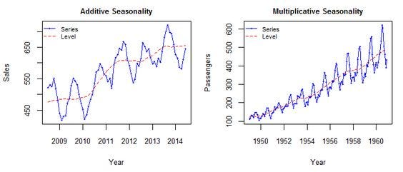
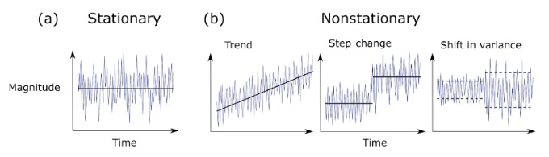
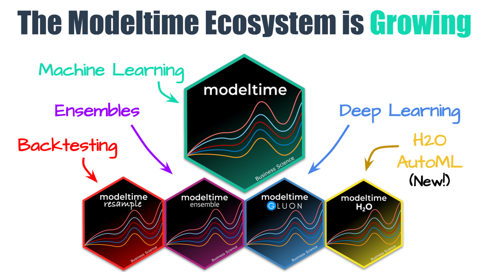
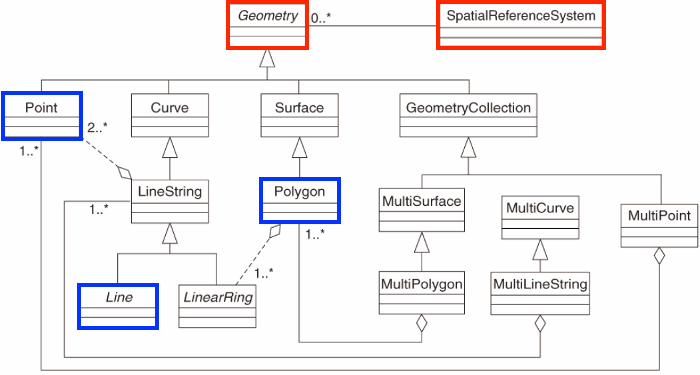

```{r setup}
#| echo: false
hexes <- function(..., size = 64) {
  x <- c(...)
  x <- sort(unique(x), decreasing = TRUE)
  right <- (seq_along(x) - 1) * size

  res <- glue::glue(
    '{.absolute top=-20 right=<right> width="<size>" height="<size * 1.16>"}',
    .open = "<", .close = ">"
  )

  paste0(res, collapse = " ")
}

train_color <- '#1E4D2B'
test_color  <- '#C8C372'
data_color  <- "#767381"
assess_color <- "#84cae1"
splits_pal <- c(data_color, train_color, test_color)
```

## Learning Objectives

By the end of this lecture, you should be able to:

-   Understand what time series data is and why it's useful
-   Work with date and time objects in R
-   Load and visualize time series data in R
-   Apply basic time series operations: decomposition, smoothing, and forecasting
-   Use `ts`, `zoo`, and `xts` objects for time-indexed data
-   Understand tidy approaches using `tsibble` and `feasts`
-   Recognize real-world environmental science applications of time series

## What is Time Series Data?

Time series data is a collection of observations recorded sequentially over time. Unlike other data types, time series data is **ordered**, and that order carries critical information.

#### Examples:

- Streamflow measurements (e.g., daily CFS at a USGS gage)
- Atmospheric CO₂ levels (e.g., Mauna Loa Observatory)
- Snowpack depth over time
- Urban water consumption by month

#### Why Time Series Matter

Time series analysis helps us:

- Understand trends and patterns
- Detect anomalies (e.g., droughts, sensor failures)
- Forecast future values (e.g., streamflow, temperature)

## Working with Date Objects in R

- Time series analysis depends on accurate and well-formatted date/time information.

- Before we can analyze time series data, we need to understand how R handles dates and times.

- R has built-in classes for date and time objects, which are essential for time series analysis.

## Base R Date Functions

R has several native classes for handling dates and times:

- **Date**: Date object

```{r}         
as.Date("2024-04-08")
```

- **POSIXct**: Date and time

```{r}         
as.POSIXct("2024-04-08 14:30:00")
```

- **POSIXlt**: List of date and time components

```{r}         
(lt <- as.POSIXlt("2024-04-08 14:30:00"))

lt$hour
```

## Date Sequences

You can create sequences of dates using the `seq.Date()` function:

- `from`: Start date
- `to`: End date (optional)
- `by`: Interval (e.g., "day", "month", "year")
- `length.out`: Number of dates to generate

```{r}           
seq.Date(from = as.Date("2024-01-01"), by = "month", length.out = 12)
```

##

You can also use `seq()` to create sequences of POSIXct/lt objects:

- `from`: Start date/time
- `to`: End date/time (optional)
- `by`: Interval (e.g., "hour", "minute", "second")
- `length.out`: Number of dates to generate

```{r}
seq(from = as.POSIXct("2024-01-01 00:00"), 
    to = as.POSIXct("2024-01-02 00:00"), 
    by = "hour")
```

## Timezones
 
- By default, R uses the system's timezone. 

- The `Sys.timezone()` function returns the current timezone.

- If you want to use another timezone, say GMT/UTC, you can change it:

```{r}
Sys.timezone()

as.POSIXct("2024-04-08 14:30:00", tz = "GMT")

(obj = as.POSIXct("2024-04-08 14:30:00"))

format(obj, tz = "EST")
```

## lubridate Package `r hexes('lubridate')`

- The `lubridate` package comes with the `tidyverse` and is designed to make working with dates and times easier. 

- It provides a consistent set of functions for parsing, manipulating, and formatting date-time objects.

```{r}           
library(lubridate)
ymd("20240408")        # Parse date
ymd_hms("20240408 123000")

now()                  # Current date and time
date <- ymd("2023-12-01")
month(date)           # Extract month
day(date)
week(date)
```

Use `lubridate` to handle inconsistent formats and to align data with time zones, daylight savings, etc.

## lubridate timezones `r hexes('lubridate')`

lubridate also provides functions for working with time zones. You can convert between time zones using `with_tz()` and `force_tz()`.

```{r}
(date <- ymd_hms("2024-04-08 14:30:00", tz = "America/New_York"))

# Change time zone without changing time
force_tz(date, "America/Los_Angeles")  

# Convert to another timezone
with_tz(date, "America/Los_Angeles")  
```

## R Packages for Time Series
R has several packages/systems for time series analysis, including:

-  `ts`: Base R time series class

-  `zoo`: Provides a flexible class for ordered observations

-  `xts`: Extensible time series class for irregularly spaced data

-  `forecast`: Functions for forecasting time series data

-  `tsibble`: Tidy time series data frames

-  `feasts`: Functions for time series analysis and visualization

-  `modeltime`: Time series modeling with tidymodels

```{r}        
library(tidyverse)
library(zoo)
library(tsibble)
library(feasts)
```

## When to Use Which Time Series Format?

| Format            | Best For                          | Advantages                                              | Limitations                               |
| ----------------- | --------------------------------- | ------------------------------------------------------- | ----------------------------------------- |
| `ts`              | Regular, simple time series       | Built into base R, supported by `forecast`              | Rigid time format, inflexible for joins   |
| `zoo`             | Irregular time steps              | Arbitrary index, supports irregular data                | More complex syntax                       |
| `xts`             | Financial-style or irregular data | Good for date-time indexing and joins                   | More complex to visualize                 |
| `tsibble`         | Tidyverse workflows               | Pipes with `dplyr`, `ggplot2`, forecasting with `fable` | Requires `tsibble` structure              |
| `tibble` + `Date` | General purpose                   | Flexible, tidy                                          | Needs conversion for time series modeling |

## Why `zoo`? Handling Irregular & Gappy Data

Environmental sensor data frequently has gaps: instruments fail, sites flood, loggers reset. `zoo` handles irregular time indexes and provides simple gap-filling tools:

```{r}
library(zoo)

# Simulate sensor data with a gap (missing Jan 2 reading)
dates <- as.Date(c("2024-01-01", "2024-01-03", "2024-01-07"))
vals  <- zoo(c(10, NA, 14), order.by = dates)

vals

# Last observation carried forward (LOCF)
na.locf(vals)

# Linear interpolation between known values
na.approx(vals)
```

Use `zoo` any time your time index is irregular or your data has missing observations that need filling before modeling.

## Key Concepts in Time Series

-  **1. Trend**: Long-term increase or decrease in the data

-  **2. Seasonality**: Repeating short-term cycle (e.g., annual snowmelt)

-  **3. Noise**: Random variation

-  **4. Stationarity**: Statistical properties (mean, variance) don't change over time

-  **5. Autocorrelation**: Correlation of a time series with its own past values

## Introducing the Mauna Loa CO₂ Dataset {background-image="img/mauna-loa.jpeg"}

## Mauna Loa CO₂ Dataset {.smaller}

- The `co2` dataset is a classic example of time series data. It contains monthly atmospheric CO₂ concentrations measured at the Mauna Loa Observatory in Hawaii.

- `co2` is a built-in dataset representing monthly CO₂ concentrations from 1959 onward.

```{r} 
class(co2)
co2
```

## Initial Plot

- The `co2` dataset is a time series object (`ts`) with 12 observations per year, starting from January 1959.

- There is a default plot method for `ts` objects that we can take advantage of:

```{r}        
plot(co2, main = "Atmospheric CO2 at Mauna Loa", ylab = "ppm")
```

We see:

- An upward **trend**
- Regular **seasonal oscillations** (higher in winter, lower in summer)

## Understanding `ts` Objects

You can think of `ts` objects as numeric vectors with time attributes.

  -  `ts` objects are used to represent time series data and are created using the `ts()` function.
  
  -  They have attributes like `start`, `end`, and `frequency` that define the time index.
  
  -  `start` and `end` define the time range of the data.
  
  -  `frequency` defines the number of observations per unit of time (e.g., 12 for monthly data).

```{r}         
class(co2)    
start(co2)    
end(co2)      
frequency(co2)
```

## Subsetting and Plotting

- Like vectors, you can subset `ts` objects using indexing. 

- For example, to extract the first year of data:

```{r}        
co2[1:12]  # First year
```

. . . 

- Or, a specific range of years:

```{r}
window(co2, start = c(1990, 1), end = c(1995, 12))
```

## Decomposing a Time Series

- Decomposition is a technique to separate a time series into its components: trend, seasonality, and residuals.

- This helps separate structure from noise. 

- In environmental science, this is useful for:

-  Removing seasonality to study droughts
-  Analyzing long-term trends
-  Understanding seasonal patterns in streamflow
-  Identifying anomalies in water quality data
-  Detecting changes in vegetation phenology
-  Monitoring seasonal patterns in temperature
-  Analyzing seasonal patterns in water demand
-  ... 

## What is Decomposition?

> **Decomposition** separates a time series into interpretable components:

- **Trend**: Long-term movement
- **Seasonality**: Regular, periodic fluctuations
- **Residual/Irregular**: Random noise or anomalies

## Additive vs Multiplicative {.smaller}

:::: {.columns}
::: {.column width="55%"}

**Additive**: components sum to the observed value:
$$ Y_t = T_t + S_t + R_t $$
Seasonal swings are the **same size** regardless of level.
*Example: air temperature: a 10°F summer bump is 10°F whether the baseline is 50°F or 70°F.*

**Multiplicative**: components scale with the level:
$$ Y_t = T_t \times S_t \times R_t $$
Seasonal swings **grow with the trend**.
*Example: streamflow: a snowmelt pulse that doubles flow is much larger at 500 cfs than at 50 cfs.*

::: {.callout-tip}
**The log trick**: $\log(T \times S \times R) = \log T + \log S + \log R$
Taking `log1p()` converts a multiplicative process into an additive one: which is why we log-transform flow before fitting models and decomposing.
:::

:::
::: {.column width="45%"}

```{r}
#| echo: false
#| out-width: "100%"

```

:::
::::


## Why Decompose?

 - Trend: Are CO₂ levels increasing?

 - Seasonality: Are there predictable cycles each year?

 - Remainder: What's left after we remove trend and season? (what is the randomness?)

## Decomposition in R

- The `decompose()` function in R can be used to perform this operation.
- The `decompose()` function by default assumes that the [time series is additive]{.underline}

```{r}
#| fig.size: 10
decomp = decompose(co2, type = "additive")
plot(decomp)
```

## Deep Dive: Trend Component

::: columns
::: {.column width="50%"}
```{r}
plot(decomp$trend, main = "Trend Component of CO₂", ylab = "ppm", col = "darkred", lwd = 2)
```
:::
::: {.column width="50%"}
 - Steady upward slope from ~316 ppm in 1959 to ~365 ppm in the late 1990s

 - Captures the long-term forcing from human activity:
 
      - Fossil fuel combustion
      - Deforestation
 
 - This trend underpins climate change science: known as the Keeling Curve

  - Notice how the trend smooths short-term fluctuations
  
:::
:::
  
## Interpreting the Trend

- A linear model or loess smoother can also help quantify the trend:

::: columns
::: {.column width="50%"}
```{r}
co2_df <- data.frame(time = time(co2), co2 = as.numeric(co2))

lm(as.numeric(co2) ~ time(co2)) |> 
  summary()
```
:::
::: {.column width="50%"}

```{r}
co2_df |>
  ggplot(aes(x = time, y = co2)) +
  geom_line(alpha = 0.5) +
  geom_smooth(method = "loess", span = 0.2, color = "red", se = FALSE) +
  labs(title = "CO₂ Trend with Loess Smoothing", y = "ppm")
```

:::
:::

::: {.callout-note}
**Reading the outputs:**

- **Linear model**: slope = **+1.31 ppm/year** (p < 2e-16), R² = 0.97: CO₂ rises ~1.3 ppm every year on average and a straight line explains 97% of the variance.
- **Loess curve**: at `span = 0.2` the smoother tracks the data closely and appears nearly linear here: confirming the linear model is a good fit for this 30-year window. The loess adds value by revealing that no strong curvature exists in this range.
- **Acceleration caveat**: the Mauna Loa record now extends to 2024 (~425 ppm). On that longer record the loess *does* curve upward: the rate has increased from ~1 ppm/yr in the 1960s to ~2.5 ppm/yr today. This dataset ends in 1997 and is too short to show it clearly.
- **Takeaway**: a high R² linear fit is not evidence of *no* acceleration: always ask whether the time window is long enough to detect the pattern you're looking for.
:::

## De-Trending

- Detrending is the process of removing the trend component from a time series.
- This isolates the seasonal + residual components:

```{r}
detrended <- co2 - decomp$trend
plot(detrended, main = "De-trended Series (seasonal + residual)")
```

## Deep Dive: Seasonal Component

::: columns
::: {.column width="50%"}
```{r}
plot(decomp$seasonal, main = "Seasonal Component of CO₂", 
     ylab = "ppm", col = "darkgreen", lwd = 2)
```
:::
::: {.column width="50%"}
 - Repeats every 12 months

 - Peaks around May, drops in September–October

 - Driven by biospheric fluxes:

    - Photosynthesis during spring/summer → CO₂ drawdown
    - Decomposition and respiration in winter → CO₂ release

- Seasonal Cycle is Northern Hemisphere-Dominated (Mauna Loa is in the Northern Hemisphere)
- Northern Hemisphere contains more landmass and vegetation
- So its biosphere exerts a stronger influence on global CO₂ than the Southern Hemisphere

- This explains the pronounced seasonal cycle in the signal
:::
:::

## De-seasonalizing

This can help for modeling the seasonal + residual only:

```{r}
deseasonalized <- co2 - decomp$seasonal
plot(deseasonalized, main = "De-seasonalized Series")
```

## Deep Dive: Remainder Component

::: columns
::: {.column width="50%"}
```{r}
plot(decomp$random, main = "Remainder Component (Residuals)", 
     ylab = "ppm", col = "gray40", lwd = 1)
```
:::
::: {.column width="50%"}
 - Residuals are the "leftover" part of the time series after removing trend and seasonality

 - Contains irregular, short-term fluctuations

 - Can be used to identify anomalies or outliers

 - Important for understanding noise in the data

- Possible sources:

  - Volcanic activity (e.g. El Chichón, Mt. Pinatubo)
  - Measurement error
  - El Niño/La Niña events (which affect carbon flux)

- Typically small amplitude: ±0.2 ppm
:::
:::

## Assessing Patterns in Error?

You might compute the standard deviation of the residuals to assess noise:

```{r}
sd(na.omit(decomp$random))
```

. . .

Or evaluate the residuals like we did for Linear Modeling!

```{r}
#| out.width: "60%"
ggpubr::ggdensity(decomp$random, main = "Residuals Histogram", xlab = "Residuals")
```

::: {.callout-note}
**So what?** SD ≈ 0.27 ppm: small relative to the ~60 ppm trend, so the decomposition captured most of the signal. The density is roughly bell-shaped and centered near zero, which is what we want: no systematic bias. The **left skew** (longer left tail) suggests occasional sharp *drops* in CO₂: likely real events (e.g., El Niño years when terrestrial uptake spikes) rather than model failure. If residuals were right-skewed, flat, or multi-modal, that would signal missing structure (another seasonal cycle, a regime shift, or a trend the model didn't account for).
:::

## Smoothing to Remove Noise

If your data is noisy - and without useful pattern - you can use a moving average to smooth it out.

<br>

::: columns
::: {.column width="50%"}
- The `zoo` package provides a convenient function for this that we have already seen in Lab 1.
- The `rollmean()` function from the `zoo` package is useful for this.
- The `k` parameter specifies the window size for the moving average.
- The `align` parameter specifies how to align the moving average with the original data (e.g., "center", "left", "right").
- The `na.pad` parameter specifies whether to pad the result with `NA` values.
:::
::: {.column width="50%"}

```{r}         
co2_smooth <- zoo::rollmean(co2, k = 12, align = "center", na.pad = TRUE)

plot(co2, col = "grey", main = "12-Month Moving Average")
lines(co2_smooth, col = "blue", lwd = 2)
```
:::
:::

## STL Decomposition (Loess-based)

- STL (Seasonal-Trend decomposition using Loess) adapts to changing trend or seasonality over time

- Doesn’t assume constant seasonal effect like `decompose()` does

- Particularly valuable when working with:
   - Long datasets
   - [Environmental time series affected by nonlinear changes]{.underline}

## STL Decomposition (Loess-based)

- `stl()` uses local regression (loess) to estimate the trend and seasonal components.

- `s.window = "periodic"` specifies that the seasonal component is periodic. 

- Other options include 
  - "none" (no seasonal component) 
  - or a numeric value for the seasonal window size.

::: columns
::: {.column width="50%"}
```{r}
plot(decomp)
```
:::
::: {.column width="50%"}
```{r}
stl(co2, s.window = "periodic") |>
  plot()
```
:::
:::


## Comparing Classical vs STL {.smaller}

| Method | Assumes Constant Season? |  Robust to Outliers? | Adaptive Smoothing? |
| -------|-------------------------|----------------------|---------------------|
| `decompose` | ✅ Yes | ❌ No | ❌ No |
| `stl` | 🔄 Adaptive | ✅ Yes | ✅ Yes |

**What these columns mean in practice:**

- **Assumes constant season?** `decompose` fits one fixed seasonal pattern for the entire record. If snowmelt peaks have shifted earlier over 30 years (they have: USGS data shows ~2 weeks earlier in the West), the model treats that as noise rather than a real signal. `stl` lets the seasonal shape evolve.

- **Robust to outliers?** A single wildfire year with anomalous summer flows can distort `decompose`'s seasonal estimate for *all* years. `stl` uses iterative reweighting to down-weight outlying observations: the Cameron Peak Fire year gets less influence.

- **Adaptive smoothing?** `stl` exposes `s.window` and `t.window` parameters so you can control how quickly trend and season are allowed to change. `decompose` has no such knobs.

::: {.callout-tip}
**Rule of thumb**: use `decompose` for quick exploratory looks at short, well-behaved series. Switch to `stl` the moment your data spans more than a decade, contains outliers, or you suspect the seasonal pattern has shifted.
:::

## Bringing It All Together

For the CO₂ dataset, decomposition reveals three interpretable layers:

  - **Trend**: A relentless human fingerprint: the Keeling Curve shows atmospheric CO₂ rising ~1.5 ppm/year, driven by fossil fuels and deforestation
  - **Seasonality**: A stable biospheric rhythm: photosynthesis draws CO₂ down each summer; respiration releases it each winter; Northern Hemisphere vegetation dominates
  - **Remainder**: Small (±0.2 ppm) but informative: anomalies here may fingerprint volcanic eruptions or El Niño-driven carbon flux shifts

Understanding these components lets us:

✅ Track long-term progress against climate targets

✅ Forecast future CO₂ concentrations with ARIMA or Prophet

✅ Communicate patterns clearly to policymakers

## Time Series in the Tidyverse: `tsibble` / `feasts`

- `tsibble` is a tidy data frame for time series data. It extends the tibble class to include time series attributes.

- Compatible with `dplyr`, `ggplot2`

- `feasts` provides functions for time series analysis and visualization.

```{r}         
co2_tbl <- as_tsibble(co2)
head(co2_tbl)
```

## Decomposing with `feasts`

### `feasts` provides: 
  -  a `STL()` function for seasonal decomposition.
  - `components()` extracts the components of the decomposition.
  - `gg_season()` and `gg_subseries()` visualize seasonal patterns.
  - `gg_lag()` visualizes autocorrelation and lagged relationships.

```{r}
co2_decomp <- co2_tbl |>
  model(STL(value ~ season(window = "periodic"))) |>
  components()

glimpse(co2_decomp)
```

## Component Access

::: columns
::: {.column width="50%"}
#### Autoplot
```{r}
autoplot(co2_decomp) +
  labs(title = "STL Decomposition of CO₂", y = "ppm") +
  theme_minimal()
```
::: 
::: {.column width="50%"}
#### Component Access
```{r}
ggpubr::ggdensity(co2_decomp$remainder, main = "Residual Component")
shapiro.test(co2_decomp$remainder)
```

::: 
::: 

## Advanced Visualization with `feasts`

`feasts` provides three complementary diagnostic plots for exploring seasonal structure:

| Function | Question it answers |
|---|---|
| `gg_lag()` | Is the series autocorrelated? Do past values predict the present? |
| `gg_subseries()` | How does each season behave across years? Is the seasonal mean stable? |
| `gg_season()` | Is the seasonal shape consistent from year to year? |

Together, these plots reveal whether your series has exploitable structure worth modeling.

## gg_lag() {.smaller}

:::: {.columns}
::: {.column width="50%"}

```{r}
#| out-width: "100%"
co2_tbl |>
  gg_lag() +
  labs(title = "Lag Plot of CO₂", x = "Lagged CO₂", y = "Current CO₂") +
  theme_minimal()
```

:::
::: {.column width="50%"}

A lag plot scatters $Y_t$ against $Y_{t-k}$ for each lag $k$. Points close to the diagonal mean past values predict current values well.

**What you're seeing:**

- **Tight diagonal lines at every lag**: CO₂ has very strong autocorrelation — knowing last month's value tells you almost exactly what this month's value will be
- **Lines fan slightly wider at lag 6**: the 6-month lag straddles opposite seasons (summer vs. winter), so the seasonal cycle introduces a small offset
- **Color banding by month**: each month traces its own trajectory — purple (Jan/Feb, low) through yellow (Nov/Dec, high) — revealing the seasonal sawtooth embedded within the trend
- **No diffuse scatter**: there is no lag at which CO₂ "forgets" its past; this series has extremely long memory

::: {.callout-tip}
Strong diagonal structure at all lags is the visual signature that ARIMA and Prophet will have predictive power here.
:::

:::
::::

## gg_subseries

`gg_subseries()` creates one mini-panel per season (e.g., one per month) and plots each season's values across all years, with a horizontal mean line.

- **Each panel** = one seasonal period (Jan, Feb, …, Dec)
- **Each line within a panel** = the value for that month in a given year
- **The mean line** = average level for that month across all years
- **Rising panels** indicate a long-term trend within that season
- **Differences in mean line height across panels** reveal the seasonal pattern

## gg_subseries()

```{r}
gg_subseries(co2_tbl) +
  labs(title = "Monthly CO₂ Patterns", y = "CO₂ (ppm)", x = "Year") + 
  theme_minimal()
```

## gg_season

`gg_season()` overlays all years on a single plot, with the x-axis running from the start to the end of one seasonal period (e.g., January to December).

- **Each line** = one year of data
- **Parallel lines** = consistent seasonal shape across years (stable seasonality)
- **Diverging lines** = the seasonal pattern is changing over time
- **Vertical spread** = the overall level shifting year-to-year (the trend)

For CO₂, the lines run nearly parallel: confirming that seasonality is stable: but shift upward each year, tracing the Keeling Curve.

## gg_season

```{r}         
gg_season(co2_tbl) +
  labs(title = "Seasonal Patterns of CO₂", y = "CO₂ (ppm)", x = "Month") +
  theme_minimal()
```

## Bonus: Interactive Plotting

- In last weeks demo, we used plotly to generate an interactive plot of the hyperparameter tuning process.

- You can use the `plotly` package to add interactivity to your ggplots directly with `ggplotly()`!

```{r}
library(plotly)

co2_df <- as_tibble(co2_tbl) |>
  mutate(date = as.Date(index))
```

## Bonus: Interactive Plotting

```{r}
plot_ly(co2_df, x = ~date, y = ~value, type = "scatter", mode = "lines",
        line = list(color = "steelblue")) |>
  layout(title = "Interactive CO₂ Time Series",
         xaxis = list(title = "Date"),
         yaxis = list(title = "ppm"))
```

## Forecasting {background-color="#1E4D2B"}

Now that we understand time series components, we can use them to **predict future values**.

<br>

We'll build from classical to modern:

| | Model | Strength |
|---|---|---|
| **Classical** | ARIMA | Autocorrelation structure, stationarity-based |
| **Modern** | Prophet | Trend changepoints, holidays, missing data |
| **Unified** | `modeltime` + `tidymodels` | Compare, calibrate, and forecast all models in one pipeline |

<br>

Both approaches need the same foundation: a stationary, well-understood series — which is exactly what decomposition gave us.

## ARIMA Intuition {.smaller}

ARIMA(p, d, q) combines three ideas — each answering a different question about the series:

| Component | Question it answers | River analogy |
|---|---|---|
| **AR(p)**: AutoRegressive | How much do the last *p* values predict today? | Spring snowmelt: if flow rose the last 3 days, it will likely keep rising |
| **I(d)**: Integrated | How many times must we difference to remove trend? | Subtracting yesterday’s flow from today’s converts a climbing hydrograph into stationary fluctuations |
| **MA(q)**: Moving Average | How much does last week’s forecast *error* still linger? | An unexpected storm pulse 2 days ago still echoes in today’s flow; MA absorbs that shock |

These map directly to the parameters: `ARIMA(p, d, q)`

- `p` = lags of the series used as predictors (read from the PACF)
- `d` = number of differences needed for stationarity (usually 0 or 1)
- `q` = lags of the error term retained (read from the ACF)

## ARIMA

The basics of a ARIMA (AutoRegressive Integrated Moving Average) Model include:\

-   **AR**: AutoRegressive part (past values):\
    -   AR(1) = current value depends on the previous value\
    -   AR(2) = current value depends on the previous two values\
-   **I**: Integrated part (differencing to make data stationary)\
    -   Differencing removes trends and seasonality\
    -   e.g., `diff(co2, lag = 12)` removes annual seasonality\
-   **MA**: Moving Average part (past errors)\
    -   MA(1) = current value depends on the previous error\
    -   MA(2) = current value depends on the previous two errors\
-   **p, d, q**: Parameters for AR, I, and MA\
    -   p = number of lagged values (AR)\
    -   d = number of differences (I)\
    -   q = number of lagged errors (MA)\
    
## Stationarity: A Prerequisite for ARIMA

ARIMA modeling works well when data is **stationary**: meaning the statistical properties (mean, variance) do not change over time.

-   Non-stationary data leads to unreliable forecasts and misleading results
-   The **I** (Integrated) component of ARIMA handles this via differencing

```{r}
#| echo: false

```

## Testing for Stationarity

Don't just look: test. Two complementary formal tests:

```{r}
library(tseries)

# Augmented Dickey-Fuller: H0 = non-stationary
# p < 0.05 → reject non-stationarity (series IS stationary)
adf.test(co2)

# KPSS: H0 = stationary
# p < 0.05 → reject stationarity (series is NOT stationary)
kpss.test(co2)
```

. . .

::: {.callout-note}
**Reading these results together:**

- **ADF**: p = 0.23 → fail to reject H₀ → cannot confirm stationarity. The series looks non-stationary.
- **KPSS**: p = 0.01 → reject H₀ → confirmed non-stationary.

Both tests agree: CO₂ has a strong upward trend that violates stationarity. Set `d = 1` (first-difference) in ARIMA to remove it.

**Why run both?** The tests have opposite null hypotheses, so agreement is reassuring. When they disagree — ADF says stationary, KPSS says not — the series is likely trend-stationary (a deterministic trend, not a random walk), which calls for detrending rather than differencing.
:::

## A Simple Forecasting Example

  - `auto.arima()` is a function from the `forecast` package that automatically selects the best ARIMA model for your data according to the AICc criterion.
  - The AICc (Akaike Information Criterion corrected) is a measure of the relative quality of statistical models for a given dataset.
  - It is used to compare different models and select the one that best fits the data while penalizing for complexity.
-   The `auto.arima()` function will automatically select the best parameters (p,d,q) based on the AICc criterion.

## AIC: Reading the Model Selection Output

The `summary()` output shows an **AIC** value — this is what `auto.arima()` minimized to choose the model:

$$\text{AIC} = -2 \cdot \log(\text{likelihood}) + 2k$$

where $k$ is the number of parameters. Lower AIC = better balance of fit and simplicity.

| Term | What it does |
|---|---|
| $-2 \log(\mathcal{L})$ | Rewards fit: lower when the model explains the data well |
| $+2k$ | Penalizes complexity: each extra parameter costs 2 AIC units |

::: {.callout-tip}
**In practice**: AIC is not an absolute measure — only *differences* matter. An ARIMA(1,1,1) with AIC = 480 vs. ARIMA(2,1,2) with AIC = 485 favors the simpler model. `auto.arima()` searches over (p,d,q) combinations and returns the winner. You rarely need to compute AIC by hand — but you do need to know what you're reading in the output.
:::

## Fitting an ARIMA Model

```{r}
library(forecast)

co2_arima <- auto.arima(co2)

summary(co2_arima)
```

## Reading ARIMA(1,1,1)(1,1,2)[12] {.smaller}

:::: {.columns}
::: {.column width="50%"}

**Non-seasonal part**: `ARIMA(p, d, q)` = `(1, 1, 1)`

| Symbol | Meaning | For CO₂ |
|---|---|---|
| AR(**1**) | Use 1 lagged value of $Y$ | Last month's CO₂ predicts this month's |
| I(**1**) | Difference once | Removes the upward trend |
| MA(**1**) | Use 1 lagged forecast error | Corrects for last month's prediction miss |

**Seasonal part**: `(P, D, Q)[m]` = `(1, 1, 2)[12]`

| Symbol | Meaning | For CO₂ |
|---|---|---|
| SAR(**1**) | Use value from 12 months ago | Last January predicts this January |
| SI(**1**) | Seasonal difference once | Removes the annual seasonal cycle |
| SMA(**2**) | Errors from 12 and 24 months ago | Smooths persistent seasonal shocks |
| **[12]** | Seasonal period = 12 | Monthly data with yearly seasonality |

:::
::: {.column width="50%"}

::: {.callout-note}
**Plain English**: take the series, remove the trend (difference once) and the seasonal cycle (difference across 12 months), then model what remains using last month's value, last year's value, and the recent forecast errors. `auto.arima()` found this structure by minimizing AIC across hundreds of candidate models.
:::

::: {.callout-tip}
**Streamflow equivalent**: if you applied `auto.arima()` to monthly Poudre flows, you'd likely see a similar `[12]` seasonal structure — May 2023 strongly predicts May 2024 because snowmelt timing is physically consistent year to year.
:::

:::
::::

## Autocorrelation: ACF & PACF

The **ACF** (Autocorrelation Function) and **PACF** (Partial Autocorrelation Function) are the standard diagnostics for choosing ARIMA orders.

- **ACF(k)**: correlation between $y_t$ and $y_{t-k}$ (includes indirect effects through intermediate lags)
- **PACF(k)**: the *direct* effect of $y_{t-k}$ on $y_t$ after removing the influence of lags 1 through $k-1$

#### What they tell you about ARIMA(p, d, q):

| Plot | Pattern | Suggests |
|------|---------|---------|
| ACF | Cuts off after lag q | MA(q) term |
| PACF | Cuts off after lag p | AR(p) term |
| Both | Tail off gradually | ARMA(p,q) |

## ACF & PACF in R

::: columns
::: {.column width="50%"}
```{r}
# feasts / tsibble approach
co2_tbl |> ACF(value) |> autoplot() +
  labs(title = "ACF of CO₂")

co2_tbl |> PACF(value) |> autoplot() +
  labs(title = "PACF of CO₂")
```
:::
::: {.column width="50%"}
```{r}
# base forecast approach
forecast::Acf(co2,  main = "ACF of CO₂")
forecast::Pacf(co2, main = "PACF of CO₂")
```
:::
:::

The slow decay in the ACF and a sharp cutoff in the PACF at lag 1 are classic signatures of an AR process: consistent with the ARIMA(1,…) selected by `auto.arima()`.

## Forecasting with ARIMA

-   The `forecast()` function is used to generate forecasts from the fitted ARIMA model.
-   The `h` argument specifies the number of periods to forecast into the future.

```{r}
co2_forecast <- forecast(co2_arima, h = 60)

plot(co2_forecast)
```

## Prophet
  - Prophet is an open-source tool for forecasting time series data.

  - Developed by Facebook (Meta)

  - Designed for analysts and data scientists

  - Handles missing data, outliers, and seasonality

##  Key Features of Prophet

✅ Additive Model: Trend + Seasonality + Holidays + Noise \
✅ Automatic Changepoint Detection\
✅ Support for Custom Holidays & Events\
✅ Flexible Seasonality (daily/weekly/yearly)\
✅ Easy-to-use API in R and Python\

##  Prophet’s Model Structure

Prophet decomposes time series into components:

$$ y(t) = g(t) + s(t) + h(t) + ε(t) $$

  - g(t): Trend (linear or logistic growth)

  - s(t): Seasonality (Fourier series)

  - h(t): Holiday effects

  - ε(t): Error term (noise)

📌 Assumes additive components by default; multiplicative also possible

## A Simple Forecasting Example

Your time series must have: (1) ds column (date/timestamp) (2) y column (value to forecast)

```{r}
library(prophet)
prophet_mod <- tsibble::as_tsibble(co2) |>
  # prophet requires ds (date) and y (value) columns
  # fits: y(t) = g(t) trend + s(t) seasonality + h(t) holidays + ε(t) noise
  dplyr::rename(ds = index, y = value) |>
  prophet()
```

```{r}
# Make future dataframe: g(t) extrapolates trend forward
future   <- make_future_dataframe(prophet_mod, periods = 1000)

# predict() returns yhat (forecast) + components: trend, seasonal, yhat_lower/upper
forecast <- predict(prophet_mod, future)

plot(prophet_mod, forecast) +
  theme_minimal()
```

## Pros / Cons {.smaller}

| Feature               | **ARIMA**                                                            | **Prophet**                                                          |
|-----------------------|----------------------------------------------------------------------|----------------------------------------------------------------------|
| Statistical rigor     | Based on strong statistical theory; well-studied                     | Intuitive, decomposable model (trend + seasonality + events)         |
| Interpretability      | Clear interpretation of AR, MA, differencing terms                   | Plots components like trend/seasonality directly                     |
| Flexibility (SARIMA)  | Seasonal ARIMA can handle seasonal structure                         | Handles multiple seasonalities natively (yearly, weekly, daily)      |
| Control over params   | Fine-tuned control over differencing, lags, and model order          | Easy to specify changepoints, seasonality, and custom events         |
| Statistical testing   | Includes AIC/BIC for model selection                                 | Cross-validation support; uncertainty intervals included             |
| Requires stationarity | Time series must be stationary or made so (differencing)             | Handles non-stationary data out of the box                           |

## Pros / Cons (cont.) {.smaller}

| Feature               | **ARIMA**                                                            | **Prophet**                                                          |
|-----------------------|----------------------------------------------------------------------|----------------------------------------------------------------------|
| Model complexity      | Needs careful tuning (p,d,q) and domain expertise                    | Defaults work well; limited tuning needed                            |
| Holiday effects       | Must be encoded manually                                             | Easy to include holidays/events                                      |
| Multivariate support  | Basic ARIMA doesn't support exogenous variables easily (need ARIMAX) | Supports external regressors with `add_regressor()`                  |
| Non-linear trends     | Poor performance with structural breaks or non-linear growth         | Handles changepoints and logistic growth models well                 |
| Seasonality limits    | SARIMA handles only one seasonal period well                         | Built-in multiple seasonal components (e.g., daily, weekly, yearly)  |

#### TL;DR

  - Use **ARIMA** for a classical, statistical model with deep customization: when you're comfortable making your data stationary.
  - Use **Prophet** for a fast, robust, intuitive model: when data has strong seasonal effects, irregular events, or missing values.

## Too much complexity!

 - Each model has it own requirements, arguments, and tuning parameters.
 
 - Similar to our ML models, this introduces a large time sink, opportunity for error, and complexity.
 
. . . 

 - `modeltime` brings tidy workflows to time series forecasting using the `parsnip` and `workflows` frameworks from `tidymodels.`

  - Combine multiple models (ARIMA, Prophet, XGBoost) in one framework to

## Modeltime Integration `r hexes('modeltime', 'tidymodels')`

```{r}
library(modeltime)
library(tidymodels)
library(timetk)
```

## 1. Create a time series split ... 

- Use `time_series_split()` to make a train/test set.

- Setting assess = "..." tells the function to use the last ... of data as the testing set. 

- Setting cumulative = `TRUE` tells the sampling to use all of the prior data as the training set.

```{r}
co2_tbl <-  tsibble::as_tsibble(co2) |> 
  as_tibble() |>
  mutate(date = as.Date(index), index = NULL) 

splits <- time_series_split(co2_tbl, assess = "60 months", cumulative = TRUE)

training <-  training(splits)
testing  <-  testing(splits)
```

## 2. Specify Models ... 

Just like tidymodels ...

- **Model Spec**: `arima_reg()`/`prophet_reg()`/`prophet_boost()` \<– This sets up your general model algorithm and key parameters 

- **Model Mode**: `mode = "regression"`/`mode = "classification"` \<– This sets the model mode to regression or classification (timeseries is always regression!)

- **Set Engine**: `set_engine("auto_arima")`/`set_engine("prophet")` / \<– This selects the specific package-function to use, you can add any function-level arguments here.


```{r}
mods <- list(
  arima_reg() |>  set_engine("auto_arima"),
  
  arima_boost(min_n = 2, learn_rate = 0.015) |> set_engine(engine = "auto_arima_xgboost"),
  
  prophet_reg() |> set_engine("prophet"),
  
  prophet_boost() |> set_engine("prophet_xgboost"),
  
  # Exponential Smoothing State Space model
  exp_smoothing() |> set_engine(engine = "ets"),
  
  # Multivariate Adaptive Regression Spline model
  mars(mode = "regression") |> set_engine("earth") 
)
```

## 3. Fit Models ...

- Use `purrr::map()` to `fit` the `models` to the training data.

- **Fit Model**: fit(value \~ date, training) \<– All `modeltime` models require a date column to be a regressor.

```{r}
#| message: false
models <- map(mods, ~ fit(.x, value ~ date, data = training))
```

::: {.callout-note}
**Why not `workflow()` / `workflowsets`?** Those are the right tools when you need a **preprocessor** (recipe) + model spec together — e.g., normalizing predictors before a regression. `modeltime` models (`arima_reg()`, `prophet_reg()`, etc.) consume the date column directly and have no preprocessing step, so wrapping them in a workflow adds boilerplate without benefit. `purrr::map()` over a list of specs is the idiomatic modeltime pattern.
:::


## 4. Build modeltime table ... {.smaller}

In tidymodels, after fitting you have a single model object. With **multiple** models you need a container — something to hold all fitted models together so calibration, accuracy, and forecasting operate on all of them at once.

`modeltime_table()` is that container. Think of it as the time series equivalent of a **`workflowset` result table**: a tidy tibble where each row is one fitted model.

| tidymodels concept | modeltime equivalent |
|---|---|
| Single `workflow` fit | Single fitted `arima_reg()` / `prophet_reg()` |
| `workflowset` results tibble | `modeltime_table` |
| `collect_metrics()` | `modeltime_accuracy()` |
| `predict()` on test set | `modeltime_calibrate()` → `modeltime_forecast()` |

```{r}
(models_tbl <- as_modeltime_table(models))
```

::: {.callout-note}
`as_modeltime_table()` is used when models come from `map()` (a list). `modeltime_table()` is used when passing models individually: `modeltime_table(fit1, fit2, fit3)`. Either way the result is the same row-per-model tibble that drives the rest of the pipeline.
:::

## Notes: 

`modeltime_table()` does some basic checking to ensure all models are fit and organized into a scalable structure called a “Modeltime Table” that is used as part of our forecasting workflow.

- It’s expected that tuning and parameter selection is performed prior to incorporating into a Modeltime Table.
- If you try to add an unfitted model, the `modeltime_table()` will complain (throw an informative error) saying you need to fit() the model.

## 5. Calibrate the Models ... {.smaller}

-  Use `modeltime_calibrate()` to evaluate the models on the test set.

-  Calibrating adds a new column, `.calibration_data`, with the test predictions and residuals inside.

```{r}
(calibration_table <- modeltime_calibrate(models_tbl, testing, quiet = FALSE))
```

::: {.callout-note}
**Yes — calibration intentionally uses the test set.** In modeltime, "calibrate" does not mean fitting or tuning — the models are already fitted. It means: *run each fitted model forward on held-out data, record the predictions and residuals, and use those residuals to estimate confidence interval width*.

This is different from how "calibration" is used in probability calibration (e.g., isotonic regression on classifier outputs). Here it is closer to **out-of-sample error estimation** — the same principle as `collect_metrics()` on a test set in tidymodels.

The residuals computed here flow downstream into `modeltime_accuracy()` (RMSE, MAE, MASE) and into the confidence bands on the forecast plot. No data leakage occurs because the models were fitted only on training data.
:::

## Testing Forecast & Accuracy Evaluation

There are 2 critical parts to an evaluation.

  - Evaluating the Test (Out of Sample) Accuracy
  - Visualizing the Forecast vs Test Data Set
  
## Accuracy 

`modeltime_accuracy()` collects common accuracy metrics using `yardstick` functions:

 - MAE - Mean absolute error, mae()
 - MAPE - Mean absolute percentage error, mape()
 - MASE - Mean absolute scaled error, mase()
 - SMAPE - Symmetric mean absolute percentage error, smape()
 - RMSE - Root mean squared error, rmse()
 - RSQ - R-squared, rsq()

```{r}
modeltime_accuracy(calibration_table) |>
  arrange(mae)
```

## Interpreting Accuracy Metrics

Not all metrics are equally useful: context matters:

| Metric | Interpretation | Watch out for |
|--------|---------------|---------------|
| **MASE** | < 1 = beats naive seasonal forecast; > 1 = worse than naive | Best for comparing across series with different scales |
| **MAPE** | Intuitive % error | Breaks down when $y \approx 0$ (e.g., near-zero flows) |
| **RMSE** | Penalizes large errors heavily | Useful when extreme errors matter (floods, droughts) |
| **RSQ** | Proportion of variance explained | Can look good even with biased predictions |

> For environmental forecasting, **MASE** and **RMSE** are usually the most informative choices.

## A Foundational Transformation: `log1p()`

::: columns
::: {.column width="50%"}
Many environmental variables: streamflow, concentration, counts: are **right-skewed and bounded at zero**. Fitting linear models on the raw scale causes two problems:

1. **Negative predictions**: models don't know flow can't go below zero
2. **Heteroskedastic residuals**: variance is much higher at peak flows, violating ARIMA's constant-variance assumption

Recall from **Week 5 EDA**: we log-transform skewed predictors before modeling. The same logic applies to the *response*:

```r
# Transform before fitting
pf_tbl <- mutate(pf_tbl, log_flow = log1p(Flow))

# Fit on log scale
fit(arima_reg(), log_flow ~ ., data = training)

# Back-transform predictions to cfs
mutate(forecast, .value = expm1(.value))
```
:::
::: {.column width="50%"}
**Why `log1p` / `expm1`?**

- `log1p(x)` = `log(x + 1)`: safe when $x \approx 0$ (avoids `log(0) = -Inf`)
- `expm1(x)` = `exp(x) - 1`: exact inverse, no rounding error
- Back-transformed predictions are **guaranteed ≥ 0**: physically impossible values are eliminated, not just clipped

**The result:**

- Variance stabilized across seasons: ARIMA's constant-variance assumption now holds
- All confidence intervals stay above zero
- MAPE becomes meaningful (no division by near-zero values)
- **Test stationarity on `log_flow`**, not raw Flow: that's the variable ARIMA actually sees

```r
adf.test(log1p(flow_vec))   # ← correct
adf.test(flow_vec)          # ← answers the wrong question
```

> This is the same reason streamflow rating curves and flood-frequency analyses are always plotted on log scales: the data lives there naturally.
:::
:::

## Why Not k-Fold Cross-Validation?

::: columns
::: {.column width="50%"}
Random k-fold CV randomly assigns observations to folds: but time series data is **ordered**. Using future data to train violates the assumption that the future is unknown.

**Walk-forward (expanding window) CV** respects temporal order:

- Each fold uses only past data to train
- Forecast window moves forward in time
- Provides a realistic estimate of out-of-sample performance
:::
::: {.column width="50%"}
```{r}
library(timetk)

cv_plan <- time_series_cv(
  co2_tbl,
  assess  = "12 months",
  initial = "36 months",
  skip    = 6,
  slice_limit = 5
)

cv_plan
```
:::
:::

## Forecast

-   Use `modeltime_forecast()` to generate forecasts for the next 120 months (10 years).
-   Use `plot_modeltime_forecast()` to visualize the forecasts.

```{r}
(forecast <- calibration_table  |> 
  modeltime_forecast(h = "60 months", 
                     new_data = testing,
                     actual_data = co2_tbl) )
```

## Visualize
```{r}
forecast |>
  filter(.key == "actual") |>
  ggplot(aes(x = .index, y = .value)) +
  geom_line(color = "grey40") +
  geom_line(data = filter(forecast, .key == "prediction"),
            aes(color = .model_desc)) +
  geom_ribbon(data = filter(forecast, .key == "prediction"),
              aes(ymin = .conf_lo, ymax = .conf_hi, fill = .model_desc),
              alpha = 0.1) +
  scale_color_brewer(palette = "Set1") +
  scale_fill_brewer(palette = "Set1") +
  labs(title = "CO₂ Forecast vs Actuals", x = NULL, y = "ppm",
       color = "Model", fill = "Model") +
  theme_minimal() +
  theme(legend.position = "bottom")
```

##  Refit to Full Dataset & Forecast Forward

The final step is to refit the models to the full dataset using modeltime_refit() and forecast them forward.

```{r}
refit_tbl <- calibration_table |>
  modeltime_refit(data = co2_tbl)

refit_fc <- refit_tbl |>
  modeltime_forecast(h = "3 years", actual_data = co2_tbl)

refit_fc |>
  filter(.key == "actual") |>
  ggplot(aes(x = .index, y = .value)) +
  geom_line(color = "grey40") +
  geom_line(data = filter(refit_fc, .key == "prediction"),
            aes(color = .model_desc)) +
  geom_ribbon(data = filter(refit_fc, .key == "prediction"),
              aes(ymin = .conf_lo, ymax = .conf_hi, fill = .model_desc),
              alpha = 0.1) +
  scale_color_brewer(palette = "Set1") +
  scale_fill_brewer(palette = "Set1") +
  labs(title = "CO₂ Forecast: Refit to Full Dataset",
       x = NULL, y = "ppm", color = "Model", fill = "Model") +
  theme_minimal() +
  theme(legend.position = "bottom")
```

## Why refit?

The models have all changed! This is the (potential) benefit of refitting.

More often than not refitting is a good idea. Refitting:

  - Retrieves your model and preprocessing steps
  
  - Refits the model to the new data
  - Recalculates any automations. This includes:
    - Recalculating the changepoints for the Earth Model
    - Recalculating the ARIMA and ETS parameters
    
  - Preserves any parameter selections. This includes:

  - Any other defaults that are not automatic calculations are used.
  
## Growing Ecosystem

```{r}
#| echo: false

```

## Why Streamflow Forecasting Is Hard {background-color="#1E4D2B"}

We're going to try three progressively more sophisticated approaches to forecast Colorado River flow at Lees Ferry.

**None of them will beat a naïve seasonal forecast.**

<br>

That's not a failure of the tools — it's the lesson. Understanding *why* models fail on a specific system is as important as knowing how to fit them. By the end of this example you'll be able to:

- Read MASE and explain what "worse than naïve" actually means
- Diagnose whether the problem is data quantity, regime shift, or missing physical drivers
- Articulate what a real operational forecast system would need that these models don't have

## Bringing It Home: Forecasting Streamflow at Lees Ferry

In **Lab 1** you built an analytical pipeline for the Colorado River: pulling 44 years of daily discharge from USGS NWIS, normalizing by drainage area, detecting low-flow threshold exceedances, and modeling the upstream-downstream relationship between Glenwood Springs and Lees Ferry.

Now we apply everything from this lecture to that same data:

- Pull daily discharge at Lees Ferry with `dataRetrieval`
- Convert to a monthly time series (the natural forecasting granularity)
- Fit multiple models with `modeltime`: ARIMA, Prophet, ETS
- Evaluate three rounds of model refinement — and learn from each failure

**Lees Ferry** is the Colorado River Compact's primary accounting point. Forecasting flow here has direct operational consequences for 40 million people across 7 states.

## Step 1: Pull Data with `dataRetrieval`

```{r}
library(dataRetrieval)
library(tidyverse)
library(lubridate)
library(modeltime)
library(tidymodels)
library(timetk)

# Lees Ferry: the Compact's accounting point (same gage as Lab 1)
lees_daily <- readNWISdv(
  siteNumbers = "09380000",
  parameterCd = "00060",        # discharge, cfs
  startDate   = "1980-01-01",
  endDate     = "2023-12-31"
) |>
  renameNWISColumns() |>
  select(Date, Flow)

glimpse(lees_daily)
```

## Step 2: Aggregate to Monthly

Daily data is noisy and computationally heavy for forecasting. Monthly mean discharge captures the hydrologically meaningful signal: the seasonal snowmelt cycle: while filtering short-term noise.

::: {.callout-note}
**Mean vs. sum?** For forecasting we use `mean(Flow)`: it normalizes for months with different lengths and focuses on flow intensity. For **operational water accounting** (e.g., Compact compliance), use `sum(Flow)` to get total volume delivered. Know which question you're answering before you aggregate.
:::

```{r}
lees_monthly <- lees_daily |>
  mutate(date = floor_date(Date, "month")) |>
  group_by(date) |>
  summarise(flow = mean(Flow, na.rm = TRUE), .groups = "drop")

lees_monthly
```

## Step 3: Visualize the Series

```{r}
lees_monthly |>
  ggplot(aes(x = date, y = flow)) +
  geom_line(color = "steelblue", alpha = 0.8) +
  geom_smooth(method = "loess", span = 0.15, color = "darkred", se = FALSE) +
  labs(title = "Monthly Mean Discharge: Lees Ferry, AZ",
       subtitle = "USGS 09380000 | 1980–2023",
       x = NULL, y = "Discharge (cfs)") +
  theme_minimal()
```

## What do you see?

::: columns
::: {.column width="50%"}
- **Trend**: A long-term decline post-2000: the megadrought fingerprint
- **Seasonality**: Annual snowmelt pulse peaking May–June, trough in autumn
- **Anomalies**: 2011 and 2023 stand out as exceptional wet years (La Niña recovery / atmospheric rivers)
:::
::: {.column width="50%"}
This series has all three components from decomposition:

- A non-stationary **trend** (declining)
- Strong **seasonality** (monthly cycle)
- Structured **remainder** (ENSO-driven anomalies)

This is exactly the kind of series where `modeltime` shines.
:::
:::

## The Forecasting Plan

Three rounds — each testing a hypothesis about what's limiting model skill:

| Round | Hypothesis | Training data | Predictors |
|---|---|---|---|
| **0** | Baseline: just fit the full record | 1980–2023 | Date only |
| **1** | Pre-2000 high-flow regime is noise | Post-2000 only | Date only |
| **2** | Models need physical upstream signal | Post-2000 only | Date + upstream flow |

After each round we check: did MASE drop below 1? (Spoiler: no. The question is *why*.)

## Round 0: Full Record Baseline

Using all 44 years of data — the simplest possible starting point:

```{r}
splits_full <- time_series_split(
  lees_monthly,
  date_var   = date,
  assess     = "60 months",
  cumulative = TRUE
)

mods_full <- list(
  arima_reg()                                |> set_engine("auto_arima"),
  prophet_reg(seasonality_yearly = TRUE)     |> set_engine("prophet"),
  exp_smoothing()                            |> set_engine("ets")
)

models_v0 <- map(mods_full, ~ fit(.x, flow ~ date, data = training(splits_full)))

cal_v0 <- as_modeltime_table(models_v0) |>
  modeltime_calibrate(testing(splits_full), quiet = FALSE)

modeltime_accuracy(cal_v0) |>
  arrange(mase) |>
  select(.model_desc, mae, mape, mase, rmse, rsq)
```

**Round 0 verdict**: MASE > 1 across the board — naïve wins. Hypothesis to test: the pre-2000 high-flow regime is distorting what the models learn. Does restricting to the modern regime help?

## Round 1: Test — Restrict to Post-2000 Regime

```{r}
lees_modern <- lees_monthly |>
  filter(date >= "2000-01-01")

splits_modern <- time_series_split(
  lees_modern,
  date_var   = date,
  assess     = "60 months",
  cumulative = TRUE
)
```

Same models, same workflow: only the training window changes:

```{r}
#| message: false
mods <- list(
  arima_reg()                                        |> set_engine("auto_arima"),
  arima_boost(min_n = 2, learn_rate = 0.015)         |> set_engine("auto_arima_xgboost"),
  prophet_reg(seasonality_yearly = TRUE)             |> set_engine("prophet"),
  exp_smoothing()                                    |> set_engine("ets")
)

models_v1 <- map(mods, ~ fit(.x, flow ~ date, data = training(splits_modern)))

cal_v1 <- as_modeltime_table(models_v1) |>
  modeltime_calibrate(testing(splits_modern), quiet = FALSE)
```

## Round 1: Results

```{r}
modeltime_accuracy(cal_v1) |>
  arrange(mase) |>
  select(.model_desc, mae, mape, mase, rmse, rsq)
```

. . .

MASE of 1.48–1.61 means **all four models are worse than the naïve seasonal benchmark** — simply repeating last year's value would outperform every model here. Restricting to post-2000 data did not help; it may have made things worse by reducing the training set size, giving the models less signal to learn the seasonal pattern.

Two things MASE > 1 tells us:

- Time structure alone (AR, MA, seasonal lags) is insufficient — the series has variance driven by physical drivers the model cannot see
- The benchmark (last year's value) is hard to beat because the seasonal cycle is highly stable; errors come from inter-annual variability in snowpack magnitude, not timing

**Round 1 verdict**: MASE got *worse* (1.48–1.61). Hypothesis rejected — restricting the window removed signal, not noise. New hypothesis: models need physical information about upstream conditions to anticipate inter-annual variability.

## Why Does Training Data Era Matter?

::: columns
::: {.column width="50%"}
- The 1984 peak (~55,000 cfs) is 5× the current typical flow
- Training on 1980–2023 teaches the model a world that no longer exists: the pre-2000 high-flow regime inflates variance estimates and distorts trend learning
- Every model wastes capacity fitting the pre-2000 regime it will never need to forecast
:::
::: {.column width="50%"}
```{r}
#| echo: false
lees_monthly |>
  mutate(era = ifelse(date < "2000-01-01", "Pre-2000", "Post-2000")) |>
  ggplot(aes(x = date, y = flow, color = era)) +
  geom_line(alpha = 0.7) +
  scale_color_manual(values = c("Pre-2000" = "steelblue", "Post-2000" = "darkred")) +
  geom_vline(xintercept = as.Date("2000-01-01"), linetype = "dashed") +
  labs(title = "Two hydrological regimes in one series",
       x = NULL, y = "cfs", color = NULL) +
  theme_minimal() + theme(legend.position = "bottom")
```
:::
:::

## Round 2: Test — Add an Upstream Regressor

Flow at Lees Ferry is driven by what happens upstream. **Glenwood Springs** (same relationship from Lab 1 Q9) — if upstream flow is a physical predictor, models with that signal should outperform pure time-structure models.

```{r}
glenwood_monthly <- readNWISdv(
  siteNumbers = "09085000",       # Roaring Fork at Glenwood Springs
  parameterCd = "00060",
  startDate   = "2000-01-01",
  endDate     = "2023-12-31"
) |>
  renameNWISColumns() |>
  mutate(date = floor_date(Date, "month")) |>
  group_by(date) |>
  summarise(glenwood = mean(Flow, na.rm = TRUE), .groups = "drop")

lees_reg <- lees_modern |>
  left_join(glenwood_monthly, by = "date") |>
  drop_na(glenwood)
```

## Round 2: Split with Regressor

The regressor must be present in **both** training and the future forecast window. For an h-step ahead forecast we use the known test-period Glenwood values as the "future" regressor: valid because upstream data is available in near real-time from NWIS.

```{r}
splits_reg <- time_series_split(
  lees_reg,
  date_var   = date,
  assess     = "60 months",
  cumulative = TRUE
)

train_reg <- training(splits_reg)
test_reg  <- testing(splits_reg)
```

## Round 2: Models with Regressor

Only models that accept `xreg` / external regressors participate. Prophet and ARIMA both support this natively in `modeltime`:

```{r}
#| message: false
mods_reg <- list(
  # ARIMA with exogenous regressor (ARIMAX)
  arima_reg() |> set_engine("auto_arima"),

  # Prophet with Glenwood as an additive regressor
  prophet_reg(seasonality_yearly = TRUE) |> set_engine("prophet"),

  # Boosted ARIMA: XGBoost picks up nonlinear upstream signal
  arima_boost(min_n = 2, learn_rate = 0.015) |>
    set_engine("auto_arima_xgboost")
)

models_v2 <- map(mods_reg, ~ fit(.x, flow ~ date + glenwood, data = train_reg))

cal_v2 <- as_modeltime_table(models_v2) |>
  modeltime_calibrate(test_reg, quiet = FALSE)
```

## Round 2: Results

```{r}
modeltime_accuracy(cal_v2) |>
  arrange(mase) |>
  select(.model_desc, mae, mape, mase, rmse, rsq)
```

. . .

MASE of 1.56–1.76 — **still worse than naïve**. Adding the upstream Glenwood regressor moved the needle marginally (ARIMA dropped from ~1.59 to 1.56) but did not solve the problem. Prophet with regressors actually got *worse* (1.76).

Why didn't it work?

- A single upstream gage captures flow volume but not its **timing or source** (snowmelt vs. rain-on-snow vs. baseflow)
- The regressor is contemporaneous — we're using current Glenwood flow to predict current Lees Ferry flow, which is nearly circular at monthly resolution
- The naïve benchmark (repeat last year) is genuinely hard to beat on a highly seasonal series with stable timing but variable magnitude

## Comparing All Three Rounds {.smaller}

```{r}
bind_rows(
  modeltime_accuracy(cal_v0) |> mutate(round = "v0: Full record 1980–2023 (baseline)"),
  modeltime_accuracy(cal_v1) |> mutate(round = "v1: Post-2000 only"),
  modeltime_accuracy(cal_v2) |> mutate(round = "v2: Post-2000 + upstream regressor")
) |>
  group_by(round) |>
  slice_min(mase, n = 1) |>
  select(round, .model_desc, mae, mase, rmse, rsq) |>
  arrange(mase)
```

. . .

All three rounds produce MASE > 1 — and each intervention **made accuracy worse**, not better:

- **v0 (baseline, full record)**: best MASE = 1.40 with PROPHET — the longer history actually helps
- **v0 → v1**: restricting to post-2000 *increased* MASE to 1.48 — less data meant less signal for the seasonal pattern, not less noise
- **v1 → v2**: adding the upstream regressor pushed MASE to 1.56 — the contemporaneous Glenwood flow adds little beyond what the seasonal structure already captures

**Takeaway**: for this system, more data beats a cleaner regime. Beating the naïve benchmark requires *leading* indicators (SWE measured before runoff, reservoir storage, climate outlooks) — not concurrent flow from a nearby gage.

## Final Step: Forecast Anyway

All three rounds failed to beat naïve. We forecast with v2 anyway — because even a MASE > 1 model captures the seasonal structure and provides uncertainty bounds that a naïve "repeat last year" cannot.

```{r}
fc <- cal_v2 |>
  modeltime_forecast(
    new_data    = test_reg,
    actual_data = lees_reg
  )

fc |>
  filter(.key == "actual") |>
  ggplot(aes(x = .index, y = .value)) +
  geom_line(color = "grey40") +
  geom_line(data = filter(fc, .key == "prediction"),
            aes(color = .model_desc)) +
  geom_ribbon(data = filter(fc, .key == "prediction"),
              aes(ymin = .conf_lo, ymax = .conf_hi, fill = .model_desc),
              alpha = 0.1) +
  scale_color_brewer(palette = "Set1") +
  scale_fill_brewer(palette = "Set1") +
  labs(title = "Lees Ferry Forecast: Post-2000 + Upstream Regressor",
       x = NULL, y = "Monthly Mean Discharge (cfs)",
       color = "Model", fill = "Model") +
  theme_minimal() +
  theme(legend.position = "bottom")
```

## What Does the Forecast Tell Us?

::: columns
::: {.column width="50%"}
**What the model gets right:**

- The seasonal cycle: spring pulse, summer drawdown, winter baseflow — the timing is reliable
- The general magnitude range: models trained on post-2000 data capture the modern low-flow regime
- Uncertainty grows appropriately beyond 12–18 months — honest about what it doesn't know

:::
::: {.column width="50%"}
**What it cannot do:**

- Anticipate wet-year spikes (2023-type events) without a leading SWE signal
- Distinguish drought persistence from mean reversion
- Outperform "repeat last year" on inter-annual magnitude

**What would actually help:** April 1 SWE at key basins, reservoir storage anomaly, PDO/ENSO phase — leading indicators, not concurrent observations. This is what USBR's operational ESP system uses.

::: {.callout-tip}
**In Lab 6** you'll add exactly this kind of outside information — GridMET climate covariates (precipitation, temperature, solar radiation) and MACA future projections — to your Poudre River forecast. That's the missing ingredient here.
:::
:::
:::

## Connecting Back to Lab 1

In Lab 1 you:

- Pulled this exact gage with `readNWISdv()` and `renameNWISColumns()`
- Computed the 7-day rolling mean and flagged below-threshold days
- Built a water-year bar chart showing the post-2000 decline
- Fit a simple log-log linear model from Glenwood Springs → Lees Ferry

Today you extended that pipeline to **time series forecasting**:

| Lab 1 skill | Week 7 extension |
|---|---|
| `readNWISdv()` + `renameNWISColumns()` | Same: data foundation unchanged |
| `zoo::rollmean()` | → `decompose()` / `stl()` for formal decomposition |
| 10th-percentile threshold | → Trend + remainder components |
| Two-gauge join (Glenwood → Lees) | → Glenwood as exogenous regressor in ARIMAX / Prophet |
| `lm(log_lees ~ log_glenwood * season)` | → `modeltime` time series model with `flow ~ date + glenwood` |
| Annual bar chart | → Calibrated 5-year probabilistic forecast |

## Summary & Takeaways

-   Time series data is sequential and ordered: always **decompose** (trend + seasonality + remainder) before modeling

-   `lubridate` handles date parsing; `ts` / `zoo` / `xts` for classic data; `tsibble` + `feasts` for tidy workflows

-   **ACF/PACF** plots guide ARIMA order selection; test stationarity with `adf.test()` / `kpss.test()` first

-   `modeltime` unifies ARIMA, Prophet, ETS, and boosting: same `parsnip` + `workflows` interface as tidymodels

-   **Training data era matters**: models trained on structurally different regimes forecast poorly: restrict to the relevant period

-   **Exogenous regressors** (upstream flow, snowpack) carry physical signal that time structure alone cannot predict; use `flow ~ date + regressor`

-   **Forecast horizon is limited**: uncertainty grows fast; regressor availability caps how far forward you can forecast reliably

-   Walk-forward CV respects temporal order: never use random k-fold on time series data

-   The `dataRetrieval` pipeline from Lab 1 is directly extensible to ensemble forecasting with `modeltime`

---

# Course Recap {background-color="#1a1a2e"}

## What We Built This Semester

::: columns
::: {.column width="50%"}
**A complete environmental data science pipeline:**

1.  Reproducible workflows & tidy data wrangling
2.  Vector spatial data, projections & interactive mapping
3.  JSON, GeoJSON, STAC & cloud-native data access
4.  Spatial predicates, tessellations & programming abstractions
5.  Raster data, remote sensing & spectral analysis
6.  Machine learning, EDA, normality & spatial cross-validation
7.  Time series decomposition, ARIMA, Prophet & forecasting
:::

::: {.column width="50%"}
**Applied to real water systems:**

-   Colorado River compact accounting (Lees Ferry)
-   US border enforcement zones (distance/projection)
-   National Dam Inventory (tessellations & MAUP)
-   Palo, Iowa flood mapping (Landsat + STAC)
-   CAMELS basin hydrology (ML at scale)
-   Cache la Poudre streamflow (climate forecasting)
:::
:::

## Week 1: Foundations {.smaller}

::: columns
::: {.column width="50%"}
**Your Digital Environment**

-   Bits, bytes, and file formats: what is actually stored on disk
-   Absolute vs. relative paths; `here::here()` for project portability
-   File naming conventions: machine-readable, human-readable, sortable
-   Version control basics and terminal navigation

**Tidy Data & dplyr**

-   Tidy principles: variables as columns, observations as rows
-   Core verbs: `filter()`, `select()`, `mutate()`, `summarize()`, `group_by()`, `arrange()`
-   `tidyselect` helpers, `|>` pipe, `if_else()`, `transmute()`
-   Relational joins: `inner_join`, `left_join`, `right_join`
-   `ggplot2` grammar of graphics
:::

::: {.column width="50%"}
**Lab 1: Colorado River Streamflow**

-   `readNWISdv()` + `renameNWISColumns()` for 7 USGS gauges, 44 years
-   Day-over-day flow changes, threshold detection, rolling means
-   Predictive modeling of Lees Ferry from upstream gauges with `broom`

**Key packages:** `tidyverse`, `dataRetrieval`, `lubridate`, `zoo`, `broom`

```{r}
#| echo: false
#| out-width: "90%"
knitr::include_graphics("img/07-tidy.png")
```
:::
:::

## Week 2: Vector Data & Interactive Mapping {.smaller}

::: columns
::: {.column width="50%"}
**Simple Features & Projections**

-   SF standard: geometry types (Point, Line, Polygon, Multi\*, GeometryCollection)
-   The spatial computing stack: GDAL (I/O), PROJ (CRS), GEOS (geometry ops)
-   Geographic vs. projected CRS: when each matters; `st_transform()`
-   Topological dimension: 0D points, 1D lines, 2D polygons
-   Distance, area, perimeter with `units`-aware results

**Interactive Mapping with Leaflet**

-   Web tiles, XYZ tile servers, Web Mercator (EPSG:3857) and its distortion
-   Layered composition: basemap → polygons → markers → popups → controls
-   `leaflet.extras`: drawing tools, search, clustering, heatmaps
:::

::: {.column width="50%"}
**Lab 2: US Border Spatial Analysis**

-   Built `sf` objects from `tigris`, `rnaturalearth`, and CSV coordinates
-   `st_union`, `st_cast`, `st_distance`, `st_transform` on city/border geometries
-   100-mile border zone: distance threshold → population in enforcement footprint
-   `gghighlight` + `ggrepel` for annotated spatial plots

**Key packages:** `sf`, `AOI`, `leaflet`, `leaflet.extras`, `units`, `tigris`, `rnaturalearth`, `gghighlight`, `ggrepel`

```{r}
#| echo: false
#| out-width: "90%"

```
:::
:::

## Week 3: Spatial Operations & Programming {.smaller}

::: columns
::: {.column width="50%"}
**Predicates & the DE-9IM Model**

-   Interior, boundary, exterior of every geometry type
-   Dimensionally Extended 9-Intersection Model (DE-9IM): encodes all possible spatial relationships as a 3×3 matrix of intersection dimensions
-   Named predicates: `st_intersects`, `st_within`, `st_contains`, `st_touches`, `st_crosses`, `st_overlaps`, `st_disjoint`

**Tessellations, Simplification & MAUP**

-   Geometry simplification: Douglas-Peucker via `ms_simplify()`: resolution vs. file size tradeoff
-   Tessellations: Voronoi, Delaunay, square grid, hexagonal grid: regularity, compactness, cost
-   Modifiable Areal Unit Problem: aggregation unit changes the answer
:::

::: {.column width="50%"}
**Writing Functions**

-   Functions as first-class objects; environment scoping
-   Arguments, defaults, return values
-   Rule of three: if you write it twice, write a function
-   Point-in-polygon as the motivating case study (spatial join → count → visualize)
-   Moran's I across tessellations as a worked example of function reuse

**Lab 3: National Dam Inventory**

-   Tessellated CONUS with 4 methods (Voronoi, Delaunay, square grid, hex); point-in-polygon for ~90,000 dams
-   Geometry simplification with `ms_simplify()` to balance detail vs. file size
-   Wrote reusable tessellation + visualization functions
-   Observed MAUP directly: same dams, different maps

**Key packages:** `sf`, `rmapshaper`, `units`, `AOI`
:::
:::

## Week 4: Raster Data & Cloud-Native Workflows {.smaller}

::: columns
::: {.column width="50%"}
**Raster Data Model**

-   Continuous fields vs. discrete objects: when to use raster vs. vector
-   Structure: extent, resolution, CRS, bands (layers); implicit coordinates
-   Spectral values, RGB channels, bits/bytes per pixel
-   `terra` operations: `crop()`, `mask()`, `aggregate()`, `classify()`, `extract()`
-   Raster algebra: band math, spectral indices (NDVI, SWIR)
-   Multi-layer arrays and S4 class system

**JSON, GeoJSON & STAC** *(applied)*

-   STAC Catalog → Collection → Item → signed Asset URL
-   `rstac`: `stac()` → `stac_search()` → `get_request()` → `items_sign()` → `assets_download()`
-   Safe download pattern: HEAD request to check file size first
:::

::: {.column width="50%"}
**Lab 4: Palo, Iowa Flood 2016**

-   STAC search on Microsoft Planetary Computer for Landsat 8 (Sept 24–29, 2016)
-   Downloaded 6 spectral bands; `plotRGB()` for true-color and false-color composites
-   Raster classification to delineate flood extent
-   Pre/post comparison to quantify inundated area

**Key packages:** `terra`, `rstac`, `sf`, `AOI`

```{r}
#| echo: false
#| out-width: "90%"
knitr::include_graphics("img/17-rgb-stack.jpg")
```
:::
:::

## Week 5: Machine Learning: EDA, tidymodels & Spatial CV {.smaller}

::: columns
::: {.column width="50%"}
**Exploratory Data Analysis**

-   EDA checklist: structure, missingness, distributions, correlations, outliers
-   `skimr::skim()`, `visdat`, `ggpubr` for rapid data profiling
-   Normality testing: Q-Q plots, Shapiro-Wilk, `nest`/`map` for per-group tests
-   Non-normal data: log-transform, nonparametric tests (Wilcoxon, Kruskal-Wallis), bootstrapping

**The tidymodels Ecosystem**

-   `rsample`: train/test splits, `vfold_cv()`, stratified sampling
-   `recipes`: normalization, dummy encoding, imputation, feature engineering
-   `parsnip`: unified spec: same code, swap engine
-   `workflows`: bundle recipe + model; `workflow_set()` for multi-model comparison
-   `yardstick`: accuracy, ROC AUC, RMSE, MAE, RSQ
:::

::: {.column width="50%"}
**Spatial Autocorrelation & Honest CV**

-   **Moran's I**: positive I = similar values cluster; tests residuals AND predictors
-   Random `vfold_cv()` leaks spatial signal → inflated skill scores
-   `spatial_block_cv()`: whole geographic blocks per fold: no leakage
-   High-Moran's-I predictors may be **geographic proxies**, not causal features
-   VIP: permutation-based importance is comparable across model families

**Lab 5: CAMELS Hydrology ML**

-   `workflow_set()` comparing 6 model families simultaneously
-   VIP: snowpack and aridity dominated; spatial leakage inflated random CV ~15%

**Key packages:** `tidymodels`, `skimr`, `visdat`, `vip`, `spatialsample`, `baguette`, `powerjoin`
:::
:::

## Week 6: Model Families & Hyperparameter Tuning {.smaller}

::: columns
::: {.column width="50%"}
**Six Model Families**

| Family | `parsnip` spec | Key hyperparameters |
|---|---|---|
| Linear / Logistic | `linear_reg()` / `logistic_reg()` | penalty, mixture |
| Decision Tree | `decision_tree()` | tree_depth, min_n |
| Random Forest | `rand_forest()` | mtry, trees, min_n |
| Boosted Trees | `boost_tree()` | learn_rate, tree_depth |
| SVM | `svm_rbf()` | cost, rbf_sigma |
| Neural Net | `mlp()` | hidden_units, penalty |

**Tuning Workflow**

-   Mark parameters with `tune()` → `tune_grid()` with a named grid
-   `select_best()` → `finalize_workflow()` → `last_fit()` on holdout test set
-   Never select hyperparameters using test data
:::

::: {.column width="50%"}
**When to Use Which Model**

-   Linear/logistic: interpretable baseline; requires feature engineering
-   Decision tree: explainable but unstable; use as a stepping stone
-   Random forest: robust default for tabular environmental data; handles missingness
-   Boosted trees: highest ceiling; prone to overfitting without careful tuning
-   SVM: strong for small/medium datasets with clear margins
-   Neural net: shines with large data, images, or sequences (e.g., LSTM for streamflow)

**Lab 5 continued**: hyperparameter tuning and `last_fit()` finalization applied to CAMELS runoff prediction
:::
:::

## Week 7: Time Series Analysis & Forecasting {.smaller}

::: columns
::: {.column width="50%"}
**Time Series Foundations**

-   Sequential data: order matters: standard ML splits leak the future
-   Decomposition: trend + seasonality + remainder; additive vs. multiplicative
-   `ts`, `zoo`, `xts` for base/irregular workflows; `tsibble` + `feasts` for tidy
-   `gg_season()`, `gg_subseries()`, `gg_lag()` for visual diagnostics

**ARIMA**

-   Stationarity prerequisite: `adf.test()` / `kpss.test()`
-   ACF → MA(q) order; PACF → AR(p) order; slow decay → differencing needed
-   Seasonal ARIMA notation: `(p,d,q)(P,D,Q)[m]`; `auto.arima()` for selection
-   AIC/AICc: penalizes complexity: lower is better
:::

::: {.column width="50%"}
**Prophet & modeltime**

-   Prophet: `y(t) = g(t) + s(t) + h(t) + ε(t)`: Fourier seasonality, changepoint detection
-   `modeltime`: ARIMA, Prophet, ETS, boosting under one `parsnip`-style interface
-   Walk-forward CV (`time_series_cv()`): never random k-fold on time series
-   Training era matters: structural regime shifts break models trained on wrong period
-   Exogenous regressors: `flow ~ date + upstream_flow` adds physical signal
-   MASE < 1 = beats naïve seasonal benchmark

**Lab 6: Cache la Poudre Forecasting**

-   GridMET (historic climate) + MACA (projected) as predictors
-   10-year climate-conditioned streamflow forecast
:::
:::

## The Ecosystem We Built {.smaller}

::: columns
::: {.column width="33%"}
**Data Access Layer**

-   `dataRetrieval`: USGS NWIS streamflow & water quality
-   `climateR`: GridMET, MACA, TerraClimate rasters
-   `rstac`: cloud raster discovery via Planetary Computer
-   `AOI`, `tigris`, `rnaturalearth`: boundaries & admin data
-   `jsonlite`: REST API responses
:::

::: {.column width="33%"}
**Wrangling & Modeling Layer**

-   `dplyr` + `tidyr` + `purrr`: data manipulation, reshaping, iteration
-   `broom`: tidy model output (`tidy()`, `glance()`, `augment()`)
-   `lubridate` + `zoo`: dates, rolling windows, irregular time series
-   `sf` + `terra`: vector and raster spatial operations
-   `tidymodels`: ML specification, training, evaluation, tuning
-   `spatialsample`: geography-aware cross-validation
-   `tsibble` + `feasts`: tidy time series diagnostics
-   `modeltime` + `timetk`: unified forecasting workflows
:::

::: {.column width="33%"}
**Communication Layer**

-   `ggplot2`: publication-quality static graphics
-   `leaflet` + `leaflet.extras`: interactive web maps
-   `plotly`: interactive charts
-   `flextable` / `kableExtra`: formatted tables
-   `Quarto`: reproducible HTML, PDF, and slides from one source
:::
:::

## From Lab 1 to Lab 6: One Continuous Thread {.smaller}

| Lab | Question | Key new tools | Builds on |
|---|---|---|---|
| Lab 1 | How has Lees Ferry flow changed? | `dataRetrieval`, `dplyr`, `zoo`, `broom` |: |
| Lab 2 | Who lives in the 100-mile border zone? | `sf`, `tigris`, `st_distance`, `gghighlight` | Lab 1 wrangling |
| Lab 3 | Where are the dams, and does the pattern depend on how we aggregate? | Tessellations, `rmapshaper`, custom functions | Lab 2 spatial ops |
| Lab 4 | How large was the Palo flood? | `terra`, `rstac`, raster algebra, composites | Lab 3 predicates |
| Lab 5 | What basin attributes predict runoff? | `tidymodels`, `spatialsample`, `vip` | Lab 1 modeling + Lab 4 spatial |
| Lab 6 | What will Poudre flow be in 2033? | `modeltime`, `climateR`, `exactextractr`, MACA | Every lab combined |

::: {.fragment}
> Lab 6 draws on **USGS data access** (Lab 1), **basin polygon operations** (Labs 2–3), **raster climate extraction** (Lab 4), and the **tidymodels workflow pattern** (Lab 5): running end-to-end in a single document.
:::

## What You Can Now Do {.smaller}

::: columns
::: {.column width="50%"}
**Answer questions like:**

-   Where does water come from, and where does it go?
-   How has streamflow changed over 40 years: and why?
-   Which basins are most drought-vulnerable given their climate and geology?
-   What spectral signature indicates standing water after a flood?
-   What is the predicted flow at Lees Ferry in 2033 under a warming scenario?

**With tools used in practice by:**

-   USBR and CWCB: `dataRetrieval` + operational forecasting
-   USACE flood operations: raster inundation mapping
-   State water agencies: MACA climate projections for planning
-   Remote sensing labs: STAC + Planetary Computer at scale
:::

::: {.column width="50%"}
**The habits that transfer to every future project:**

1.  **Reproducibility**: relative paths, `here`, version-controlled projects
2.  **EDA before modeling**: distributions, missingness, spatial structure first
3.  **Decompose the signal**: trend + seasonality + remainder before fitting
4.  **Honest evaluation**: spatial CV and walk-forward CV, never random splits on structured data
5.  **Physical intuition**: does the model agree with what the hydrology says should happen?
6.  **Functions over copy-paste**: three repetitions = write a function
7.  **Communicate uncertainty**: intervals and residual diagnostics, not just point estimates
8.  **Open data, open code**: reproducible work is citable, auditable, and extensible
:::
:::

## {background-color="#1E4D2B"}

::: {style="text-align: center; padding-top: 120px; font-size: 1.2em; line-height: 2.2em;"}

It's been a long 7 weeks — I hope you were able to take something away from it.

Congrats on making it through.

Good luck with whatever career path you pursue, and always feel free to reach out.

:::

